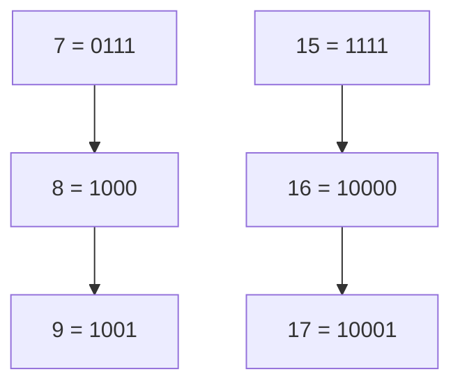

# Power Of Two

## Introduction

In computer science, powers of two hold a special significance. Numbers that are powers of two (1, 2, 4, 8, 16, 32, etc.) have unique binary representations that make them particularly useful in many computing contexts, from memory allocation to data structures.

In this tutorial, we'll explore how to determine if a number is a power of two using bit manipulation techniques, and why this is such an important concept in programming.

## What is a Power of Two?

A power of two is any number that can be expressed as 2^n, where n is a non-negative integer:
- 2^0 = 1
- 2^1 = 2
- 2^2 = 4
- 2^3 = 8
- 2^4 = 16
- And so on...

Let's examine the binary representation of these numbers:

| Decimal | Binary |
|---------|--------|
| 1       | 0001   |
| 2       | 0010   |
| 4       | 0100   |
| 8       | 1000   |
| 16      | 10000  |

Notice something interesting? Each power of two has exactly one bit set to 1, and all other bits are 0. This property is what makes powers of two special in bit manipulation.

## Checking if a Number is a Power of Two

### Method 1: Counting Set Bits

Since a power of two has exactly one bit set to 1, we can simply count the number of set bits (1s) in the binary representation. If there's exactly one set bit, the number is a power of two.

```java
public boolean isPowerOfTwo(int n) {
    if (n <= 0) return false;
    
    int count = 0;
    while (n > 0) {
        if ((n & 1) == 1) count++;
        n >>= 1;
    }
    
    return count == 1;
}
```

**Input:** `n = 16`  
**Output:** `true` (16 is 2^4)

**Input:** `n = 18`  
**Output:** `false` (18 is not a power of two, its binary is 10010)

### Method 2: Bit Manipulation Trick

There's an elegant bit manipulation trick that leverages the special property of powers of two. If a number n is a power of two, then `n & (n-1)` will always be zero.

Why? Let's see:
- If n is a power of two, its binary representation has only one bit set to 1
- n-1 will have that bit set to 0, and all the bits to the right set to 1
- When we apply the bitwise AND operator (&), the result will be 0

```java
public boolean isPowerOfTwo(int n) {
    if (n <= 0) return false;
    return (n & (n-1)) == 0;
}
```

Let's visualize this with an example where n = 8:

```
n    = 8  = 1000 (binary)
n-1  = 7  = 0111 (binary)
n & (n-1) = 1000 & 0111 = 0000 = 0
```

Since the result is 0, 8 is a power of two.

Now let's try with n = 6, which is not a power of two:

```
n    = 6  = 0110 (binary)
n-1  = 5  = 0101 (binary)
n & (n-1) = 0110 & 0101 = 0100 = 4
```

Since the result is not 0, 6 is not a power of two.

### Method 3: Using Built-in Functions

Many programming languages provide built-in functions to count bits. In Java, we can use `Integer.bitCount()`:

```java
public boolean isPowerOfTwo(int n) {
    if (n <= 0) return false;
    return Integer.bitCount(n) == 1;
}
```

## Practical Applications

### 1. Memory Allocation

Powers of two are extensively used in memory allocation because they align with how computer memory is organized. Many memory allocators round up allocation sizes to powers of two for efficiency.

```java
public int nextPowerOfTwo(int n) {
    n--;
    n |= n >> 1;
    n |= n >> 2;
    n |= n >> 4;
    n |= n >> 8;
    n |= n >> 16;
    return n + 1;
}
```

This function finds the next power of two greater than or equal to n.

### 2. Hash Table Sizes

Hash table implementations often use sizes that are powers of two for better performance:

```java
class SimpleHashMap<K, V> {
    private static final int DEFAULT_CAPACITY = 16; // Power of two
    private static final float LOAD_FACTOR = 0.75f;
    
    private Entry<K, V>[] table;
    private int size;
    
    @SuppressWarnings("unchecked")
    public SimpleHashMap() {
        table = new Entry[DEFAULT_CAPACITY];
        size = 0;
    }
    
    // Rest of the implementation...
}
```

### 3. Graphics and Game Development

Powers of two are crucial in graphics programming, especially for texture sizes:

```java
public boolean isValidTextureSize(int width, int height) {
    return isPowerOfTwo(width) && isPowerOfTwo(height);
}

// Game developers often need to check and adjust texture dimensions
public int adjustToValidTextureSize(int dimension) {
    if (isPowerOfTwo(dimension)) return dimension;
    return nextPowerOfTwo(dimension);
}
```

## Understanding Binary Properties of Powers of Two

To better understand why powers of two are so special, let's visualize how powers of two and their neighbors look in binary:



Notice that:
1. A power of two (like 8 or 16) always has a single bit set to 1
2. The number before a power of two (like 7 or 15) always has all 1's in the lower positions
3. The number after a power of two (like 9 or 17) has the same high bit set, plus at least one more bit

These patterns help us understand why the trick `n & (n-1) == 0` works so elegantly.

## Summary

Powers of two are fundamental concepts in bit manipulation and computer science as a whole:

- A number is a power of two if it can be expressed as 2^n where n is a non-negative integer
- Powers of two have exactly one bit set to 1 in their binary representation
- We can check if a number is a power of two using the elegant trick: `n > 0 && (n & (n-1)) == 0`
- Powers of two appear frequently in memory allocation, data structures, and graphics programming

Understanding these properties helps you write more efficient code and gain deeper insight into how computers work at a fundamental level.

## Exercises

1. Write a function to find the largest power of two less than or equal to a given number.
2. Implement a function that counts how many powers of two are in a given range [L, R].
3. Given an array of integers, find how many elements are powers of two.
4. Write a program that generates the first 20 powers of two without using the exponentiation operator.
5. Implement an algorithm to check if a number is a power of four using bit manipulation.

## Additional Resources

- Bit Manipulation section in "Cracking the Coding Interview" by Gayle Laakmann McDowell
- "Hacker's Delight" by Henry S. Warren - a comprehensive guide to bit manipulation techniques
- Online bit manipulation visualizers to see the binary representation of numbers

Happy coding!