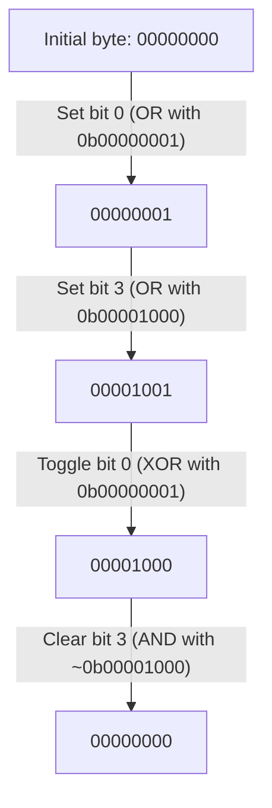

# Binary Representation

## Introduction

Binary representation forms the foundation of all computer operations. At its core, a computer only understands two states: on and off, represented as 1 and 0. These binary digits, or **bits**, are the most basic units of information in computing.

In this tutorial, you'll learn how data is represented in binary, why computers use binary, and how understanding binary representation is essential for effective bit manipulation in programming.

## Why Binary?

Computers use binary for a simple reason: electronic components are most reliable when distinguishing between just two states:

- **On** (1): Current flowing
- **Off** (0): No current flowing

Using only two states makes computer hardware simpler, more reliable, and less susceptible to errors caused by electrical noise or component variations.

## How Binary Numbers Work

### The Decimal System (Base 10)

Before diving into binary, let's quickly review our familiar decimal system:

In decimal (base 10), we have 10 possible digits (0-9) and positions represent powers of 10:

```
1234 = 1×10³ + 2×10² + 3×10¹ + 4×10⁰
     = 1×1000 + 2×100 + 3×10 + 4×1
     = 1000 + 200 + 30 + 4
     = 1234
```

### The Binary System (Base 2)

In binary (base 2), we have only 2 possible digits (0 and 1) and positions represent powers of 2:

```
1011₂ = 1×2³ + 0×2² + 1×2¹ + 1×2⁰
      = 1×8 + 0×4 + 1×2 + 1×1
      = 8 + 0 + 2 + 1
      = 11₁₀
```

This shows that the binary number 1011 equals the decimal number 11.

### Binary Counting

Here's how to count from 0 to 15 in binary:

| Decimal | Binary |
|---------|--------|
| 0       | 0000   |
| 1       | 0001   |
| 2       | 0010   |
| 3       | 0011   |
| 4       | 0100   |
| 5       | 0101   |
| 6       | 0110   |
| 7       | 0111   |
| 8       | 1000   |
| 9       | 1001   |
| 10      | 1010   |
| 11      | 1011   |
| 12      | 1100   |
| 13      | 1101   |
| 14      | 1110   |
| 15      | 1111   |

Notice how binary numbers grow in length faster than decimal numbers. To represent 15, we need 4 bits, but to represent 255, we need 8 bits.

## Common Binary Sizes in Computing

Computers typically organize bits into standard groups:

- **Bit**: A single binary digit (0 or 1)
- **Nibble**: 4 bits (half a byte)
- **Byte**: 8 bits
- **Word**: Depends on architecture (often 16, 32, or 64 bits)

These groupings help computers efficiently process data.

## Converting Between Binary and Decimal

### Decimal to Binary Conversion

To convert a decimal number to binary:

1. Divide the number by 2
2. Note the remainder (0 or 1)
3. Continue dividing the quotient by 2 until you reach 0
4. Read the remainders from bottom to top

Example: Convert 25 to binary

```
25 ÷ 2 = 12 remainder 1
12 ÷ 2 = 6  remainder 0
6  ÷ 2 = 3  remainder 0
3  ÷ 2 = 1  remainder 1
1  ÷ 2 = 0  remainder 1
```

Reading from bottom to top: 25₁₀ = 11001₂

Let's implement this in code:

```java
public static String decimalToBinary(int decimal) {
    if (decimal == 0) {
        return "0";
    }
    
    StringBuilder binary = new StringBuilder();
    while (decimal > 0) {
        binary.insert(0, decimal % 2);
        decimal /= 2;
    }
    
    return binary.toString();
}
```

Usage example:

```java
System.out.println(decimalToBinary(25)); // Outputs: 11001
```

### Binary to Decimal Conversion

To convert a binary number to decimal, multiply each digit by its corresponding power of 2 and sum the results.

Example: Convert 11001₂ to decimal

```
1×2⁴ + 1×2³ + 0×2² + 0×2¹ + 1×2⁰
= 16 + 8 + 0 + 0 + 1
= 25
```

Here's a Java implementation:

```java
public static int binaryToDecimal(String binary) {
    int decimal = 0;
    int power = 0;
    
    // Start from the rightmost digit
    for (int i = binary.length() - 1; i >= 0; i--) {
        if (binary.charAt(i) == '1') {
            decimal += Math.pow(2, power);
        }
        power++;
    }
    
    return decimal;
}
```

Usage example:

```java
System.out.println(binaryToDecimal("11001")); // Outputs: 25
```

## Binary Representation in Programming Languages

Most programming languages provide built-in functions or methods to work with binary representations:

### Java

```java
// Decimal to binary
String binary = Integer.toBinaryString(25);
System.out.println(binary);  // Outputs: 11001

// Binary to decimal
int decimal = Integer.parseInt("11001", 2);
System.out.println(decimal);  // Outputs: 25
```

### Python

```python
# Decimal to binary
binary = bin(25)[2:]  # [2:] removes the '0b' prefix
print(binary)  # Outputs: 11001

# Binary to decimal
decimal = int("11001", 2)
print(decimal)  # Outputs: 25
```

### JavaScript

```javascript
// Decimal to binary
const binary = (25).toString(2);
console.log(binary);  // Outputs: 11001

// Binary to decimal
const decimal = parseInt("11001", 2);
console.log(decimal);  // Outputs: 25
```

## Signed vs. Unsigned Integers

Binary representation becomes more complex when we need to represent negative numbers. There are several methods for representing signed integers:

### Two's Complement

The most common representation for signed integers in computers is the two's complement. In this system:

1. Positive numbers are represented normally
2. Negative numbers are represented by:
   - Taking the binary representation of the absolute value
   - Inverting all the bits (0s become 1s and vice versa)
   - Adding 1 to the result

Example: Representing -5 in 8-bit two's complement

1. 5 in binary: 00000101
2. Invert all bits: 11111010
3. Add 1: 11111011

So -5 in 8-bit two's complement is 11111011.

The most significant bit (leftmost) acts as a sign bit: 0 for positive numbers and 1 for negative numbers.

```java
public static String twosComplement(int number, int bits) {
    if (number >= 0) {
        // Positive number, just convert to binary and pad with zeros
        String binary = Integer.toBinaryString(number);
        while (binary.length() < bits) {
            binary = "0" + binary;
        }
        return binary;
    } else {
        // For negative numbers, we use 2's complement
        int positiveNumber = Math.abs(number);
        String binary = Integer.toBinaryString(positiveNumber);
        
        // Pad with zeros
        while (binary.length() < bits) {
            binary = "0" + binary;
        }
        
        // Invert all bits
        StringBuilder inverted = new StringBuilder();
        for (char bit : binary.toCharArray()) {
            inverted.append(bit == '0' ? '1' : '0');
        }
        
        // Add 1 to the inverted bits
        String invertedStr = inverted.toString();
        StringBuilder result = new StringBuilder();
        boolean carry = true;
        
        for (int i = invertedStr.length() - 1; i >= 0; i--) {
            if (carry) {
                if (invertedStr.charAt(i) == '1') {
                    result.insert(0, '0');
                } else {
                    result.insert(0, '1');
                    carry = false;
                }
            } else {
                result.insert(0, invertedStr.charAt(i));
            }
        }
        
        return result.toString();
    }
}
```

Usage example:

```java
System.out.println(twosComplement(5, 8));   // Outputs: 00000101
System.out.println(twosComplement(-5, 8));  // Outputs: 11111011
```

## Bitwise Operations

Understanding binary representation is essential for performing bitwise operations:

- AND (`&`): returns 1 only if both corresponding bits are 1
- OR (`|`): returns 1 if at least one of the corresponding bits is 1
- XOR (`^`): returns 1 only if exactly one of the corresponding bits is 1
- NOT (`~`): inverts all bits
- Left Shift (`<<`): shifts bits to the left, filling with zeros
- Right Shift (`>>`): shifts bits to the right

These operations are fundamental to efficient algorithms in many domains, which we'll cover in depth in upcoming tutorials.

## Practical Applications of Binary Representation

### 1. Flags and State Management

Binary representation is excellent for storing multiple boolean flags in a single integer:

```java
// Define flags
final int READ_PERMISSION = 0b0001;    // 1 in decimal
final int WRITE_PERMISSION = 0b0010;   // 2 in decimal
final int EXECUTE_PERMISSION = 0b0100; // 4 in decimal
final int ADMIN_PERMISSION = 0b1000;   // 8 in decimal

// Set permissions for a user
int userPermissions = READ_PERMISSION | WRITE_PERMISSION; // 0b0011 (3 in decimal)

// Check if user has read permission
boolean canRead = (userPermissions & READ_PERMISSION) != 0; // true

// Check if user has execute permission
boolean canExecute = (userPermissions & EXECUTE_PERMISSION) != 0; // false

// Grant execute permission
userPermissions |= EXECUTE_PERMISSION; // Now userPermissions = 0b0111 (7 in decimal)

// Revoke write permission
userPermissions &= ~WRITE_PERMISSION; // Now userPermissions = 0b0101 (5 in decimal)
```

This technique is used in file systems (Unix permissions), graphics (RGB color channels), and network protocols.

### 2. Memory Optimization

Binary representation helps optimize memory usage:

```java
// Store 8 boolean values in a single byte
byte packedBooleans = 0;

// Set the 3rd boolean to true (0-indexed)
packedBooleans |= (1 << 2);

// Check if the 3rd boolean is true
boolean isThirdSet = (packedBooleans & (1 << 2)) != 0; // true

// Toggle the 5th boolean
packedBooleans ^= (1 << 4);
```

This is especially valuable in resource-constrained environments like embedded systems or when dealing with large datasets.

### 3. Bit Manipulation in Puzzles and Algorithms

Many computational problems can be solved elegantly using bit manipulation:

```java
// Find if a number is a power of 2
public static boolean isPowerOfTwo(int n) {
    return n > 0 && (n & (n - 1)) == 0;
}

// Count the number of set bits (1s) in an integer
public static int countSetBits(int n) {
    int count = 0;
    while (n > 0) {
        count += n & 1;
        n >>= 1;
    }
    return count;
}
```

## Binary Representation Visualization

To better understand binary representation, let's visualize how a byte changes as we manipulate its bits:



This visualization shows how individual bits can be manipulated while leaving others unchanged.

## Summary

Binary representation is the foundation of all computing systems:

- Computers use binary (base-2) because electronic components work reliably with two states
- Each position in a binary number represents a power of 2
- Converting between decimal and binary is a fundamental skill
- Two's complement allows for representation of negative numbers
- Binary representation enables efficient bit manipulation operations
- Real-world applications include permission systems, memory optimization, and algorithm design

Understanding binary representation is essential for:
- Efficient algorithm design
- Low-level systems programming
- Network protocols
- File format handling
- Cryptography and security implementations

## Exercises

Test your understanding with these exercises:

1. Convert the decimal number 42 to binary.
2. Convert the binary number 10110 to decimal.
3. Represent -15 using 8-bit two's complement.
4. Write a function that determines if a number has exactly one bit set to 1.
5. Create a bitmap class that can efficiently store and manipulate 1000 boolean values.
6. Implement a function to swap two numbers without using a temporary variable (hint: use XOR).
7. Write a program that prints all possible 4-bit binary numbers and their decimal equivalents.

## Additional Resources

To deepen your understanding of binary representation:

- Explore bitwise operations in your preferred programming language
- Study binary arithmetic (addition, subtraction, multiplication, division)
- Learn about floating-point representation using the IEEE 754 standard
- Investigate hexadecimal representation as a compact way to represent binary data

In the next tutorial, we'll explore specific bitwise operations in more detail and see how they can be applied to solve interesting problems.