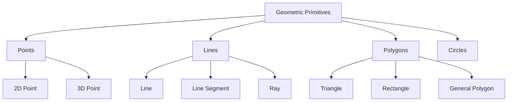

# Geometric Primitives

## Introduction

Geometric primitives are the fundamental building blocks used in computational geometry and graphics programming. They represent the most basic geometric shapes and concepts, such as points, lines, and polygons. Understanding these primitives is essential before diving into more complex geometric algorithms.

In this lesson, we'll explore the most common geometric primitives, how to represent them in code, and basic operations you can perform with them. This knowledge will serve as the foundation for solving more complex geometric problems.

## Points: The Most Basic Primitive

A point represents a single location in space, defined by its coordinates. In a 2D plane, a point is represented by an x and y coordinate.

### Representing Points in Code

```cpp
struct Point {
    double x, y;
    
    // Constructor
    Point(double _x = 0, double _y = 0) : x(_x), y(_y) {}
};
```

In Python, you might represent points as:

```python
class Point:
    def __init__(self, x=0, y=0):
        self.x = x
        self.y = y
        
    def __str__(self):
        return f"({self.x}, {self.y})"
```

### Basic Point Operations

#### Distance Between Two Points

The Euclidean distance formula is used to calculate the distance between two points:

```cpp
double distance(const Point& a, const Point& b) {
    return sqrt((a.x - b.x) * (a.x - b.x) + (a.y - b.y) * (a.y - b.y));
}
```

In Python:

```python
import math

def distance(a, b):
    return math.sqrt((a.x - b.x)**2 + (a.y - b.y)**2)
```

#### Example: Finding the Closest Pair of Points

```python
def closest_pair(points):
    min_dist = float('inf')
    closest_p1, closest_p2 = None, None
    
    for i in range(len(points)):
        for j in range(i+1, len(points)):
            dist = distance(points[i], points[j])
            if dist < min_dist:
                min_dist = dist
                closest_p1, closest_p2 = points[i], points[j]
                
    return closest_p1, closest_p2, min_dist

# Example usage
points = [Point(0, 0), Point(1, 1), Point(2, 4), Point(3, 2)]
p1, p2, dist = closest_pair(points)
print(f"Closest pair: {p1} and {p2}, distance: {dist}")
```

Output:
```
Closest pair: (0, 0) and (1, 1), distance: 1.4142135623730951
```

## Vectors: Direction and Magnitude

Vectors represent both direction and magnitude. In geometric algorithms, vectors are essential for calculating direction, motion, and forces.

### Representing Vectors in Code

Vectors can be represented similarly to points:

```cpp
struct Vector {
    double x, y;
    
    Vector(double _x = 0, double _y = 0) : x(_x), y(_y) {}
    
    // Create vector from two points
    Vector(const Point& a, const Point& b) {
        x = b.x - a.x;
        y = b.y - a.y;
    }
};
```

In Python:

```python
class Vector:
    def __init__(self, x=0, y=0):
        self.x = x
        self.y = y
    
    @classmethod
    def from_points(cls, p1, p2):
        return cls(p2.x - p1.x, p2.y - p1.y)
        
    def __str__(self):
        return f"({self.x}, {self.y})"
```

### Vector Operations

#### Vector Magnitude (Length)

```python
def magnitude(v):
    return math.sqrt(v.x**2 + v.y**2)
```

#### Vector Normalization (Unit Vector)

```python
def normalize(v):
    mag = magnitude(v)
    if mag > 0:
        return Vector(v.x / mag, v.y / mag)
    return Vector(0, 0)
```

#### Dot Product

The dot product is used to find the angle between vectors or calculate projections:

```python
def dot_product(v1, v2):
    return v1.x * v2.x + v1.y * v2.y
```

#### Cross Product (in 2D)

In 2D, the cross product gives the signed area of the parallelogram:

```python
def cross_product(v1, v2):
    return v1.x * v2.y - v1.y * v2.x
```

## Lines and Line Segments

Lines extend infinitely in both directions, while line segments have defined start and end points.

### Representing Line Segments

```cpp
struct LineSegment {
    Point start, end;
    
    LineSegment(const Point& _start, const Point& _end) 
        : start(_start), end(_end) {}
};
```

In Python:

```python
class LineSegment:
    def __init__(self, start, end):
        self.start = start
        self.end = end
```

### Line Representations

There are several ways to represent a line:

1. **Point-slope form**: A line passing through point `(x0, y0)` with slope `m` can be written as:
   `y - y0 = m(x - x0)`

2. **Slope-intercept form**: `y = mx + b` where `m` is the slope and `b` is the y-intercept

3. **General (or standard) form**: `Ax + By + C = 0`

```python
class Line:
    # Ax + By + C = 0
    def __init__(self, A, B, C):
        self.A = A
        self.B = B
        self.C = C
        
    @classmethod
    def from_points(cls, p1, p2):
        A = p2.y - p1.y
        B = p1.x - p2.x
        C = p2.x * p1.y - p1.x * p2.y
        return cls(A, B, C)
```

### Basic Line Operations

#### Checking if Point is on Line

```python
def is_point_on_line(line, point, epsilon=1e-9):
    # Check if Ax + By + C is approximately 0
    value = line.A * point.x + line.B * point.y + line.C
    return abs(value) < epsilon
```

#### Intersection of Two Lines

```python
def line_intersection(line1, line2):
    # Check if lines are parallel
    det = line1.A * line2.B - line1.B * line2.A
    
    if abs(det) < 1e-9:
        return None  # Lines are parallel
    
    x = (line1.B * line2.C - line2.B * line1.C) / det
    y = (line2.A * line1.C - line1.A * line2.C) / det
    
    return Point(x, y)
```

#### Checking if Point is on Line Segment

```python
def is_point_on_segment(segment, point, epsilon=1e-9):
    # Create vector from start to end
    seg_vec = Vector.from_points(segment.start, segment.end)
    
    # Create vector from start to point
    point_vec = Vector.from_points(segment.start, point)
    
    # Check if cross product is approximately 0 (collinear)
    cross = cross_product(seg_vec, point_vec)
    if abs(cross) > epsilon:
        return False
    
    # Check if point is within bounds of segment
    dot = dot_product(seg_vec, point_vec)
    if dot < 0:
        return False
        
    seg_len_squared = seg_vec.x**2 + seg_vec.y**2
    if dot > seg_len_squared:
        return False
        
    return True
```

## Polygons and Triangles

Polygons are shapes with straight sides. Triangles are the simplest polygons.

### Representing Polygons

```cpp
struct Polygon {
    std::vector<Point> vertices;
    
    // Add a vertex to the polygon
    void add_vertex(const Point& vertex) {
        vertices.push_back(vertex);
    }
};
```

In Python:

```python
class Polygon:
    def __init__(self, vertices=None):
        self.vertices = vertices or []
    
    def add_vertex(self, vertex):
        self.vertices.append(vertex)
```

### Polygon Operations

#### Area of a Polygon

Using the shoelace formula (also known as the surveyor's formula):

```python
def polygon_area(polygon):
    n = len(polygon.vertices)
    if n < 3:
        return 0  # Not a polygon
    
    area = 0
    for i in range(n):
        j = (i + 1) % n
        area += (polygon.vertices[i].x * polygon.vertices[j].y)
        area -= (polygon.vertices[j].x * polygon.vertices[i].y)
    
    return abs(area) / 2
```

#### Check if Point is Inside Polygon

Using the ray casting algorithm:

```python
def is_point_inside(polygon, point):
    n = len(polygon.vertices)
    inside = False
    
    for i in range(n):
        j = (i + 1) % n
        vi = polygon.vertices[i]
        vj = polygon.vertices[j]
        
        # Check if ray from point to right intersects with line segment
        if (((vi.y > point.y) != (vj.y > point.y)) and 
            (point.x < vi.x + (vj.x - vi.x) * (point.y - vi.y) / (vj.y - vi.y))):
            inside = not inside
    
    return inside
```

## Circles

Circles are defined by a center point and a radius.

### Representing Circles

```cpp
struct Circle {
    Point center;
    double radius;
    
    Circle(const Point& _center, double _radius) 
        : center(_center), radius(_radius) {}
};
```

In Python:

```python
class Circle:
    def __init__(self, center, radius):
        self.center = center
        self.radius = radius
```

### Circle Operations

#### Check if Point is Inside Circle

```python
def is_point_inside_circle(circle, point):
    return distance(circle.center, point) < circle.radius
```

#### Intersection of Two Circles

```python
def circle_intersection(c1, c2):
    # Distance between centers
    d = distance(c1.center, c2.center)
    
    # Check if circles are separate, contained, or coincident
    if d > c1.radius + c2.radius:
        return []  # No intersection
    if d < abs(c1.radius - c2.radius):
        return []  # One circle is inside the other
    if abs(d) < 1e-9 and abs(c1.radius - c2.radius) < 1e-9:
        return None  # Circles are identical
        
    # Calculate intersection points
    a = (c1.radius**2 - c2.radius**2 + d**2) / (2*d)
    h = math.sqrt(c1.radius**2 - a**2)
    
    # Position of point on the line between centers
    p0 = Point(
        c1.center.x + a * (c2.center.x - c1.center.x) / d,
        c1.center.y + a * (c2.center.y - c1.center.y) / d
    )
    
    # Intersection points
    p1 = Point(
        p0.x + h * (c2.center.y - c1.center.y) / d,
        p0.y - h * (c2.center.x - c1.center.x) / d
    )
    
    p2 = Point(
        p0.x - h * (c2.center.y - c1.center.y) / d,
        p0.y + h * (c2.center.x - c1.center.x) / d
    )
    
    if abs(p1.x - p2.x) < 1e-9 and abs(p1.y - p2.y) < 1e-9:
        return [p1]  # Circles touch at one point
    return [p1, p2]
```

## Real-World Applications

### Example 1: Collision Detection in Games

Game developers use geometric primitives to detect collisions between objects:

```python
def check_collision(character, obstacle):
    # Assuming both are represented as circles for simplicity
    char_circle = Circle(character.position, character.radius)
    obs_circle = Circle(obstacle.position, obstacle.radius)
    
    dist = distance(char_circle.center, obs_circle.center)
    return dist < char_circle.radius + obs_circle.radius
```

### Example 2: GIS (Geographic Information Systems)

Determining if a location is within a specific region:

```python
def is_in_restricted_zone(location, zone_boundaries):
    # location is a Point, zone_boundaries is a Polygon
    point = Point(location.longitude, location.latitude)
    zone = Polygon(zone_boundaries)
    
    return is_point_inside(zone, point)
```

### Example 3: Computer Vision

Edge detection in images often uses line segments:

```python
def detect_edges(image):
    edges = []
    # Simplified example (real edge detection uses more complex algorithms)
    for y in range(1, image.height):
        for x in range(1, image.width):
            if abs(image.get_pixel(x, y) - image.get_pixel(x-1, y)) > threshold:
                edges.append(LineSegment(Point(x-1, y), Point(x, y)))
    return edges
```

## Visualizing Geometric Primitives

Let's visualize some basic geometric relationships using a Mermaid diagram:



## Summary

In this lesson, we've covered:

- **Points**: The fundamental building block of geometry
- **Vectors**: Direction and magnitude, essential for movement and forces
- **Lines and Line Segments**: Infinite and bounded straight paths
- **Polygons**: Enclosed shapes with straight edges
- **Circles**: Defined by center and radius

These geometric primitives form the foundation of more complex geometric algorithms. By understanding how to represent and manipulate these primitives, you'll be well-equipped to tackle a wide range of problems in graphics, games, simulations, and data visualization.

## Exercises

1. Implement a function that calculates the perimeter of a polygon.
2. Write a function to determine if two line segments intersect.
3. Create a function that finds the center and radius of a circle passing through three given points.
4. Implement a function that computes the convex hull of a set of points.
5. Write a function to check if a given polygon is convex or concave.

## Additional Resources

- "Computational Geometry: Algorithms and Applications" by Mark de Berg et al.
- "Introduction to Algorithms" by Thomas H. Cormen et al.
- Online platforms like Codeforces and LeetCode have many geometry-related problems to practice.
- Graphics programming libraries like OpenGL and Three.js have excellent documentation on geometric primitives.

Understanding these fundamentals will help you build intuition for more advanced geometric algorithms and is essential for applications in computer graphics, game development, computer vision, and robotics.