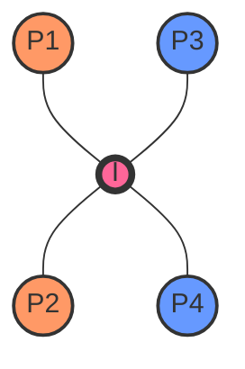

# Line Intersection

## Introduction

Line intersection is a fundamental concept in computational geometry with wide-ranging applications in computer graphics, game development, geographic information systems, and more. In this tutorial, we'll explore how to determine if two line segments intersect and how to find their point of intersection.

When we talk about line intersection, we're typically dealing with one of two problems:
- Determining whether two line segments intersect
- Finding the exact point where they intersect (if they do)

This knowledge forms the basis for more complex geometric algorithms such as polygon clipping, ray casting, and collision detection systems.

## Understanding Line Segments

Before diving into intersections, let's clarify what we mean by a line segment. Unlike infinite lines that extend forever, a line segment has two endpoints. We typically represent a line segment using these two points:

```
LineSegment {
    Point p1;  // First endpoint
    Point p2;  // Second endpoint
}

Point {
    double x;
    double y;
}
```

## Approaches to Line Intersection

There are several approaches to determining line intersection. We'll cover two popular methods:

1. **Vector Cross Product Method** - Uses vector math to determine intersection
2. **Line Equation Method** - Uses the algebraic equation of lines

## Vector Cross Product Method

This method leverages the properties of vector cross products to determine if two line segments intersect.

### Mathematical Foundation

Given two line segments:
- Line 1 from point P1(x1, y1) to point P2(x2, y2)
- Line 2 from point P3(x3, y3) to point P4(x4, y4)

We can represent these as vectors and use the cross product to determine their orientation.

### Implementation in JavaScript

```javascript
// Define Point class
class Point {
  constructor(x, y) {
    this.x = x;
    this.y = y;
  }
}

// Calculate orientation of triplet (p, q, r)
// Returns:
// 0 --> Collinear
// 1 --> Clockwise
// 2 --> Counterclockwise
function orientation(p, q, r) {
  const val = (q.y - p.y) * (r.x - q.x) - (q.x - p.x) * (r.y - q.y);
  
  if (val === 0) return 0;  // collinear
  return (val > 0) ? 1 : 2; // clockwise or counterclockwise
}

// Check if point q is on segment pr
function onSegment(p, q, r) {
  return q.x <= Math.max(p.x, r.x) && q.x >= Math.min(p.x, r.x) &&
         q.y <= Math.max(p.y, r.y) && q.y >= Math.min(p.y, r.y);
}

// Check if two line segments intersect
function doIntersect(p1, p2, p3, p4) {
  // Find the four orientations needed
  const o1 = orientation(p1, p2, p3);
  const o2 = orientation(p1, p2, p4);
  const o3 = orientation(p3, p4, p1);
  const o4 = orientation(p3, p4, p2);

  // General case
  if (o1 !== o2 && o3 !== o4) {
    return true;
  }

  // Special Cases
  // p1, p2 and p3 are collinear and p3 lies on segment p1p2
  if (o1 === 0 && onSegment(p1, p3, p2)) return true;
  
  // p1, p2 and p4 are collinear and p4 lies on segment p1p2
  if (o2 === 0 && onSegment(p1, p4, p2)) return true;
  
  // p3, p4 and p1 are collinear and p1 lies on segment p3p4
  if (o3 === 0 && onSegment(p3, p1, p4)) return true;
  
  // p3, p4 and p2 are collinear and p2 lies on segment p3p4
  if (o4 === 0 && onSegment(p3, p2, p4)) return true;

  return false; // Doesn't fall in any of the above cases
}
```

### Step-by-Step Explanation

1. We define a function `orientation()` that determines whether three points are collinear, clockwise, or counterclockwise.
2. The `onSegment()` function checks if a point lies on a given line segment.
3. The main function `doIntersect()` uses these helpers to determine intersection:
   - First, it calculates the orientation of each triplet of points
   - If orientations (o1, o2) and (o3, o4) differ, the segments intersect
   - We also check special cases where points are collinear

## Line Equation Method

Another approach is to express each line segment as a mathematical equation and solve for the intersection point.

### Mathematical Foundation

For line segments:
- Line 1: P1(x1, y1) to P2(x2, y2)
- Line 2: P3(x3, y3) to P4(x4, y4)

We can represent them parametrically:
- Point on Line 1 = P1 + t(P2 - P1) where 0 ≤ t ≤ 1
- Point on Line 2 = P3 + s(P4 - P3) where 0 ≤ s ≤ 1

### Implementation in Python

```python
def find_intersection(p1, p2, p3, p4):
    """
    Find the intersection point of two line segments.
    Returns None if there is no intersection.
    """
    # Extract coordinates
    x1, y1 = p1
    x2, y2 = p2
    x3, y3 = p3
    x4, y4 = p4
    
    # Calculate denominators
    denom = (y4 - y3) * (x2 - x1) - (x4 - x3) * (y2 - y1)
    
    # If denominator is 0, lines are parallel or collinear
    if denom == 0:
        return None
    
    # Calculate parameters t and s
    ua = ((x4 - x3) * (y1 - y3) - (y4 - y3) * (x1 - x3)) / denom
    ub = ((x2 - x1) * (y1 - y3) - (y2 - y1) * (x1 - x3)) / denom
    
    # Check if intersection is within the line segments
    if ua < 0 or ua > 1 or ub < 0 or ub > 1:
        return None
    
    # Calculate the intersection point
    x = x1 + ua * (x2 - x1)
    y = y1 + ua * (y2 - y1)
    
    return (x, y)

# Example usage
segment1 = [(0, 0), (5, 5)]  # First line segment from (0,0) to (5,5)
segment2 = [(0, 5), (5, 0)]  # Second line segment from (0,5) to (5,0)

intersection = find_intersection(
    segment1[0], segment1[1], segment2[0], segment2[1]
)

print(f"Intersection point: {intersection}")  # Output: Intersection point: (2.5, 2.5)
```

### Step-by-Step Explanation

1. We represent each line parametrically using their endpoints.
2. We calculate the denominators for our equations. If the denominator is zero, the lines are parallel or collinear.
3. We calculate parameters `ua` and `ub` which represent how far along each line segment the intersection occurs.
4. If `ua` and `ub` are both between 0 and 1, the intersection point lies within both segments.
5. We calculate the intersection point coordinates using the parametric equation.

## Visualizing Line Intersection

To better understand how line intersection works, let's visualize it:



In this diagram:
- P1 and P2 are the endpoints of the first line segment
- P3 and P4 are the endpoints of the second line segment
- I is the intersection point

## Real-World Applications

### 1. Collision Detection in Games

In game development, line intersection is used to detect when objects collide. For example, when:
- A bullet trajectory intersects with a character model
- A line of sight needs to be calculated between two points
- A character moves from one point to another and needs to check for walls

```javascript
function canSeePlayer(enemy, player, walls) {
  // Create a line segment from enemy to player
  const sightLine = {
    p1: { x: enemy.x, y: enemy.y },
    p2: { x: player.x, y: player.y }
  };
  
  // Check if line of sight intersects with any walls
  for (const wall of walls) {
    if (doIntersect(
      sightLine.p1, sightLine.p2, 
      { x: wall.x1, y: wall.y1 }, { x: wall.x2, y: wall.y2 }
    )) {
      return false; // Line of sight is blocked by a wall
    }
  }
  
  return true; // No walls block the line of sight
}
```

### 2. Geographic Information Systems (GIS)

Line intersection is used extensively in mapping and GIS applications:
- Determining if roads intersect
- Calculating the area of land parcels
- Finding where a user-drawn line intersects with map features

### 3. Computer Graphics

Line clipping algorithms use line intersection to determine which parts of lines should be drawn:
- When rendering only the parts of objects visible in a viewport
- For shadow calculations and ray tracing
- When determining visibility in 3D scenes

## Performance Considerations

When implementing line intersection algorithms, consider:

1. **Numerical Precision**: Floating-point errors can cause problems with edge cases. Consider using epsilon values for comparisons.

2. **Special Cases**: Handle parallel lines, overlapping lines, and collinear points properly.

3. **Optimization**: For applications checking many lines (like ray casting), consider using spatial partitioning structures like quadtrees to reduce the number of checks.

## Example: Line Intersection in a Simple 2D Game

Let's implement a simple raycasting example where we detect if a "sight ray" from a character hits a wall:

```javascript
class Wall {
  constructor(x1, y1, x2, y2) {
    this.p1 = { x: x1, y: y1 };
    this.p2 = { x: x2, y: y2 };
  }
}

class Character {
  constructor(x, y, directionAngle) {
    this.position = { x, y };
    this.angle = directionAngle;
    this.sightDistance = 100;
  }
  
  // Calculate endpoint of sight line based on angle and sight distance
  getSightEndpoint() {
    return {
      x: this.position.x + Math.cos(this.angle) * this.sightDistance,
      y: this.position.y + Math.sin(this.angle) * this.sightDistance
    };
  }
  
  // Check if character can see through the walls
  castSightRay(walls) {
    const sightEnd = this.getSightEndpoint();
    let closestIntersection = null;
    let shortestDistance = this.sightDistance;
    
    // Check intersection with each wall
    for (const wall of walls) {
      const intersection = find_intersection(
        this.position, sightEnd, wall.p1, wall.p2
      );
      
      if (intersection) {
        const distance = Math.sqrt(
          Math.pow(intersection.x - this.position.x, 2) +
          Math.pow(intersection.y - this.position.y, 2)
        );
        
        if (distance < shortestDistance) {
          shortestDistance = distance;
          closestIntersection = intersection;
        }
      }
    }
    
    return {
      hitPoint: closestIntersection,
      distance: shortestDistance
    };
  }
}

// Example usage
const walls = [
  new Wall(10, 10, 10, 100),
  new Wall(10, 100, 100, 100),
  new Wall(100, 100, 100, 10),
  new Wall(100, 10, 10, 10)
];

const player = new Character(50, 50, Math.PI / 4); // 45 degrees
const sightResult = player.castSightRay(walls);

console.log("Ray hit wall at:", sightResult.hitPoint);
console.log("Distance to wall:", sightResult.distance);
```

## Summary

In this tutorial, we've covered:

1. What line intersection is and why it's important
2. Two methods to determine if line segments intersect:
   - Vector cross product method
   - Line equation method
3. How to find the exact intersection point
4. Real-world applications of line intersection
5. Performance considerations and optimizations

Line intersection is a building block for more complex geometric algorithms. By understanding this concept, you've taken a significant step into computational geometry, which will serve you well in graphics programming, game development, and many other fields.

## Exercises

1. Modify the line intersection code to handle collinear overlapping segments correctly.
2. Implement a function that returns all intersection points of a line with a convex polygon.
3. Create a visualization tool that shows line intersections as the user draws lines on a canvas.
4. Extend the line intersection to handle 3D lines.
5. Implement a ray casting algorithm using line intersection to detect if a point is inside a polygon.

## Additional Resources

- **Computational Geometry: Algorithms and Applications** by Mark de Berg et al.
- **Real-Time Collision Detection** by Christer Ericson
- [Computational Geometry in C](https://cs.smith.edu/~jorourke/books/compgeom.html) by Joseph O'Rourke

Line intersection is just the beginning of the fascinating world of geometric algorithms. As you progress, you'll discover how these concepts build upon each other to create powerful systems for solving complex spatial problems.