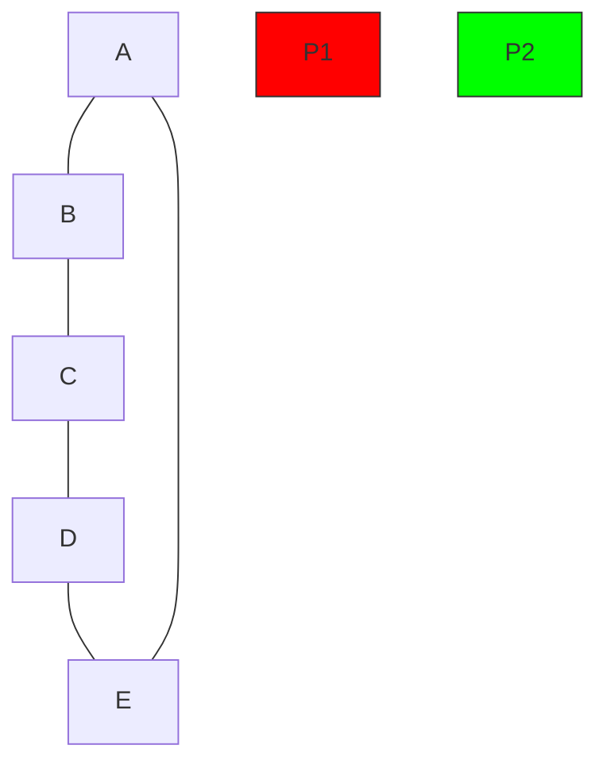
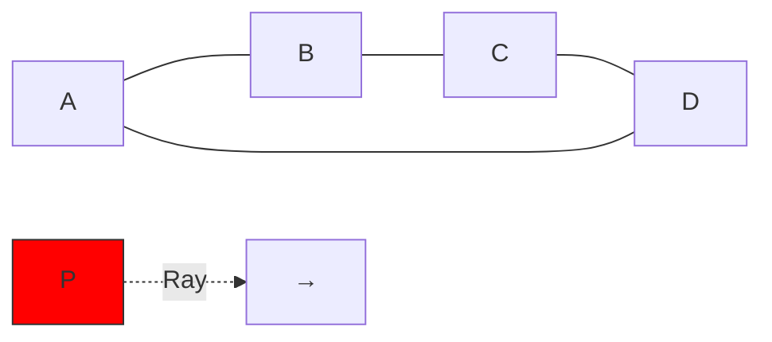

# Point In Polygon

## Introduction

Determining whether a point lies inside or outside a polygon is a fundamental problem in computational geometry. The "Point in Polygon" (PIP) test is used in various applications, from computer graphics and game development to geographic information systems (GIS).

Consider questions like:
- Is a user's click inside a button?
- Is a character inside a restricted game area?
- Is a location inside a specific country or region?

All these scenarios require a point-in-polygon test. In this article, we'll explore different algorithms to solve this problem, understand their implementations, and see their real-world applications.

## What is the Point in Polygon Problem?

The Point in Polygon problem can be stated simply:

> Given a polygon defined by a sequence of vertices (x₁, y₁), (x₂, y₂), ..., (xₙ, yₙ) and a point P(x, y), determine whether P lies inside, outside, or on the boundary of the polygon.

Let's visualize this:



In this illustration, P1 is inside the polygon ABCDE, while P2 is outside.

## Ray Casting Algorithm

The Ray Casting algorithm (also known as the Even-Odd Rule or Crossing Number algorithm) is one of the most popular methods for solving the point in polygon problem.

### How it Works:

1. Imagine drawing a ray (a half-line) from the point P in any fixed direction (often horizontally to the right).
2. Count the number of times this ray intersects the polygon's edges.
3. If the count is odd, the point is inside; if even, the point is outside.



### Algorithm Implementation:

```javascript
function isPointInPolygon(point, polygon) {
  let inside = false;
  for (let i = 0, j = polygon.length - 1; i < polygon.length; j = i++) {
    const xi = polygon[i][0], yi = polygon[i][1];
    const xj = polygon[j][0], yj = polygon[j][1];
    
    // Check if ray from point crosses this edge
    const intersect = ((yi > point[1]) != (yj > point[1])) &&
          (point[0] < (xj - xi) * (point[1] - yi) / (yj - yi) + xi);
          
    if (intersect) inside = !inside;
  }
  return inside;
}

// Example usage:
const polygon = [[0, 0], [10, 0], [10, 10], [0, 10]]; // A square
console.log(isPointInPolygon([5, 5], polygon)); // true
console.log(isPointInPolygon([15, 5], polygon)); // false
```

### Special Cases:

- **Points on the boundary**: The algorithm might be inconsistent. You may need a separate check.
- **Vertices**: If the ray passes through a vertex, special handling is required.

## Winding Number Algorithm

Another approach to solving the Point in Polygon problem is the Winding Number algorithm.

### How it Works:

1. Imagine standing at the test point and looking around 360 degrees.
2. If the polygon winds around you (makes a full 360° turn), you're inside; otherwise, you're outside.
3. Mathematically, we compute the "winding number" by checking how many times the polygon winds around the point.

### Algorithm Implementation:

```javascript
function isPointInPolygonWinding(point, polygon) {
  let wn = 0; // Winding number
  
  for (let i = 0; i < polygon.length; i++) {
    const [xi, yi] = polygon[i];
    const [xi1, yi1] = polygon[(i + 1) % polygon.length];
    
    if (yi <= point[1]) {
      if (yi1 > point[1]) {
        if (isLeft(xi, yi, xi1, yi1, point[0], point[1]) > 0) {
          wn++;
        }
      }
    } else {
      if (yi1 <= point[1]) {
        if (isLeft(xi, yi, xi1, yi1, point[0], point[1]) < 0) {
          wn--;
        }
      }
    }
  }
  
  return wn !== 0;
}

// Helper function to determine if a point is left of a line
function isLeft(x0, y0, x1, y1, x, y) {
  return (x1 - x0) * (y - y0) - (x - x0) * (y1 - y0);
}

// Example usage:
const polygon = [[0, 0], [10, 0], [10, 10], [0, 10]]; // A square
console.log(isPointInPolygonWinding([5, 5], polygon)); // true
console.log(isPointInPolygonWinding([15, 5], polygon)); // false
```

## Handling Complex Polygons

Real-world polygons can be complex, including:

1. **Self-intersecting polygons**: Where edges cross each other.
2. **Polygons with holes**: Like a donut shape.
3. **Concave polygons**: Where interior angles can be greater than 180°.

Both ray casting and winding number algorithms can handle these cases with proper implementation.

## Performance Considerations

For simple polygons with few vertices, both algorithms are fast. However, for complex polygons with many vertices, performance can be improved by:

1. **Bounding Box Check**: First check if the point is within the polygon's bounding box.
2. **Spatial Indexing**: For multiple point checks, organize polygon edges into a spatial structure.

```javascript
function isPointInPolygonWithBoundingBox(point, polygon) {
  // Bounding box quick check
  const [minX, minY, maxX, maxY] = getBoundingBox(polygon);
  
  if (point[0] < minX || point[0] > maxX || point[1] < minY || point[1] > maxY) {
    return false; // Outside bounding box means outside polygon
  }
  
  // Continue with ray casting for points within the bounding box
  return isPointInPolygon(point, polygon);
}

function getBoundingBox(polygon) {
  let minX = Infinity, minY = Infinity;
  let maxX = -Infinity, maxY = -Infinity;
  
  for (const [x, y] of polygon) {
    minX = Math.min(minX, x);
    minY = Math.min(minY, y);
    maxX = Math.max(maxX, x);
    maxY = Math.max(maxY, y);
  }
  
  return [minX, minY, maxX, maxY];
}
```

## Real-World Applications

### 1. Geographic Information Systems (GIS)

GIS systems use point-in-polygon tests to determine if a location is within a specific geographic boundary:

```javascript
// Check if a location is within a specific city boundary
function isLocationInCity(lat, lon, cityBoundary) {
  return isPointInPolygon([lon, lat], cityBoundary);
}

// Example of checking if a user is in a no-fly zone
const noFlyZone = [[/*coordinates*/]];
if (isLocationInCity(drone.lat, drone.lon, noFlyZone)) {
  alert("WARNING: Entering no-fly zone!");
}
```

### 2. Game Development

Games often need to check if characters are within certain areas:

```javascript
function isPlayerInSafeZone(player, safeZoneBoundary) {
  return isPointInPolygon([player.x, player.y], safeZoneBoundary);
}

function update() {
  // Check if player is in a safe zone
  if (isPlayerInSafeZone(player, safeZone)) {
    player.takeDamage = false;
  } else {
    player.takeDamage = true;
  }
}
```

### 3. Computer Graphics

UI interactions often require point-in-polygon tests:

```javascript
function handleClick(event) {
  const mousePoint = [event.clientX, event.clientY];
  
  // Check if click is within an irregular button shape
  if (isPointInPolygon(mousePoint, buttonBoundary)) {
    executeButtonAction();
  }
}
```

## Edge Cases and Considerations

### Points on the Edge

What about points that lie exactly on an edge or vertex? Different algorithms and implementations handle this differently:

- Some consider edge points as "inside"
- Others consider them "outside"
- Some have special "boundary" classification

The most common approach is to define a strict rule like "a point on an edge or vertex is considered inside," and consistently implement it.

```javascript
function isPointOnEdge(point, polygon, epsilon = 1e-9) {
  for (let i = 0, j = polygon.length - 1; i < polygon.length; j = i++) {
    const [xi, yi] = polygon[i];
    const [xj, yj] = polygon[j];
    
    // Check if point is on this edge
    if (distanceToSegment(point, [xi, yi], [xj, yj]) < epsilon) {
      return true;
    }
  }
  return false;
}

function distanceToSegment(p, v, w) {
  // Implementation of distance from point to line segment
  // (Omitted for brevity, can be found in geometry libraries)
}
```

### Numerical Precision

Floating-point precision can lead to errors in edge cases. Consider using an epsilon value for comparisons:

```javascript
if (Math.abs(result) < 1e-9) {
  // Treat as zero/equal
}
```

## Summary

The Point in Polygon problem is a fundamental geometric algorithm with wide applications. We've covered:

1. **Ray Casting Algorithm**: Counting ray intersections (even-odd rule)
2. **Winding Number Algorithm**: Calculating how the polygon wraps around a point
3. **Complex Cases**: Handling concave polygons, self-intersections, and holes
4. **Performance Optimizations**: Using bounding boxes and spatial indexing
5. **Real-World Applications**: GIS, games, and UI interactions

Both algorithms have their strengths and are suitable for different scenarios, but ray casting is often preferred for its simplicity and efficiency.

## Exercises

1. Implement the ray casting algorithm to check if a point is inside a triangle.
2. Create a function that determines if a point is on the boundary of a polygon.
3. Extend the basic algorithms to handle polygons with holes.
4. Build a small interactive demo where users can draw a polygon and then test points.
5. Optimize the algorithm to efficiently check thousands of points against a complex polygon.

## Additional Resources

- Books:
  - "Computational Geometry: Algorithms and Applications" by Mark de Berg et al.
  - "Real-Time Collision Detection" by Christer Ericson

- Online:
  - [Computational Geometry algorithms on GitHub](https://github.com/mapbox/earcut)
  - [Point in Polygon Strategies](https://erich.realtimerendering.com/ptinpoly/)

Remember that the point-in-polygon test is just one piece in the larger puzzle of computational geometry. As you become more comfortable with it, explore related concepts like triangulation, convex hulls, and Delaunay triangulations.