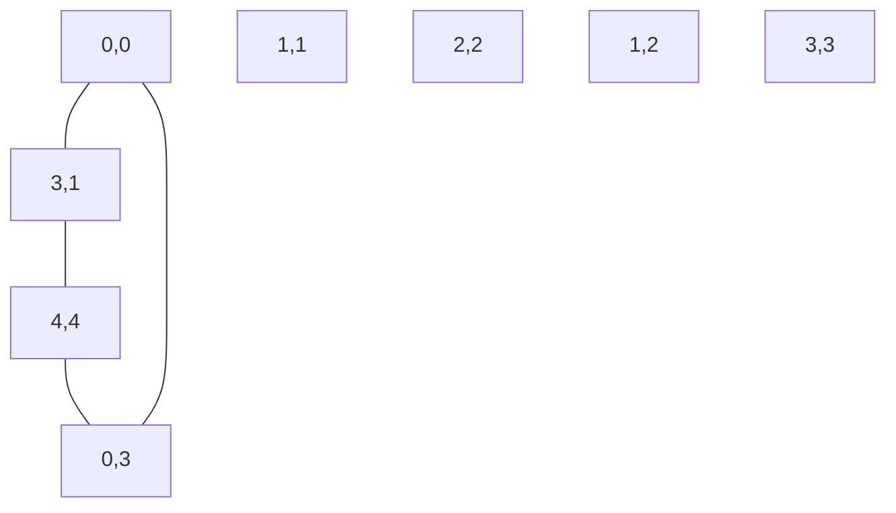

# Convex Hull

## Introduction

Imagine wrapping a rubber band around a set of pins stuck in a board - the shape formed by the rubber band is a **convex hull**. In computational geometry, the convex hull of a set of points is the smallest convex polygon that contains all the points. Think of it as the shape formed by stretching a rubber band around all points in the set.

A convex polygon is one where no line segment between any two points within the polygon ever goes outside the polygon. In other words, all interior angles are less than or equal to 180 degrees.

<div className="flex justify-center">
  
</div>

## Why Learn About Convex Hulls?

Convex hulls are fundamental in computational geometry and have numerous applications:

- Collision detection in games and simulations
- Pattern recognition and image processing
- Geographical information systems (GIS)
- Path planning for robots
- Data visualization and clustering

## Key Convex Hull Algorithms

We'll explore two popular algorithms for finding convex hulls:

1. **Graham's Scan** - Efficiency: O(n log n)
2. **Jarvis March** (Gift Wrapping) - Efficiency: O(nh) where h is the number of vertices in the hull

## Graham's Scan Algorithm

Graham's Scan is one of the most efficient algorithms for computing the convex hull of a set of points.

### How Graham's Scan Works:

1. Find the point with the lowest y-coordinate (and leftmost if tied)
2. Sort all points by polar angle with respect to this point
3. Iterate through the sorted points and maintain a stack of potential hull vertices
4. For each point, check if including it creates a "right turn" or a "left turn"
5. Keep only points that maintain the correct "turn" direction

Let's implement this in Python:

```python
def graham_scan(points):
    # Find the bottom-most point (and left-most if tied)
    bottom_point = min(points, key=lambda p: (p[1], p[0]))
    
    # Define a function to compute the cross product
    def cross_product(p1, p2, p3):
        return (p2[0] - p1[0]) * (p3[1] - p1[1]) - (p2[1] - p1[1]) * (p3[0] - p1[0])
    
    # Define a function to compute the polar angle
    def polar_angle(p):
        return math.atan2(p[1] - bottom_point[1], p[0] - bottom_point[0])
    
    # Sort points by polar angle
    sorted_points = sorted(points, key=polar_angle)
    
    # Initialize the hull with the first three points
    hull = [sorted_points[0], sorted_points[1]]
    
    # Process remaining points
    for i in range(2, len(sorted_points)):
        # Remove points that don't create a counter-clockwise turn
        while len(hull) > 1 and cross_product(hull[-2], hull[-1], sorted_points[i]) <= 0:
            hull.pop()
        hull.append(sorted_points[i])
    
    return hull
```

### Example:

```python
# Example points
points = [(0, 3), (1, 1), (2, 2), (4, 4), (0, 0), (1, 2), (3, 1), (3, 3)]
hull = graham_scan(points)
print("Convex Hull vertices:", hull)
# Output: Convex Hull vertices: [(0, 0), (3, 1), (4, 4), (0, 3)]
```

## Jarvis March (Gift Wrapping) Algorithm

The Jarvis March algorithm is conceptually simpler but less efficient for large point sets. It mimics the process of wrapping a gift by selecting the next point with the smallest angle.

### How Jarvis March Works:

1. Find the leftmost point (which is guaranteed to be on the hull)
2. Select the next hull point by considering the point with the smallest counter-clockwise angle
3. Repeat step 2 until we reach the starting point

Here's a Python implementation:

```python
def jarvis_march(points):
    # Find the leftmost point
    leftmost = min(points, key=lambda p: p[0])
    
    hull = []
    current_point = leftmost
    
    while True:
        hull.append(current_point)
        
        # Initialize the next point as the first point (which is not the current point)
        next_point = points[0]
        if next_point == current_point:
            next_point = points[1]
        
        # Find the point with the smallest counter-clockwise angle
        for p in points:
            if p == current_point or p == next_point:
                continue
            
            # Use cross product to determine the turn direction
            cross = (next_point[0] - current_point[0]) * (p[1] - current_point[1]) - \
                   (next_point[1] - current_point[1]) * (p[0] - current_point[0])
            
            # If cross product is positive, p makes a more counter-clockwise turn
            if cross > 0:
                next_point = p
            # If points are collinear, choose the farthest one
            elif cross == 0:
                dist1 = (next_point[0] - current_point[0]) ** 2 + (next_point[1] - current_point[1]) ** 2
                dist2 = (p[0] - current_point[0]) ** 2 + (p[1] - current_point[1]) ** 2
                if dist2 > dist1:
                    next_point = p
        
        # If we've returned to the start, we're done
        if next_point == leftmost:
            break
        
        current_point = next_point
    
    return hull
```

### Example:

```python
# Example points
points = [(0, 3), (1, 1), (2, 2), (4, 4), (0, 0), (1, 2), (3, 1), (3, 3)]
hull = jarvis_march(points)
print("Convex Hull vertices:", hull)
# Output: Convex Hull vertices: [(0, 0), (3, 1), (4, 4), (0, 3)]
```

## Visualization of Convex Hull

Let's visualize how a convex hull looks with a simple diagram:



The points A, B, C, and D form the convex hull around the other points E, F, G, and H.

## Time Complexity Analysis

| Algorithm | Time Complexity | When to Use |
|-----------|-----------------|-------------|
| Graham's Scan | O(n log n) | General purpose, works well for most cases |
| Jarvis March | O(nh) | When h (number of hull points) is small compared to n |

For most applications, Graham's Scan is preferred due to its better average-case performance.

## Real-World Applications

### 1. Collision Detection in Game Physics

Convex hulls are often used for simplified collision detection in game engines:

```python
def check_collision(object1_points, object2_points):
    # Generate convex hulls for both objects
    hull1 = graham_scan(object1_points)
    hull2 = graham_scan(object2_points)
    
    # Check if the hulls intersect (simplified)
    # In real game engines, more complex algorithms like GJK or SAT are used
    if hulls_intersect(hull1, hull2):
        return "Collision detected!"
    else:
        return "No collision."
```

### 2. Geographic Information Systems (GIS)

Convex hulls can help analyze geographic data:

```python
def analyze_city_spread(city_points):
    # Generate convex hull of city buildings
    city_hull = graham_scan(city_points)
    
    # Calculate the area of urban sprawl
    area = calculate_polygon_area(city_hull)
    
    # Calculate the density
    density = len(city_points) / area
    
    return {
        "urban_area": area,
        "building_density": density,
        "city_boundary_points": city_hull
    }
```

### 3. Image Processing

In computer vision, convex hulls help with shape analysis and feature detection:

```python
def analyze_object_shape(edge_points):
    # Generate the convex hull of the object's edges
    hull = graham_scan(edge_points)
    
    # Calculate actual object area
    object_area = calculate_polygon_area(edge_points)
    
    # Calculate convex hull area
    hull_area = calculate_polygon_area(hull)
    
    # Convexity ratio (1.0 means perfectly convex)
    convexity = object_area / hull_area
    
    return {
        "convexity": convexity,
        "is_mostly_convex": convexity > 0.9
    }
```

## Optimizations and Variations

### Quick Hull Algorithm

QuickHull is a divide-and-conquer approach to finding the convex hull, similar to QuickSort:

1. Find points with min and max x-coordinates (these will be on the hull)
2. Use the line between these points to divide the set into two subsets
3. Find the point furthest from this line in each subset
4. Recursively process the triangles formed by these new points

This algorithm can be faster in practice for certain distributions of points.

### Chan's Algorithm

Chan's algorithm combines the strengths of Graham's Scan and Jarvis March to achieve an optimal O(n log h) runtime, where h is the number of points on the hull.

## Common Pitfalls and Tips

1. **Handling Collinear Points**: Special care is needed when three or more points lie on the same line.
2. **Numerical Precision**: Floating point errors can cause issues with angle calculations.
3. **Empty Sets**: Remember to handle the special cases of empty sets or sets with fewer than 3 points.

## Summary

Convex hulls are a fundamental concept in computational geometry with a wide range of practical applications. We've covered:

- The definition and properties of convex hulls
- Two main algorithms: Graham's Scan and Jarvis March
- Implementations in Python
- Real-world applications
- Optimization techniques and variations

Mastering convex hulls is an important step in understanding more advanced geometric algorithms and solving complex spatial problems.

## Exercises

1. Implement Graham's Scan and test it on different point distributions.
2. Modify the algorithm to handle collinear points.
3. Create a visualization of the step-by-step process of building a convex hull.
4. Compare the performance of Graham's Scan and Jarvis March on various datasets.
5. Implement a convex hull application for a real-world problem like collision detection in a simple 2D game.

## Additional Resources

- The Computational Geometry Algorithms Library (CGAL)
- "Computational Geometry: Algorithms and Applications" by de Berg et al.
- Interactive convex hull visualizations on geometric algorithm websites
- Advanced algorithms like QuickHull and Chan's algorithm for more efficient hull computation

Convex hulls are just the beginning of computational geometry. Once you've mastered this concept, you can explore other fascinating topics like Voronoi diagrams, Delaunay triangulations, and geometric intersection problems.