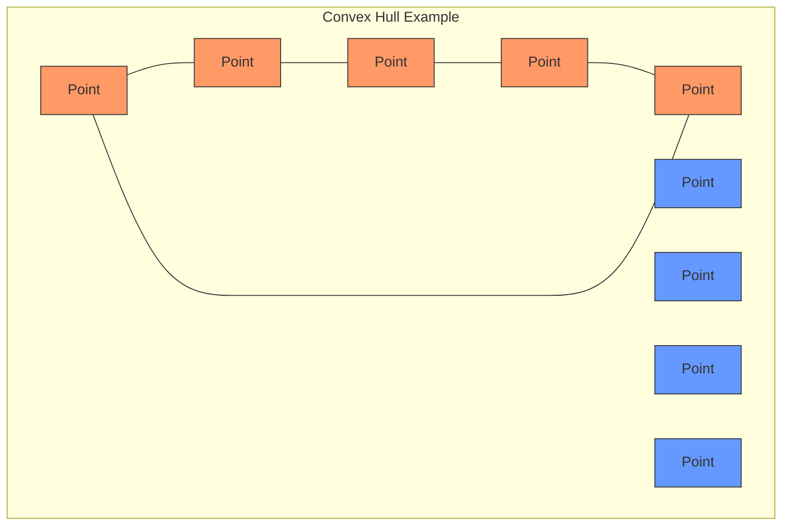
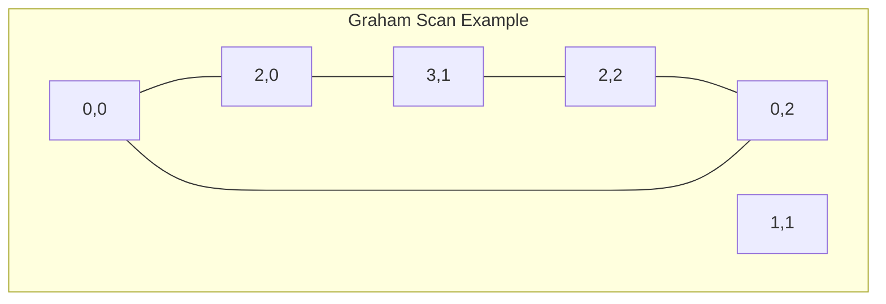

# Graham Scan Algorithm

## Introduction

The Graham Scan is an efficient algorithm used to find the **convex hull** of a set of points in a two-dimensional plane. Before we dive into the algorithm, let's understand what a convex hull is.

A convex hull of a set of points is the smallest convex polygon that encloses all the points. Think of it as putting a rubber band around all the points - when released, the rubber band will snap into the shape of the convex hull.



In this diagram, the blue points are inside the convex hull, while the orange points form the vertices of the convex hull polygon.

The Graham Scan algorithm was published by Ronald Graham in 1972 and has a time complexity of O(n log n), making it one of the most efficient algorithms for finding the convex hull.

## How the Graham Scan Works

The Graham Scan algorithm works through the following steps:

1. **Find an anchor point** - usually the point with the lowest y-coordinate (and leftmost if there are ties)
2. **Sort all other points** by polar angle (counterclockwise) with respect to the anchor point
3. **Process points sequentially** using a stack-based approach to build the convex hull

Let's break down each step in detail:

### Step 1: Finding the Anchor Point

We first identify the point with the lowest y-coordinate. If there are multiple such points, we choose the one with the smallest x-coordinate. This point is guaranteed to be on the convex hull.

### Step 2: Sorting Points by Polar Angle

Next, we sort all other points based on their polar angle relative to the anchor point. This creates a counterclockwise ordering of the points. In cases where points have the same angle, we keep the one furthest from the anchor point.

### Step 3: Building the Convex Hull

Finally, we process the sorted points one by one:

1. The first three points are pushed onto a stack (the anchor point and first two sorted points)
2. For each remaining point, we check if it makes a "right turn" with the last two points on the stack
3. If it makes a right turn, we pop the last point from the stack and repeat the check
4. If it makes a left turn, we push the point onto the stack
5. After processing all points, the stack contains the points of the convex hull in counterclockwise order

## Implementation

Here's a step-by-step implementation of the Graham Scan algorithm in Python:

```python
def graham_scan(points):
    """
    Computes the convex hull of a set of 2D points using the Graham scan algorithm.
    
    Args:
        points: A list of (x, y) tuples representing points in 2D space
        
    Returns:
        A list of (x, y) tuples representing the convex hull vertices in CCW order
    """
    # Find the point with the lowest y-coordinate (and leftmost if tied)
    anchor = min(points, key=lambda p: (p[1], p[0]))
    
    # Define a function to compute polar angle between anchor and another point
    def polar_angle(point):
        return math.atan2(point[1] - anchor[1], point[0] - anchor[0])
    
    # Define a function to determine the orientation of three points
    def orientation(p, q, r):
        val = (q[1] - p[1]) * (r[0] - q[0]) - (q[0] - p[0]) * (r[1] - q[1])
        if val == 0:
            return 0  # collinear
        return 1 if val > 0 else 2  # clockwise or counterclockwise
    
    # Sort points by polar angle with respect to the anchor
    # For the same angle, keep the farthest point
    sorted_points = sorted(points, key=lambda p: 
                          (polar_angle(p), 
                           -(p[0] - anchor[0])**2 - (p[1] - anchor[1])**2))
    
    # Remove duplicates with the same polar angle (keep the farthest one)
    i = 1
    while i < len(sorted_points) - 1:
        if polar_angle(sorted_points[i]) == polar_angle(sorted_points[i+1]):
            # Keep the farthest point
            dist_i = (sorted_points[i][0] - anchor[0])**2 + (sorted_points[i][1] - anchor[1])**2
            dist_i_plus_1 = (sorted_points[i+1][0] - anchor[0])**2 + (sorted_points[i+1][1] - anchor[1])**2
            if dist_i < dist_i_plus_1:
                sorted_points.pop(i)
            else:
                sorted_points.pop(i+1)
        else:
            i += 1
    
    # Build the convex hull
    stack = [anchor, sorted_points[0]]
    
    # Process the sorted points
    for i in range(1, len(sorted_points)):
        # Pop the last point from the stack if we don't make a counterclockwise turn
        while len(stack) > 1 and orientation(stack[-2], stack[-1], sorted_points[i]) != 2:
            stack.pop()
        stack.append(sorted_points[i])
    
    return stack
```

Let's break down the key components:

- We use `math.atan2()` to calculate the polar angle
- The `orientation()` function determines whether three points make a left turn (counterclockwise) or a right turn (clockwise)
- We use a stack to build the convex hull by ensuring we always make counterclockwise turns

## Example Walkthrough

Let's trace through the algorithm with a simple example:

Consider the following points:
- (0, 0)
- (1, 1)
- (2, 0)
- (2, 2)
- (3, 1)
- (0, 2)

1. **Find the anchor point**: (0, 0) has the lowest y-coordinate
2. **Sort by polar angle**:
   - Relative to (0, 0), the sorted points are: (2, 0), (3, 1), (2, 2), (0, 2), (1, 1)
3. **Build the convex hull**:
   - Push (0, 0), (2, 0)
   - Push (3, 1)
   - Push (2, 2)
   - Push (0, 2)
   - When considering (1, 1), we find it makes a right turn with (2, 2) and (0, 2), so we don't include it

Final convex hull: [(0, 0), (2, 0), (3, 1), (2, 2), (0, 2)]



## Complete Example with Input and Output

Here's a complete example with input and output:

```python
import math

def graham_scan(points):
    # Implementation as above...
    # [Code omitted for brevity]

# Example usage
if __name__ == "__main__":
    import matplotlib.pyplot as plt
    
    # Sample points
    points = [(0, 0), (1, 1), (2, 0), (2, 2), (3, 1), (0, 2)]
    
    print("Input points:", points)
    
    # Compute convex hull
    hull = graham_scan(points)
    
    print("Convex hull vertices:", hull)
    
    # Plotting for visualization
    x_coords = [p[0] for p in points]
    y_coords = [p[1] for p in points]
    
    hull_x = [p[0] for p in hull]
    hull_y = [p[1] for p in hull]
    hull_x.append(hull[0][0])  # Close the polygon
    hull_y.append(hull[0][1])
    
    plt.figure(figsize=(8, 8))
    plt.scatter(x_coords, y_coords, c='blue', label='Input Points')
    plt.plot(hull_x, hull_y, 'r-', label='Convex Hull')
    plt.scatter([hull[0][0]], [hull[0][1]], c='green', s=100, label='Anchor Point')
    plt.grid(True)
    plt.legend()
    plt.axis('equal')
    plt.title('Graham Scan Convex Hull')
    plt.show()
```

Output:
```
Input points: [(0, 0), (1, 1), (2, 0), (2, 2), (3, 1), (0, 2)]
Convex hull vertices: [(0, 0), (2, 0), (3, 1), (2, 2), (0, 2)]
```

## Real-World Applications

The convex hull algorithm and specifically the Graham Scan have numerous practical applications:

### 1. Collision Detection in Video Games

Game developers use convex hull algorithms to create bounding volumes around complex objects. This simplifies collision detection, making games run more efficiently.

### 2. Image Processing

In computer vision, convex hulls help in shape analysis, pattern recognition, and feature extraction from images.

### 3. Geographic Information Systems (GIS)

GIS applications use convex hulls to define boundaries around geographic features or to calculate the "footprint" of a set of geographic points.

### 4. Robot Motion Planning

Robots use convex hulls to identify obstacle-free paths and navigate around objects in their environment.

### 5. Pattern Recognition

Machine learning algorithms use convex hulls as a feature extraction technique to identify shapes and patterns in data.

## Time and Space Complexity

- **Time Complexity**: O(n log n), where n is the number of points
  - The sorting step dominates the algorithm's runtime
  - The actual hull construction takes O(n) time
- **Space Complexity**: O(n) for storing the sorted points and the hull

## Common Pitfalls and Optimizations

1. **Handling collinear points**: When multiple points have the same polar angle, you need to ensure only the farthest one is kept
2. **Numerical precision**: Floating-point calculations can introduce errors, especially in the orientation test
3. **Empty input**: Make sure to handle the case where there are fewer than 3 points
4. **Optimization**: The algorithm can be optimized by skipping points that are clearly inside the hull

## Summary

The Graham Scan algorithm is an elegant and efficient method for finding the convex hull of a set of points in a plane. With a time complexity of O(n log n), it's among the fastest algorithms for this problem.

Key takeaways:
- The algorithm works by sorting points by their polar angle and then building the hull incrementally
- It uses a stack to maintain the current convex hull as points are processed
- The hull is maintained by ensuring all turns are counterclockwise
- Graham Scan has numerous practical applications in various fields

## Exercise Suggestions

1. **Modify the Algorithm**: Implement the Graham Scan to handle edge cases like collinear points more efficiently.

2. **Visualization Tool**: Create a visualization that shows the algorithm in action, step by step.

3. **Benchmark**: Compare the Graham Scan with other convex hull algorithms (like Jarvis March or QuickHull) in terms of performance for different input distributions.

4. **Advanced Application**: Use the Graham Scan algorithm to implement a collision detection system for simple 2D shapes.

5. **Challenge Problem**: Modify the algorithm to find the convex hull of a dynamically changing set of points (points being added and removed).

## Additional Resources

- "Computational Geometry: Algorithms and Applications" by Mark de Berg et al.
- "Introduction to Algorithms" by Cormen, Leiserson, Rivest, and Stein
- [Computational Geometry Algorithms Library (CGAL)](https://www.cgal.org/)

For a deeper understanding of the mathematics behind the algorithm, explore concepts like vector cross products and orientation tests in computational geometry texts.