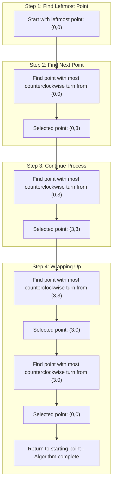

# Jarvis March

## Introduction

The Jarvis March, also known as the Gift Wrapping algorithm, is a simple and intuitive algorithm for computing the **convex hull** of a set of points in a plane. The convex hull of a set of points is the smallest convex polygon that contains all the points. Think of it as wrapping a rubber band around all the points - the shape formed is the convex hull.

The algorithm is named after R. A. Jarvis who first published it in 1973, and it's called "Gift Wrapping" because the process resembles wrapping a gift with paper by continuously folding around the corners.


## Why Learn Jarvis March?

Convex hull algorithms have many practical applications:
- Collision detection in video games and simulations
- Image processing and pattern recognition
- Geographical information systems (GIS)
- Robot motion planning
- Statistical analysis and outlier detection

## The Intuition

The intuitive idea behind the Jarvis March algorithm is simple:

1. Start with the leftmost point (which is definitely on the hull)
2. Find the next point by selecting the one that makes the most counterclockwise turn
3. Repeat until we get back to the starting point

It's like wrapping a string around the set of points, one point at a time.

## Algorithm Steps

Let's break down the Jarvis March algorithm step by step:

1. Find the point with the lowest x-coordinate (leftmost). If there's a tie, choose the one with the lowest y-coordinate.
2. Set this point as the current point.
3. Select the next point so that all other points are to the right of the line formed by current point and next point.
4. Set the next point as the current point.
5. Repeat steps 3-4 until we reach the starting point again.

## Implementation in Code

Here's an implementation of the Jarvis March algorithm in JavaScript:

```javascript
class Point {
  constructor(x, y) {
    this.x = x;
    this.y = y;
  }
}

// Returns the orientation of triplet (p, q, r)
// 0 --> Collinear
// 1 --> Clockwise
// 2 --> Counterclockwise
function orientation(p, q, r) {
  let val = (q.y - p.y) * (r.x - q.x) - (q.x - p.x) * (r.y - q.y);
  
  if (val === 0) return 0;  // collinear
  return (val > 0) ? 1 : 2; // clockwise or counterclockwise
}

function jarvisMarch(points) {
  let n = points.length;
  
  // There must be at least 3 points
  if (n < 3) return points;
  
  // Initialize result
  let hull = [];
  
  // Find the leftmost point
  let leftmost = 0;
  for (let i = 1; i < n; i++) {
    if (points[i].x < points[leftmost].x) {
      leftmost = i;
    } else if (points[i].x === points[leftmost].x) {
      // If there are multiple leftmost points, choose the one with lowest y
      if (points[i].y < points[leftmost].y) {
        leftmost = i;
      }
    }
  }
  
  // Start from leftmost point, keep moving counterclockwise
  // until we reach the start point again
  let p = leftmost;
  let q;
  
  do {
    // Add current point to result
    hull.push(points[p]);
    
    // Search for a point 'q' such that orientation(p, q, x) is counterclockwise
    // for all points 'x'
    q = (p + 1) % n;
    
    for (let i = 0; i < n; i++) {
      // If i is more counterclockwise than current q, then update q
      if (orientation(points[p], points[i], points[q]) === 2) {
        q = i;
      }
    }
    
    // Now q is the most counterclockwise with respect to p
    // Set p as q for next iteration
    p = q;
    
  } while (p !== leftmost);  // Continue until we reach first point again
  
  return hull;
}

// Example usage:
const points = [
  new Point(0, 3),
  new Point(2, 2),
  new Point(1, 1),
  new Point(2, 1),
  new Point(3, 0),
  new Point(0, 0),
  new Point(3, 3)
];

const convexHull = jarvisMarch(points);
console.log("Points on the convex hull:");
convexHull.forEach(point => console.log(`(${point.x}, ${point.y})`));
```

### Expected Output:

```
Points on the convex hull:
(0, 0)
(3, 0)
(3, 3)
(0, 3)
```

## Visualizing the Algorithm

Let's visualize how Jarvis March works on a simple example:



## Time and Space Complexity

- **Time Complexity**: O(n²) where n is the number of points. For each point on the hull, we must examine all n points to determine the next hull point.
- **Space Complexity**: O(h) where h is the number of points on the hull. In the worst case, all points might be on the hull, making it O(n).

## Optimizations and Variants

1. **Skip Interior Points**: Once we've identified a point as an interior point (not on the hull), we can mark it and skip it in future iterations.

2. **Chan's Algorithm**: Combines Jarvis March with Graham Scan to achieve O(n log h) time complexity where h is the number of points on the convex hull.

## Practical Application: Collision Detection

One practical application of the convex hull is in collision detection systems. By computing the convex hull of complex objects, we can simplify collision checks by using the hull as a bounding volume.

Here's a simple example of how convex hulls might be used for collision detection:

```javascript
function doConvexHullsCollide(hull1, hull2) {
  // For simplicity, using a basic separation axis theorem check
  // Real implementations would be more sophisticated
  
  // Check if any point from hull1 is inside hull2
  for (const point of hull1) {
    if (isPointInConvexPolygon(point, hull2)) {
      return true;
    }
  }
  
  // Check if any point from hull2 is inside hull1
  for (const point of hull2) {
    if (isPointInConvexPolygon(point, hull1)) {
      return true;
    }
  }
  
  // Check if any edges intersect
  for (let i = 0; i < hull1.length; i++) {
    const p1 = hull1[i];
    const p2 = hull1[(i + 1) % hull1.length];
    
    for (let j = 0; j < hull2.length; j++) {
      const q1 = hull2[j];
      const q2 = hull2[(j + 1) % hull2.length];
      
      if (doSegmentsIntersect(p1, p2, q1, q2)) {
        return true;
      }
    }
  }
  
  return false;
}
```

## Summary

The Jarvis March algorithm is an intuitive method for computing the convex hull of a set of points in 2D space. While not the most efficient algorithm for large datasets (Graham's scan is generally faster with O(n log n) time complexity), Jarvis March is easier to understand and implement.

Key characteristics of Jarvis March:
- Output-sensitive algorithm (complexity depends on the number of points on the hull)
- Intuitive approach similar to wrapping a rubber band around points
- Works well when the number of points on the hull is small relative to the total number of points
- Time complexity of O(n²) in the worst case

## Exercises

1. **Basic Implementation**: Implement the Jarvis March algorithm in your preferred programming language.

2. **Visualization**: Create a visualization of the Jarvis March algorithm step by step for a set of random points.

3. **Optimization Challenge**: Modify the algorithm to skip points that are determined to be inside the convex hull.

4. **Application**: Use the Jarvis March algorithm to implement a simple collision detection system between two convex polygons.

5. **Comparison**: Implement both Jarvis March and Graham Scan algorithms and compare their performance on datasets of various sizes.

## Additional Resources

- [Computational Geometry: Algorithms and Applications](https://www.cs.uu.nl/geobook/) by Mark de Berg et al.
- [Introduction to Algorithms](https://mitpress.mit.edu/books/introduction-algorithms-third-edition) by Cormen, Leiserson, Rivest, and Stein
- [Computational Geometry in C](https://cs.smith.edu/~jorourke/books/compgeom.html) by Joseph O'Rourke

## References

1. Jarvis, R. A. (1973). "On the identification of the convex hull of a finite set of points in the plane". Information Processing Letters. 2 (1): 18–21.
2. O'Rourke, J. (1998). Computational Geometry in C (2nd ed.). Cambridge University Press.