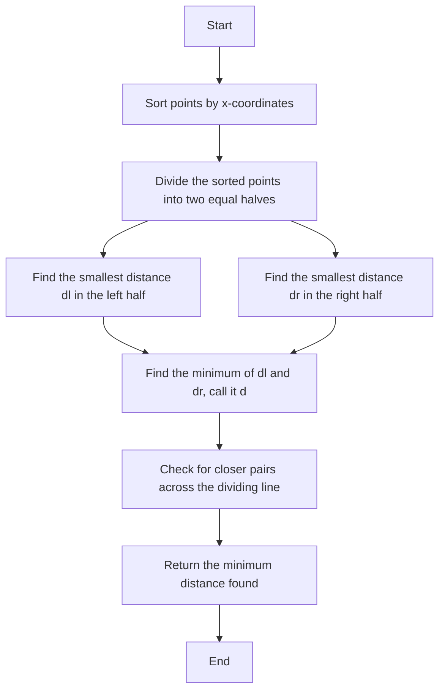

# Closest Pair of Points

## Introduction

The closest pair of points problem is a fundamental geometric problem: given a set of points in a plane, find the two points that are closest to each other. While this might sound simple, developing an efficient algorithm for this problem is quite interesting.

A naive approach would be to calculate the distance between every possible pair of points and find the minimum distance. This would have a time complexity of O(n²), which isn't ideal for large datasets. However, using a divide-and-conquer approach, we can solve this problem in O(n log n) time, which is significantly better.

In this tutorial, we'll understand the problem, learn the efficient approach to solve it, and see how it applies to real-world scenarios.

## Understanding the Problem

Before diving into the solution, let's clearly define what we mean by "closest pair of points."

### Problem Statement

Given a set of n points in a 2D plane, find the two points that are closest to each other (as measured by Euclidean distance).

### Distance Calculation

The Euclidean distance between two points (x₁, y₁) and (x₂, y₂) is calculated as:

```
distance = √[(x₂ - x₁)² + (y₂ - y₁)²]
```

## Divide and Conquer Approach

We'll solve this problem using a divide and conquer approach. Here's a high-level overview:

1. Sort all points according to x-coordinates.
2. Divide the sorted points into two equal halves.
3. Recursively find the smallest distances in both halves.
4. Take the minimum of the two smallest distances.
5. Check if there are any pairs of points with one point in the left half and the other in the right half that are closer than the current minimum distance.

Let's break this down step by step.

### Step 1: Sort Points by X-Coordinates

We start by sorting all the points based on their x-coordinates. This allows us to easily divide the plane into two halves.

### Step 2: Divide and Recursively Find Minimum Distances

We split the sorted array of points into two halves and recursively find the minimum distances in each half. Let's call these minimum distances `dl` (for the left half) and `dr` (for the right half).

### Step 3: Find the Overall Minimum Distance

The minimum of `dl` and `dr` gives us the smallest distance found so far. Let's call it `d`.

### Step 4: Check for Closer Pairs Across the Dividing Line

Now, there's a possibility that the closest pair has one point in the left half and one in the right half. To find such a pair, we only need to consider points that are within a distance `d` of the dividing line.

We create a strip of points that are within a distance `d` from the vertical line dividing the two halves. We sort this strip by y-coordinates to efficiently compare distances.

### Step 5: Check Distances Within the Strip

For each point in the strip, we only need to check a limited number of points ahead (at most 6, based on a geometric property). If we find a pair with a distance less than `d`, we update `d`.

## Implementation in Python

Let's implement the algorithm in Python:

```python
import math

def distance(p1, p2):
    return math.sqrt((p1[0] - p2[0])**2 + (p1[1] - p2[1])**2)

def brute_force(points, n):
    min_dist = float('inf')
    closest_pair = None
    
    for i in range(n):
        for j in range(i + 1, n):
            dist = distance(points[i], points[j])
            if dist < min_dist:
                min_dist = dist
                closest_pair = (points[i], points[j])
    
    return min_dist, closest_pair

def closest_pair_strip(strip, size, d):
    min_dist = d
    closest_pair = None
    
    # Sort strip by y-coordinate
    strip.sort(key=lambda point: point[1])
    
    # For each point in the strip, check at most 6 points ahead
    for i in range(size):
        j = i + 1
        while j < size and (strip[j][1] - strip[i][1]) < min_dist:
            dist = distance(strip[i], strip[j])
            if dist < min_dist:
                min_dist = dist
                closest_pair = (strip[i], strip[j])
            j += 1
    
    return min_dist, closest_pair

def closest_pair_util(points, n):
    # Base case: If there are 2 or 3 points, use brute force
    if n <= 3:
        return brute_force(points, n)
    
    # Find the middle point
    mid = n // 2
    mid_point = points[mid]
    
    # Recursively find the minimum distances in left and right halves
    dl, pair_left = closest_pair_util(points[:mid], mid)
    dr, pair_right = closest_pair_util(points[mid:], n - mid)
    
    # Find the smaller of the two distances
    if dl < dr:
        d = dl
        closest_pair = pair_left
    else:
        d = dr
        closest_pair = pair_right
    
    # Create a strip of points within distance d of the middle line
    strip = []
    for i in range(n):
        if abs(points[i][0] - mid_point[0]) < d:
            strip.append(points[i])
    
    # Find the closest pair in the strip (if any)
    strip_min, strip_pair = closest_pair_strip(strip, len(strip), d)
    
    # Return the minimum of d and strip_min
    if strip_min < d:
        return strip_min, strip_pair
    else:
        return d, closest_pair

def closest_pair(points):
    # Sort points based on x-coordinates
    points.sort(key=lambda point: point[0])
    
    # Call the recursive function
    min_dist, closest_pair = closest_pair_util(points, len(points))
    
    return min_dist, closest_pair
```

## Example Usage

Let's see the algorithm in action with a simple example:

```python
# Sample points represented as (x, y)
points = [(2, 3), (12, 30), (40, 50), (5, 1), (12, 10), (3, 4)]

min_distance, pair = closest_pair(points)
print(f"The closest pair of points is {pair} with distance {min_distance}")
```

**Output:**
```
The closest pair of points is ((2, 3), (3, 4)) with distance 1.4142135623730951
```

## Time Complexity Analysis

- Sorting the points based on x-coordinates: O(n log n)
- Recursive divide-and-conquer: The recurrence relation is T(n) = 2T(n/2) + O(n), which resolves to O(n log n)
- The strip comparison step: O(n)

Overall, the time complexity of the algorithm is O(n log n).

## Real-World Applications

The closest pair of points algorithm has numerous real-world applications:

### 1. Collision Detection in Games

When developing games or simulations, you often need to check if objects are colliding. The closest pair algorithm can be used to efficiently detect potential collisions.

### 2. Geographic Information Systems (GIS)

GIS applications frequently need to find the closest points of interest (like the nearest restaurant or park). This algorithm can be used to optimize such searches.

### 3. Clustering in Data Science

In data mining and machine learning, clustering algorithms like K-means often require finding the closest points to form clusters.

### 4. Air Traffic Control

Air traffic control systems need to monitor and prevent potential collisions between aircraft. The closest pair algorithm can be used to identify aircraft that are getting dangerously close to each other.

### 5. Wireless Network Optimization

When setting up a network of wireless sensors, you might want to ensure that they're not too close to each other for optimal coverage.

## Visualization

Let's understand the algorithm visually:



## Exercises for Practice

1. Modify the algorithm to return all pairs of points that are at the minimum distance, not just one.
2. Implement the algorithm in a different programming language of your choice.
3. Extend the algorithm to work in 3D space.
4. Design a test case with a large number of points (e.g., 10,000) and measure the performance of the naive approach vs. the divide-and-conquer approach.
5. Research and implement a variant of the algorithm that uses a different data structure (e.g., k-d trees) to solve the problem.

## Summary

The closest pair of points problem is a classic geometric problem that has real-world applications in various domains. While a naive approach would take O(n²) time, using a divide-and-conquer strategy allows us to solve it in O(n log n) time, making it feasible for large datasets.

We've learned how to:

- Understand the problem and its applications.
- Implement an efficient divide-and-conquer algorithm to find the closest pair.
- Analyze the time complexity of the algorithm.
- Apply the algorithm to real-world scenarios.

## Additional Resources

- "Computational Geometry: Algorithms and Applications" by Mark de Berg et al.
- "Introduction to Algorithms" by Cormen, Leiserson, Rivest, and Stein.
- [Computational Geometry on Wikipedia](https://en.wikipedia.org/wiki/Computational_geometry)
- Online courses on Algorithmic techniques, especially those covering divide-and-conquer strategies.

Happy coding!