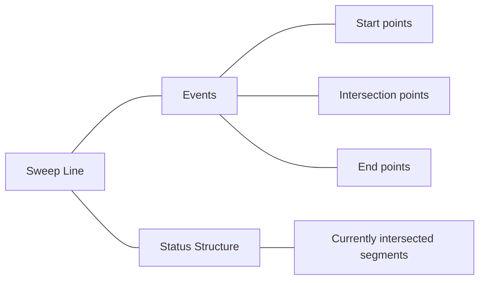

# Sweep Line Algorithm

## Introduction

The Sweep Line Algorithm (also known as the Line Sweep Algorithm) is a fundamental technique in computational geometry that solves various geometric problems efficiently. As the name suggests, it works by "sweeping" an imaginary line across the plane, processing geometric objects as this line encounters them.

Think of it as scanning a document with a scanner - as the scanner's light moves across the page (our sweep line), it processes information one line at a time. This approach allows us to transform complex two-dimensional problems into simpler one-dimensional problems that we can solve incrementally.

The sweep line algorithm is particularly useful for problems involving:

- Finding intersections between geometric objects (lines, segments, polygons)
- Computing union, intersection, or difference of geometric shapes
- Detecting overlaps among rectangles or other shapes
- Finding the closest pair of points
- Constructing Voronoi diagrams

## Basic Concept

The key components of the sweep line algorithm are:

1. **Sweep Line**: An imaginary line (often vertical or horizontal) that moves across the plane
2. **Event Points**: Points where the sweep line must stop and process information
3. **Event Queue**: A priority queue that stores events sorted by their position
4. **Status Structure**: A data structure (often a balanced binary search tree) that maintains the current state of objects intersecting the sweep line

Let's visualize the sweep line as it processes line segments:



## Step-by-Step Algorithm

Here's how the sweep line algorithm generally works:

1. Identify all possible event points and sort them (typically from left to right or top to bottom)
2. Initialize an empty status structure to track objects currently intersected by the sweep line
3. Process events in order:
   - When starting a new object, add it to the status structure
   - When ending an object, remove it from the status structure
   - At each event point, check for any new interactions between adjacent objects in the status structure
4. Update results based on the events processed

## Example: Finding Line Segment Intersections

One classic application of the sweep line algorithm is finding all intersections between a set of line segments. Let's implement this:

```python
from collections import namedtuple
import heapq

# Define our Point and Segment types
Point = namedtuple('Point', ['x', 'y'])
Segment = namedtuple('Segment', ['start', 'end', 'id'])

class Event:
    START = 0
    END = 1
    INTERSECTION = 2
    
    def __init__(self, point, event_type, segment1, segment2=None):
        self.point = point
        self.event_type = event_type
        self.segment1 = segment1
        self.segment2 = segment2
    
    def __lt__(self, other):
        # Sort by x-coordinate, then by event type
        if self.point.x != other.point.x:
            return self.point.x < other.point.x
        return self.event_type < other.event_type

def orientation(p, q, r):
    """Check orientation of points p, q, r"""
    val = (q.y - p.y) * (r.x - q.x) - (q.x - p.x) * (r.y - q.y)
    if val == 0:
        return 0  # collinear
    return 1 if val > 0 else 2  # clockwise or counterclockwise

def do_segments_intersect(seg1, seg2):
    """Check if two line segments intersect"""
    o1 = orientation(seg1.start, seg1.end, seg2.start)
    o2 = orientation(seg1.start, seg1.end, seg2.end)
    o3 = orientation(seg2.start, seg2.end, seg1.start)
    o4 = orientation(seg2.start, seg2.end, seg1.end)
    
    # General case
    if o1 != o2 and o3 != o4:
        return True
    
    # Special cases (collinear points)
    # We'll simplify and assume no collinear segments for this example
    return False

def compute_intersection_point(seg1, seg2):
    """Compute the intersection point of two line segments"""
    # Line 1 represented as a1x + b1y = c1
    a1 = seg1.end.y - seg1.start.y
    b1 = seg1.start.x - seg1.end.x
    c1 = a1 * seg1.start.x + b1 * seg1.start.y
    
    # Line 2 represented as a2x + b2y = c2
    a2 = seg2.end.y - seg2.start.y
    b2 = seg2.start.x - seg2.end.x
    c2 = a2 * seg2.start.x + b2 * seg2.start.y
    
    determinant = a1 * b2 - a2 * b1
    if determinant == 0:
        return None  # Parallel lines
    
    x = (b2 * c1 - b1 * c2) / determinant
    y = (a1 * c2 - a2 * c1) / determinant
    return Point(x, y)

def find_intersections(segments):
    """Find all intersections between line segments using sweep line"""
    # Create events for segment endpoints
    events = []
    for segment in segments:
        # Ensure start is to the left of end
        if segment.start.x > segment.end.x:
            segment = Segment(segment.end, segment.start, segment.id)
        
        # Add start and end events
        heapq.heappush(events, Event(segment.start, Event.START, segment))
        heapq.heappush(events, Event(segment.end, Event.END, segment))
    
    active_segments = set()
    intersections = []
    
    while events:
        event = heapq.heappop(events)
        
        if event.event_type == Event.START:
            # Check new segment against all active segments for intersections
            for segment in active_segments:
                if do_segments_intersect(event.segment1, segment):
                    intersection_point = compute_intersection_point(event.segment1, segment)
                    # Only add intersection if it's to the right of current sweep line
                    if intersection_point and intersection_point.x >= event.point.x:
                        heapq.heappush(events, Event(
                            intersection_point, 
                            Event.INTERSECTION, 
                            event.segment1, 
                            segment
                        ))
            active_segments.add(event.segment1)
            
        elif event.event_type == Event.END:
            # Remove the segment from active set
            active_segments.remove(event.segment1)
            
        elif event.event_type == Event.INTERSECTION:
            # Record the intersection
            intersections.append((event.point, event.segment1.id, event.segment2.id))
    
    return intersections
```

### Example Usage:

```python
# Define some line segments
segments = [
    Segment(Point(0, 0), Point(10, 10), 1),  # Diagonal line from bottom-left to top-right
    Segment(Point(0, 10), Point(10, 0), 2),  # Diagonal line from top-left to bottom-right
    Segment(Point(5, 0), Point(5, 10), 3),   # Vertical line in the middle
]

intersections = find_intersections(segments)
print("Found intersections:")
for point, id1, id2 in intersections:
    print(f"Segments {id1} and {id2} intersect at ({point.x}, {point.y})")
```

**Output**:
```
Found intersections:
Segments 1 and 2 intersect at (5.0, 5.0)
Segments 1 and 3 intersect at (5.0, 5.0)
Segments 2 and 3 intersect at (5.0, 5.0)
```

## Common Applications

### 1. Rectangle Intersection

The sweep line algorithm is particularly efficient for finding intersections between rectangles. We sweep a vertical line from left to right, maintaining active rectangles in a balanced binary search tree.

### 2. Computing the Union of Rectangles

This is useful in GUI systems for calculating the total area covered by multiple windows or elements.

### 3. Closest Pair of Points

While the divide and conquer method is more commonly used for this problem, sweep line can also efficiently find the closest pair of points in a 2D plane.

### 4. Line Segment Visibility

Determining which line segments are visible from a given viewpoint is another application that benefits from the sweep line approach.

### 5. Polygon Clipping

The Sutherland-Hodgman algorithm uses a sweep line approach for clipping polygons against each other.

## Real-World Applications

### Geographic Information Systems (GIS)

GIS software uses sweep line algorithms to:
- Detect overlapping map features
- Calculate intersections between roads, rivers, or boundaries
- Perform spatial queries like "find all buildings within 500 meters of this road"

### Computer Graphics

In graphics applications, sweep line algorithms help with:
- Hidden surface removal
- Shadow calculation
- Collision detection
- Ray tracing optimization

### Integrated Circuit Design

When designing computer chips:
- Verifying that circuit traces don't intersect
- Calculating spacing and overlaps between components
- Design rule checking

### Example: Map Overlay in GIS

Imagine you have two maps - one showing flood zones and another showing residential areas. To find residential areas at risk of flooding, you need to compute the intersection of these two maps. The sweep line algorithm efficiently finds all overlapping regions:

```python
def find_overlapping_regions(map1_regions, map2_regions):
    # Step 1: Create event points for all rectangle edges
    events = []
    for i, rect in enumerate(map1_regions):
        # Each rectangle has (x1,y1) as bottom-left and (x2,y2) as top-right
        events.append((rect[0], 0, 1, i))  # 0 = start event, 1 = map1
        events.append((rect[2], 1, 1, i))  # 1 = end event, 1 = map1
    
    for i, rect in enumerate(map2_regions):
        events.append((rect[0], 0, 2, i))  # 0 = start event, 2 = map2
        events.append((rect[2], 1, 2, i))  # 1 = end event, 2 = map2
    
    # Sort events by x-coordinate
    events.sort()
    
    # Step 2: Process events with sweep line
    active_map1 = set()
    active_map2 = set()
    overlaps = []
    
    for x, event_type, map_id, rect_id in events:
        if event_type == 0:  # Start event
            if map_id == 1:
                # For each active map2 rectangle, check for overlap
                rect1 = map1_regions[rect_id]
                for j in active_map2:
                    rect2 = map2_regions[j]
                    if max(rect1[1], rect2[1]) < min(rect1[3], rect2[3]):  # y-overlap check
                        # Found an overlap starting at x
                        overlaps.append((x, max(rect1[1], rect2[1]), rect_id, j))
                active_map1.add(rect_id)
            else:
                # For each active map1 rectangle, check for overlap
                rect2 = map2_regions[rect_id]
                for i in active_map1:
                    rect1 = map1_regions[i]
                    if max(rect1[1], rect2[1]) < min(rect1[3], rect2[3]):  # y-overlap check
                        # Found an overlap starting at x
                        overlaps.append((x, max(rect1[1], rect2[1]), i, rect_id))
                active_map2.add(rect_id)
        else:  # End event
            if map_id == 1:
                active_map1.remove(rect_id)
            else:
                active_map2.remove(rect_id)
    
    return overlaps
```

## Time Complexity Analysis

For the line segment intersection algorithm:
- Sorting the events takes O(n log n) time, where n is the number of segments
- Processing each event takes O(log n) time with a balanced search tree
- There are O(n + k) events, where k is the number of intersections
- Therefore, the overall time complexity is O((n + k) log n)

This is much more efficient than the naive approach of checking all O(n²) pairs of segments, especially when there are few intersections.

## Common Challenges and Solutions

### Challenge: Numerical Precision

When calculating intersection points, floating-point precision errors can occur.

**Solution**: Use exact arithmetic libraries or epsilon comparisons for floating point values.

### Challenge: Degenerate Cases

Handling special cases like vertical lines or collinear points can be tricky.

**Solution**: Add special case handling and ensure your implementation covers edge cases.

### Challenge: Performance on Large Datasets

For very large inputs, even O(n log n) can be slow.

**Solution**: Consider spatial partitioning techniques (like quadtrees) to reduce the problem size.

## Summary

The sweep line algorithm is a powerful technique for solving geometric problems efficiently by:

1. Converting 2D problems into 1D by sweeping across the plane
2. Processing events in order (usually left to right)
3. Maintaining a data structure that tracks the current state of the sweep line
4. Checking for interactions only between adjacent objects

This makes it ideal for intersection problems, overlap detection, and many other geometric computations that would be much more expensive using naive approaches.

## Exercises

1. **Basic**: Modify the line segment intersection algorithm to handle vertical line segments correctly.

2. **Intermediate**: Implement a sweep line algorithm to compute the total area covered by a set of rectangles (considering overlaps).

3. **Advanced**: Use the sweep line technique to find the closest pair of points in a set of 2D points.

4. **Application**: Implement a map overlay function that computes the intersection of two sets of polygons using the sweep line algorithm.

5. **Challenge**: Extend the sweep line algorithm to find all intersections in a set of circles efficiently.

## Additional Resources

- "Computational Geometry: Algorithms and Applications" by Mark de Berg et al.
- "Introduction to Algorithms" by Cormen, Leiserson, Rivest, and Stein (Chapter on Computational Geometry)
- [Computational Geometry Algorithms Library (CGAL)](https://www.cgal.org/)
- [Visualizations of Sweep Line Algorithms](https://visualgo.net/en)

Remember, the key to mastering the sweep line technique is practice. Start with simple problems and gradually work your way up to more complex applications!