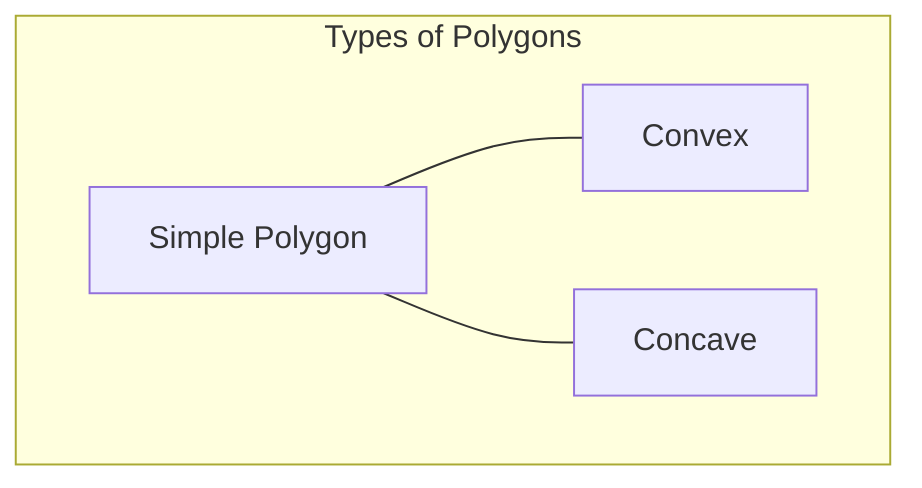

# Area of Polygon

## Introduction

Calculating the area of a polygon is a fundamental problem in computational geometry with applications ranging from computer graphics and game development to geographic information systems (GIS) and computer-aided design (CAD). While the area of simple shapes like triangles and rectangles can be calculated using well-known formulas, calculating the area of an arbitrary polygon requires more sophisticated algorithms.

In this tutorial, we'll explore how to calculate the area of any polygon, including:

1. The Shoelace formula (also known as the Surveyor's formula)
2. Triangulation method
3. Applications in real-world scenarios
4. Implementation in code

## Understanding Polygons

A polygon is a closed shape made up of straight line segments. The points where these line segments meet are called vertices.

- **Simple polygon**: A polygon whose sides do not intersect each other
- **Convex polygon**: A polygon where all interior angles are less than 180 degrees
- **Concave polygon**: A polygon where at least one interior angle is greater than 180 degrees



## The Shoelace Formula

The Shoelace formula (also known as the Surveyor's formula or Gauss's area formula) is an efficient way to calculate the area of any simple polygon (convex or concave) given the coordinates of its vertices.

### How It Works

1. Number the vertices of the polygon from 0 to n-1
2. For each vertex, multiply its x-coordinate by the y-coordinate of the next vertex
3. For each vertex, multiply its y-coordinate by the x-coordinate of the next vertex
4. Subtract the second sum from the first sum
5. Take the absolute value of half of this difference

### Mathematical Formula

$$\text{Area} = \frac{1}{2} \left| \sum_{i=0}^{n-1} (x_i y_{i+1} - x_{i+1} y_i) \right|$$

where $(x_i, y_i)$ are the coordinates of the $i$-th vertex, and $(x_n, y_n) = (x_0, y_0)$.

### Code Implementation

Here's how to implement the Shoelace formula in JavaScript:

```javascript
/**
 * Calculate the area of a polygon using the Shoelace formula
 * @param {Array} vertices - Array of [x, y] coordinates
 * @return {number} Area of the polygon
 */
function calculatePolygonArea(vertices) {
  const n = vertices.length;
  let area = 0;
  
  // Add the last vertex to complete the loop
  vertices.push(vertices[0]);
  
  // Apply the Shoelace formula
  for (let i = 0; i < n; i++) {
    area += vertices[i][0] * vertices[i + 1][1];
    area -= vertices[i][1] * vertices[i + 1][0];
  }
  
  // Remove the added vertex
  vertices.pop();
  
  // Take the absolute value and divide by 2
  return Math.abs(area) / 2;
}

// Example usage
const square = [[0, 0], [0, 4], [4, 4], [4, 0]];
console.log(`Area of square: ${calculatePolygonArea(square)}`); // Output: Area of square: 16

const triangle = [[0, 0], [0, 3], [4, 0]];
console.log(`Area of triangle: ${calculatePolygonArea(triangle)}`); // Output: Area of triangle: 6

const complexPolygon = [[0, 0], [2, 4], [4, 4], [6, 2], [4, 0]];
console.log(`Area of complex polygon: ${calculatePolygonArea(complexPolygon)}`); // Output: Area of complex polygon: 16
```

### Why Does It Work?

The name "Shoelace" comes from the lacing pattern when you trace through all the terms in the formula. The method essentially divides the polygon into a collection of trapezoids and sums their areas, accounting for positive and negative contributions.

## Triangulation Method

Another approach to finding the area of a polygon is to decompose it into triangles.

### How It Works

1. Choose a point inside the polygon (often a vertex)
2. Create triangles by connecting this point to each edge of the polygon
3. Calculate the area of each triangle using the formula: ½ × base × height
4. Sum up the areas of all triangles

### Code Implementation (For Convex Polygons)

```javascript
/**
 * Calculate the area of a triangle given three points
 * @param {Array} p1 - [x, y] coordinates of point 1
 * @param {Array} p2 - [x, y] coordinates of point 2
 * @param {Array} p3 - [x, y] coordinates of point 3
 * @return {number} Area of the triangle
 */
function triangleArea(p1, p2, p3) {
  return Math.abs(
    (p1[0] * (p2[1] - p3[1]) + p2[0] * (p3[1] - p1[1]) + p3[0] * (p1[1] - p2[1])) / 2
  );
}

/**
 * Calculate the area of a convex polygon using triangulation
 * @param {Array} vertices - Array of [x, y] coordinates
 * @return {number} Area of the polygon
 */
function calculatePolygonAreaByTriangulation(vertices) {
  if (vertices.length < 3) return 0;
  
  const referencePoint = vertices[0];
  let totalArea = 0;
  
  // Create triangles from reference point to each edge
  for (let i = 1; i < vertices.length - 1; i++) {
    totalArea += triangleArea(referencePoint, vertices[i], vertices[i + 1]);
  }
  
  return totalArea;
}

// Example usage
const pentagon = [[0, 0], [2, 3], [5, 3], [7, 0], [3, -2]];
console.log(`Area of pentagon: ${calculatePolygonAreaByTriangulation(pentagon)}`);
// Output: Area of pentagon: 25
```

## Time and Space Complexity

For both the Shoelace formula and the simple triangulation method presented:

- **Time Complexity**: O(n), where n is the number of vertices
- **Space Complexity**: O(1) additional space (excluding the input storage)

## Handling Special Cases

### Self-Intersecting Polygons

The Shoelace formula calculates what's known as the "signed area" of a polygon. For self-intersecting polygons, this gives the net area, which may not be what you want. For these cases, a more complex algorithm involving detecting and handling intersections might be required.

### Polygons with Holes

For polygons with holes, you can calculate the area of the outer boundary and subtract the areas of each hole:

```javascript
function calculatePolygonAreaWithHoles(outerBoundary, holes) {
  let area = calculatePolygonArea(outerBoundary);
  
  // Subtract the area of each hole
  for (const hole of holes) {
    area -= calculatePolygonArea(hole);
  }
  
  return area;
}

// Example: A square with a square hole in the middle
const outerSquare = [[0, 0], [0, 10], [10, 10], [10, 0]];
const innerSquare = [[3, 3], [3, 7], [7, 7], [7, 3]];
console.log(`Area of square with hole: ${calculatePolygonAreaWithHoles(outerSquare, [innerSquare])}`);
// Output: Area of square with hole: 84 (100 - 16)
```

## Real-World Applications

### 1. Geographic Information Systems (GIS)

GIS applications frequently need to calculate areas of land parcels, administrative boundaries, or features on a map.

```javascript
// Calculate the area of a land parcel
const parcelCoordinates = [
  [0, 0],
  [0, 100],
  [120, 100],
  [120, 50],
  [80, 0]
];

const parcelAreaSqM = calculatePolygonArea(parcelCoordinates);
console.log(`Land parcel area: ${parcelAreaSqM} square meters`);
// Convert to acres (1 square meter = 0.000247105 acres)
console.log(`Land parcel area: ${parcelAreaSqM * 0.000247105} acres`);
```

### 2. Computer Graphics

In game development or graphics applications, calculating polygon areas helps with collision detection, physics simulations, and rendering optimization.

```javascript
// Check if a character can fit in a space
const characterSize = 10; // square units
const availableSpace = calculatePolygonArea(spaceCoordinates);

if (availableSpace >= characterSize) {
  console.log("Character fits in the available space!");
} else {
  console.log("Not enough space for the character.");
}
```

### 3. Computer-Aided Design (CAD)

CAD systems use polygon area calculations for designing buildings, mechanical parts, and other engineering applications.

```javascript
// Calculate the amount of material needed for a custom-shaped floor
const floorShapeCoordinates = [[0, 0], [0, 8], [5, 10], [10, 8], [10, 0]];
const floorArea = calculatePolygonArea(floorShapeCoordinates);

// Calculate flooring material (assuming 1 sq unit needs 1.1 units of material including waste)
const materialNeeded = floorArea * 1.1;
console.log(`You'll need ${materialNeeded} units of flooring material.`);
```

## Performance Optimization

For very large polygons (with thousands of vertices), numerical stability can become an issue. One approach is to shift all coordinates to be relative to the centroid of the polygon before calculating the area:

```javascript
function calculateCentroid(vertices) {
  let sumX = 0, sumY = 0;
  for (const [x, y] of vertices) {
    sumX += x;
    sumY += y;
  }
  return [sumX / vertices.length, sumY / vertices.length];
}

function calculatePolygonAreaStable(vertices) {
  const centroid = calculateCentroid(vertices);
  const shiftedVertices = vertices.map(([x, y]) => [x - centroid[0], y - centroid[1]]);
  return calculatePolygonArea(shiftedVertices);
}
```

## Summary

We've explored two main methods for calculating the area of a polygon:

1. **The Shoelace Formula**: An efficient algorithm that works for any simple polygon by summing the cross products of adjacent vertices.
2. **Triangulation**: Decomposing the polygon into triangles and summing their areas.

Both methods have their strengths:
- The Shoelace formula is elegant, efficient, and easy to implement
- Triangulation can be more intuitive and extends to 3D surfaces

The algorithms have important applications in GIS, computer graphics, CAD systems, and many other fields.

## Practice Exercises

1. Implement the Shoelace formula in a different programming language (Python, Java, C++, etc.)
2. Write a function to check if a polygon is convex or concave
3. Create a visualization tool that shows how the Shoelace formula works step by step
4. Calculate the area of complex polygons with holes
5. Apply the algorithm to a real-world scenario: calculate the area of your city, campus, or favorite park using coordinate data

## Further Reading

- Computational Geometry: Algorithms and Applications by Mark de Berg
- Introduction to Algorithms by Thomas H. Cormen
- Interactive Computational Geometry tutorials
- Advanced topics: Delaunay triangulation for more complex polygon decomposition

Happy coding!