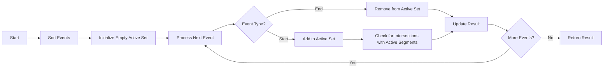

# Line Sweep Algorithms

## Introduction

Line sweep (or plane sweep) is an elegant algorithmic technique used to solve geometric problems efficiently. The core idea is simple yet powerful: imagine a line, typically vertical or horizontal, sweeping across the plane, stopping at key positions to perform operations on the geometric objects it encounters.

This "sweep line" moves through the input data in a predetermined order, processing events as they occur. Instead of considering all possible interactions between geometric objects at once, line sweep algorithms handle them incrementally, which often reduces time complexity significantly.

By the end of this tutorial, you'll understand how line sweep algorithms work, when to use them, and how to implement them to solve common geometric problems.

## The Line Sweep Approach

### Core Concept

The line sweep paradigm involves:

1. **Ordering events**: Sort all events (e.g., start and end points of line segments) from left to right (or top to bottom).
2. **Sweeping**: Move a conceptual line across the plane, stopping at each event.
3. **Maintaining a data structure**: Track active objects that intersect the sweep line.
4. **Processing events**: Handle events as the sweep line encounters them.

## When to Use Line Sweep Algorithms

Line sweep algorithms are particularly effective for:

- Finding intersections between geometric objects
- Computing the union, intersection, or difference of geometric shapes
- Finding the closest pair of points
- Calculating the area of union of rectangles
- Detecting overlaps among intervals or rectangles

## Basic Implementation Structure

Most line sweep algorithms follow this structure:

```javascript
function lineSweep(geometricObjects) {
  // 1. Generate events from geometric objects
  const events = generateEvents(geometricObjects);
  
  // 2. Sort events (typically left to right or top to bottom)
  events.sort(compareEvents);
  
  // 3. Initialize data structures
  const activeObjects = new DataStructure();
  
  // 4. Process events in order
  for (const event of events) {
    // Handle event based on its type
    if (event.type === 'START') {
      // Add to active objects
      activeObjects.add(event.object);
      // Check for potential interactions with other active objects
    } else if (event.type === 'END') {
      // Remove from active objects
      activeObjects.remove(event.object);
    }
    // Perform any necessary operations
  }
  
  return result;
}
```

## Example 1: Finding Line Segment Intersections

One classic application of line sweep is determining if any pair of line segments in a set intersect.

### Problem Statement

Given n line segments in a plane, determine if any two segments intersect.

### Solution with Line Sweep

```javascript
function findIntersections(segments) {
  const events = [];
  
  // Create events for segment endpoints
  segments.forEach((segment, idx) => {
    // Ensure left endpoint comes before right endpoint
    const [p1, p2] = segment;
    const left = p1.x < p2.x ? p1 : p2;
    const right = p1.x < p2.x ? p2 : p1;
    
    events.push({
      x: left.x,
      type: 'START',
      segmentId: idx,
      y: left.y,
      otherY: right.y
    });
    
    events.push({
      x: right.x,
      type: 'END',
      segmentId: idx,
      y: right.y,
      otherY: left.y
    });
  });
  
  // Sort events by x-coordinate
  events.sort((a, b) => {
    if (a.x !== b.x) return a.x - b.x;
    // Handle other cases (START before END, etc.)
    return a.type === 'END' ? 1 : -1;
  });
  
  // Active segments crossing the sweep line, sorted by y-coordinate
  const activeSegments = new Set();
  
  for (const event of events) {
    if (event.type === 'START') {
      // Check for intersections with active segments
      for (const activeSegmentId of activeSegments) {
        if (segmentsIntersect(segments[event.segmentId], segments[activeSegmentId])) {
          return true; // Found intersection
        }
      }
      activeSegments.add(event.segmentId);
    } else { // END event
      activeSegments.delete(event.segmentId);
    }
  }
  
  return false; // No intersections found
}

// Helper function to check if two segments intersect
function segmentsIntersect(seg1, seg2) {
  // Implementation of line segment intersection test
  // (This would use a standard algorithm like checking for opposite orientations)
  // ...
}
```

### Example Usage

```javascript
const segments = [
  [{x: 1, y: 1}, {x: 5, y: 5}],  // Segment 1
  [{x: 2, y: 4}, {x: 6, y: 1}],  // Segment 2
  [{x: 3, y: 3}, {x: 7, y: 7}]   // Segment 3
];

const hasIntersection = findIntersections(segments);
console.log(hasIntersection);  // Output: true (segments 1 and 2 intersect)
```

## Example 2: Finding the Union of Rectangles

Let's solve a more complex problem: calculating the total area covered by a set of axis-aligned rectangles.

### Problem Statement

Given n rectangles with sides parallel to the x and y axes, find the total area covered by all rectangles (accounting for overlaps).

### Solution with Line Sweep

```javascript
function computeTotalArea(rectangles) {
  const events = [];
  
  // Generate vertical edge events
  rectangles.forEach((rect, idx) => {
    // Left edge (entering)
    events.push({
      x: rect.left,
      type: 'START',
      y1: rect.bottom,
      y2: rect.top
    });
    
    // Right edge (exiting)
    events.push({
      x: rect.right,
      type: 'END',
      y1: rect.bottom,
      y2: rect.top
    });
  });
  
  // Sort events by x-coordinate
  events.sort((a, b) => a.x - b.x);
  
  let totalArea = 0;
  let prevX = events[0].x;
  
  // Data structure to track active y-intervals
  const activeIntervals = [];
  
  for (const event of events) {
    // Calculate area between previous and current x-coordinate
    if (event.x > prevX) {
      const width = event.x - prevX;
      const coveredLength = computeCoveredLength(activeIntervals);
      totalArea += width * coveredLength;
    }
    
    // Update active intervals
    if (event.type === 'START') {
      activeIntervals.push([event.y1, event.y2]);
    } else { // END event
      // Remove the interval
      const idx = activeIntervals.findIndex(
        interval => interval[0] === event.y1 && interval[1] === event.y2
      );
      if (idx !== -1) activeIntervals.splice(idx, 1);
    }
    
    prevX = event.x;
  }
  
  return totalArea;
}

// Helper function to compute the length covered by intervals
function computeCoveredLength(intervals) {
  if (intervals.length === 0) return 0;
  
  // Sort intervals by their start coordinate
  const sortedIntervals = [...intervals].sort((a, b) => a[0] - b[0]);
  
  let coveredLength = 0;
  let currentEnd = sortedIntervals[0][0];
  
  for (const [start, end] of sortedIntervals) {
    currentEnd = Math.max(currentEnd, start);
    if (end > currentEnd) {
      coveredLength += end - currentEnd;
      currentEnd = end;
    }
  }
  
  return coveredLength;
}
```

### Example Usage

```javascript
const rectangles = [
  { left: 1, right: 4, bottom: 1, top: 4 },  // Rectangle 1
  { left: 2, right: 5, bottom: 2, top: 5 }   // Rectangle 2
];

const area = computeTotalArea(rectangles);
console.log(area);  // Output: 19 (total area with overlaps counted once)
```

## Visualizing Line Sweep

Let's visualize how a line sweep works for finding intersections among line segments:



## Time Complexity Analysis

The efficiency of line sweep algorithms comes from avoiding the need to check all possible pairs of objects:

- Sorting events typically takes O(n log n) time
- Processing each event typically takes O(log n) time with appropriate data structures
- Overall complexity is usually O(n log n) compared to the naive O(n²) approach

For example, finding all k intersections among n line segments:
- Naive approach: O(n²) 
- Line sweep: O((n + k) log n)

## Practical Applications

Line sweep algorithms are used in many real-world applications:

1. **Geographic Information Systems (GIS)**
   - Finding overlaps between map layers
   - Computing unions of geographic regions

2. **Computer Graphics**
   - Hidden surface removal
   - Rendering algorithms
   - Collision detection

3. **Integrated Circuit Design**
   - Design rule checking
   - Circuit layout verification

4. **Computational Geometry Libraries**
   - Used in libraries like CGAL (Computational Geometry Algorithms Library)

## Example 3: Closest Pair of Points

Let's implement another classic geometric problem: finding the closest pair of points in a 2D plane.

### Problem Statement

Given n points in a plane, find the pair with the smallest Euclidean distance between them.

### Solution with Line Sweep

```javascript
function closestPair(points) {
  if (points.length < 2) return Infinity;
  
  // Sort points by x-coordinate
  points.sort((a, b) => a.x - b.x);
  
  let bestDistance = Infinity;
  let bestPair = null;
  
  // Active points (points within the vertical strip)
  // For efficiency, we use a balanced binary search tree
  // Here, we'll simulate with an array for simplicity
  const activePoints = [];
  
  let i = 0;
  for (const point of points) {
    // Remove points that are too far to the left
    while (i < activePoints.length && point.x - activePoints[i].x > bestDistance) {
      activePoints.splice(i, 1);
    }
    
    // Check distances with active points
    for (const activePoint of activePoints) {
      // We only need to check points within bestDistance of y-coordinate
      if (Math.abs(activePoint.y - point.y) < bestDistance) {
        const distance = calculateDistance(activePoint, point);
        if (distance < bestDistance) {
          bestDistance = distance;
          bestPair = [activePoint, point];
        }
      }
    }
    
    // Insert current point into active set
    // (in a real implementation, we would maintain sorted order by y)
    activePoints.push(point);
    activePoints.sort((a, b) => a.y - b.y);
  }
  
  return { distance: bestDistance, pair: bestPair };
}

function calculateDistance(p1, p2) {
  const dx = p1.x - p2.x;
  const dy = p1.y - p2.y;
  return Math.sqrt(dx * dx + dy * dy);
}
```

### Example Usage

```javascript
const points = [
  { x: 2, y: 3 },
  { x: 5, y: 4 },
  { x: 3, y: 1 },
  { x: 7, y: 7 },
  { x: 4, y: 2 }
];

const result = closestPair(points);
console.log(`Closest distance: ${result.distance}`);
console.log(`Between points: (${result.pair[0].x}, ${result.pair[0].y}) and (${result.pair[1].x}, ${result.pair[1].y})`);
// Output will show the closest pair of points
```

## Common Pitfalls and Tips

1. **Event Ordering**: Make sure to define clear rules for when events with the same coordinate should be processed.
2. **Numerical Precision**: Be careful with floating-point comparisons; consider using epsilon values for equality checks.
3. **Data Structure Choice**: The efficiency of line sweep algorithms heavily depends on choosing appropriate data structures for active elements.
4. **Edge Cases**: Pay special attention to edge cases like collinear segments or concurrent endpoints.
5. **Degenerate Cases**: Handle degenerate inputs like empty sets, single points, or overlapping objects.

## Summary

Line sweep algorithms offer an elegant and efficient approach to solving many geometric problems by simulating a line sweeping across the plane and handling events in a structured way. They typically improve time complexity from O(n²) to O(n log n), making them essential tools in computational geometry.

Key takeaways:

- Line sweep works by sorting events and processing them in order
- Maintaining an appropriate active set data structure is crucial
- The technique excels at handling object intersections and overlaps
- Line sweep is widely used in GIS, computer graphics, and CAD systems

## Exercises

1. Modify the line segment intersection algorithm to report all intersection points rather than just detecting if any exist.
2. Implement a line sweep algorithm to find the area of intersection (rather than union) of a set of rectangles.
3. Use the line sweep technique to solve the problem of finding all pairs of rectangles that overlap.
4. Implement an efficient solution to the "skyline problem": given n buildings with heights, compute the skyline outline.
5. Extend the closest pair algorithm to find the k closest pairs of points.

## Additional Resources

- "Computational Geometry: Algorithms and Applications" by Mark de Berg, et al.
- "Introduction to Algorithms" by Cormen, Leiserson, Rivest, and Stein
- The CGAL (Computational Geometry Algorithms Library) documentation
- "Computational Geometry in C" by Joseph O'Rourke

With these resources and the understanding you've gained, you'll be well-equipped to apply line sweep algorithms to solve complex geometric problems efficiently!