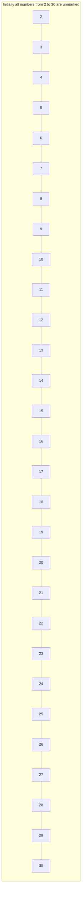

# Sieve of Eratosthenes

## Introduction

The **Sieve of Eratosthenes** is one of the oldest algorithms in mathematics, dating back to ancient Greece. Named after Eratosthenes of Cyrene (276-194 BCE), a Greek mathematician, geographer, and astronomer, this algorithm efficiently finds all prime numbers up to a given limit.

A prime number is a natural number greater than 1 that is not divisible by any number other than 1 and itself. While checking if a single number is prime can be done with simple trial division, finding all prime numbers in a range requires a more efficient approach - and that's where the Sieve of Eratosthenes comes in.

## How the Sieve Works

The core idea of the Sieve of Eratosthenes is beautifully simple:

1. Create a list of consecutive integers from 2 to the given limit n: (2, 3, 4, ..., n).
2. Start with the first prime number, p = 2.
3. Mark all multiples of p (like 2p, 3p, 4p, ...) as composite (non-prime).
4. Find the smallest number in the list that is greater than p and not marked. This is the next prime number.
5. Repeat steps 3-4 until you've processed all numbers up to √n.

The key insight is that if a number hasn't been marked as composite after this process, it must be prime!

Let's visualize how this works for finding primes up to n = 30:



1. We start with p = 2 (our first prime)
2. We mark all multiples of 2: 4, 6, 8, 10, 12, ..., 30
3. The next unmarked number is 3, which is our next prime
4. Mark all multiples of 3: 6, 9, 12, 15, 18, 21, 24, 27, 30
5. The next unmarked number is 5, which is our next prime
6. And so on...

After completing the process, the unmarked numbers are all the primes up to 30: 2, 3, 5, 7, 11, 13, 17, 19, 23, 29.

## Implementation in Code

Let's implement the Sieve of Eratosthenes in different programming languages:

### Python Implementation

```python
def sieve_of_eratosthenes(n):
    """
    Find all prime numbers up to n using Sieve of Eratosthenes.
    
    Args:
        n: Upper limit to find primes up to.
        
    Returns:
        A list of prime numbers from 2 to n.
    """
    # Create a boolean array "is_prime[0..n]" and initialize
    # all entries as true. A value in is_prime[i] will
    # finally be false if i is not a prime, else true.
    is_prime = [True for i in range(n+1)]
    is_prime[0] = is_prime[1] = False  # 0 and 1 are not prime
    
    p = 2
    while p * p <= n:
        # If is_prime[p] is not changed, then it is a prime
        if is_prime[p]:
            # Update all multiples of p as non-prime
            for i in range(p*p, n+1, p):
                is_prime[i] = False
        p += 1
    
    # Create a list of all the prime numbers
    primes = [p for p in range(n+1) if is_prime[p]]
    return primes

# Example usage
limit = 30
primes = sieve_of_eratosthenes(limit)
print(f"Prime numbers up to {limit}:", primes)
```

**Output:**
```
Prime numbers up to 30: [2, 3, 5, 7, 11, 13, 17, 19, 23, 29]
```

### JavaScript Implementation

```javascript
function sieveOfEratosthenes(n) {
    // Create array of size n+1 and fill with true
    const isPrime = new Array(n+1).fill(true);
    isPrime[0] = isPrime[1] = false; // 0 and 1 are not prime
    
    // Start with the first prime number, 2
    for (let p = 2; p * p <= n; p++) {
        // If isPrime[p] is not marked false, it's a prime
        if (isPrime[p]) {
            // Mark all multiples of p as non-prime
            for (let i = p * p; i <= n; i += p) {
                isPrime[i] = false;
            }
        }
    }
    
    // Collect all prime numbers into an array
    const primes = [];
    for (let i = 2; i <= n; i++) {
        if (isPrime[i]) {
            primes.push(i);
        }
    }
    
    return primes;
}

// Example usage
const limit = 30;
const primes = sieveOfEratosthenes(limit);
console.log(`Prime numbers up to ${limit}: ${primes}`);
```

**Output:**
```
Prime numbers up to 30: 2,3,5,7,11,13,17,19,23,29
```

### Java Implementation

```java
import java.util.ArrayList;
import java.util.List;

public class SieveOfEratosthenes {
    public static List<Integer> sieveOfEratosthenes(int n) {
        // Create a boolean array "isPrime[0..n]"
        boolean[] isPrime = new boolean[n+1];
        for (int i = 0; i <= n; i++) {
            isPrime[i] = true;
        }
        
        // Mark 0 and 1 as non-prime
        isPrime[0] = isPrime[1] = false;
        
        // Process all numbers from 2 to sqrt(n)
        for (int p = 2; p * p <= n; p++) {
            // If isPrime[p] is not changed, it's prime
            if (isPrime[p]) {
                // Update all multiples of p as non-prime
                for (int i = p * p; i <= n; i += p) {
                    isPrime[i] = false;
                }
            }
        }
        
        // Collect prime numbers in a list
        List<Integer> primes = new ArrayList<>();
        for (int i = 2; i <= n; i++) {
            if (isPrime[i]) {
                primes.add(i);
            }
        }
        
        return primes;
    }
    
    public static void main(String[] args) {
        int limit = 30;
        List<Integer> primes = sieveOfEratosthenes(limit);
        System.out.print("Prime numbers up to " + limit + ": ");
        System.out.println(primes);
    }
}
```

**Output:**
```
Prime numbers up to 30: [2, 3, 5, 7, 11, 13, 17, 19, 23, 29]
```

## Optimizations

The basic implementation of the Sieve of Eratosthenes can be optimized in several ways:

### 1. Start marking from p²

In the basic sieve, for each prime p, we mark its multiples as composite. However, when we reach a prime p, all numbers of the form k×p, where k < p, have already been marked as composite. Therefore, we can start marking from p² directly.

### 2. Only consider odd numbers

Since all even numbers except 2 are composite, we can focus only on odd numbers. This reduces our space requirement by half.

### 3. Memory optimization (Segmented Sieve)

For very large values of n, the standard sieve might consume too much memory. The segmented sieve breaks the range into smaller segments and applies the sieve on each segment separately.

Here's a memory-optimized implementation in Python:

```python
def segmented_sieve(n, segment_size=10**6):
    """
    A memory-optimized sieve implementation for large n.
    """
    # Find primes up to sqrt(n) using regular sieve
    limit = int(n**0.5) + 1
    basic_primes = sieve_of_eratosthenes(limit)
    
    # Initialize the result list with the basic primes
    result = basic_primes.copy()
    
    # Process segments
    low = limit
    while low < n:
        high = min(low + segment_size, n)
        
        # Create a segment array
        segment = [True] * (high - low + 1)
        
        # Mark composites in the current segment
        for prime in basic_primes:
            # Find the first multiple of prime in the segment
            start = max(prime * prime, (low // prime) * prime)
            if start < low:
                start = start + prime * ((low - start + prime - 1) // prime)
                
            # Mark all multiples in this segment
            for i in range(start, high + 1, prime):
                segment[i - low] = False
        
        # Add primes from this segment to the result
        for i in range(low, high + 1):
            if segment[i - low]:
                result.append(i)
                
        low += segment_size
        
    return result
```

## Time and Space Complexity

### Time Complexity: O(n log log n)

The time complexity comes from marking all multiples of each prime p up to n. The mathematical proof involves the distribution of prime numbers and the harmonic series of primes, which converges to log log n.

### Space Complexity: O(n)

We need to store n boolean values for our sieve array. With the segmented sieve, we can reduce the space to O(√n + segment_size).

## Real-World Applications

The Sieve of Eratosthenes has several practical applications:

### 1. Cryptography

Prime numbers are fundamental to modern cryptographic systems like RSA. While the Sieve of Eratosthenes isn't directly used for generating large primes (due to memory constraints), the principles behind it influence how we search for and verify large primes.

```python
def rsa_key_generation_simplified():
    """A simplified demonstration of how primes are used in RSA keys"""
    # In real applications, much larger primes would be used
    p = 61  # A prime number
    q = 53  # Another prime number
    n = p * q  # Public key component
    
    # In actual RSA, we'd calculate the totient and choose e and d carefully
    print(f"RSA public key component n = p × q = {p} × {q} = {n}")
    print("The security relies on the difficulty of factoring n back into p and q")
    
    return n

# Example
public_key_component = rsa_key_generation_simplified()
```

**Output:**
```
RSA public key component n = p × q = 61 × 53 = 3233
The security relies on the difficulty of factoring n back into p and q
```

### 2. Prime Counting Functions

In number theory, the prime counting function π(x) gives the number of primes less than or equal to x. The Sieve of Eratosthenes provides an efficient way to calculate this function for moderately large values.

```python
def prime_counting_function(n):
    """Count the number of primes less than or equal to n"""
    primes = sieve_of_eratosthenes(n)
    return len(primes)

# Example
for x in [10, 100, 1000, 10000]:
    count = prime_counting_function(x)
    print(f"π({x}) = {count} (there are {count} primes <= {x})")
```

**Output:**
```
π(10) = 4 (there are 4 primes <= 10)
π(100) = 25 (there are 25 primes <= 100)
π(1000) = 168 (there are 168 primes <= 1000)
π(10000) = 1229 (there are 1229 primes <= 10000)
```

### 3. Project Euler and Competitive Programming

The sieve is commonly used to solve problems in competitive programming platforms and mathematical challenges like Project Euler, where efficient handling of prime numbers is essential.

### 4. Number Theory Research

Researchers use the sieve and its variants to explore patterns and distributions of primes, which remain central to many unsolved problems in mathematics.

## Summary

The Sieve of Eratosthenes is an elegant and efficient algorithm for finding all prime numbers up to a given limit. Despite being over 2,200 years old, it remains one of the most practical methods for this task, especially when optimized.

Key points to remember:

1. It works by systematically marking composite numbers in a range
2. Its time complexity is O(n log log n), making it very efficient
3. Basic optimizations include starting marking from p² and only considering odd numbers
4. For handling larger ranges, segmented sieves reduce memory requirements
5. The algorithm has practical applications in cryptography, number theory, and competitive programming

## Exercises

1. Implement a version of the Sieve of Eratosthenes that only stores odd numbers to reduce memory usage.
2. Modify the sieve algorithm to find all twin primes (pairs of primes that differ by 2) up to a given limit.
3. Implement a function that returns the nth prime number using the sieve.
4. Use the sieve to find the sum of all primes below one million.
5. Modify the algorithm to count the number of distinct prime factors of each number from 1 to n.

## Additional Resources

- [The Prime Number Theorem](https://en.wikipedia.org/wiki/Prime_number_theorem)
- [Algorithms Explained - Sieve of Eratosthenes](https://www.cs.hmc.edu/~oneill/papers/Sieve-JFP.pdf) (A deeper dive into optimizations)
- [Segmented Sieve of Eratosthenes](https://www.geeksforgeeks.org/segmented-sieve/) (For handling very large ranges)
- [Project Euler](https://projecteuler.net/) (Mathematical programming challenges where this algorithm is often useful)

Happy coding and prime hunting!