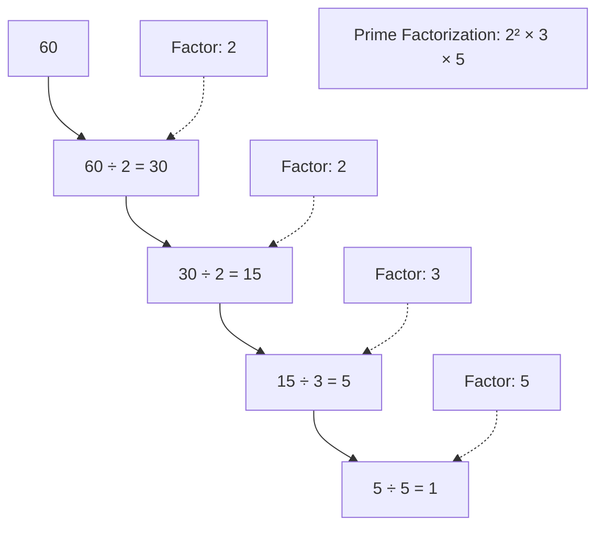

# Prime Factorization

## Introduction

Prime factorization is a fundamental concept in number theory that involves breaking down a composite number into a product of prime numbers. A prime number is a natural number greater than 1 that is not divisible by any positive integer other than 1 and itself.

For example, the prime factorization of 60 is:

$$60 = 2^2 \times 3 \times 5$$

Prime factorization serves as the backbone for numerous algorithms in computer science, especially in cryptography and number theory. Understanding how to efficiently find the prime factors of a number is crucial for solving complex mathematical problems and implementing secure systems.

## Why Prime Factorization Matters

Prime factorization is important for several reasons:

1. **Fundamental Theorem of Arithmetic**: Every integer greater than 1 can be represented uniquely as a product of prime numbers (up to the order of the factors).
2. **Cryptographic Security**: Many encryption algorithms rely on the difficulty of factoring large numbers.
3. **Greatest Common Divisor (GCD)**: Finding the GCD becomes simpler when you know the prime factorizations.
4. **Least Common Multiple (LCM)**: Similarly, calculating the LCM is straightforward with prime factorizations.

## Basic Prime Factorization Algorithm

Let's start with a simple algorithm to find the prime factorization of a number:

```python
def prime_factorization(n):
    """
    Returns a list of the prime factors of n.
    """
    factors = []
    
    # Handle the factor 2 separately
    while n % 2 == 0:
        factors.append(2)
        n //= 2
    
    # n must be odd at this point
    # so we can skip even numbers and iterate only through odd numbers
    i = 3
    while i * i <= n:
        while n % i == 0:
            factors.append(i)
            n //= i
        i += 2
    
    # If n is a prime number greater than 2
    if n > 2:
        factors.append(n)
    
    return factors
```

### Example Usage

```python
print(prime_factorization(60))  # Output: [2, 2, 3, 5]
print(prime_factorization(100))  # Output: [2, 2, 5, 5]
print(prime_factorization(17))   # Output: [17]
```

### Time Complexity Analysis

The time complexity of the basic prime factorization algorithm is O(√n), where n is the input number. This is because:

1. We check for divisibility by 2 separately.
2. We only check odd numbers from 3 up to √n.
3. Each division operation takes constant time.

## Optimized Prime Factorization

For larger numbers, we can optimize our approach:

```python
def optimized_prime_factorization(n):
    """
    Returns a dictionary with prime factors as keys and their exponents as values.
    """
    factors = {}
    
    # Handle the factor 2 separately
    count = 0
    while n % 2 == 0:
        count += 1
        n //= 2
    if count > 0:
        factors[2] = count
    
    # Check for odd prime factors
    i = 3
    while i * i <= n:
        count = 0
        while n % i == 0:
            count += 1
            n //= i
        if count > 0:
            factors[i] = count
        i += 2
    
    # If n is a prime number greater than 2
    if n > 1:
        factors[n] = 1
    
    return factors
```

### Example Usage

```python
print(optimized_prime_factorization(60))  # Output: {2: 2, 3: 1, 5: 1}
print(optimized_prime_factorization(100)) # Output: {2: 2, 5: 2}
```

## Visualization of Prime Factorization

Let's visualize the prime factorization process for the number 60:



## Sieve of Eratosthenes for Prime Factorization

For even more efficient prime factorization, especially when factoring multiple numbers, we can use the Sieve of Eratosthenes to precompute the smallest prime factor for each number:

```python
def sieve_for_factorization(max_n):
    """
    Precomputes the smallest prime factor for each number up to max_n.
    """
    spf = [i for i in range(max_n + 1)]  # spf[i] stores smallest prime factor of i
    
    # Mark 0 and 1 which are not prime
    spf[0] = spf[1] = 0
    
    for i in range(2, int(max_n**0.5) + 1):
        # If i is prime
        if spf[i] == i:
            # Mark all multiples of i
            for j in range(i*i, max_n + 1, i):
                # Update only if not already marked
                if spf[j] == j:
                    spf[j] = i
    
    return spf

def factorize_with_sieve(n, spf):
    """
    Returns prime factorization of n using the precomputed smallest prime factors.
    """
    factors = []
    
    while n > 1:
        factors.append(spf[n])
        n //= spf[n]
    
    return factors
```

### Example Usage

```python
max_n = 1000
spf = sieve_for_factorization(max_n)

print(factorize_with_sieve(60, spf))   # Output: [2, 2, 3, 5]
print(factorize_with_sieve(100, spf))  # Output: [2, 2, 5, 5]
```

## Real-World Applications

### 1. Cryptography - RSA Algorithm

The security of the RSA encryption algorithm relies on the difficulty of factoring the product of two large prime numbers:

```python
def simple_rsa_example():
    # Choose two prime numbers (in real applications these would be much larger)
    p = 61
    q = 53
    
    # Compute n = p * q
    n = p * q
    
    # Compute Euler's totient function: φ(n) = (p-1) * (q-1)
    phi = (p - 1) * (q - 1)
    
    # Choose e such that 1 < e < φ(n) and gcd(e, φ(n)) = 1
    e = 17
    
    # Compute d such that (d * e) % phi = 1
    d = 0
    for i in range(1, phi):
        if (i * e) % phi == 1:
            d = i
            break
    
    print(f"Public key: (n={n}, e={e})")
    print(f"Private key: (n={n}, d={d})")
    
    # Example encryption and decryption
    message = 123
    encrypted = pow(message, e, n)
    decrypted = pow(encrypted, d, n)
    
    print(f"Original message: {message}")
    print(f"Encrypted message: {encrypted}")
    print(f"Decrypted message: {decrypted}")
```

### 2. Finding the Greatest Common Divisor (GCD)

Prime factorization can be used to find the GCD of two numbers:

```python
def gcd_using_factorization(a, b):
    factors_a = optimized_prime_factorization(a)
    factors_b = optimized_prime_factorization(b)
    
    gcd = 1
    for prime in set(factors_a.keys()) & set(factors_b.keys()):
        gcd *= prime ** min(factors_a[prime], factors_b[prime])
    
    return gcd

# Example
a = 60
b = 24
print(f"GCD of {a} and {b} is {gcd_using_factorization(a, b)}")  # Output: 12
```

### 3. Finding the Least Common Multiple (LCM)

```python
def lcm_using_factorization(a, b):
    factors_a = optimized_prime_factorization(a)
    factors_b = optimized_prime_factorization(b)
    
    all_primes = set(factors_a.keys()) | set(factors_b.keys())
    lcm = 1
    
    for prime in all_primes:
        max_power = max(factors_a.get(prime, 0), factors_b.get(prime, 0))
        lcm *= prime ** max_power
    
    return lcm

# Example
a = 60
b = 24
print(f"LCM of {a} and {b} is {lcm_using_factorization(a, b)}")  # Output: 120
```

## Advanced Topic: Pollard's Rho Algorithm

For factoring larger numbers, more sophisticated algorithms are required. Pollard's Rho is a probabilistic algorithm that's much faster than trial division for large numbers:

```python
import random
import math

def gcd(a, b):
    while b:
        a, b = b, a % b
    return a

def pollard_rho(n):
    if n % 2 == 0:
        return 2
        
    x = random.randint(1, n-1)
    y = x
    c = random.randint(1, n-1)
    d = 1
    
    # Define the function f(x) = (x^2 + c) % n
    f = lambda x: (x*x + c) % n
    
    while d == 1:
        x = f(x)
        y = f(f(y))
        d = gcd(abs(x - y), n)
        
        if d == n:
            # Failure, try again with different x, y, c
            return pollard_rho(n)
    
    return d

def factorize_with_pollard_rho(n):
    """Factorize n using Pollard's Rho algorithm"""
    factors = []
    
    def find_factors(n):
        if n <= 1:
            return
        if is_probably_prime(n):
            factors.append(n)
            return
            
        factor = pollard_rho(n)
        find_factors(factor)
        find_factors(n // factor)
    
    find_factors(n)
    return sorted(factors)

# Simple primality test (not secure, just for example)
def is_probably_prime(n, k=5):
    """Miller-Rabin primality test"""
    if n <= 1:
        return False
    if n <= 3:
        return True
    if n % 2 == 0:
        return False
        
    # Write n-1 as 2^r * d
    r, d = 0, n - 1
    while d % 2 == 0:
        r += 1
        d //= 2
        
    # Witness loop
    for _ in range(k):
        a = random.randint(2, n - 2)
        x = pow(a, d, n)
        if x == 1 or x == n - 1:
            continue
        for _ in range(r - 1):
            x = pow(x, 2, n)
            if x == n - 1:
                break
        else:
            return False
    return True
```

:::note
Note that Pollard's Rho algorithm is probabilistic and may not always find a factor on the first try. The implementation above includes retries to handle this.
:::

## Common Pitfalls and Optimization Tips

1. **Large Numbers**: Basic factorization algorithms are inefficient for very large numbers. For cryptographic applications, specialized algorithms like the Quadratic Sieve or the Number Field Sieve are used.

2. **Prime Testing**: Before attempting to factorize, check if the number is prime using probabilistic primality tests like Miller-Rabin.

3. **Memory Usage**: The Sieve of Eratosthenes approach requires memory proportional to the maximum number you want to factorize. For very large ranges, consider segmented sieve implementations.

4. **Avoid Redundant Work**: If you need to factorize multiple numbers, precompute the prime numbers or smallest prime factors once and reuse them.

## Summary

Prime factorization is a fundamental concept in number theory with wide-ranging applications from basic mathematics to advanced cryptography. In this guide, we've explored:

- The basic trial division algorithm for prime factorization
- Optimized approaches using the Sieve of Eratosthenes
- Advanced techniques like Pollard's Rho algorithm for larger numbers
- Real-world applications in cryptography, GCD, and LCM calculations

Understanding these algorithms gives you powerful tools for solving problems in number theory and implementing efficient computational solutions.

## Practice Exercises

1. Implement a function to express a number's prime factorization in a readable format (e.g., "2^3 × 3^1 × 5^2").

2. Use prime factorization to find all divisors of a given number.

3. Implement a function to determine if a number is a perfect square using its prime factorization.

4. Optimize the basic prime factorization algorithm to handle numbers up to 10^12.

5. Research and implement the wheel factorization method, which is an optimization of the trial division algorithm.

## Additional Resources

- **Number Theory and Cryptography**: "Introduction to Modern Cryptography" by Jonathan Katz and Yehuda Lindell
- **Efficient Algorithms**: "The Art of Computer Programming, Volume 2: Seminumerical Algorithms" by Donald E. Knuth
- **Online Tools**: [FactorDB](http://factordb.com/) - A database of large factorizations
- **Interactive Learning**: [Khan Academy's Number Theory Course](https://www.khanacademy.org/math/math-for-fun-and-glory/number-theory)

Happy factorizing!