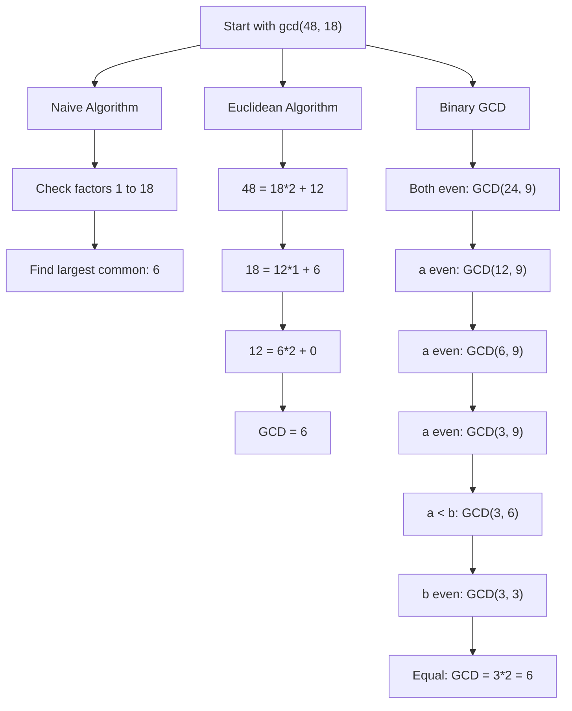

# Greatest Common Divisor (GCD)

## Introduction

The Greatest Common Divisor (GCD) of two or more integers is the largest positive integer that divides each of the given integers without leaving a remainder. It's also known as the Greatest Common Factor (GCF) or Highest Common Factor (HCF).

For example, the GCD of 12 and 18 is 6, because 6 is the largest positive integer that divides both 12 and 18 without a remainder.

In programming and number theory, finding the GCD efficiently is fundamental for:
- Simplifying fractions
- Cryptography algorithms
- Solving Diophantine equations
- Modular arithmetic operations

## Mathematical Foundation

### Definition

For two integers a and b, not both zero, the GCD is denoted as gcd(a, b) and is defined as the largest positive integer that divides both a and b.

### Properties

1. **Commutativity**: gcd(a, b) = gcd(b, a)
2. **Associativity**: gcd(a, gcd(b, c)) = gcd(gcd(a, b), c)
3. **If a divides b**: gcd(a, b) = |a| when a divides b
4. **Identity**: gcd(a, 0) = |a|
5. **Linearity**: gcd(ac, bc) = |c| × gcd(a, b)

## Computing the GCD

### Naive Approach

The simplest approach is to find all factors of both numbers and identify the largest common factor.

```javascript
function naiveGCD(a, b) {
    a = Math.abs(a);
    b = Math.abs(b);
    
    let gcd = 1;
    
    // Find the minimum of a and b
    const minValue = Math.min(a, b);
    
    // Check all possible factors from 1 to minValue
    for (let i = 1; i <= minValue; i++) {
        // If i is a factor of both a and b, update gcd
        if (a % i === 0 && b % i === 0) {
            gcd = i;
        }
    }
    
    return gcd;
}

console.log(naiveGCD(48, 18)); // Output: 6
```

This approach works but becomes inefficient for large numbers, as its time complexity is O(min(a, b)).

### Euclidean Algorithm

The Euclidean algorithm is one of the oldest and most efficient methods for computing the GCD. It's based on the principle that:

If a and b are positive integers with a > b, then gcd(a, b) = gcd(b, a % b)

```javascript
function euclideanGCD(a, b) {
    a = Math.abs(a);
    b = Math.abs(b);
    
    // Base case
    if (b === 0) {
        return a;
    }
    
    // Recursive step
    return euclideanGCD(b, a % b);
}

console.log(euclideanGCD(48, 18)); // Output: 6
```

Here's an iterative version of the same algorithm:

```javascript
function iterativeGCD(a, b) {
    a = Math.abs(a);
    b = Math.abs(b);
    
    while (b !== 0) {
        let temp = b;
        b = a % b;
        a = temp;
    }
    
    return a;
}

console.log(iterativeGCD(48, 18)); // Output: 6
```

Let's see how this works with a step-by-step example:

**Computing gcd(48, 18):**

1. a = 48, b = 18
2. 48 = 18 × 2 + 12, so gcd(48, 18) = gcd(18, 12)
3. 18 = 12 × 1 + 6, so gcd(18, 12) = gcd(12, 6)
4. 12 = 6 × 2 + 0, so gcd(12, 6) = gcd(6, 0)
5. Since b = 0, gcd(6, 0) = 6

Therefore, gcd(48, 18) = 6.

## Binary GCD Algorithm (Stein's Algorithm)

Another efficient algorithm for computing GCD is the Binary GCD algorithm, which avoids division operations, making it faster on systems where division is expensive.

```javascript
function binaryGCD(a, b) {
    a = Math.abs(a);
    b = Math.abs(b);
    
    // Base cases
    if (a === 0) return b;
    if (b === 0) return a;
    if (a === b) return a;
    
    // Check if both a and b are even
    if ((a & 1) === 0 && (b & 1) === 0) {
        return binaryGCD(a >> 1, b >> 1) << 1;
    }
    
    // If a is even and b is odd
    if ((a & 1) === 0) {
        return binaryGCD(a >> 1, b);
    }
    
    // If a is odd and b is even
    if ((b & 1) === 0) {
        return binaryGCD(a, b >> 1);
    }
    
    // Both a and b are odd
    return binaryGCD(Math.abs(a - b), Math.min(a, b));
}

console.log(binaryGCD(48, 18)); // Output: 6
```

## Finding GCD of Multiple Numbers

To find the GCD of more than two numbers, we can use the associative property of the GCD: gcd(a, b, c) = gcd(gcd(a, b), c).

```javascript
function multipleGCD(...numbers) {
    // Remove any zeros as they don't affect the GCD calculation
    numbers = numbers.filter(num => num !== 0);
    
    if (numbers.length === 0) return 0;
    if (numbers.length === 1) return Math.abs(numbers[0]);
    
    let result = Math.abs(numbers[0]);
    for (let i = 1; i < numbers.length; i++) {
        result = euclideanGCD(result, numbers[i]);
        
        // Optimization: if GCD becomes 1, it will remain 1
        if (result === 1) {
            return 1;
        }
    }
    
    return result;
}

console.log(multipleGCD(48, 18, 30)); // Output: 6
```

## Practical Applications

### 1. Simplifying Fractions

The GCD is used to simplify fractions to their lowest terms by dividing both the numerator and denominator by their GCD.

```javascript
function simplifyFraction(numerator, denominator) {
    const gcd = euclideanGCD(numerator, denominator);
    
    return {
        numerator: numerator / gcd,
        denominator: denominator / gcd
    };
}

const fraction = simplifyFraction(48, 18);
console.log(`${fraction.numerator}/${fraction.denominator}`); // Output: 8/3
```

### 2. Least Common Multiple (LCM)

The GCD is directly related to the Least Common Multiple (LCM) through the formula:
lcm(a, b) = |a × b| / gcd(a, b)

```javascript
function lcm(a, b) {
    return Math.abs(a * b) / euclideanGCD(a, b);
}

console.log(lcm(12, 18)); // Output: 36
```

### 3. Checking Coprimality

Two numbers are coprime (or relatively prime) if their GCD is 1, meaning they don't share any common factors except 1.

```javascript
function areCoprime(a, b) {
    return euclideanGCD(a, b) === 1;
}

console.log(areCoprime(15, 28)); // Output: true
console.log(areCoprime(15, 25)); // Output: false
```

### 4. Extended Euclidean Algorithm

The extended Euclidean algorithm not only finds the GCD of two integers but also finds the coefficients of Bézout's identity: integers x and y such that ax + by = gcd(a, b).

```javascript
function extendedGCD(a, b) {
    if (b === 0) {
        return { gcd: a, x: 1, y: 0 };
    }
    
    const result = extendedGCD(b, a % b);
    const gcd = result.gcd;
    const x = result.y;
    const y = result.x - Math.floor(a / b) * result.y;
    
    return { gcd, x, y };
}

const result = extendedGCD(35, 15);
console.log(`GCD: ${result.gcd}`);
console.log(`Coefficients: x=${result.x}, y=${result.y}`);
console.log(`Verification: ${35}*${result.x} + ${15}*${result.y} = ${35*result.x + 15*result.y}`);
/* Output:
GCD: 5
Coefficients: x=1, y=-2
Verification: 35*1 + 15*(-2) = 5
*/
```

This extended algorithm is used in:
- Solving Diophantine equations
- Computing modular multiplicative inverses
- Various cryptographic protocols

## Performance Comparison

Here's a visual representation of how the algorithms compare in terms of steps required to find GCD:



For larger numbers, the Euclidean algorithm is significantly more efficient than the naive approach, and the Binary GCD can be faster for certain systems where division operations are expensive.

## Time Complexity

- **Naive Algorithm**: O(min(a, b))
- **Euclidean Algorithm**: O(log(min(a, b)))
- **Binary GCD Algorithm**: O(log(a) × log(b))

## Summary

The Greatest Common Divisor is a fundamental concept in number theory with numerous applications in computer science and mathematics. The Euclidean algorithm provides an efficient way to compute the GCD, with O(log(min(a, b))) time complexity.

Key takeaways:
1. The GCD is the largest positive integer that divides given integers without a remainder
2. The Euclidean algorithm is the most common method for calculating GCD efficiently
3. GCD is used for simplifying fractions, calculating LCM, and solving various number theory problems
4. The Extended Euclidean Algorithm has applications in cryptography and solving linear Diophantine equations

## Exercises

1. Implement a function to find the GCD of an array of integers.
2. Use the Extended Euclidean Algorithm to find integers x and y such that 17x + 23y = 1.
3. Write a function that returns all common divisors of two numbers, not just the greatest one.
4. Given two fractions, implement a function to add them and return the result in simplified form.
5. Implement a function to find the LCM of multiple numbers.

## Additional Resources

- [Number Theory and Cryptography](https://en.wikipedia.org/wiki/Number_theory)
- [The Euclidean Algorithm](https://en.wikipedia.org/wiki/Euclidean_algorithm)
- [Extended Euclidean Algorithm](https://en.wikipedia.org/wiki/Extended_Euclidean_algorithm)
- [Binary GCD Algorithm](https://en.wikipedia.org/wiki/Binary_GCD_algorithm)