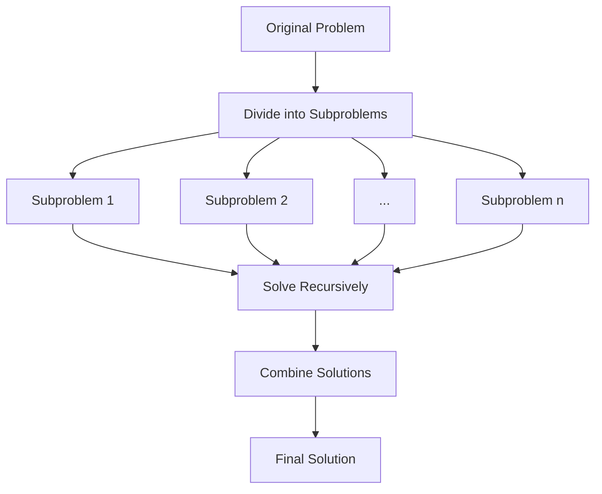

# Divide and Conquer

## Introduction

Divide and Conquer is a fundamental algorithmic paradigm that tackles complex problems by breaking them down into smaller, more manageable subproblems. The approach consists of three primary steps:

1. **Divide**: Break the original problem into smaller subproblems.
2. **Conquer**: Solve these subproblems recursively.
3. **Combine**: Merge the solutions of the subproblems to create a solution to the original problem.

This approach is particularly effective for problems that can be naturally split into similar subproblems, leading to elegant and efficient solutions. Many important algorithms that you'll use throughout your programming career are based on this paradigm.

## How Divide and Conquer Works

Let's visualize the general process:



### Key Characteristics

- **Recursive approach**: Problems are solved by breaking them into smaller versions of the same problem.
- **Base case**: Simple cases that can be solved directly without further division.
- **Problem independence**: Subproblems should be solvable independently.
- **Solution combining**: A method to merge subproblem solutions into the original problem's solution.

## Classic Divide and Conquer Algorithms

### Binary Search

Binary search is a simple yet powerful application of divide and conquer. It efficiently finds an element in a sorted array.

#### How Binary Search Works:

1. Compare the target value to the middle element of the array.
2. If they match, return the middle index.
3. If the target is smaller, search the left half.
4. If the target is larger, search the right half.
5. Repeat until the element is found or the search space is empty.

```javascript
function binarySearch(arr, target) {
  let left = 0;
  let right = arr.length - 1;
  
  while (left <= right) {
    let mid = Math.floor((left + right) / 2);
    
    // Found the target
    if (arr[mid] === target) {
      return mid;
    }
    
    // Target is in the left half
    if (arr[mid] > target) {
      right = mid - 1;
    } 
    // Target is in the right half
    else {
      left = mid + 1;
    }
  }
  
  // Target not found
  return -1;
}

// Example usage
const sortedArray = [2, 3, 5, 7, 11, 13, 17, 19, 23];
console.log(binarySearch(sortedArray, 11)); // Output: 4
console.log(binarySearch(sortedArray, 6));  // Output: -1
```

The time complexity of binary search is O(log n), making it much more efficient than linear search (O(n)) for large datasets.

### Merge Sort

Merge Sort is a classic divide and conquer algorithm that efficiently sorts an array.

#### How Merge Sort Works:

1. **Divide**: Split the array into two halves.
2. **Conquer**: Recursively sort both halves.
3. **Combine**: Merge the sorted halves to produce a sorted array.

```javascript
function mergeSort(arr) {
  // Base case: arrays with 0 or 1 element are already sorted
  if (arr.length <= 1) {
    return arr;
  }
  
  // Divide the array into two halves
  const mid = Math.floor(arr.length / 2);
  const left = arr.slice(0, mid);
  const right = arr.slice(mid);
  
  // Recursively sort both halves
  const sortedLeft = mergeSort(left);
  const sortedRight = mergeSort(right);
  
  // Merge the sorted halves
  return merge(sortedLeft, sortedRight);
}

function merge(left, right) {
  let result = [];
  let leftIndex = 0;
  let rightIndex = 0;
  
  // Compare elements from both arrays and add the smaller one to the result
  while (leftIndex < left.length && rightIndex < right.length) {
    if (left[leftIndex] < right[rightIndex]) {
      result.push(left[leftIndex]);
      leftIndex++;
    } else {
      result.push(right[rightIndex]);
      rightIndex++;
    }
  }
  
  // Add any remaining elements
  return result.concat(left.slice(leftIndex)).concat(right.slice(rightIndex));
}

// Example usage
const unsortedArray = [38, 27, 43, 3, 9, 82, 10];
console.log(mergeSort(unsortedArray)); // Output: [3, 9, 10, 27, 38, 43, 82]
```

Merge Sort has a time complexity of O(n log n), making it efficient for sorting large datasets.

### Quick Sort

Quick Sort is another efficient sorting algorithm based on divide and conquer.

#### How Quick Sort Works:

1. Choose a "pivot" element from the array.
2. Partition the array around the pivot (elements less than pivot go to the left, greater to the right).
3. Recursively apply the above steps to the sub-arrays.

```javascript
function quickSort(arr) {
  // Base case: arrays with 0 or 1 element are already sorted
  if (arr.length <= 1) {
    return arr;
  }
  
  // Select pivot (here we're using the first element for simplicity)
  const pivot = arr[0];
  
  // Partition the array
  const less = [];
  const equal = [];
  const greater = [];
  
  for (let element of arr) {
    if (element < pivot) {
      less.push(element);
    } else if (element === pivot) {
      equal.push(element);
    } else {
      greater.push(element);
    }
  }
  
  // Recursively sort the partitions and combine
  return [...quickSort(less), ...equal, ...quickSort(greater)];
}

// Example usage
const unsortedArray = [38, 27, 43, 3, 9, 82, 10];
console.log(quickSort(unsortedArray)); // Output: [3, 9, 10, 27, 38, 43, 82]
```

Quick Sort also has an average time complexity of O(n log n), but in the worst case, it can degrade to O(n²).

## Real-World Applications

### The Tower of Hanoi Puzzle

The Tower of Hanoi is a classic problem that demonstrates the power of recursive thinking and divide and conquer:

```javascript
function towerOfHanoi(n, source, auxiliary, target) {
  // Base case: if only one disk, move it directly
  if (n === 1) {
    console.log(`Move disk 1 from ${source} to ${target}`);
    return;
  }
  
  // Move n-1 disks from source to auxiliary using target as the helper
  towerOfHanoi(n - 1, source, target, auxiliary);
  
  // Move the nth disk from source to target
  console.log(`Move disk ${n} from ${source} to ${target}`);
  
  // Move the n-1 disks from auxiliary to target using source as the helper
  towerOfHanoi(n - 1, auxiliary, source, target);
}

// Example usage
console.log("Steps to solve Tower of Hanoi with 3 disks:");
towerOfHanoi(3, 'A', 'B', 'C');
```

Output:
```
Steps to solve Tower of Hanoi with 3 disks:
Move disk 1 from A to C
Move disk 2 from A to B
Move disk 1 from C to B
Move disk 3 from A to C
Move disk 1 from B to A
Move disk 2 from B to C
Move disk 1 from A to C
```

### Finding the Closest Pair of Points

This geometric problem can be efficiently solved using divide and conquer:

1. Sort points by their x-coordinates.
2. Divide the set of points into two equal-sized subsets.
3. Recursively find the closest pairs in each subset.
4. Find the closest pair that crosses the dividing line.
5. Return the overall minimum distance.

This approach achieves O(n log n) time complexity, much better than the O(n²) brute force approach.

### Finding the Maximum Subarray

The maximum subarray problem finds the contiguous subarray with the largest sum. Kadane's algorithm is a dynamic programming solution, but it can also be solved using divide and conquer:

```javascript
function findMaximumSubarray(arr, low, high) {
  if (low === high) {
    return { low, high, sum: arr[low] };
  }
  
  const mid = Math.floor((low + high) / 2);
  
  // Find maximum subarray in left half
  const leftSubarray = findMaximumSubarray(arr, low, mid);
  
  // Find maximum subarray in right half
  const rightSubarray = findMaximumSubarray(arr, mid + 1, high);
  
  // Find maximum subarray crossing the midpoint
  const crossingSubarray = findMaxCrossingSubarray(arr, low, mid, high);
  
  // Return the maximum of the three
  if (leftSubarray.sum >= rightSubarray.sum && leftSubarray.sum >= crossingSubarray.sum) {
    return leftSubarray;
  } else if (rightSubarray.sum >= leftSubarray.sum && rightSubarray.sum >= crossingSubarray.sum) {
    return rightSubarray;
  } else {
    return crossingSubarray;
  }
}

function findMaxCrossingSubarray(arr, low, mid, high) {
  // Find maximum subarray in left half ending at mid
  let leftSum = -Infinity;
  let sum = 0;
  let maxLeft = mid;
  
  for (let i = mid; i >= low; i--) {
    sum += arr[i];
    if (sum > leftSum) {
      leftSum = sum;
      maxLeft = i;
    }
  }
  
  // Find maximum subarray in right half starting at mid+1
  let rightSum = -Infinity;
  sum = 0;
  let maxRight = mid + 1;
  
  for (let i = mid + 1; i <= high; i++) {
    sum += arr[i];
    if (sum > rightSum) {
      rightSum = sum;
      maxRight = i;
    }
  }
  
  return { low: maxLeft, high: maxRight, sum: leftSum + rightSum };
}

// Example usage
const array = [-2, 1, -3, 4, -1, 2, 1, -5, 4];
const result = findMaximumSubarray(array, 0, array.length - 1);
console.log(`Maximum subarray sum: ${result.sum}`); // Output: 6
console.log(`From index ${result.low} to ${result.high}`); // Output: From index 3 to 6
```

## When to Use Divide and Conquer

Divide and conquer is particularly effective when:

1. **The problem can be divided into similar subproblems**: The subproblems should be smaller instances of the original problem.

2. **Subproblems are independent**: Solutions to one subproblem shouldn't rely on solutions to others.

3. **Solutions can be efficiently combined**: The overhead of combining solutions shouldn't outweigh the benefits of dividing.

4. **The problem has optimal substructure**: The optimal solution to the problem contains optimal solutions to its subproblems.

## Benefits and Limitations

### Benefits:
- **Efficiency**: Often leads to asymptotically optimal solutions (O(n log n) for many problems).
- **Parallelization**: Subproblems can often be solved in parallel, leveraging multi-core processors.
- **Clarity**: The recursive nature often leads to cleaner, more understandable code.

### Limitations:
- **Overhead**: Recursive calls can add function call overhead.
- **Memory usage**: The call stack can grow large for deeply recursive algorithms.
- **Not always applicable**: Some problems don't naturally decompose into independent subproblems.

## Summary

The Divide and Conquer paradigm is a powerful approach that breaks complex problems into smaller, manageable subproblems:

1. **Divide** the problem into subproblems
2. **Conquer** the subproblems by solving them recursively
3. **Combine** the solutions to create a solution to the original problem

This strategy has given us some of computer science's most important algorithms, including binary search, merge sort, and quick sort. Understanding divide and conquer gives you a powerful tool for solving complex computational problems efficiently.

## Practice Exercises

1. Implement a divide and conquer algorithm to find the majority element in an array (an element that appears more than n/2 times).
2. Use divide and conquer to compute x^n efficiently (binary exponentiation).
3. Implement the Karatsuba algorithm for multiplying large integers.
4. Create a divide and conquer algorithm to find the median of two sorted arrays.
5. Implement the Strassen algorithm for matrix multiplication.

## Additional Resources

- [Introduction to Algorithms](https://mitpress.mit.edu/books/introduction-algorithms-third-edition) by Cormen, Leiserson, Rivest, and Stein
- [Algorithms, 4th Edition](https://algs4.cs.princeton.edu/home/) by Robert Sedgewick and Kevin Wayne
- [Stanford's Divide and Conquer, Sorting and Searching, and Randomized Algorithms](https://www.coursera.org/learn/algorithms-divide-conquer) on Coursera
- [VisuAlgo - Visualising Algorithms and Data Structures](https://visualgo.net/) to visually understand sorting algorithms

By mastering divide and conquer, you're gaining access to a powerful problem-solving approach that will serve you well throughout your programming career!