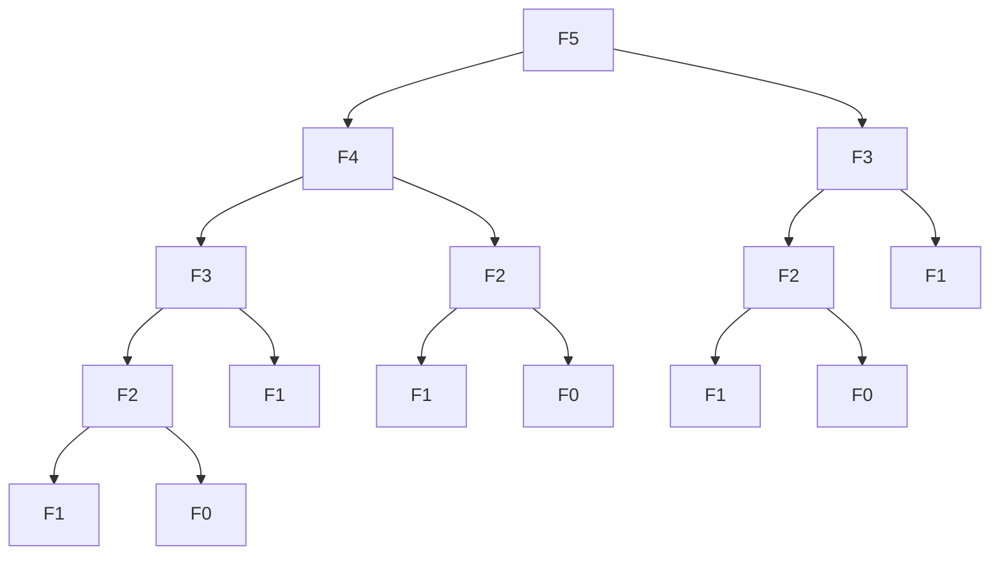

# Dynamic Programming

## Introduction

Dynamic Programming (DP) is a powerful algorithmic paradigm that solves complex problems by breaking them down into simpler overlapping subproblems. Unlike divide and conquer algorithms where subproblems are independent, DP handles problems where subproblems overlap, allowing us to solve each subproblem just once and store the results to avoid redundant calculations.

The term "programming" in dynamic programming refers to optimization through tabulation or planning, not writing code in a programming language. This technique was coined by mathematician Richard Bellman in the 1950s.

## When to Use Dynamic Programming

Dynamic Programming is particularly effective when a problem exhibits:

1. **Overlapping Subproblems**: The same subproblems are solved multiple times.
2. **Optimal Substructure**: An optimal solution to the problem contains optimal solutions to its subproblems.

## Key Approaches to Dynamic Programming

### 1. Top-Down (Memoization)

In this approach:
- We solve the problem recursively
- Before performing a calculation, we check if we've already computed it
- If yes, we retrieve the stored result; if not, we compute and store it

### 2. Bottom-Up (Tabulation)

In this approach:
- We start from the smallest subproblems
- Build up solutions to increasingly larger subproblems
- Fill a table (array) with solutions

## Understanding with a Classic Example: Fibonacci Numbers

The Fibonacci sequence is defined as:
- F(0) = 0
- F(1) = 1
- F(n) = F(n-1) + F(n-2) for n > 1

### Naive Recursive Solution (Without DP)

```javascript
function fibonacci(n) {
  if (n <= 1) return n;
  return fibonacci(n - 1) + fibonacci(n - 2);
}

console.log(fibonacci(10)); // Output: 55
```

This has time complexity O(2^n) - extremely inefficient!

### Top-Down DP (Memoization)

```javascript
function fibonacciMemoization(n, memo = {}) {
  if (n in memo) return memo[n];
  if (n <= 1) return n;
  
  memo[n] = fibonacciMemoization(n - 1, memo) + fibonacciMemoization(n - 2, memo);
  return memo[n];
}

console.log(fibonacciMemoization(10)); // Output: 55
console.log(fibonacciMemoization(100)); // Calculates F(100) almost instantly
```

Time complexity: O(n) - Much better!

### Bottom-Up DP (Tabulation)

```javascript
function fibonacciTabulation(n) {
  if (n <= 1) return n;
  
  let dp = new Array(n + 1);
  dp[0] = 0;
  dp[1] = 1;
  
  for (let i = 2; i <= n; i++) {
    dp[i] = dp[i - 1] + dp[i - 2];
  }
  
  return dp[n];
}

console.log(fibonacciTabulation(10)); // Output: 55
```

Time complexity: O(n) - Also efficient!

### Space-Optimized Bottom-Up Approach

```javascript
function fibonacciOptimized(n) {
  if (n <= 1) return n;
  
  let a = 0, b = 1;
  for (let i = 2; i <= n; i++) {
    let temp = a + b;
    a = b;
    b = temp;
  }
  
  return b;
}

console.log(fibonacciOptimized(10)); // Output: 55
```

Time complexity: O(n), Space complexity: O(1)

## Steps to Solve a Problem using Dynamic Programming

1. **Identify** if the problem can be solved using DP (overlapping subproblems and optimal substructure)
2. **Define the state**: What are the variables that define a subproblem?
3. **Establish the base case**: What's the solution for the smallest subproblem?
4. **Define the recurrence relation**: How does the answer to the current problem relate to smaller subproblems?
5. **Implement** using memoization (top-down) or tabulation (bottom-up)
6. **Add optimization** if needed

## More Practical Examples

### Example 1: Climbing Stairs

**Problem**: You are climbing a staircase that has n steps. You can take either 1 or 2 steps at a time. How many different ways can you climb to the top?

**Analysis**: At each step, we need to decide whether to take 1 step or 2 steps.

```javascript
function climbStairs(n) {
  // Base cases
  if (n <= 2) return n;
  
  // Create DP table
  let dp = new Array(n + 1);
  dp[1] = 1; // One way to climb 1 step
  dp[2] = 2; // Two ways to climb 2 steps (1+1 or 2)
  
  // Fill the DP table
  for (let i = 3; i <= n; i++) {
    dp[i] = dp[i - 1] + dp[i - 2];
  }
  
  return dp[n];
}

console.log(climbStairs(4)); // Output: 5
// Explanation: There are five ways: 1+1+1+1, 1+1+2, 1+2+1, 2+1+1, 2+2
```

### Example 2: Coin Change

**Problem**: Given coins of different denominations and a total amount of money, find the minimum number of coins needed to make up that amount.

```javascript
function coinChange(coins, amount) {
  // Initialize dp array with a value larger than any possible solution
  const dp = new Array(amount + 1).fill(Number.MAX_SAFE_INTEGER);
  dp[0] = 0; // Base case: 0 coins needed to make 0 amount
  
  // Fill the dp table
  for (let i = 1; i <= amount; i++) {
    for (const coin of coins) {
      if (coin <= i) {
        dp[i] = Math.min(dp[i], dp[i - coin] + 1);
      }
    }
  }
  
  return dp[amount] === Number.MAX_SAFE_INTEGER ? -1 : dp[amount];
}

console.log(coinChange([1, 2, 5], 11)); // Output: 3 (5 + 5 + 1)
console.log(coinChange([2], 3)); // Output: -1 (not possible)
```

### Example 3: Knapsack Problem

**Problem**: Given weights and values of n items, put these items in a knapsack of capacity W to get the maximum value.

```javascript
function knapsack(weights, values, capacity) {
  const n = weights.length;
  // Create a 2D DP table
  const dp = Array(n + 1).fill().map(() => Array(capacity + 1).fill(0));
  
  // Fill the DP table
  for (let i = 1; i <= n; i++) {
    for (let w = 1; w <= capacity; w++) {
      if (weights[i - 1] <= w) {
        // Max of including or excluding the current item
        dp[i][w] = Math.max(
          values[i - 1] + dp[i - 1][w - weights[i - 1]],
          dp[i - 1][w]
        );
      } else {
        // Can't include this item
        dp[i][w] = dp[i - 1][w];
      }
    }
  }
  
  return dp[n][capacity];
}

const weights = [2, 3, 4, 5];
const values = [3, 4, 5, 6];
const capacity = 8;

console.log(knapsack(weights, values, capacity)); // Output: 10
// Explanation: Include items with weights 3 and 5 (values 4 + 6 = 10)
```

## Visualizing DP Solutions

For many DP problems, visualizing the process can be extremely helpful. Let's visualize the Fibonacci calculation:



Notice how F3 and F2 are computed multiple times! This is where DP shines - it eliminates these redundant calculations.

## Real-World Applications of Dynamic Programming

Dynamic Programming is used in numerous real-world applications:

1. **Shortest Path Algorithms**: Used in GPS and navigation systems (Dijkstra's algorithm)
2. **Resource Allocation**: In economics and operations research
3. **Bioinformatics**: For sequence alignment in DNA or protein sequences
4. **Natural Language Processing**: For parsing and speech recognition
5. **Finance**: For portfolio optimization and option pricing

## Common Dynamic Programming Patterns

1. **Linear Sequences**: Like Fibonacci, climbing stairs
2. **Grid Problems**: Optimal paths in 2D grids
3. **String Problems**: String matching, edit distance, longest common subsequence
4. **Decision Problems**: 0/1 Knapsack, coin change
5. **Interval Problems**: Matrix chain multiplication, optimal BST

## Summary

Dynamic Programming is a method for solving complex problems by breaking them down into simpler subproblems and remembering the solutions to avoid recalculating them. The key characteristics are:

1. **Overlapping subproblems** - The same calculations are performed repeatedly
2. **Optimal substructure** - Optimal solutions contain optimal solutions to subproblems
3. Two main approaches:
   - **Top-Down (Memoization)**: Recursive with caching
   - **Bottom-Up (Tabulation)**: Iterative building from base cases

With practice, you'll be able to identify when to use DP and how to formulate solutions to seemingly complex problems.

## Practice Exercises

1. **Maximum Subarray Sum**: Find the contiguous subarray with the largest sum
2. **Longest Increasing Subsequence**: Find the length of the longest subsequence that is strictly increasing
3. **Edit Distance**: Determine minimum operations to convert one string to another
4. **House Robber**: Maximize the amount of money you can rob without robbing adjacent houses
5. **Matrix Chain Multiplication**: Find the most efficient way to multiply a chain of matrices

## Additional Resources

- Books: 
  - "Introduction to Algorithms" by Cormen, Leiserson, Rivest, and Stein
  - "Algorithms" by Robert Sedgewick and Kevin Wayne
- Online Platforms for Practice:
  - LeetCode's Dynamic Programming section
  - HackerRank's Dynamic Programming challenges
  - GeeksforGeeks Dynamic Programming problems
- Video Tutorials:
  - MIT OpenCourseWare: Dynamic Programming lectures
  - Algorithms Specialization on Coursera by Stanford University

Remember, the key to mastering Dynamic Programming is practicing a diverse set of problems and recognizing patterns between them!