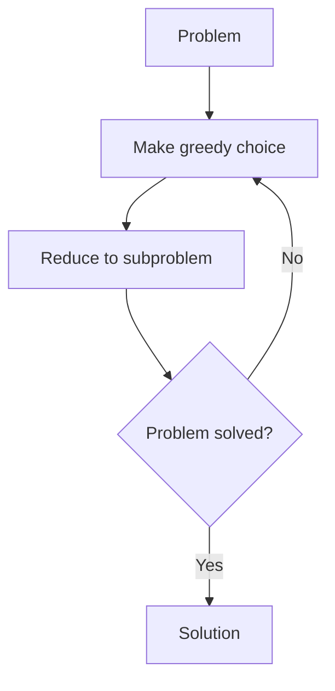

# Greedy Approach

## Introduction

The Greedy Approach is a powerful algorithmic paradigm that makes decisions based on what appears to be the best choice at the current moment, without reconsidering previous choices. In simpler terms, it follows a strategy of "take what's best right now" at each step, hoping to find the global optimum solution.

Greedy algorithms are particularly attractive because they are typically:

- Straightforward to understand and implement
- Efficient in terms of runtime complexity
- Easy to reason about

However, they don't always provide the optimal solution for every problem. Understanding when to apply greedy algorithms is as important as knowing how they work.

## How Greedy Algorithms Work

A greedy algorithm works by making a series of choices, each of which looks best at the moment. The algorithm makes locally optimal choices in the hope of finding a global optimum.

The general pattern of a greedy algorithm follows these steps:

1. Develop a greedy choice property (a rule for making decisions)
2. Make the choice that appears best at the moment
3. Reduce the problem to a smaller subproblem
4. Repeat until the problem is solved
5. Verify that the greedy approach leads to an optimal solution



## When to Use Greedy Approach

Greedy algorithms work well when:

1. The problem has **optimal substructure**: An optimal solution to the problem contains optimal solutions to subproblems.
2. The problem has the **greedy choice property**: A globally optimal solution can be arrived at by making locally optimal choices.

Greedy algorithms might not work when:

1. The problem requires consideration of all possible approaches to find the optimal solution.
2. Earlier decisions affect the availability of future choices.

## Common Greedy Algorithm Examples

### 1. Coin Change Problem (with certain coin denominations)

Let's solve the problem of making change with the minimum number of coins.

```javascript
function minCoins(coins, amount) {
    // Sort coins in decreasing order
    coins.sort((a, b) => b - a);
    
    let totalCoins = 0;
    let remainingAmount = amount;
    let coinCounts = {};
    
    // Process each coin denomination
    for (let coin of coins) {
        // Take as many coins of this denomination as possible
        const count = Math.floor(remainingAmount / coin);
        remainingAmount -= count * coin;
        totalCoins += count;
        
        if (count > 0) {
            coinCounts[coin] = count;
        }
        
        // If we've made exact change, break
        if (remainingAmount === 0) break;
    }
    
    // Check if we were able to make exact change
    if (remainingAmount !== 0) {
        return { possible: false };
    }
    
    return {
        possible: true,
        totalCoins: totalCoins,
        coinCounts: coinCounts
    };
}

// Example usage
const coins = [25, 10, 5, 1]; // Quarter, dime, nickel, penny
const amount = 63;
const result = minCoins(coins, amount);

console.log("Amount:", amount);
console.log("Result:", result);

/* Output:
Amount: 63
Result: {
  possible: true,
  totalCoins: 6,
  coinCounts: { '25': 2, '10': 1, '5': 0, '1': 3 }
}
*/
```

**Note**: This greedy approach works correctly for the US coin system (1, 5, 10, 25). However, for arbitrary coin denominations, it may not always yield the optimal solution. In those cases, dynamic programming would be more appropriate.

### 2. Fractional Knapsack Problem

In the fractional knapsack problem, we can take fractions of items to maximize the value in our knapsack.

```python
def fractional_knapsack(items, capacity):
    # Calculate value per weight for each item
    for item in items:
        item['value_per_weight'] = item['value'] / item['weight']
    
    # Sort items by value per weight in descending order
    items.sort(key=lambda x: x['value_per_weight'], reverse=True)
    
    total_value = 0
    knapsack = []
    
    for item in items:
        if capacity >= item['weight']:
            # Take the whole item
            knapsack.append({
                'item': item['name'],
                'fraction': 1.0
            })
            total_value += item['value']
            capacity -= item['weight']
        else:
            # Take a fraction of the item
            fraction = capacity / item['weight']
            knapsack.append({
                'item': item['name'],
                'fraction': fraction
            })
            total_value += item['value'] * fraction
            break  # Knapsack is full
    
    return {
        'total_value': total_value,
        'knapsack': knapsack
    }

# Example usage
items = [
    {'name': 'A', 'weight': 10, 'value': 60},
    {'name': 'B', 'weight': 20, 'value': 100},
    {'name': 'C', 'weight': 30, 'value': 120}
]
capacity = 50

result = fractional_knapsack(items, capacity)
print(f"Maximum value: {result['total_value']}")
print("Items taken:")
for entry in result['knapsack']:
    print(f"  {entry['item']} - {entry['fraction'] * 100:.1f}%")

"""
Output:
Maximum value: 240.0
Items taken:
  A - 100.0%
  B - 100.0%
  C - 66.7%
"""
```

### 3. Activity Selection Problem

The activity selection problem involves selecting the maximum number of non-overlapping activities.

```java
import java.util.*;

public class ActivitySelection {
    static class Activity {
        String name;
        int start, finish;
        
        public Activity(String name, int start, int finish) {
            this.name = name;
            this.start = start;
            this.finish = finish;
        }
    }
    
    public static List<Activity> selectActivities(Activity[] activities) {
        // Sort activities by finish time
        Arrays.sort(activities, Comparator.comparingInt(a -> a.finish));
        
        List<Activity> selected = new ArrayList<>();
        
        // Always select the first activity
        if (activities.length > 0) {
            selected.add(activities[0]);
        }
        
        // Consider the rest of the activities
        int lastFinishTime = activities[0].finish;
        
        for (int i = 1; i < activities.length; i++) {
            // If this activity starts after the previous selected
            if (activities[i].start >= lastFinishTime) {
                selected.add(activities[i]);
                lastFinishTime = activities[i].finish;
            }
        }
        
        return selected;
    }
    
    public static void main(String[] args) {
        Activity[] activities = {
            new Activity("A", 1, 4),
            new Activity("B", 3, 5),
            new Activity("C", 0, 6),
            new Activity("D", 5, 7),
            new Activity("E", 3, 9),
            new Activity("F", 5, 9),
            new Activity("G", 6, 10),
            new Activity("H", 8, 11),
            new Activity("I", 8, 12),
            new Activity("J", 2, 14),
            new Activity("K", 12, 16)
        };
        
        List<Activity> selected = selectActivities(activities);
        
        System.out.println("Selected Activities:");
        for (Activity activity : selected) {
            System.out.printf("  %s: (%d, %d)%n", activity.name, activity.start, activity.finish);
        }
    }
}

/*
Output:
Selected Activities:
  A: (1, 4)
  D: (5, 7)
  H: (8, 11)
  K: (12, 16)
*/
```

## Real-World Applications

### 1. Huffman Coding for Data Compression

Huffman coding is a greedy algorithm used for lossless data compression. It assigns variable-length codes to characters based on their frequencies – more frequent characters get shorter codes.

```python
import heapq
from collections import Counter

class Node:
    def __init__(self, char, freq):
        self.char = char
        self.freq = freq
        self.left = None
        self.right = None
        
    # Define comparison for the priority queue
    def __lt__(self, other):
        return self.freq < other.freq

def build_huffman_tree(text):
    # Count frequency of each character
    frequency = Counter(text)
    
    # Create leaf nodes and add to priority queue
    priority_queue = [Node(char, freq) for char, freq in frequency.items()]
    heapq.heapify(priority_queue)
    
    # Build the Huffman tree
    while len(priority_queue) > 1:
        # Get the two nodes with lowest frequency
        left = heapq.heappop(priority_queue)
        right = heapq.heappop(priority_queue)
        
        # Create internal node with these two as children
        internal_node = Node(None, left.freq + right.freq)
        internal_node.left = left
        internal_node.right = right
        
        # Add the internal node back to the priority queue
        heapq.heappush(priority_queue, internal_node)
    
    # Return the root of the Huffman tree
    return priority_queue[0]

def generate_codes(node, current_code="", codes=None):
    if codes is None:
        codes = {}
    
    # If this is a leaf node (has a character)
    if node.char is not None:
        codes[node.char] = current_code if current_code else "0"
        return codes
    
    # Traverse left (add 0 to code)
    if node.left:
        generate_codes(node.left, current_code + "0", codes)
    
    # Traverse right (add 1 to code)
    if node.right:
        generate_codes(node.right, current_code + "1", codes)
    
    return codes

def huffman_encoding(text):
    if not text:
        return "", None
    
    # Build the Huffman tree
    root = build_huffman_tree(text)
    
    # Generate codes for each character
    codes = generate_codes(root)
    
    # Encode the text
    encoded_text = "".join(codes[char] for char in text)
    
    return encoded_text, root

# Example usage
text = "This is an example for huffman encoding"
encoded_text, tree = huffman_encoding(text)

original_size = len(text) * 8  # Assuming 8 bits per character
compressed_size = len(encoded_text)

print(f"Original text: {text}")
print(f"Encoded text: {encoded_text}")
print(f"Original size: {original_size} bits")
print(f"Compressed size: {compressed_size} bits")
print(f"Compression ratio: {original_size / compressed_size:.2f}")
```

### 2. Dijkstra's Algorithm for Shortest Path

Dijkstra's algorithm uses a greedy approach to find the shortest path in a graph from a single source to all other vertices.

```javascript
function dijkstra(graph, startNode) {
    const nodes = Object.keys(graph);
    const distances = {};
    const previous = {};
    const unvisited = new Set(nodes);
    
    // Initialize distances
    for (let node of nodes) {
        distances[node] = Infinity;
    }
    distances[startNode] = 0;
    
    while (unvisited.size > 0) {
        // Find the unvisited node with minimum distance
        let currentNode = null;
        let minDistance = Infinity;
        
        for (let node of unvisited) {
            if (distances[node] < minDistance) {
                minDistance = distances[node];
                currentNode = node;
            }
        }
        
        // If we can't find a node to visit, break
        if (currentNode === null) break;
        
        // Remove the current node from unvisited
        unvisited.delete(currentNode);
        
        // Check neighbors of the current node
        for (let neighbor in graph[currentNode]) {
            const distance = graph[currentNode][neighbor];
            const totalDistance = distances[currentNode] + distance;
            
            // If this path is shorter than the current path
            if (totalDistance < distances[neighbor]) {
                distances[neighbor] = totalDistance;
                previous[neighbor] = currentNode;
            }
        }
    }
    
    return { distances, previous };
}

// Helper function to reconstruct path
function getPath(previous, endNode) {
    const path = [];
    let current = endNode;
    
    while (current !== undefined) {
        path.unshift(current);
        current = previous[current];
    }
    
    return path;
}

// Example usage
const graph = {
    'A': { 'B': 4, 'C': 2 },
    'B': { 'A': 4, 'D': 5 },
    'C': { 'A': 2, 'D': 8, 'E': 10 },
    'D': { 'B': 5, 'C': 8, 'E': 2, 'F': 6 },
    'E': { 'C': 10, 'D': 2, 'F': 3 },
    'F': { 'D': 6, 'E': 3 }
};

const startNode = 'A';
const { distances, previous } = dijkstra(graph, startNode);

console.log("Shortest distances from node", startNode);
for (let node in distances) {
    console.log(`  To ${node}: ${distances[node]}`);
}

// Find path to F
const endNode = 'F';
const path = getPath(previous, endNode);
console.log(`Shortest path from ${startNode} to ${endNode}: ${path.join(' -> ')}`);

/*
Output:
Shortest distances from node A
  To A: 0
  To B: 4
  To C: 2
  To D: 9
  To E: 11
  To F: 14
Shortest path from A to F: A -> C -> D -> E -> F
*/
```

## Common Greedy Algorithm Patterns

### 1. Sort and Iterate

Many greedy algorithms start by sorting the input based on some criteria, then iterating through the sorted array to make decisions. Examples:

- Activity Selection (sort by finish time)
- Fractional Knapsack (sort by value/weight ratio)

### 2. Priority Queue

Some greedy algorithms maintain a priority queue to efficiently find the "best" element at each step. Examples:

- Dijkstra's Algorithm
- Huffman Coding
- Prim's Algorithm (for minimum spanning tree)

### 3. Incremental Construction

Start with an empty solution and build it up incrementally by adding elements that optimize the current criterion. Examples:

- Minimum Spanning Tree algorithms
- Coin change problem

## Greedy vs. Dynamic Programming

It's important to understand when to use greedy algorithms versus dynamic programming:

| Greedy Approach | Dynamic Programming |
|----------------|---------------------|
| Makes the locally optimal choice at each step | Considers all possible choices before making a decision |
| Does not reconsider previous choices | Builds a table of solutions to subproblems |
| Usually more efficient (often O(n log n)) | Usually less efficient (often O(n²)) |
| Works only for problems with greedy choice and optimal substructure properties | Works for a wider range of problems |
| Example: Activity Selection | Example: 0-1 Knapsack Problem |

## Common Pitfalls

1. **Assuming greedy always works**: Always verify that your problem has the greedy choice property.
2. **Incorrect greedy criterion**: The choice of what to optimize at each step is critical.
3. **Not considering edge cases**: Greedy algorithms might fail on certain inputs or edge cases.
4. **Overlooking the proof**: For a greedy algorithm to be correct, it needs a formal proof that making local optimal choices leads to a global optimum.

## Summary

The Greedy Approach is a powerful algorithmic paradigm that builds solutions incrementally by making the best possible choice at each step:

- It works well for problems with the greedy choice property and optimal substructure.
- Common applications include activity selection, Huffman coding, and various shortest path problems.
- Greedy algorithms are typically efficient and easy to implement.
- Not all problems can be solved optimally with greedy algorithms.
- When in doubt, verify that your greedy solution is correct with proof or testing.

## Practice Exercises

1. **Minimum Spanning Tree**: Implement Prim's algorithm to find the minimum spanning tree of a graph.
2. **Job Sequencing with Deadlines**: Given a set of jobs with deadlines and profits, find the sequence that maximizes profit.
3. **Egyptian Fractions**: Express a fraction as a sum of distinct unit fractions.
4. **Gas Station Problem**: Find if it's possible to complete a circular route starting with an empty tank.
5. **Interval Covering**: Given a set of intervals, find the minimum number of points that cover all intervals.

## Additional Resources

- "Introduction to Algorithms" by Cormen, Leiserson, Rivest, and Stein
- "Algorithm Design Manual" by Steven Skiena
- "Grokking Algorithms" by Aditya Bhargava for a more visual approach
- Online platforms like LeetCode, HackerRank, and GeeksforGeeks have numerous greedy algorithm problems to practice

Remember, the key to mastering greedy algorithms is to practice identifying when they are applicable and proving that they provide optimal solutions for your specific problems.