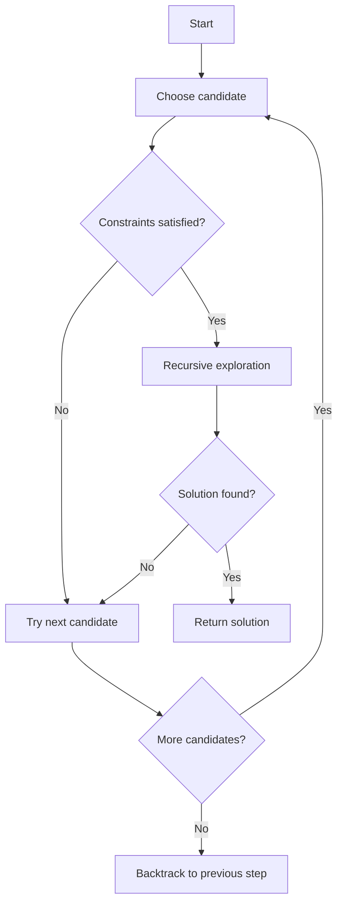

# Backtracking

## Introduction

Backtracking is a systematic algorithmic technique for finding solutions to computational problems, particularly those that require exploring all potential solutions in a solution space. It incrementally builds candidates for solutions, abandoning candidates ("backtracking") as soon as it determines they cannot possibly lead to a valid solution.

Think of backtracking like exploring a maze with several paths. You walk down one path until you hit a dead end, then you backtrack to the last intersection and try another path. This process continues until you find the exit or exhaust all possibilities.

Backtracking is especially useful for solving:
- Constraint satisfaction problems
- Combinatorial optimization problems
- Decision problems where we need to find all possible solutions

## How Backtracking Works

The backtracking algorithm follows a depth-first search approach with these key steps:

1. **Choose**: Select a candidate for the next position in our solution
2. **Constraint Check**: Check if the candidate violates any constraints
3. **Explore**: If constraints are satisfied, recursively attempt to complete the solution
4. **Backtrack**: If constraints are violated or exploration fails, undo the choice and try another candidate



## Simple Example: N-Queens Problem

Let's understand backtracking with the classic N-Queens puzzle - placing N chess queens on an N×N chessboard so that no queen attacks another.

Here's a solution for the 4-Queens problem:

```
 _ Q _ _
 _ _ _ Q
 Q _ _ _
 _ _ Q _
```

Let's implement a backtracking solution for this problem:

```python
def solve_n_queens(n):
    def is_safe(board, row, col):
        # Check if no queen attacks this position
        
        # Check column
        for i in range(row):
            if board[i] == col:
                return False
        
        # Check upper-left diagonal
        for i, j in zip(range(row-1, -1, -1), range(col-1, -1, -1)):
            if board[i] == j:
                return False
        
        # Check upper-right diagonal
        for i, j in zip(range(row-1, -1, -1), range(col+1, n)):
            if board[i] == j:
                return False
                
        return True
    
    def backtrack(row, current_solution):
        if row == n:
            # We've placed queens in all rows, add solution
            solutions.append(current_solution[:])
            return
        
        for col in range(n):
            if is_safe(current_solution, row, col):
                current_solution[row] = col  # Place queen
                backtrack(row + 1, current_solution)
                # No need to remove queen, it will be overwritten in next iteration
    
    solutions = []
    board = [-1] * n  # board[i] = j means queen at position (i, j)
    backtrack(0, board)
    
    # Convert solutions to board representation
    result = []
    for solution in solutions:
        board_repr = []
        for col in solution:
            row_str = '.' * col + 'Q' + '.' * (n - col - 1)
            board_repr.append(row_str)
        result.append(board_repr)
    
    return result

# Example usage
solutions = solve_n_queens(4)
print(f"Number of solutions: {len(solutions)}")
for i, solution in enumerate(solutions):
    print(f"Solution {i+1}:")
    for row in solution:
        print(row)
    print()
```

**Output**:
```
Number of solutions: 2
Solution 1:
.Q..
...Q
Q...
..Q.

Solution 2:
..Q.
Q...
...Q
.Q..
```

## Step-by-Step Explanation

Let's break down how backtracking works using a simpler example - generating all possible permutations of a set:

```python
def generate_permutations(elements):
    def backtrack(current_perm, remaining):
        if not remaining:  # Base case: no more elements to add
            result.append(current_perm[:])
            return
        
        for i in range(len(remaining)):
            # Choose
            next_element = remaining[i]
            current_perm.append(next_element)
            
            # Explore
            new_remaining = remaining[:i] + remaining[i+1:]
            backtrack(current_perm, new_remaining)
            
            # Backtrack (unchoose)
            current_perm.pop()
    
    result = []
    backtrack([], elements)
    return result

# Example
print(generate_permutations([1, 2, 3]))
```

**Output**:
```
[[1, 2, 3], [1, 3, 2], [2, 1, 3], [2, 3, 1], [3, 1, 2], [3, 2, 1]]
```

### Tracing the Execution:

1. Start with `current_perm = []` and `remaining = [1, 2, 3]`
2. First recursion:
   - Choose `1`, now `current_perm = [1]` and `remaining = [2, 3]`
   - Recurse
     - Choose `2`, now `current_perm = [1, 2]` and `remaining = [3]`
     - Recurse
       - Choose `3`, now `current_perm = [1, 2, 3]` and `remaining = []`
       - No elements remain, add `[1, 2, 3]` to results and backtrack
     - Unchoose `3`, now `current_perm = [1, 2]`
     - No more elements to choose, backtrack
   - Unchoose `2`, now `current_perm = [1]`
   - Choose `3`, now `current_perm = [1, 3]` and `remaining = [2]`
   - ... and so on

This recursive exploration with backtracking allows us to systematically generate all permutations.

## Common Backtracking Problems

### Subset Sum

Finding all subsets of elements that sum to a target value:

```python
def subset_sum(nums, target):
    def backtrack(start, current_sum, path):
        if current_sum == target:
            results.append(path[:])
            return
        
        if current_sum > target or start >= len(nums):
            return
            
        for i in range(start, len(nums)):
            # Skip duplicates in sorted array
            if i > start and nums[i] == nums[i-1]:
                continue
                
            # Choose
            path.append(nums[i])
            
            # Explore
            backtrack(i + 1, current_sum + nums[i], path)
            
            # Backtrack
            path.pop()
    
    results = []
    nums.sort()  # Sort to handle duplicates easily
    backtrack(0, 0, [])
    return results

# Example
print(subset_sum([1, 2, 3, 4, 5], 7))
```

**Output**:
```
[[2, 5], [3, 4]]
```

### Sudoku Solver

Solving a Sudoku puzzle is a classic backtracking problem:

```python
def solve_sudoku(board):
    def is_valid(row, col, num):
        # Check row
        for x in range(9):
            if board[row][x] == num:
                return False
        
        # Check column
        for x in range(9):
            if board[x][col] == num:
                return False
        
        # Check 3x3 box
        box_row, box_col = 3 * (row // 3), 3 * (col // 3)
        for i in range(box_row, box_row + 3):
            for j in range(box_col, box_col + 3):
                if board[i][j] == num:
                    return False
        
        return True
    
    def backtrack():
        # Find an empty cell
        for row in range(9):
            for col in range(9):
                if board[row][col] == 0:  # Empty cell
                    for num in range(1, 10):
                        if is_valid(row, col, num):
                            # Try this number
                            board[row][col] = num
                            
                            # Recurse
                            if backtrack():
                                return True
                            
                            # Backtrack
                            board[row][col] = 0
                    
                    # No valid number found
                    return False
        
        # No empty cells left - puzzle solved!
        return True
    
    # Make a copy to avoid modifying original
    board_copy = [row[:] for row in board]
    backtrack()
    return board_copy

# Example
puzzle = [
    [5, 3, 0, 0, 7, 0, 0, 0, 0],
    [6, 0, 0, 1, 9, 5, 0, 0, 0],
    [0, 9, 8, 0, 0, 0, 0, 6, 0],
    [8, 0, 0, 0, 6, 0, 0, 0, 3],
    [4, 0, 0, 8, 0, 3, 0, 0, 1],
    [7, 0, 0, 0, 2, 0, 0, 0, 6],
    [0, 6, 0, 0, 0, 0, 2, 8, 0],
    [0, 0, 0, 4, 1, 9, 0, 0, 5],
    [0, 0, 0, 0, 8, 0, 0, 7, 9]
]

solution = solve_sudoku(puzzle)
for row in solution:
    print(row)
```

## Real-World Applications

### 1. Constraint Satisfaction Problems

Backtracking is used in scheduling problems, resource allocation, and configuration management where multiple constraints need to be satisfied.

**Example**: University Timetable Scheduling
- Each course must be assigned a room and time slot
- No two courses can use the same room at the same time
- Instructors cannot teach multiple classes at once
- Some courses require specific equipment

### 2. Graph Coloring

Map coloring where adjacent regions must have different colors is solved using backtracking.

```python
def graph_coloring(graph, m):
    """
    Graph coloring using backtracking
    graph: adjacency list of the graph
    m: number of colors available
    """
    colors = [0] * len(graph)  # 0 means no color assigned
    
    def is_safe(vertex, color):
        # Check if any adjacent vertex has the same color
        for adjacent in graph[vertex]:
            if colors[adjacent] == color:
                return False
        return True
    
    def backtrack(vertex):
        if vertex == len(graph):
            return True  # All vertices are colored
        
        for color in range(1, m + 1):
            if is_safe(vertex, color):
                colors[vertex] = color
                
                if backtrack(vertex + 1):
                    return True
                
                colors[vertex] = 0  # Backtrack
        
        return False
    
    if backtrack(0):
        return colors
    return None

# Example
graph = {
    0: [1, 2, 3],
    1: [0, 2],
    2: [0, 1, 3],
    3: [0, 2]
}

solution = graph_coloring(graph, 3)
print(solution)  # Output: [1, 2, 3, 2]
```

### 3. Parsing and Pattern Recognition

Natural language processing systems use backtracking to parse ambiguous grammar and identify patterns in text.

### 4. Artificial Intelligence

In game-playing AI and decision trees, backtracking helps explore potential moves and strategies.

## When to Use Backtracking

Backtracking is appropriate when:

1. The problem requires finding all solutions (or counting them)
2. You can identify constraints that can prune the search space early
3. The problem can be broken down into a sequence of decisions
4. The solution space is too large for brute force but has defined constraints

However, backtracking can be inefficient for problems with very large solution spaces without enough early constraints to prune the search.

## Optimizing Backtracking

1. **Pruning**: Eliminate branches that cannot lead to a solution as early as possible
2. **Ordering**: Process choices that are more likely to lead to solutions first
3. **Constraint Propagation**: After making a choice, infer and apply additional constraints
4. **Memoization**: Store results of subproblems to avoid redundant computation

## Summary

Backtracking is a powerful algorithmic technique that systematically explores a solution space, making choices and undoing them when they lead to dead ends. It's particularly effective for constraint satisfaction problems and combinatorial explorations.

Key points to remember:
- Backtracking uses depth-first search with systematic trial and error
- It's built on recursion with state tracking
- Early pruning of invalid paths is crucial for efficiency
- The algorithm follows a "choose, explore, unchoose" pattern

By understanding backtracking, you've added an essential problem-solving tool to your algorithmic toolkit that will help you tackle complex problems requiring exhaustive search through constrained solution spaces.

## Practice Exercises

1. **8-Queens Problem**: Extend the N-Queens solution to solve the 8-Queens puzzle.
2. **Word Search**: Implement a function that finds if a word exists in a 2D grid of letters.
3. **Combination Sum**: Find all unique combinations of candidates that sum to a target.
4. **Knight's Tour**: Find a sequence of moves for a knight that visits every square on a chessboard exactly once.
5. **Maze Solver**: Implement an algorithm to find a path from start to finish in a maze.

## Additional Resources

- [Backtracking Algorithms](https://www.geeksforgeeks.org/backtracking-algorithms/)
- [Introduction to Backtracking](https://www.hackerearth.com/practice/algorithms/searching/depth-first-search/tutorial/)
- "Algorithm Design Manual" by Steven S. Skiena (Chapter on Backtracking)
- "Introduction to Algorithms" by Cormen, Leiserson, Rivest, and Stein

Backtracking may require practice to master, but it's an incredibly versatile technique that will help you solve problems that initially seem impossible to approach systematically.