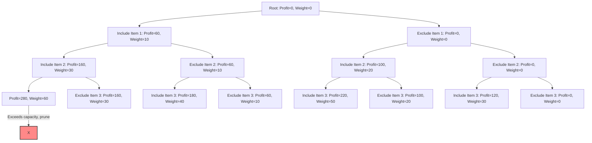

# Branch and Bound

## Introduction

The Branch and Bound algorithm is a powerful algorithmic paradigm designed to solve optimization problems. Unlike exhaustive search methods that explore all possible solutions, Branch and Bound intelligently prunes the search space to find optimal solutions more efficiently.

At its core, Branch and Bound works by:

1. **Branching**: Breaking down a problem into smaller subproblems (creating branches)
2. **Bounding**: Calculating bounds on the possible solutions from each branch
3. **Pruning**: Eliminating branches that cannot possibly lead to optimal solutions

This systematic approach allows us to solve complex optimization problems without exploring the entire solution space, making it much more efficient than brute force methods.

## Understanding the Concept

### The Basic Framework

Branch and Bound is particularly useful for discrete and combinatorial optimization problems where we need to find the best solution among a finite but potentially large set of possibilities.

The algorithm follows this general pattern:

1. Maintain a set of active subproblems (often using a priority queue)
2. Select and remove a subproblem from the set
3. Either:
   - Determine this subproblem has a complete solution
   - Branch this subproblem into smaller subproblems
4. For each new subproblem:
   - Calculate bounds on the best possible solution
   - If the bound indicates this branch cannot lead to an optimal solution, discard it
   - Otherwise, add it to the active set
5. Repeat until finding the optimal solution or exhausting all possibilities

### Key Components

- **Branching strategy**: How to divide the problem into subproblems
- **Bounding function**: How to calculate the upper/lower bounds for solutions
- **Selection strategy**: How to choose the next subproblem to explore (e.g., best-first, depth-first)
- **Pruning rules**: When to discard branches that cannot lead to optimal solutions

## Working Example: The 0/1 Knapsack Problem

Let's implement Branch and Bound to solve the classic 0/1 Knapsack Problem:

> We have a set of items, each with a weight and value. We want to maximize the value in our knapsack without exceeding its weight capacity.

### Step-by-Step Implementation

```python
class Item:
    def __init__(self, weight, value, index):
        self.weight = weight
        self.value = value
        self.index = index
        self.ratio = value / weight  # Value per unit weight

class Node:
    def __init__(self, level, profit, weight):
        self.level = level    # Level in the decision tree
        self.profit = profit  # Current profit
        self.weight = weight  # Current weight
        self.bound = 0        # Upper bound on maximum profit

def calculate_bound(node, n, capacity, items):
    """Calculate the upper bound at the current node."""
    if node.weight >= capacity:
        return 0
    
    profit_bound = node.profit
    total_weight = node.weight
    j = node.level + 1
    
    # Add items until knapsack is full
    while j < n and total_weight + items[j].weight <= capacity:
        total_weight += items[j].weight
        profit_bound += items[j].value
        j += 1
    
    # Add the fraction of the next item if possible
    if j < n:
        profit_bound += (capacity - total_weight) * items[j].ratio
    
    return profit_bound

def knapsack_branch_and_bound(weights, values, capacity):
    n = len(weights)
    
    # Create items and sort by value-to-weight ratio
    items = [Item(weights[i], values[i], i) for i in range(n)]
    items.sort(key=lambda x: x.ratio, reverse=True)
    
    # Create a queue for BFS
    from queue import Queue
    q = Queue()
    
    # Create a dummy node at the start
    u = Node(-1, 0, 0)
    q.put(u)
    
    # Initialize maximum profit to 0
    max_profit = 0
    
    # Branch and bound
    while not q.empty():
        # Dequeue a node
        u = q.get()
        
        # If it's a starting node, assign level 0
        if u.level == -1:
            v_level = 0
        else:
            v_level = u.level + 1
        
        # If we've processed all items, skip
        if v_level == n:
            continue
        
        # Create a new node including this item
        v = Node(v_level, u.profit + items[v_level].value, 
                u.weight + items[v_level].weight)
        
        # If this node is promising and better than current best
        if v.weight <= capacity and v.profit > max_profit:
            max_profit = v.profit
        
        # Calculate bound to decide if we should explore this node
        v.bound = calculate_bound(v, n, capacity, items)
        if v.bound > max_profit:
            q.put(v)
        
        # Create a node excluding this item
        v = Node(v_level, u.profit, u.weight)
        v.bound = calculate_bound(v, n, capacity, items)
        if v.bound > max_profit:
            q.put(v)
    
    return max_profit

# Example usage
weights = [10, 20, 30]
values = [60, 100, 120]
capacity = 50

max_value = knapsack_branch_and_bound(weights, values, capacity)
print(f"Maximum value in knapsack = {max_value}")
```

**Output:**
```
Maximum value in knapsack = 220
```

### Explanation

1. We represent each item by its weight, value, and value-to-weight ratio.
2. We represent each node in our search tree with its level (depth), current profit, weight, and a bound.
3. The bound calculation tells us the maximum possible profit we could achieve from this node.
4. We use a queue to explore nodes in a breadth-first manner.
5. For each item, we create two branches: one where we include the item and one where we exclude it.
6. We only explore branches where the bound exceeds our current best solution.

## The Decision Tree Visualization

Let's visualize how the Branch and Bound algorithm works for this problem:



Nodes that exceed the capacity constraint are pruned. Nodes with bounds less than the current best solution are also pruned (not all pruning is shown in this simplified diagram).

## Applications of Branch and Bound

Branch and Bound is applicable to a wide range of optimization problems:

1. **Traveling Salesman Problem (TSP)**: Finding the shortest possible route that visits each city exactly once and returns to the origin.

2. **Job Assignment Problem**: Assigning jobs to workers to minimize total cost or maximize efficiency.

3. **Integer Linear Programming**: Solving linear programming problems where variables must take integer values.

4. **Quadratic Assignment Problem**: Allocating facilities to locations to minimize total distance × flow.

5. **Resource Allocation Problems**: Optimizing the allocation of limited resources to maximize output.

## Example: Solving the Traveling Salesman Problem

For the Traveling Salesman Problem, Branch and Bound works particularly well. Here's a simplified implementation:

```python
import numpy as np
from queue import PriorityQueue

def tsp_branch_and_bound(graph):
    n = len(graph)
    # Priority queue with (lower_bound, path, visited_mask)
    pq = PriorityQueue()
    
    # Start from node 0
    initial_path = [0]
    initial_bound = calculate_bound(graph, initial_path, n)
    pq.put((initial_bound, initial_path, 1))  # 1 is binary mask for visited[0]
    
    best_cost = float('inf')
    best_path = None
    
    while not pq.empty():
        bound, path, visited_mask = pq.get()
        
        # If the bound is worse than our current best, skip
        if bound >= best_cost:
            continue
        
        # If we've visited all nodes, check if this is a complete tour
        if len(path) == n:
            # Try to return to starting node
            if graph[path[-1]][0] > 0:
                total_cost = path_cost(graph, path) + graph[path[-1]][0]
                if total_cost < best_cost:
                    best_cost = total_cost
                    best_path = path + [0]
            continue
        
        # Try to extend the path
        current = path[-1]
        for next_node in range(n):
            # Skip if already visited or no edge
            if (visited_mask & (1 << next_node)) or graph[current][next_node] == 0:
                continue
                
            new_path = path + [next_node]
            new_mask = visited_mask | (1 << next_node)
            new_bound = calculate_bound(graph, new_path, n)
            
            if new_bound < best_cost:
                pq.put((new_bound, new_path, new_mask))
    
    return best_path, best_cost

def path_cost(graph, path):
    cost = 0
    for i in range(len(path) - 1):
        cost += graph[path[i]][path[i+1]]
    return cost

def calculate_bound(graph, path, n):
    # This is a simple lower bound calculation
    cost = path_cost(graph, path)
    
    # Add minimum outgoing edge for each unvisited node
    visited = set(path)
    for i in range(n):
        if i not in visited:
            min_edge = float('inf')
            for j in range(n):
                if i != j and graph[i][j] > 0:
                    min_edge = min(min_edge, graph[i][j])
            if min_edge != float('inf'):
                cost += min_edge
    
    return cost

# Example usage
graph = np.array([
    [0, 10, 15, 20],
    [10, 0, 35, 25],
    [15, 35, 0, 30],
    [20, 25, 30, 0]
])

best_path, best_cost = tsp_branch_and_bound(graph)
print(f"Best TSP path: {best_path}")
print(f"Best TSP cost: {best_cost}")
```

**Output:**
```
Best TSP path: [0, 1, 3, 2, 0]
Best TSP cost: 80
```

## Comparison with Other Techniques

Let's compare Branch and Bound with other algorithmic paradigms:

| Feature | Branch and Bound | Dynamic Programming | Greedy Algorithms |
|---------|------------------|---------------------|-------------------|
| **Solution quality** | Optimal | Optimal | Often suboptimal |
| **Space complexity** | High (needs to store branches) | High (needs to store subproblems) | Low |
| **Problem types** | Discrete optimization problems | Problems with overlapping subproblems | Problems with optimal substructure |
| **Early termination** | Possible (can stop when bound exceeds current best) | Not usually possible | Not applicable |
| **Parallelization** | Easy (branches can be explored in parallel) | Often sequential | Often sequential |

## Tips for Effective Branch and Bound

1. **Choose good branching strategies**: The way you partition the problem greatly affects efficiency.

2. **Develop tight bounds**: Tighter (more accurate) bounds allow for more effective pruning.

3. **Use good node selection strategies**: Best-first search often works well but consumes more memory; depth-first can use less memory but might explore unnecessary nodes.

4. **Consider the problem structure**: Sometimes problem-specific knowledge can lead to more efficient branching or bounding strategies.

5. **Implement pruning early**: Check bounds as soon as possible to avoid unnecessary computation.

## Summary

Branch and Bound is a powerful algorithmic technique for solving optimization problems. By systematically exploring and pruning the search space, it can find optimal solutions much more efficiently than brute force methods.

Key takeaways:
- Branch and Bound divides problems into smaller subproblems (branching)
- It calculates bounds to estimate the quality of potential solutions
- It uses these bounds to prune branches that can't lead to optimal solutions
- It's particularly useful for discrete optimization problems
- The efficiency depends greatly on the quality of the bounding function

## Exercises

1. Implement the Branch and Bound algorithm for the following problems:
   - Maximum Independent Set in a graph
   - Minimum Vertex Cover
   - Graph Coloring Problem

2. Experiment with different node selection strategies (depth-first, breadth-first, best-first) and compare their performance.

3. Try to optimize the bounding function in the Knapsack implementation to achieve better pruning.

4. Modify the TSP implementation to handle asymmetric distance matrices (where the distance from A to B might differ from B to A).

5. Compare the performance of your Branch and Bound implementation against dynamic programming for the Knapsack problem with different input sizes.

## Additional Resources

- "Algorithm Design Techniques: Dynamic Programming and Branch & Bound" by Jon Kleinberg and Éva Tardos
- "Combinatorial Optimization: Algorithms and Complexity" by Christos H. Papadimitriou and Kenneth Steiglitz
- "Introduction to Algorithms" by Cormen, Leiserson, Rivest, and Stein (Chapter on NP-completeness and approximation algorithms)

Happy problem solving with Branch and Bound!