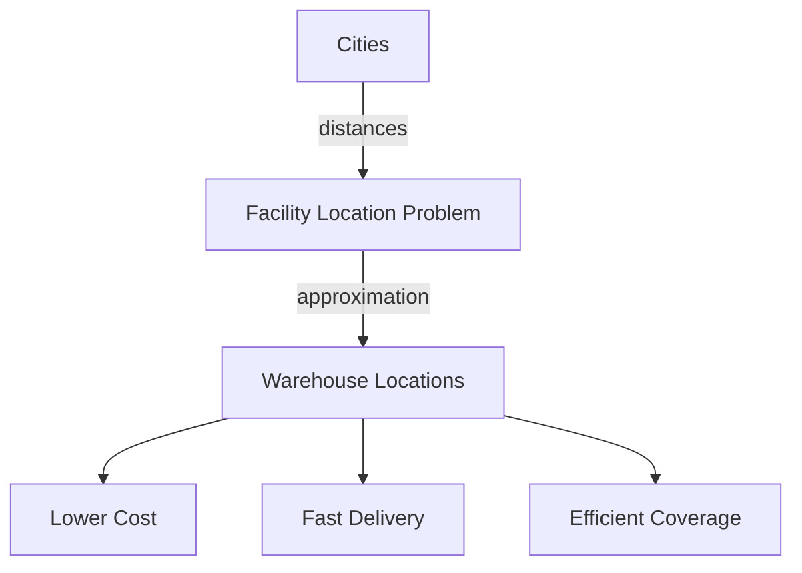

# Approximation Algorithms

## Introduction

Have you ever faced a problem that seemed impossible to solve perfectly within a reasonable time? Many real-world optimization problems fall into a category called "NP-hard," which means finding an optimal solution is computationally expensive as the input size grows. This is where **approximation algorithms** come to our rescue!

An approximation algorithm is a technique that finds a solution that may not be optimal but is guaranteed to be within some factor of the optimal solution. Instead of seeking perfection, we settle for a "good enough" answer that we can compute efficiently.

## Why Do We Need Approximation Algorithms?

Many important problems like:
- Finding the shortest route visiting multiple cities (Traveling Salesman Problem)
- Packing items optimally into containers (Bin Packing Problem)
- Finding the maximum set of non-adjacent vertices in a graph (Independent Set Problem)

are NP-hard, meaning they likely cannot be solved optimally in polynomial time (unless P=NP, a famous unsolved question in computer science).

For practical applications, we often prefer:
- A solution that's 95% optimal but takes seconds to compute
- Rather than a perfect solution that might take years to calculate

## Key Concepts

### Approximation Ratio

The **approximation ratio** (or factor) measures how close our approximation is to the optimal solution:

- For minimization problems: ratio = approximation / optimal ≥ 1
- For maximization problems: ratio = optimal / approximation ≥ 1

A smaller ratio means a better approximation. For example, a 2-approximation algorithm guarantees a solution that is at most twice the optimal solution for minimization problems.

### Example: Vertex Cover Problem

The Vertex Cover problem asks us to find the smallest set of vertices in a graph such that every edge has at least one endpoint in the set. This problem is NP-hard, but we can approximate it:

```javascript
function approximateVertexCover(graph) {
    const cover = new Set();
    const edges = [...graph.edges]; // Make a copy of all edges
    
    while (edges.length > 0) {
        // Pick any edge (u,v)
        const [u, v] = edges.pop();
        
        // Add both endpoints to the cover
        cover.add(u);
        cover.add(v);
        
        // Remove all edges incident to u or v
        for (let i = edges.length - 1; i >= 0; i--) {
            const [a, b] = edges[i];
            if (a === u || a === v || b === u || b === v) {
                edges.splice(i, 1);
            }
        }
    }
    
    return cover;
}
```

This algorithm gives us a 2-approximation for the Vertex Cover problem. That means if the optimal solution requires k vertices, our approximation will use at most 2k vertices.

### Example Input and Output

```javascript
// Input graph represented as an adjacency list
const graph = {
    vertices: ["A", "B", "C", "D", "E"],
    edges: [
        ["A", "B"], ["B", "C"], ["C", "D"], 
        ["D", "E"], ["E", "A"], ["B", "E"]
    ]
};

const cover = approximateVertexCover(graph);
console.log("Approximate vertex cover:", [...cover]); 
// Output: Approximate vertex cover: ["A", "B", "C", "D"]
// Note: The optimal solution might be ["B", "D", "E"], using only 3 vertices
```

## Common Approximation Techniques

### 1. Greedy Algorithms

Greedy algorithms make locally optimal choices at each step, hoping to reach a globally good solution.

#### Example: Set Cover Problem

The Set Cover problem involves selecting the minimum number of sets from a collection to cover all elements.

```javascript
function greedySetCover(universe, subsets) {
    const result = [];
    let remainingElements = new Set([...universe]);
    
    // Continue until all elements are covered
    while (remainingElements.size > 0) {
        // Find the subset that covers the most uncovered elements
        let bestSubset = null;
        let maxCovered = 0;
        
        for (let i = 0; i < subsets.length; i++) {
            if (result.includes(i)) continue; // Skip if already selected
            
            let coveredCount = 0;
            for (const element of subsets[i]) {
                if (remainingElements.has(element)) {
                    coveredCount++;
                }
            }
            
            if (coveredCount > maxCovered) {
                maxCovered = coveredCount;
                bestSubset = i;
            }
        }
        
        // If we found a subset that covers something
        if (bestSubset !== null) {
            result.push(bestSubset);
            // Remove covered elements
            for (const element of subsets[bestSubset]) {
                remainingElements.delete(element);
            }
        } else {
            break; // No subset covers any remaining element
        }
    }
    
    return result;
}

// Example usage:
const universe = [1, 2, 3, 4, 5];
const subsets = [
    [1, 2, 3],
    [2, 4],
    [3, 5],
    [1, 5]
];

const coverIndices = greedySetCover(universe, subsets);
console.log("Selected subsets:", coverIndices.map(i => subsets[i]));
// Output: Selected subsets: [[1, 2, 3], [2, 4], [3, 5]]
```

This greedy approach for Set Cover gives an O(log n) approximation, where n is the size of the universe.

### 2. Linear Programming Relaxation

This technique works by:
1. Formulating the problem as an Integer Linear Program (ILP)
2. Relaxing the integer constraints to create a Linear Program (LP) that can be solved efficiently
3. Rounding the fractional solution to get an approximate solution

### 3. Local Search

Local search starts with a feasible solution and iteratively improves it by making small changes until no further improvement is possible.

## Real-World Applications

### 1. Network Design

Telecommunication companies use approximation algorithms to design networks with the minimum amount of cable needed to connect all locations.

```javascript
function approximateMST(vertices, edges) {
    // Implementation of Kruskal's algorithm for Minimum Spanning Tree
    // This is actually an exact algorithm for MST, but is often used
    // as an approximation for more complex network design problems
    
    // Sort edges by weight
    edges.sort((a, b) => a.weight - b.weight);
    
    const parent = {};
    vertices.forEach(v => parent[v] = v);
    
    function find(v) {
        if (parent[v] !== v) {
            parent[v] = find(parent[v]);
        }
        return parent[v];
    }
    
    function union(u, v) {
        parent[find(u)] = find(v);
    }
    
    const result = [];
    let edgeCount = 0;
    let i = 0;
    
    while (edgeCount < vertices.length - 1 && i < edges.length) {
        const { u, v, weight } = edges[i++];
        
        if (find(u) !== find(v)) {
            result.push({ u, v, weight });
            union(u, v);
            edgeCount++;
        }
    }
    
    return result;
}
```

### 2. Job Scheduling

Data centers and cloud providers use approximation algorithms to schedule jobs efficiently on their servers.

```javascript
function approximateJobScheduling(jobs, machines) {
    // Sort jobs in decreasing order of processing time
    jobs.sort((a, b) => b.time - a.time);
    
    // Initialize machines with 0 load
    const machineLoads = new Array(machines).fill(0);
    const jobAssignment = new Array(jobs.length);
    
    // Assign each job to the least loaded machine
    for (let i = 0; i < jobs.length; i++) {
        // Find machine with minimum load
        let minLoadMachine = 0;
        for (let j = 1; j < machines; j++) {
            if (machineLoads[j] < machineLoads[minLoadMachine]) {
                minLoadMachine = j;
            }
        }
        
        // Assign job to this machine
        machineLoads[minLoadMachine] += jobs[i].time;
        jobAssignment[i] = minLoadMachine;
    }
    
    return {
        assignment: jobAssignment,
        makespan: Math.max(...machineLoads)
    };
}

// Example:
const jobs = [
    { id: 1, time: 8 },
    { id: 2, time: 7 },
    { id: 3, time: 6 },
    { id: 4, time: 5 },
    { id: 5, time: 4 }
];

const result = approximateJobScheduling(jobs, 2);
console.log("Job assignments:", result.assignment);
console.log("Makespan:", result.makespan);
// Output: Job assignments: [0, 1, 0, 1, 0]
//         Makespan: 18
```

This algorithm is a (2-1/m)-approximation for scheduling on m identical machines.

### 3. Facility Location

Retailers use approximation algorithms to decide where to place warehouses to minimize shipping costs.



## Common NP-hard Problems with Approximation Algorithms

| Problem | Approximation Ratio | Technique |
|---------|---------------------|-----------|
| Traveling Salesman | 3/2 (for metric TSP) | Minimum Spanning Tree + Matching |
| Knapsack | 1+ε (PTAS) | Dynamic Programming + Rounding |
| Set Cover | O(log n) | Greedy |
| Vertex Cover | 2 | Maximal Matching |
| Max Cut | 0.878 | Semidefinite Programming |

## Limitations of Approximation Algorithms

Not all problems can be approximated equally well:

1. Some problems have a Polynomial-Time Approximation Scheme (PTAS), allowing arbitrarily good approximations
2. Others have constant-factor approximations (like our 2-approximation for Vertex Cover)
3. Some problems are provably hard to approximate beyond certain thresholds (e.g., Set Cover)

## Summary

Approximation algorithms offer a practical approach to solving computationally hard problems:

- They provide solutions with guaranteed quality bounds
- They run efficiently (in polynomial time)
- They help us tackle real-world optimization problems
- They represent a trade-off between optimality and efficiency

When faced with an NP-hard problem in practice, consider whether an approximate solution would meet your needs. Often, a fast algorithm with a good approximation guarantee is more useful than waiting for a perfect but computationally infeasible solution.

## Additional Resources and Exercises

### Further Reading
- "Approximation Algorithms" by Vijay V. Vazirani
- "The Design of Approximation Algorithms" by David P. Williamson and David B. Shmoys

### Exercises

1. **Basic**: Implement a 2-approximation algorithm for the Bin Packing problem using the First-Fit heuristic.

2. **Intermediate**: Improve the Vertex Cover approximation by implementing a local search that tries to remove redundant vertices.

3. **Advanced**: Implement a PTAS (Polynomial-Time Approximation Scheme) for the Knapsack problem that can achieve any approximation ratio (1+ε) for ε > 0.

4. **Challenge**: Research and implement the Christofides algorithm for the Metric Traveling Salesman Problem, which provides a 1.5-approximation.

Happy approximating! Remember that sometimes, "good enough" is actually perfect for practical applications.