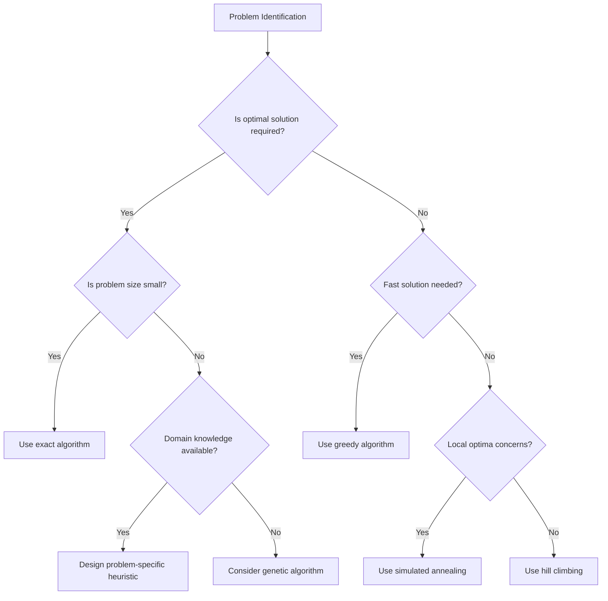

# Heuristic Algorithms

## Introduction

When faced with complex computational problems that are impractical or impossible to solve optimally, heuristic algorithms come to the rescue. A **heuristic** is a problem-solving approach that employs practical methods or shortcuts to quickly find a solution that is "good enough," though not guaranteed to be optimal.

Heuristic algorithms are especially valuable when:
- Exhaustive search would take too much time
- Problems are NP-hard (like the Traveling Salesman Problem)
- Approximate solutions are acceptable
- Quick decisions are more important than perfect ones

In this lesson, we'll explore how heuristic algorithms work, examine common examples, and learn when and how to apply them in real-world programming scenarios.

## What Makes an Algorithm "Heuristic"?

A heuristic algorithm:
1. **Trades optimality for speed** - It might not find the best possible solution, but finds a good one quickly
2. **Uses "rules of thumb"** - Relies on practical, domain-specific knowledge
3. **Often employs educated guesses** - Makes reasonable assumptions to reduce search space
4. **Provides no guarantees** - Cannot prove that its solution is optimal

Think of heuristics as shortcuts that experienced humans use when solving problems. For example, when planning a route between multiple destinations, you might intuitively visit the closest unvisited location next—this is a heuristic approach!

## Common Heuristic Techniques

### 1. Greedy Algorithms

Greedy algorithms make locally optimal choices at each step, hoping to find a global optimum. While not always producing the best solution, they often come close with minimal computational effort.

#### Example: Coin Change Problem

Let's solve the coin change problem using a greedy approach:

```python
def greedy_coin_change(amount, denominations):
    # Sort denominations in descending order
    denominations.sort(reverse=True)
    
    selected_coins = []
    
    # Try to use the largest denomination first
    for coin in denominations:
        while amount >= coin:
            selected_coins.append(coin)
            amount -= coin
    
    return selected_coins

# Example usage
amount = 73
coins = [1, 5, 10, 25]
result = greedy_coin_change(amount, coins)
print(f"Coins needed: {result}")
print(f"Total coins: {len(result)}")
```

**Output:**
```
Coins needed: [25, 25, 10, 10, 1, 1, 1]
Total coins: 7
```

Note that for the US coin system, this greedy approach works optimally. However, for other coin systems (like 1, 3, 4), it might not produce the optimal solution.

### 2. Hill Climbing

Hill climbing is a local search algorithm that continuously moves toward increasing (or decreasing) values until it reaches a peak (or valley). It's like climbing a hill by always moving in the direction that goes upward the steepest.

```python
def hill_climbing(initial_state, objective_function, get_neighbors):
    current = initial_state
    current_value = objective_function(current)
    
    while True:
        # Find the best neighbor
        neighbors = get_neighbors(current)
        if not neighbors:
            break
            
        best_neighbor = max(neighbors, key=objective_function)
        best_value = objective_function(best_neighbor)
        
        # If no improvement, we've reached a local maximum
        if best_value <= current_value:
            break
            
        current = best_neighbor
        current_value = best_value
    
    return current
```

Hill climbing can get stuck in local optima, which is one of its limitations.

### 3. Simulated Annealing

Simulated annealing improves upon hill climbing by occasionally accepting worse solutions to escape local optima. It's inspired by the annealing process in metallurgy.

```python
import math
import random

def simulated_annealing(initial_state, objective_function, get_neighbor, max_iterations=1000, 
                        initial_temp=100, cooling_rate=0.95):
    current = initial_state
    current_value = objective_function(current)
    best = current
    best_value = current_value
    temperature = initial_temp
    
    for iteration in range(max_iterations):
        # Get a random neighbor
        neighbor = get_neighbor(current)
        neighbor_value = objective_function(neighbor)
        
        # Calculate acceptance probability
        delta = neighbor_value - current_value
        acceptance_prob = 1.0 if delta > 0 else math.exp(delta / temperature)
        
        # Accept the neighbor based on probability
        if random.random() < acceptance_prob:
            current = neighbor
            current_value = neighbor_value
            
            # Update best if needed
            if current_value > best_value:
                best = current
                best_value = current_value
        
        # Cool down temperature
        temperature *= cooling_rate
        
    return best
```

### 4. Genetic Algorithms

Genetic algorithms are inspired by natural selection. They maintain a population of potential solutions and evolve them over generations using operations like selection, crossover, and mutation.

```python
import random

def genetic_algorithm(population_size, gene_length, fitness_function, generations=100, 
                      mutation_rate=0.01, crossover_rate=0.7):
    # Initialize random population
    population = [
        ''.join(random.choice('01') for _ in range(gene_length)) 
        for _ in range(population_size)
    ]
    
    for generation in range(generations):
        # Calculate fitness for each individual
        fitness_scores = [fitness_function(individual) for individual in population]
        
        # Select parents for reproduction (fitness proportionate selection)
        total_fitness = sum(fitness_scores)
        selection_probs = [score / total_fitness for score in fitness_scores]
        
        new_population = []
        
        # Create new generation
        while len(new_population) < population_size:
            # Selection
            parent1 = random.choices(population, weights=selection_probs)[0]
            parent2 = random.choices(population, weights=selection_probs)[0]
            
            # Crossover
            if random.random() < crossover_rate:
                crossover_point = random.randint(1, gene_length - 1)
                child1 = parent1[:crossover_point] + parent2[crossover_point:]
                child2 = parent2[:crossover_point] + parent1[crossover_point:]
            else:
                child1, child2 = parent1, parent2
                
            # Mutation
            child1 = ''.join('1' if c == '0' else '0' if random.random() < mutation_rate else c for c in child1)
            child2 = ''.join('1' if c == '0' else '0' if random.random() < mutation_rate else c for c in child2)
            
            new_population.extend([child1, child2])
            
        # Replace old population (ensure we don't exceed population size)
        population = new_population[:population_size]
    
    # Return the best individual from final generation
    fitness_scores = [fitness_function(individual) for individual in population]
    return population[fitness_scores.index(max(fitness_scores))]
```

## Real-World Applications

### 1. Route Planning with Nearest Neighbor Algorithm

The Nearest Neighbor algorithm is a simple heuristic for solving the Traveling Salesman Problem (TSP).

```python
def nearest_neighbor_tsp(distances):
    num_cities = len(distances)
    unvisited = set(range(1, num_cities))  # Start from city 0
    current_city = 0
    tour = [current_city]
    
    while unvisited:
        # Find the nearest unvisited city
        nearest_city = min(unvisited, key=lambda city: distances[current_city][city])
        
        # Visit the nearest city
        unvisited.remove(nearest_city)
        tour.append(nearest_city)
        current_city = nearest_city
    
    # Return to the starting city
    tour.append(0)
    
    return tour

# Example: Distance matrix where distances[i][j] is the distance from city i to j
distances = [
    [0, 10, 15, 20],
    [10, 0, 35, 25],
    [15, 35, 0, 30],
    [20, 25, 30, 0]
]

tour = nearest_neighbor_tsp(distances)
print(f"Proposed tour: {tour}")

# Calculate total distance
total_distance = sum(distances[tour[i]][tour[i+1]] for i in range(len(tour)-1))
print(f"Total distance: {total_distance}")
```

**Output:**
```
Proposed tour: [0, 1, 3, 2, 0]
Total distance: 85
```

In a real-world scenario, this could be used for a delivery service planning routes between multiple destinations.

### 2. Scheduling with Heuristics

Let's consider a simple job scheduling problem where we need to assign tasks to machines to minimize completion time.

```python
def greedy_job_scheduling(jobs, machines):
    # Sort jobs by processing time (longest first)
    sorted_jobs = sorted(jobs, reverse=True)
    
    # Initialize machine loads
    machine_loads = [0] * machines
    job_assignment = [[] for _ in range(machines)]
    
    # Assign each job to the machine with the smallest load
    for job in sorted_jobs:
        # Find machine with minimum load
        min_loaded_machine = machine_loads.index(min(machine_loads))
        
        # Assign job to that machine
        machine_loads[min_loaded_machine] += job
        job_assignment[min_loaded_machine].append(job)
    
    return job_assignment, machine_loads

# Example: Job processing times
job_times = [6, 5, 4, 3, 2, 8, 7]
num_machines = 3

assignments, loads = greedy_job_scheduling(job_times, num_machines)

print("Job assignments:")
for i, jobs in enumerate(assignments):
    print(f"Machine {i+1}: {jobs} (Total: {loads[i]})")

print(f"Maximum completion time: {max(loads)}")
```

**Output:**
```
Job assignments:
Machine 1: [8, 3] (Total: 11)
Machine 2: [7, 4] (Total: 11)
Machine 3: [6, 5, 2] (Total: 13)
Maximum completion time: 13
```

### 3. K-Means Clustering

K-means is a heuristic algorithm used for clustering data points. While we'll simplify it, this demonstrates another real-world application.

```python
import random
import math

def k_means(points, k, max_iterations=100):
    # Randomly initialize centroids
    centroids = random.sample(points, k)
    
    for _ in range(max_iterations):
        # Assign points to clusters
        clusters = [[] for _ in range(k)]
        
        for point in points:
            # Find the nearest centroid
            distances = [euclidean_distance(point, centroid) for centroid in centroids]
            closest_centroid = distances.index(min(distances))
            clusters[closest_centroid].append(point)
        
        # Update centroids
        new_centroids = []
        for cluster in clusters:
            if cluster:  # Ensure cluster is not empty
                # Calculate average position
                centroid = [sum(coord) / len(cluster) for coord in zip(*cluster)]
                new_centroids.append(centroid)
            else:
                # If a cluster is empty, keep its centroid unchanged
                new_centroids.append(centroids[len(new_centroids)])
        
        # Check for convergence
        if new_centroids == centroids:
            break
            
        centroids = new_centroids
    
    return clusters, centroids

def euclidean_distance(point1, point2):
    return math.sqrt(sum((a - b) ** 2 for a, b in zip(point1, point2)))

# Example usage (in 2D space)
points = [(1, 1), (1, 2), (2, 1), (8, 8), (9, 8), (8, 9)]
k = 2
clusters, centroids = k_means(points, k)

print("Clusters:")
for i, cluster in enumerate(clusters):
    print(f"Cluster {i+1}: {cluster}")
    
print("\nCentroids:")
for i, centroid in enumerate(centroids):
    print(f"Centroid {i+1}: {centroid}")
```

K-means has many applications including customer segmentation, image compression, and pattern recognition.

## When to Use Heuristic Algorithms

Heuristic algorithms are most useful when:

1. **The problem is NP-hard** - Finding an exact solution would take too long
2. **Quick approximate solutions are needed** - Time is a critical factor
3. **The search space is enormous** - Exploring all possibilities is impractical
4. **The problem structure allows for intelligent shortcuts** - Domain knowledge can guide the search
5. **Optimality is not crucial** - A "good enough" solution is acceptable

## Flowchart for Selecting a Heuristic Approach



## Common Pitfalls with Heuristic Algorithms

When using heuristic algorithms, be aware of these potential issues:

1. **Local optima** - The solution may get stuck in a locally optimal but globally suboptimal state
2. **Parameter sensitivity** - Many heuristics require careful tuning of parameters
3. **No guarantees** - You can't be certain about how close to optimal your solution is
4. **Problem-specific performance** - A heuristic that works well for one problem might perform poorly on another

## Summary

Heuristic algorithms provide efficient ways to solve complex problems by finding good (though not necessarily optimal) solutions. We've explored:

- What makes an algorithm "heuristic"
- Common heuristic techniques like greedy algorithms, hill climbing, simulated annealing, and genetic algorithms
- Real-world applications in route planning, scheduling, and clustering
- When to use heuristic approaches and their limitations

While heuristics don't guarantee optimal solutions, they're invaluable tools when exact algorithms would be impractical. By understanding the tradeoffs between speed and optimality, you can make informed decisions about when to apply these powerful techniques.

## Exercises

1. **Basic**: Implement a greedy algorithm for the knapsack problem. Compare its solutions with the optimal ones for small test cases.

2. **Intermediate**: Develop a hill climbing algorithm to solve the 8-Queens problem (placing 8 queens on a chess board so that none attack each other).

3. **Advanced**: Implement a genetic algorithm to find the maximum of a complex mathematical function with multiple local maxima.

4. **Challenge**: Use simulated annealing to solve a Sudoku puzzle. Design an appropriate neighbor function and cooling schedule.

## Additional Resources

- "Essentials of Metaheuristics" by Sean Luke (freely available online)
- "Introduction to Algorithms" by Cormen, Leiserson, Rivest, and Stein for foundational concepts
- "Artificial Intelligence: A Modern Approach" by Russell and Norvig for more advanced heuristic search algorithms
- The Genetic Algorithm repositories on GitHub for practical implementations

As you progress, try applying these techniques to problems in your domain, and don't be afraid to experiment with hybrid approaches that combine multiple heuristic methods!