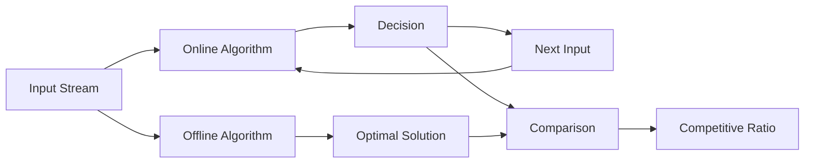

# Online Algorithms

## Introduction

In most traditional algorithms, we assume that the entire input data is available before we start processing. But what if we need to make decisions before seeing all the data? This is where **online algorithms** come into play.

An online algorithm processes its input piece-by-piece in a serial fashion, without having the entire input available from the start. This is in contrast to offline algorithms that have access to the entire problem data from the beginning.

Consider scrolling through an infinite social media feed - the app doesn't wait to load all posts before showing you content. Instead, it loads and processes posts as you scroll, making decisions about what to display without knowing what might come next.

## Key Concepts of Online Algorithms

### Competitive Analysis

Since online algorithms must make decisions without knowing future inputs, they cannot always achieve optimal solutions. To analyze their effectiveness, we use **competitive analysis**:

- **Competitive Ratio**: The maximum ratio between the cost of the online algorithm's solution and the cost of the optimal offline solution (which knows all inputs in advance).
- If an online algorithm has a competitive ratio of `k`, it means that its solution will be at most `k` times worse than the optimal solution.



### Adversarial Analysis

When analyzing online algorithms, we often consider the worst-case scenario where an adversary deliberately creates input sequences to maximize the algorithm's competitive ratio.

## Common Online Algorithm Problems

### The Ski Rental Problem

The ski rental problem is a classic example that illustrates the concept of online algorithms:

**Problem**: You're at a ski resort for an unknown number of days. Each day, you can either:
- Rent skis for $1 per day
- Buy skis for $B (a fixed cost)

You want to minimize your total expense without knowing in advance how many days you'll ski.

**Online Solution**: The best strategy is to rent skis until the cumulative rental cost equals the buying cost, then buy the skis.

```javascript
function skiRental(buyingCost, daysSkiing) {
  let totalCost = 0;
  let hasBoughtSkis = false;
  
  for (let day = 1; day <= daysSkiing; day++) {
    if (!hasBoughtSkis) {
      if (day >= buyingCost) {
        // Buy skis
        totalCost += buyingCost;
        hasBoughtSkis = true;
      } else {
        // Rent skis
        totalCost += 1;
      }
    }
  }
  
  return totalCost;
}

// Example
const buyingCost = 10;
const daysSkiing = 15;
console.log(`Total cost for ${daysSkiing} days: $${skiRental(buyingCost, daysSkiing)}`);
```

**Output:**
```
Total cost for 15 days: $19
```

This algorithm has a competitive ratio of 2, meaning our cost is at most twice the optimal cost.

### Paging/Caching

Caching is another classic online algorithm problem:

**Problem**: You have a cache that can store `k` pages. Whenever a page is requested, you need to serve it from the cache or load it from memory (which is costly). If the cache is full, you need to decide which page to evict.

**Popular Online Algorithms**:

1. **LRU (Least Recently Used)**: Evict the page that hasn't been used for the longest time.

```python
class LRUCache:
    def __init__(self, capacity):
        self.capacity = capacity
        self.cache = {}  # Dictionary to store key-value pairs
        self.usage_order = []  # List to track usage order
    
    def get(self, key):
        if key in self.cache:
            # Move the key to the end (most recently used)
            self.usage_order.remove(key)
            self.usage_order.append(key)
            return self.cache[key]
        return -1
    
    def put(self, key, value):
        if key in self.cache:
            # Update existing key
            self.usage_order.remove(key)
        elif len(self.cache) >= self.capacity:
            # Cache is full, remove least recently used
            oldest_key = self.usage_order.pop(0)
            del self.cache[oldest_key]
        
        # Add/update the entry
        self.cache[key] = value
        self.usage_order.append(key)

# Example usage
cache = LRUCache(2)  # Create cache with capacity 2
cache.put(1, 1)  # Add key 1 with value 1
cache.put(2, 2)  # Add key 2 with value 2
print(cache.get(1))  # Returns 1
cache.put(3, 3)  # Removes key 2, adds key 3
print(cache.get(2))  # Returns -1 (not found)
print(cache.get(3))  # Returns 3
```

**Output:**
```
1
-1
3
```

2. **FIFO (First-In-First-Out)**: Evict the page that was loaded first.
3. **Random**: Randomly select a page to evict.

LRU typically performs better in practice with a competitive ratio of `k`.

### The Secretary Problem

**Problem**: You want to hire the best secretary from `n` candidates. You interview them one by one and must decide immediately after each interview whether to hire them or not. Once rejected, a candidate cannot be called back.

**Online Solution**: The optimal strategy is to reject the first `n/e` candidates (where `e` is Euler's number ≈ 2.718) and then hire the first candidate who is better than all the previously seen candidates.

```javascript
function hireSecretary(candidates) {
  const n = candidates.length;
  const observeCount = Math.floor(n / Math.E);
  
  // Observe the first n/e candidates
  let bestSoFar = -Infinity;
  for (let i = 0; i < observeCount; i++) {
    if (candidates[i] > bestSoFar) {
      bestSoFar = candidates[i];
    }
  }
  
  // Hire the first candidate better than all observed candidates
  for (let i = observeCount; i < n; i++) {
    if (candidates[i] > bestSoFar) {
      return {
        candidateIndex: i,
        candidateValue: candidates[i]
      };
    }
  }
  
  // If no better candidate is found, hire the last one
  return {
    candidateIndex: n - 1,
    candidateValue: candidates[n - 1]
  };
}

// Example
const candidates = [10, 25, 15, 30, 50, 20];
const hired = hireSecretary(candidates);
console.log(`Hired candidate at position ${hired.candidateIndex + 1} with value ${hired.candidateValue}`);
```

**Output:**
```
Hired candidate at position 5 with value 50
```

This algorithm has a probability of success of approximately 1/e (≈ 37%).

## Real-World Applications

### 1. Stock Trading

Online algorithms are essential for algorithmic trading where buy/sell decisions must be made in real-time without knowing future price movements.

```javascript
function onlineTrading(prices) {
  let cash = 1000;  // Starting cash
  let shares = 0;   // Starting shares
  
  // Simple strategy: Buy if price increases, sell if decreases
  for (let i = 1; i < prices.length; i++) {
    if (prices[i] > prices[i-1] && cash > 0) {
      // Price is increasing, buy shares
      const sharesToBuy = Math.floor(cash / prices[i]);
      shares += sharesToBuy;
      cash -= sharesToBuy * prices[i];
      console.log(`Day ${i}: Bought ${sharesToBuy} shares at $${prices[i]}`);
    } 
    else if (prices[i] < prices[i-1] && shares > 0) {
      // Price is decreasing, sell shares
      cash += shares * prices[i];
      console.log(`Day ${i}: Sold ${shares} shares at $${prices[i]}`);
      shares = 0;
    }
  }
  
  // Final portfolio value
  const finalValue = cash + (shares * prices[prices.length - 1]);
  return finalValue;
}

// Example
const stockPrices = [100, 110, 105, 120, 125, 115, 130];
const finalPortfolio = onlineTrading(stockPrices);
console.log(`Final portfolio value: $${finalPortfolio}`);
```

**Output:**
```
Day 1: Bought 9 shares at $110
Day 2: Sold 9 shares at $105
Day 3: Bought 8 shares at $120
Day 6: Bought 0 shares at $130
Final portfolio value: $1065
```

### 2. Load Balancing in Distributed Systems

Online load balancing algorithms distribute incoming requests across multiple servers without knowing the future workload.

```python
class SimpleLoadBalancer:
    def __init__(self, servers):
        self.servers = servers
        self.loads = [0] * len(servers)
    
    def assign_request(self, request_size):
        # Find server with minimum current load
        min_load_index = self.loads.index(min(self.loads))
        
        # Assign request to that server
        self.loads[min_load_index] += request_size
        
        return {
            'server': self.servers[min_load_index],
            'new_load': self.loads[min_load_index]
        }

# Example usage
load_balancer = SimpleLoadBalancer(['Server-A', 'Server-B', 'Server-C'])
requests = [10, 15, 5, 20, 8, 12]

for i, req_size in enumerate(requests):
    result = load_balancer.assign_request(req_size)
    print(f"Request {i+1} (size {req_size}) assigned to {result['server']}, new load: {result['new_load']}")

print(f"Final loads: {load_balancer.loads}")
```

**Output:**
```
Request 1 (size 10) assigned to Server-A, new load: 10
Request 2 (size 15) assigned to Server-B, new load: 15
Request 3 (size 5) assigned to Server-C, new load: 5
Request 4 (size 20) assigned to Server-C, new load: 25
Request 5 (size 8) assigned to Server-A, new load: 18
Request 6 (size 12) assigned to Server-B, new load: 27
Final loads: [18, 27, 25]
```

### 3. Memory Management

Operating systems use online algorithms to allocate and deallocate memory as processes request and release it.

```c
// Simplified memory allocation using First-Fit algorithm
typedef struct MemoryBlock {
    int start;
    int size;
    bool free;
    struct MemoryBlock* next;
} MemoryBlock;

MemoryBlock* memory_start = NULL;

void initialize_memory(int total_size) {
    memory_start = (MemoryBlock*)malloc(sizeof(MemoryBlock));
    memory_start->start = 0;
    memory_start->size = total_size;
    memory_start->free = true;
    memory_start->next = NULL;
}

int allocate_memory(int size) {
    MemoryBlock* current = memory_start;
    
    // First-fit algorithm: Allocate in the first free block that's big enough
    while (current) {
        if (current->free && current->size >= size) {
            // Found a suitable block
            if (current->size > size) {
                // Split the block
                MemoryBlock* new_block = (MemoryBlock*)malloc(sizeof(MemoryBlock));
                new_block->start = current->start + size;
                new_block->size = current->size - size;
                new_block->free = true;
                new_block->next = current->next;
                
                current->size = size;
                current->next = new_block;
            }
            
            current->free = false;
            return current->start;  // Return the starting address
        }
        
        current = current->next;
    }
    
    return -1;  // Allocation failed
}
```

## Advanced Online Algorithm Techniques

### Randomized Online Algorithms

Sometimes, introducing randomness can improve the performance of online algorithms against adversarial inputs.

### The k-Server Problem

The k-server problem is a generalization of many online problems:

- `k` servers are positioned in a metric space
- Requests arrive one by one, each specifying a point in the space
- You must move a server to that point to serve the request
- The goal is to minimize the total distance traveled by servers

## Summary

Online algorithms are crucial for solving problems where all input is not available upfront. Key points to remember:

1. Online algorithms make decisions with incomplete information
2. The effectiveness is measured using competitive analysis
3. Common examples include caching, ski rental, and the secretary problem
4. Real-world applications include trading, load balancing, and memory management

The challenges of online algorithms highlight an important principle: making optimal decisions often requires balancing immediate needs with potential future scenarios. While they may not always find the best solution, well-designed online algorithms can provide guarantees about worst-case performance.

## Exercises

1. Implement an online algorithm for the "Ski Rental Problem" with different buying costs and analyze its performance.
2. Design an online algorithm for a taxi service where requests come in real-time and the taxi needs to decide which passenger to pick up next.
3. Implement the "Move-to-Front" online list update algorithm and compare its performance with static ordering.
4. Solve the "One-Way Trading" problem: You have $1 and want to convert it to euros over `n` days with different exchange rates each day.

## Additional Resources

- "Competitive Programming 3" by Steven Halim and Felix Halim
- "Online Computation and Competitive Analysis" by Allan Borodin and Ran El-Yaniv
- "Introduction to Algorithms" by Cormen, Leiserson, Rivest, and Stein (CLRS) - Chapter on Online Algorithms

Happy algorithmic problem solving!