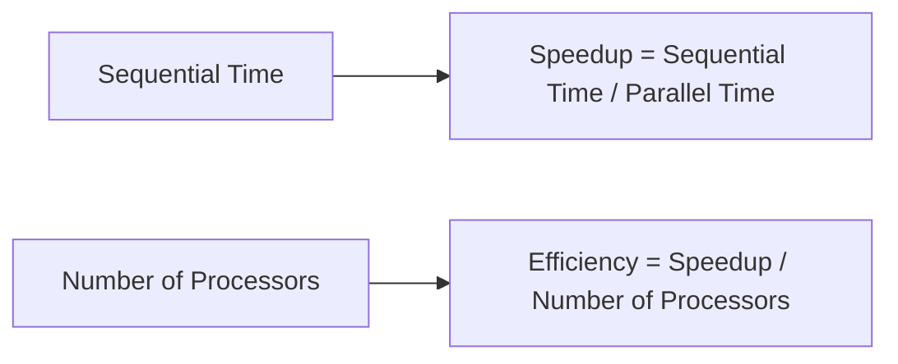
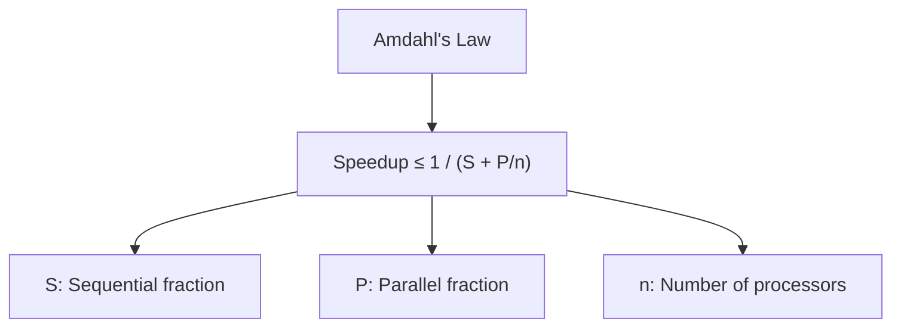
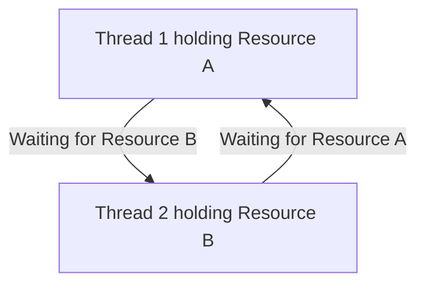

# Parallel Algorithms

## Introduction

Parallel algorithms are designed to take advantage of multiple processing units (CPUs, cores, or separate computers) to solve computational problems faster than sequential approaches. Instead of executing instructions one after another, parallel algorithms break down problems into independent parts that can be processed simultaneously.

In today's computing world, where most devices have multiple cores, understanding parallel algorithms is becoming increasingly important for efficient programming. This guide will introduce you to the fundamental concepts of parallelism and provide practical examples to help you leverage parallel processing in your own programs.

## Why Parallel Algorithms Matter

Before diving into the details, let's understand why parallel algorithms are important:

1. **Performance**: They can significantly reduce execution time for computationally intensive tasks
2. **Resource utilization**: They make better use of modern multi-core processors
3. **Scalability**: They can handle larger problem sizes by distributing the workload
4. **Energy efficiency**: In some cases, running tasks in parallel at lower clock speeds can be more energy-efficient

## Basic Concepts in Parallel Computing

### Types of Parallelism

1. **Data Parallelism**: The same operation is performed on different pieces of data simultaneously
2. **Task Parallelism**: Different tasks are executed in parallel
3. **Pipeline Parallelism**: A task is divided into stages, and different stages process different data items simultaneously

### Measuring Parallel Performance

Two key metrics help us evaluate parallel algorithms:

1. **Speedup**: The ratio of sequential execution time to parallel execution time
2. **Efficiency**: Speedup divided by the number of processors used



### Amdahl's Law

Amdahl's Law helps us understand the theoretical maximum speedup we can achieve through parallelization:



This law reminds us that the sequential portions of our code limit the overall speedup we can achieve.

## Parallel Algorithm Design Patterns

Let's explore common patterns for designing parallel algorithms:

### 1. Divide and Conquer

This pattern involves:
1. Dividing the problem into smaller subproblems
2. Solving the subproblems in parallel
3. Combining results to form the final solution

#### Example: Parallel Merge Sort

```python
import concurrent.futures

def merge_sort_parallel(arr):
    # Base case for recursion
    if len(arr) <= 1:
        return arr
    
    # Divide the array into two halves
    mid = len(arr) // 2
    
    # Use a ThreadPoolExecutor to sort the halves in parallel
    with concurrent.futures.ThreadPoolExecutor() as executor:
        left_future = executor.submit(merge_sort_parallel, arr[:mid])
        right_future = executor.submit(merge_sort_parallel, arr[mid:])
        
        left = left_future.result()
        right = right_future.result()
    
    # Merge the sorted halves
    return merge(left, right)

def merge(left, right):
    result = []
    i = j = 0
    
    # Merge the two sorted arrays
    while i < len(left) and j < len(right):
        if left[i] <= right[j]:
            result.append(left[i])
            i += 1
        else:
            result.append(right[j])
            j += 1
    
    # Add any remaining elements
    result.extend(left[i:])
    result.extend(right[j:])
    return result

# Example usage
if __name__ == "__main__":
    data = [8, 3, 1, 5, 9, 2, 7, 4, 6]
    print(f"Unsorted array: {data}")
    sorted_data = merge_sort_parallel(data)
    print(f"Sorted array: {sorted_data}")
```

**Output:**
```
Unsorted array: [8, 3, 1, 5, 9, 2, 7, 4, 6]
Sorted array: [1, 2, 3, 4, 5, 6, 7, 8, 9]
```

### 2. Map-Reduce

Map-Reduce is a programming model for processing large datasets:

1. **Map**: Apply a function to each element in the dataset
2. **Reduce**: Combine the results into a single output

#### Example: Parallel Sum Calculation

```python
import multiprocessing

def calculate_sum_parallel(numbers):
    # Determine the number of available processors
    num_processes = multiprocessing.cpu_count()
    
    # Split the data into chunks
    chunk_size = len(numbers) // num_processes
    chunks = [numbers[i:i + chunk_size] for i in range(0, len(numbers), chunk_size)]
    
    # Create a pool of worker processes
    with multiprocessing.Pool(processes=num_processes) as pool:
        # Map: Apply sum function to each chunk
        partial_sums = pool.map(sum, chunks)
        
        # Reduce: Combine partial sums
        total_sum = sum(partial_sums)
    
    return total_sum

# Example usage
if __name__ == "__main__":
    data = list(range(1, 1000001))  # Numbers from 1 to 1,000,000
    print(f"Sum of numbers from 1 to 1,000,000: {calculate_sum_parallel(data)}")
    # Expected: 500000500000
```

**Output:**
```
Sum of numbers from 1 to 1,000,000: 500000500000
```

### 3. Data Parallelism

This pattern involves performing the same operation on different portions of data simultaneously.

#### Example: Parallel Array Multiplication

```python
import numpy as np
from concurrent.futures import ThreadPoolExecutor

def multiply_array_segment(arr, factor, start, end):
    for i in range(start, end):
        arr[i] *= factor

def parallel_array_multiply(arr, factor):
    num_threads = 4  # You can adjust based on your system
    segment_size = len(arr) // num_threads
    
    with ThreadPoolExecutor(max_workers=num_threads) as executor:
        futures = []
        for i in range(num_threads):
            start = i * segment_size
            # Handle the last segment which might be larger
            end = len(arr) if i == num_threads - 1 else (i + 1) * segment_size
            futures.append(
                executor.submit(multiply_array_segment, arr, factor, start, end)
            )
        
        # Wait for all tasks to complete
        for future in futures:
            future.result()
    
    return arr

# Example usage
if __name__ == "__main__":
    data = np.array([1, 2, 3, 4, 5, 6, 7, 8, 9, 10])
    factor = 5
    print(f"Original array: {data}")
    result = parallel_array_multiply(data, factor)
    print(f"After multiplication by {factor}: {result}")
```

**Output:**
```
Original array: [ 1  2  3  4  5  6  7  8  9 10]
After multiplication by 5: [ 5 10 15 20 25 30 35 40 45 50]
```

## Common Challenges in Parallel Algorithms

While parallel algorithms can provide significant speedups, they also introduce several challenges:

### 1. Race Conditions

When multiple processes access shared data simultaneously, one process might overwrite changes made by another.

#### Example: Race Condition

```python
import threading

counter = 0

def increment_counter():
    global counter
    for _ in range(100000):
        # Read counter
        current = counter
        # Increment
        current += 1
        # Write back
        counter = current

# Example showing a race condition
def demonstrate_race_condition():
    global counter
    counter = 0
    
    # Create two threads that increment the counter
    threads = [threading.Thread(target=increment_counter) for _ in range(2)]
    
    # Start the threads
    for thread in threads:
        thread.start()
    
    # Wait for threads to complete
    for thread in threads:
        thread.join()
    
    print(f"Final counter value: {counter}")
    print(f"Expected value: {2 * 100000}")

if __name__ == "__main__":
    demonstrate_race_condition()
```

**Output (may vary):**
```
Final counter value: 153762
Expected value: 200000
```

### 2. Solution: Using Locks

```python
import threading

counter = 0
lock = threading.Lock()

def increment_counter_safe():
    global counter
    for _ in range(100000):
        with lock:
            counter += 1

def demonstrate_lock_solution():
    global counter
    counter = 0
    
    # Create two threads that increment the counter safely
    threads = [threading.Thread(target=increment_counter_safe) for _ in range(2)]
    
    # Start the threads
    for thread in threads:
        thread.start()
    
    # Wait for threads to complete
    for thread in threads:
        thread.join()
    
    print(f"Final counter value with lock: {counter}")
    print(f"Expected value: {2 * 100000}")

if __name__ == "__main__":
    demonstrate_lock_solution()
```

**Output:**
```
Final counter value with lock: 200000
Expected value: 200000
```

### 3. Deadlocks

Deadlocks occur when two or more processes are waiting for each other to release resources.



### 4. Load Balancing

For optimal performance, work should be distributed evenly across all processors.

## Real-World Applications of Parallel Algorithms

### Image Processing

Image filters and transformations can be applied in parallel to different parts of an image.

#### Example: Parallel Image Blurring

```python
import numpy as np
from PIL import Image
import multiprocessing

def apply_blur_to_region(image_array, start_row, end_row, result_array, kernel_size=3):
    height, width, channels = image_array.shape
    half_kernel = kernel_size // 2
    
    for row in range(start_row, end_row):
        for col in range(width):
            for ch in range(channels):
                # Calculate the average of surrounding pixels
                total = 0
                count = 0
                for kr in range(-half_kernel, half_kernel + 1):
                    for kc in range(-half_kernel, half_kernel + 1):
                        r, c = row + kr, col + kc
                        if 0 <= r < height and 0 <= c < width:
                            total += image_array[r, c, ch]
                            count += 1
                result_array[row, col, ch] = total // count

def parallel_blur_image(image_path, output_path):
    # Load image
    img = Image.open(image_path)
    img_array = np.array(img)
    
    # Create output array
    result_array = np.zeros_like(img_array)
    
    # Get number of available CPUs
    num_processes = multiprocessing.cpu_count()
    
    # Split image into horizontal strips
    height = img_array.shape[0]
    strip_height = height // num_processes
    
    # Create processes
    processes = []
    for i in range(num_processes):
        start_row = i * strip_height
        end_row = height if i == num_processes - 1 else (i + 1) * strip_height
        
        p = multiprocessing.Process(
            target=apply_blur_to_region,
            args=(img_array, start_row, end_row, result_array)
        )
        processes.append(p)
        p.start()
    
    # Wait for all processes to finish
    for p in processes:
        p.join()
    
    # Save result
    result_img = Image.fromarray(result_array)
    result_img.save(output_path)
    
    return output_path
```

### Web Servers

Modern web servers use parallel processing to handle multiple client requests simultaneously.

```python
import socket
import threading

def handle_client(client_socket, address):
    print(f"Connection from {address}")
    
    # Receive request
    request = client_socket.recv(1024).decode('utf-8')
    
    # Simple HTTP response
    response = "HTTP/1.1 200 OK\r\nContent-Type: text/html\r\n\r\n"
    response += "<html><body><h1>Hello from a parallel web server!</h1></body></html>"
    
    # Send response
    client_socket.send(response.encode('utf-8'))
    
    # Close connection
    client_socket.close()

def start_server(host='127.0.0.1', port=8080):
    server = socket.socket(socket.AF_INET, socket.SOCK_STREAM)
    server.bind((host, port))
    server.listen(5)
    print(f"Server listening on {host}:{port}")
    
    try:
        while True:
            # Accept client connection
            client, address = server.accept()
            
            # Create a new thread to handle the client
            client_thread = threading.Thread(target=handle_client, args=(client, address))
            client_thread.daemon = True
            client_thread.start()
    except KeyboardInterrupt:
        print("Server shutting down")
    finally:
        server.close()

# To run the server: start_server()
```

### Machine Learning

Parallel algorithms are essential in machine learning for processing large datasets and training models faster.

```python
import numpy as np
from sklearn.ensemble import RandomForestClassifier
from joblib import Parallel, delayed
from sklearn.datasets import make_classification
from sklearn.model_selection import cross_val_score

# Create a synthetic dataset
X, y = make_classification(n_samples=10000, n_features=20, 
                          n_informative=10, n_classes=2, random_state=42)

# Function to evaluate model with different n_estimators
def evaluate_n_estimators(n):
    model = RandomForestClassifier(n_estimators=n, random_state=42)
    scores = cross_val_score(model, X, y, cv=5)
    return n, np.mean(scores)

# Parallel evaluation of different hyperparameter values
n_estimator_options = [10, 50, 100, 200, 300, 400, 500]

# Run evaluations in parallel
results = Parallel(n_jobs=-1)(
    delayed(evaluate_n_estimators)(n) for n in n_estimator_options
)

# Print results
for n, score in results:
    print(f"n_estimators = {n}: CV Score = {score:.4f}")

# Find best configuration
best_n, best_score = max(results, key=lambda x: x[1])
print(f"\nBest configuration: n_estimators = {best_n} with score {best_score:.4f}")
```

## Best Practices for Parallel Algorithm Design

1. **Identify parallelizable components**: Look for independent tasks or data that can be processed simultaneously
2. **Consider the granularity**: Balance the overhead of creating parallel tasks with the benefits of parallelism
3. **Minimize communication**: Reduce data sharing between parallel tasks to avoid bottlenecks
4. **Be aware of synchronization costs**: Synchronizing parallel tasks has overhead
5. **Test scalability**: Ensure your algorithm scales well with additional processors
6. **Consider the target hardware**: Design with the specific parallel architecture in mind

## Summary

Parallel algorithms provide a powerful way to leverage modern multi-core processors and distributed systems. They can significantly improve performance for computationally intensive tasks by breaking them down into smaller units that can be processed simultaneously.

Key takeaways:
- Parallel algorithms work by distributing computation across multiple processing units
- Common parallelization patterns include divide and conquer, map-reduce, and data parallelism
- Challenges include race conditions, deadlocks, and load balancing
- Real-world applications include image processing, web servers, and machine learning
- Effective parallel algorithm design requires careful consideration of task independence, communication costs, and hardware capabilities

## Exercises

1. Implement a parallel version of the matrix multiplication algorithm and compare its performance against a sequential version.
2. Modify the parallel merge sort algorithm to use processes instead of threads (hint: use `multiprocessing.Process` instead of `concurrent.futures.ThreadPoolExecutor`).
3. Create a parallel web crawler that can download and process multiple web pages simultaneously.
4. Implement a parallel version of the Floyd-Warshall algorithm for finding shortest paths in a graph.
5. Design a parallel algorithm for calculating the Mandelbrot set and visualize the results.

## Additional Resources

- [Introduction to Parallel Computing](https://computing.llnl.gov/tutorials/parallel_comp/)
- [Python's `concurrent.futures` documentation](https://docs.python.org/3/library/concurrent.futures.html)
- [Python's `multiprocessing` documentation](https://docs.python.org/3/library/multiprocessing.html)
- Books:
  - "An Introduction to Parallel Programming" by Peter Pacheco
  - "Parallel Programming in Python" by Jan Palach
  - "Programming Massively Parallel Processors" by David B. Kirk and Wen-mei W. Hwu

Remember, the best way to learn parallel programming is through practice. Start with simple examples and gradually tackle more complex problems as you become more comfortable with the concepts.