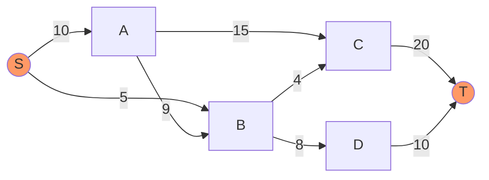
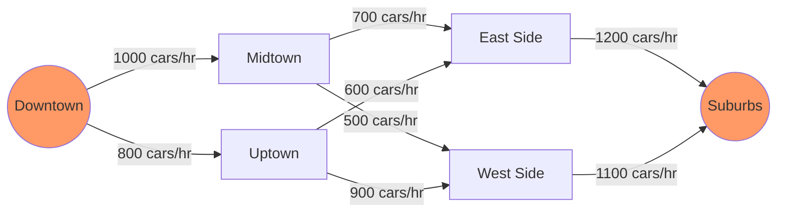

# Maximum Flow

## Introduction

Maximum Flow is a fundamental problem in graph theory and network optimization. It addresses a seemingly simple question: given a network of pipes with different capacities, what's the maximum amount of flow that can travel from a source to a sink?

This problem appears in numerous real-world scenarios—from transportation networks to telecommunications, from resource allocation to bipartite matching. Understanding maximum flow algorithms equips you with powerful tools to solve a wide range of computational problems.

In this guide, we'll explore:
- What maximum flow problems are
- Key concepts and terminology
- Popular algorithms for solving maximum flow problems
- Real-world applications
- Step-by-step implementation examples

## Understanding the Basics

### What is a Flow Network?

A flow network is a directed graph where:
- Each edge has a capacity (maximum amount of flow it can handle)
- There is a source node (where flow originates)
- There is a sink node (where flow terminates)
- Flow conservation applies at every node except source and sink (what goes in must come out)



In this example, S is the source, T is the sink, and the numbers on edges represent capacities.

### Key Concepts

1. **Flow**: The amount of "stuff" traveling through an edge. Must be non-negative and cannot exceed the edge capacity.

2. **Residual Capacity**: The additional flow that can be pushed through an edge. Calculated as `capacity - current_flow`.

3. **Augmenting Path**: A path from source to sink where every edge has positive residual capacity.

4. **Residual Network**: A network showing the remaining capacity on each edge.

5. **Min-Cut**: A partition of the network into two sets (one containing source, one containing sink) such that the total capacity of edges crossing from the source set to the sink set is minimized.

## The Ford-Fulkerson Algorithm

Ford-Fulkerson is a greedy algorithm that incrementally increases the flow until no more augmenting paths can be found.

### Algorithm Steps:

1. Initialize flow to 0 for all edges
2. While there exists an augmenting path from source to sink:
   - Find an augmenting path
   - Determine the bottleneck capacity (minimum residual capacity along the path)
   - Augment the flow by that bottleneck value
3. Return the total flow

### Implementation

Here's a Python implementation of the Ford-Fulkerson algorithm:

```python
def ford_fulkerson(graph, source, sink):
    """
    Implements the Ford-Fulkerson algorithm for finding maximum flow.
    
    Args:
        graph: A list of lists representing the adjacency matrix 
              where graph[u][v] is the capacity from u to v
        source: The source vertex
        sink: The sink vertex
        
    Returns:
        The maximum flow from source to sink
    """
    n = len(graph)
    # Create a residual graph
    residual = [row[:] for row in graph]
    
    # To keep track of the path
    parent = [-1] * n
    max_flow = 0
    
    # Augment the flow while there is a path from source to sink
    while bfs(residual, source, sink, parent):
        # Find minimum residual capacity along the path
        path_flow = float("Inf")
        s = sink
        while s != source:
            path_flow = min(path_flow, residual[parent[s]][s])
            s = parent[s]
            
        # Add path flow to overall flow
        max_flow += path_flow
        
        # Update residual capacities
        v = sink
        while v != source:
            u = parent[v]
            residual[u][v] -= path_flow  # Forward edge
            residual[v][u] += path_flow  # Backward edge (for cancellation)
            v = parent[v]
            
    return max_flow

def bfs(residual, source, sink, parent):
    """
    Performs breadth-first search to find an augmenting path.
    
    Returns:
        True if there is an augmenting path, False otherwise
    """
    n = len(residual)
    visited = [False] * n
    queue = [source]
    visited[source] = True
    
    while queue:
        u = queue.pop(0)
        for v in range(n):
            if not visited[v] and residual[u][v] > 0:
                queue.append(v)
                visited[v] = True
                parent[v] = u
                
    # If we reached the sink, there's an augmenting path
    return visited[sink]
```

### Example Usage

Let's use the algorithm on a simple network:

```python
# Example graph represented as an adjacency matrix
# The indices correspond to vertices: 0=source, 1=A, 2=B, 3=sink
graph = [
    [0, 10, 5, 0],  # Edges from source
    [0, 0, 2, 7],   # Edges from A
    [0, 0, 0, 10],  # Edges from B
    [0, 0, 0, 0]    # Edges from sink (none)
]

source = 0
sink = 3

max_flow = ford_fulkerson(graph, source, sink)
print(f"The maximum flow from source to sink is: {max_flow}")
```

**Output:**
```
The maximum flow from source to sink is: 15
```

## Edmonds-Karp Algorithm: An Optimization

The Edmonds-Karp algorithm is an implementation of Ford-Fulkerson that specifically uses BFS to find augmenting paths. This guarantees a time complexity of O(V²E), which is polynomial.

The key difference is that Edmonds-Karp always chooses the shortest augmenting path (fewest edges), which leads to faster convergence.

```python
# The implementation above already uses BFS,
# so it's actually the Edmonds-Karp algorithm
```

## Dinic's Algorithm: A Faster Approach

For networks with large capacities, Dinic's algorithm offers better performance with a time complexity of O(V²E).

The key innovations in Dinic's algorithm:
1. Uses level graphs to find shortest paths
2. Performs multiple augmentations in a single phase
3. Uses blocking flows to maximize efficiency

```python
def dinic_algorithm(graph, source, sink):
    n = len(graph)
    flow = 0
    
    # While we can find a level graph
    while create_level_graph(graph, source, sink):
        # Find blocking flow
        f = blocking_flow(graph, source, sink)
        if f == 0:
            break
        flow += f
        
    return flow

# Note: This is a simplified version. A complete implementation
# would require level graph creation and blocking flow functions.
```

## Real-World Applications

### 1. Transportation Networks

Consider a city with multiple roads connecting different areas. Each road has a maximum number of vehicles it can handle per hour. Maximum flow can determine the maximum number of vehicles that can travel from one area to another.



### 2. Bipartite Matching

Maximum flow algorithms can solve maximum bipartite matching problems—finding the maximum number of matches between two groups (like job applicants and positions).

```python
def maximum_bipartite_matching(graph, m, n):
    """
    Find maximum bipartite matching using Ford-Fulkerson
    
    Args:
        graph: Adjacency list where graph[u] contains the neighbors of u
               in the first partition
        m: Number of nodes in the first partition
        n: Number of nodes in the second partition
        
    Returns:
        Maximum number of matches
    """
    # Create flow network with source (node 0) and sink (node m+n+1)
    source = 0
    sink = m + n + 1
    flow_graph = [[0] * (m + n + 2) for _ in range(m + n + 2)]
    
    # Edges from source to first partition (with capacity 1)
    for i in range(1, m + 1):
        flow_graph[source][i] = 1
    
    # Edges between partitions (with capacity 1)
    for u in range(1, m + 1):
        for v in graph[u-1]:
            flow_graph[u][m + v] = 1
    
    # Edges from second partition to sink (with capacity 1)
    for i in range(1, n + 1):
        flow_graph[m + i][sink] = 1
        
    return ford_fulkerson(flow_graph, source, sink)
```

### 3. Image Segmentation

Maximum flow can be used for image segmentation—dividing an image into regions. Pixels are nodes, with edges weighted by similarity. A min-cut (equivalent to max flow) separates the image into foreground and background.

### 4. Sports Team Elimination

Determining whether a team is mathematically eliminated from a championship can be modeled as a maximum flow problem.

## Advanced Techniques

### Push-Relabel Algorithm

For very large networks, the Push-Relabel algorithm often performs better than Ford-Fulkerson with a time complexity of O(V²E).

### Min-Cost Max-Flow

When each edge has both a capacity and a cost per unit flow, we need to find the maximum flow with minimum total cost. This is solved with algorithms like the Successive Shortest Path algorithm.

## Summary

Maximum flow algorithms solve the problem of finding how much "stuff" can be pushed through a network with capacity constraints. The key algorithms we covered include:

1. **Ford-Fulkerson** - The foundational greedy algorithm
2. **Edmonds-Karp** - A polynomial-time implementation using BFS
3. **Dinic's Algorithm** - A faster approach for large networks

These algorithms have wide-ranging applications from transportation planning to resource allocation, making them essential tools in any algorithmic toolkit.

## Practice Exercises

1. Implement the Ford-Fulkerson algorithm and test it on a small graph.
2. Model a bipartite matching problem (like students to courses) and solve it using maximum flow.
3. Try to solve the [Maximum Flow problem on LeetCode](https://leetcode.com/problems/maximum-flow/).
4. Implement Dinic's algorithm and compare its performance with Ford-Fulkerson.
5. Given a grid with obstacles, find the maximum number of non-overlapping paths from the top-left to bottom-right.

## Additional Resources

- **Books**:
  - "Introduction to Algorithms" by Cormen, Leiserson, Rivest, and Stein
  - "Algorithm Design" by Kleinberg and Tardos
  
- **Online Courses**:
  - Stanford's Algorithms specialization on Coursera
  - MIT OpenCourseWare on Advanced Algorithms

- **Visualization Tools**:
  - [VisuAlgo](https://visualgo.net/en/maxflow) for visualizing maximum flow algorithms
  - [Graph Online](https://graphonline.ru/en/) for creating and analyzing flow networks

Remember that mastering maximum flow algorithms takes practice. Start with simple examples, trace through the algorithms by hand, and gradually move to more complex problems.

Happy coding!