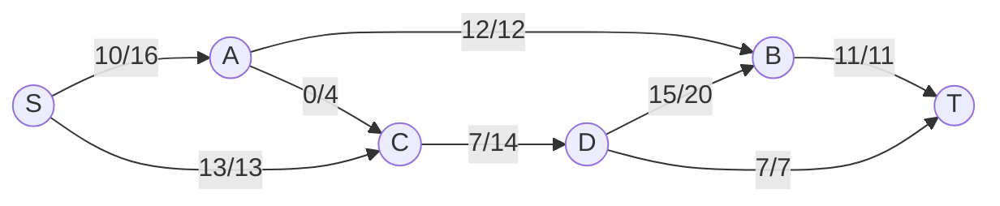
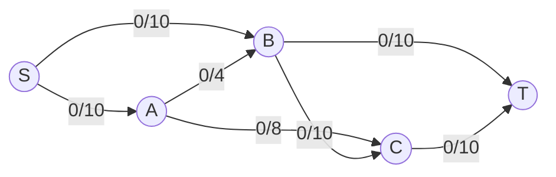

# Ford-Fulkerson Algorithm

## Introduction

The Ford-Fulkerson algorithm is a fundamental graph algorithm used to solve the **maximum flow problem** in flow networks. Developed by L. R. Ford Jr. and D. R. Fulkerson in 1956, this algorithm computes the maximum possible flow from a source node to a sink node in a network.

Imagine a network of pipes with different capacities, and you want to determine the maximum amount of water that can flow from a source to a destination. This is exactly what the Ford-Fulkerson algorithm helps us solve.

## Understanding Flow Networks

Before diving into the algorithm, let's understand some key concepts:

- **Flow Network**: A directed graph where each edge has a capacity (maximum amount that can flow through)
- **Source (s)**: The node where flow originates
- **Sink (t)**: The node where flow terminates
- **Flow**: The amount of "stuff" (data, water, etc.) moving through each edge
- **Capacity**: The maximum amount that can flow through an edge
- **Residual Capacity**: The additional flow that can be pushed through an edge

## How the Algorithm Works

The Ford-Fulkerson algorithm follows these key steps:

1. Initialize flow on all edges to 0
2. While there exists an augmenting path from source to sink:
   - Find an augmenting path using a path-finding algorithm (like DFS or BFS)
   - Calculate the bottleneck capacity (minimum residual capacity along the path)
   - Update the flow along the path by adding the bottleneck capacity
3. Return the total flow

An **augmenting path** is a path from source to sink where additional flow can be pushed through.

## Visual Representation

Let's see how a flow network might be represented:



In this diagram:
- Each edge is labeled with "flow/capacity"
- S is the source, T is the sink
- The maximum flow is 23 (which we'll calculate with the algorithm)

## Implementation

Let's implement the Ford-Fulkerson algorithm using the Edmonds-Karp variation (which uses BFS to find augmenting paths):

```python
from collections import defaultdict, deque

class Graph:
    def __init__(self, vertices):
        self.vertices = vertices
        self.graph = defaultdict(list)
        self.flow = {}

    def add_edge(self, u, v, capacity):
        # Add forward edge
        self.graph[u].append(v)
        # Add backward edge for residual graph
        self.graph[v].append(u)
        # Initialize flow to 0
        self.flow[(u, v)] = 0
        self.flow[(v, u)] = 0
        # Store capacity of forward edge
        self.flow[(u, v, 'capacity')] = capacity
        # The reverse edge has 0 capacity initially
        self.flow[(v, u, 'capacity')] = 0

    def bfs(self, source, sink, parent):
        # Mark all vertices as not visited
        visited = [False] * self.vertices
        # Create a queue for BFS
        queue = deque()
        # Mark the source node as visited and enqueue it
        queue.append(source)
        visited[source] = True
        
        # BFS loop
        while queue:
            u = queue.popleft()
            
            # Get all adjacent vertices of the dequeued vertex
            for v in self.graph[u]:
                # Check if there's available capacity and vertex is not visited
                residual_capacity = self.flow[(u, v, 'capacity')] - self.flow[(u, v)]
                if not visited[v] and residual_capacity > 0:
                    # Mark it visited and enqueue it
                    queue.append(v)
                    visited[v] = True
                    parent[v] = u
        
        # If we reached sink in BFS, then return true, else false
        return visited[sink]

    def ford_fulkerson(self, source, sink):
        parent = [-1] * self.vertices
        max_flow = 0
        
        # Augment the flow while there is a path from source to sink
        while self.bfs(source, sink, parent):
            # Find minimum residual capacity of the edges along the
            # path filled by BFS. Or we can say find the maximum flow
            # through the path found.
            path_flow = float("Inf")
            s = sink
            while s != source:
                path_flow = min(path_flow, 
                                self.flow[(parent[s], s, 'capacity')] - 
                                self.flow[(parent[s], s)])
                s = parent[s]
            
            # Add path flow to overall flow
            max_flow += path_flow
            
            # Update residual capacities of the edges and reverse edges
            # along the path
            v = sink
            while v != source:
                u = parent[v]
                self.flow[(u, v)] += path_flow
                self.flow[(v, u)] -= path_flow
                v = parent[v]
                
        return max_flow
```

## Example Execution

Let's see how this works with a simple example:

```python
# Create a graph with 6 vertices (labeled 0 to 5)
g = Graph(6)

# Add edges with their capacities
g.add_edge(0, 1, 16)  # s -> a
g.add_edge(0, 2, 13)  # s -> c
g.add_edge(1, 2, 4)   # a -> c
g.add_edge(1, 3, 12)  # a -> b
g.add_edge(2, 4, 14)  # c -> d
g.add_edge(3, 5, 11)  # b -> t
g.add_edge(3, 2, 9)   # b -> c (not shown in the diagram)
g.add_edge(4, 3, 20)  # d -> b
g.add_edge(4, 5, 7)   # d -> t

# Source is 0 and sink is 5
max_flow = g.ford_fulkerson(0, 5)
print(f"Maximum flow: {max_flow}")  # Output: Maximum flow: 23
```

Output:
```
Maximum flow: 23
```

## Step-by-Step Execution

Let's trace through a smaller example to understand better:



1. **Initial State**: All flows are 0
2. **First Iteration**:
   - Find path: S → A → C → T (capacity 8)
   - Update flow: S → A (8/10), A → C (8/8), C → T (8/10)
3. **Second Iteration**:
   - Find path: S → B → T (capacity 10)
   - Update flow: S → B (10/10), B → T (10/10)
4. **Third Iteration**:
   - Find path: S → A → B → C → T (capacity 2)
   - Update flow: S → A (10/10), A → B (2/4), B → C (2/10), C → T (10/10)
5. **No more paths**: Maximum flow = 20

## Applications of Ford-Fulkerson

The Ford-Fulkerson algorithm has many real-world applications:

### 1. Transportation Networks

Imagine a network of roads with capacity constraints (maximum number of vehicles per hour). The algorithm can find the maximum number of vehicles that can move from one point to another through the network.

### 2. Telecommunications

In networks where data packets need to be routed efficiently, Ford-Fulkerson can determine the maximum data throughput between any two points.

```python
# Example: Network routing
# Nodes represent routers, edges represent connections with bandwidth limits

network = Graph(6)  # 6 routers in the network
# Add connections with bandwidth in Mbps
network.add_edge(0, 1, 1000)  # Router 0 to Router 1 with 1Gbps
network.add_edge(0, 2, 800)   # Router 0 to Router 2 with 800Mbps
network.add_edge(1, 3, 700)   # And so on...
network.add_edge(2, 3, 900)
network.add_edge(2, 4, 500)
network.add_edge(3, 5, 1200)
network.add_edge(4, 5, 600)

max_bandwidth = network.ford_fulkerson(0, 5)  # Source router to destination router
print(f"Maximum bandwidth: {max_bandwidth} Mbps")
```

### 3. Bipartite Matching

The algorithm can be used to find the maximum number of matches in a bipartite graph, which has applications in job assignment problems.

```python
# Example: Job Assignment Problem
# Workers (0-3) and Jobs (4-7)

matching = Graph(8)  # 4 workers + 4 jobs = 8 nodes
# Edge (i,j) means worker i can do job j
matching.add_edge(0, 4, 1)  # Worker 0 can do Job 0
matching.add_edge(0, 5, 1)  # Worker 0 can do Job 1
matching.add_edge(1, 4, 1)
matching.add_edge(1, 6, 1)
matching.add_edge(2, 5, 1)
matching.add_edge(2, 7, 1)
matching.add_edge(3, 6, 1)

# Add source and sink
for i in range(4):
    matching.add_edge(8, i, 1)  # Source to workers
for i in range(4, 8):
    matching.add_edge(i, 9, 1)  # Jobs to sink

max_matching = matching.ford_fulkerson(8, 9)
print(f"Maximum number of workers that can be assigned jobs: {max_matching}")
```

### 4. Image Segmentation

In computer vision, the algorithm is used for image segmentation using the min-cut/max-flow theorem.

## Time Complexity

The time complexity depends on the method used to find augmenting paths:

- With DFS: O(E × f), where E is the number of edges and f is the maximum flow value
- With Edmonds-Karp (BFS): O(V × E²), where V is the number of vertices

## Min-Cut Max-Flow Theorem

A key result related to Ford-Fulkerson is the **Min-Cut Max-Flow Theorem**, which states that:

> The maximum flow in a network equals the minimum capacity of any cut that separates the source and sink.

A **cut** is a partition of the vertices into two disjoint sets, with the source in one set and the sink in the other.

## Common Pitfalls and Optimizations

- **Irrational capacities**: With irrational capacities, the algorithm might not terminate
- **Integer capacities**: For networks with integer capacities, the algorithm always terminates
- **Choosing augmenting paths**: Different strategies affect performance:
  - Shortest path (Edmonds-Karp): Guarantees O(V × E²) time complexity
  - Fattest path (choosing the path with maximum bottleneck capacity): Often faster in practice

## Summary

The Ford-Fulkerson algorithm is a powerful method for finding maximum flow in a network. Key takeaways:

1. It iteratively finds augmenting paths and increases flow until no more paths exist
2. The Edmonds-Karp variation uses BFS to find shortest augmenting paths
3. It has wide applications in transportation, telecommunications, and assignment problems
4. The min-cut max-flow theorem connects the maximum flow to the minimum cut capacity

## Exercises

1. Implement the Ford-Fulkerson algorithm using DFS instead of BFS
2. Find the maximum flow in the following network:
   - Source (0) to nodes 1 and 2 with capacities 10 and 8
   - Node 1 to nodes 3 and 4 with capacities 5 and 4
   - Node 2 to nodes 3 and 4 with capacities 3 and 10
   - Nodes 3 and 4 to Sink (5) with capacities 7 and 14
3. Modify the algorithm to handle undirected graphs
4. Use the Ford-Fulkerson algorithm to solve a bipartite matching problem

## Additional Resources

- Introduction to Algorithms (CLRS) - Chapter on Maximum Flow
- Graph Algorithms by Shimon Even
- Stanford's CS 161 lecture notes on network flow
- [Introduction to the Ford-Fulkerson Algorithm](https://brilliant.org/wiki/ford-fulkerson-algorithm/)

<br />

Remember that understanding flow networks is foundational to many advanced algorithms, and the Ford-Fulkerson algorithm is just the beginning of this fascinating topic!