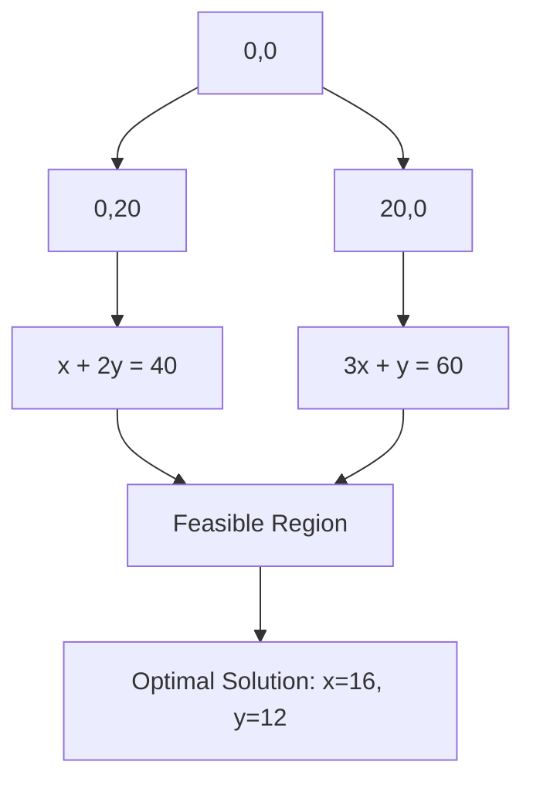

# Linear Programming

## Introduction

Linear Programming (LP) is a mathematical optimization technique used to find the best outcome in a mathematical model whose requirements are represented by linear relationships. It's an essential tool in the algorithm designer's toolkit, allowing us to solve complex resource allocation problems efficiently.

At its core, linear programming helps us answer questions like:
- "What's the most profitable way to allocate limited resources?"
- "What's the least expensive way to meet certain requirements?"
- "How can we optimize a distribution network with constraints?"

Despite having "programming" in its name, linear programming isn't directly about computer programming. Instead, it refers to planning or "programming" processes to achieve optimal results. However, implementing LP solvers is an important aspect of algorithm development.

## Understanding Linear Programming

### Basic Components

A linear programming problem consists of:

1. **Objective Function**: What we want to maximize or minimize (like profit or cost)
2. **Decision Variables**: The quantities we need to determine (like production amounts)
3. **Constraints**: Limitations on our resources or requirements (like budget or labor hours)

All of these components must be expressed as linear equations or inequalities.

### Standard Form

A linear program in standard form looks like:

Maximize (or Minimize): $c_1x_1 + c_2x_2 + ... + c_nx_n$

Subject to:
- $a_{11}x_1 + a_{12}x_2 + ... + a_{1n}x_n \leq b_1$
- $a_{21}x_1 + a_{22}x_2 + ... + a_{2n}x_n \leq b_2$
- ...
- $a_{m1}x_1 + a_{m2}x_2 + ... + a_{mn}x_n \leq b_m$
- $x_1, x_2, ..., x_n \geq 0$

Where:
- $x_1, x_2, ..., x_n$ are the decision variables
- $c_1, c_2, ..., c_n$ are the coefficients of the objective function
- $a_{ij}$ represents the coefficient of variable $x_j$ in the $i$-th constraint
- $b_i$ represents the right-hand side of the $i$-th constraint

## Linear Programming Algorithms

Several algorithms can solve linear programming problems:

### 1. Simplex Method

The Simplex Method, developed by George Dantzig in 1947, is one of the most popular algorithms for solving LP problems. It works by moving from one vertex of the feasible region to an adjacent vertex that improves the objective function.

### 2. Interior Point Methods

Interior point methods approach the optimal solution by traversing the interior of the feasible region rather than traveling along its edges.

### 3. Ellipsoid Method

This algorithm was historically significant for proving that linear programming problems can be solved in polynomial time.

## Implementing Linear Programming in Code

Here's how we can solve a simple linear programming problem using Python with the `PuLP` library:

```python
# Install PuLP if you haven't already: pip install pulp
from pulp import LpMaximize, LpProblem, LpVariable

# Create a linear programming problem
model = LpProblem(name="resource-allocation", sense=LpMaximize)

# Define the decision variables
x = LpVariable(name="product_x", lowBound=0)  # Number of Product X to make
y = LpVariable(name="product_y", lowBound=0)  # Number of Product Y to make

# Define the objective function
# Profit: $40 for each Product X, $30 for each Product Y
model += 40 * x + 30 * y, "Profit"

# Add constraints
# Resource 1: Each Product X uses 1 unit, each Product Y uses 2 units, 40 units available
model += 1 * x + 2 * y <= 40, "Resource_1_constraint"
# Resource 2: Each Product X uses 3 units, each Product Y uses 1 unit, 60 units available
model += 3 * x + 1 * y <= 60, "Resource_2_constraint"

# Solve the problem
model.solve()

# Print the results
print(f"Optimal Production Plan:")
print(f"Product X: {x.value()}")
print(f"Product Y: {y.value()}")
print(f"Total Profit: ${40 * x.value() + 30 * y.value()}")
```

**Output**:
```
Optimal Production Plan:
Product X: 16.0
Product Y: 12.0
Total Profit: $1000.0
```

This simple example shows how we can find the optimal production levels to maximize profit while respecting resource constraints.

## Visualizing Linear Programming Problems

For two-dimensional problems (with two decision variables), we can visualize the constraints and objective function graphically:



In the graph above:
- Each constraint forms a line in the 2D space
- The feasible region is the area that satisfies all constraints
- The optimal solution is the point in the feasible region that maximizes (or minimizes) the objective function

## Practical Applications

Linear programming has numerous real-world applications:

### 1. Supply Chain Optimization

A company needs to decide which products to make in which factories to minimize total production and shipping costs while meeting customer demand.

### 2. Portfolio Optimization

An investment manager wants to allocate funds across different assets to maximize expected return while controlling risk.

```python
from pulp import LpMinimize, LpProblem, LpVariable

# Create a portfolio optimization model
model = LpProblem(name="portfolio_optimization", sense=LpMinimize)

# Assets to invest in
assets = ["Stock_A", "Stock_B", "Bond_C", "REIT_D"]

# Expected returns (%)
returns = {"Stock_A": 12, "Stock_B": 10, "Bond_C": 7, "REIT_D": 9}

# Risk measures (variance)
risk = {"Stock_A": 25, "Stock_B": 18, "Bond_C": 4, "REIT_D": 13}

# Decision variables - percentage allocated to each asset
allocations = LpVariable.dicts("Allocation", assets, lowBound=0, upBound=1)

# Objective: Minimize risk
model += sum([risk[a] * allocations[a] for a in assets]), "Total_Risk"

# Constraint: All funds must be allocated
model += sum([allocations[a] for a in assets]) == 1, "Full_Allocation"

# Constraint: Minimum expected return of 9%
model += sum([returns[a] * allocations[a] for a in assets]) >= 9, "Min_Return"

# Constraint: Max 60% in stocks
model += allocations["Stock_A"] + allocations["Stock_B"] <= 0.6, "Max_Stocks"

# Solve the model
model.solve()

# Print results
print("Optimal Portfolio Allocation:")
total_return = 0
for a in assets:
    percentage = allocations[a].value() * 100
    print(f"{a}: {percentage:.2f}%")
    total_return += returns[a] * allocations[a].value()
    
print(f"Expected Return: {total_return:.2f}%")
print(f"Risk Score: {sum(risk[a] * allocations[a].value() for a in assets):.2f}")
```

### 3. Transportation Planning

A logistics company needs to determine the optimal routes for delivering goods from warehouses to retail locations.

### 4. Production Planning

A manufacturer needs to determine how many units of each product to produce to maximize profit while respecting capacity constraints.

## Limitations of Linear Programming

While powerful, linear programming has some limitations:

1. **Linearity requirement**: Both the objective function and constraints must be linear
2. **Certainty assumption**: The model assumes all parameters are known with certainty
3. **Divisibility assumption**: Solutions can be fractional, which might not make sense for some problems (e.g., you can't produce 2.5 cars)

For problems that don't meet these requirements, variations like Integer Linear Programming, Mixed Integer Linear Programming, or Nonlinear Programming may be more appropriate.

## Extending Linear Programming

### Integer Linear Programming (ILP)

When variables must be integers, we use Integer Linear Programming. This is common in problems where fractional solutions don't make sense (like assigning whole tasks to workers).

### Mixed Integer Linear Programming (MILP)

When some variables must be integers while others can be continuous, we use MILP.

### Linear Programming Relaxation

A technique where we first solve the problem without integer constraints, then round or adjust the solution to get integer values.

## Summary

Linear programming is a powerful mathematical technique for optimizing linear objective functions subject to linear constraints. It forms the foundation for many advanced algorithms and has wide-ranging applications in business, engineering, and computer science.

The key steps in solving linear programming problems are:

1. Identify the decision variables
2. Formulate the objective function
3. Define the constraints
4. Solve using an appropriate algorithm (like Simplex or Interior Point)
5. Interpret the results in the context of the original problem

While we've touched on the basics here, linear programming is a rich field with many extensions and variations to handle more complex optimization scenarios.

## Further Resources and Exercises

### Resources
1. "Introduction to Linear Optimization" by Dimitris Bertsimas and John N. Tsitsiklis
2. "Linear Programming: Foundations and Extensions" by Robert J. Vanderbei
3. The documentation for the PuLP library: [PuLP Documentation](https://coin-or.github.io/pulp/)

### Exercises

1. **Manufacturing Problem**: A company makes tables and chairs. Each table requires 8 hours of carpentry and 2 hours of finishing. Each chair requires 2 hours of carpentry and 1 hour of finishing. The company has 40 hours of carpentry time and 12 hours of finishing time available. If the profit is $90 per table and $25 per chair, how many of each should they make to maximize profit?

2. **Diet Problem**: Create a linear program to determine the minimum cost diet that meets certain nutritional requirements.

3. **Network Flow**: Implement a linear program to find the maximum flow in a network with capacity constraints.

4. **Assignment Problem**: Formulate a linear programming solution for assigning n workers to n jobs to minimize the total cost, where each worker must be assigned exactly one job.

5. **Implement the Simplex Method**: As a challenge, try implementing the Simplex algorithm in your preferred programming language.

Happy optimizing!