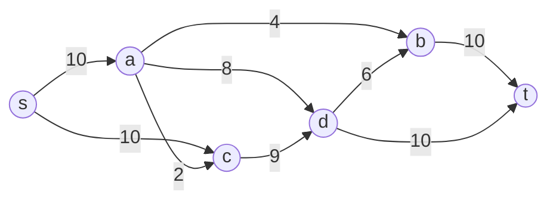

# Edmonds-Karp Algorithm

## Introduction

The Edmonds-Karp algorithm is a specific implementation of the Ford-Fulkerson method for computing the maximum flow in a flow network. Developed by Jack Edmonds and Richard Karp in 1972, it improves upon the Ford-Fulkerson algorithm by specifying that the augmenting path is found using breadth-first search (BFS). This choice guarantees a polynomial time complexity of O(V×E²), where V is the number of vertices and E is the number of edges in the graph.

In this tutorial, we'll explore how the Edmonds-Karp algorithm works, implement it step by step, and see how it can be applied to real-world problems.

## Prerequisites

Before diving into Edmonds-Karp, you should be familiar with:
- Graph theory basics
- Breadth-First Search (BFS)
- The concept of network flows
- The Ford-Fulkerson method

## Understanding Network Flow

A flow network is a directed graph where each edge has a capacity, indicating the maximum amount of flow that can pass through it. The goal is to find the maximum flow from a source node (s) to a sink node (t).

Key concepts:
- **Flow**: The amount of something moving through an edge
- **Capacity**: The maximum amount an edge can handle
- **Residual capacity**: The remaining capacity on an edge
- **Augmenting path**: A path from source to sink where more flow can be added

## The Edmonds-Karp Algorithm

Edmonds-Karp is an improvement over the Ford-Fulkerson method with a specific rule: always choose the shortest augmenting path (in terms of number of edges) from source to sink using BFS.

### Algorithm Steps:

1. Initialize flow on all edges to 0
2. Create a residual graph (initially identical to the original graph)
3. While there exists an augmenting path from source to sink in the residual graph:
   - Find the shortest augmenting path using BFS
   - Determine the bottleneck capacity (minimum residual capacity along the path)
   - Increase flow along this path by the bottleneck capacity
   - Update the residual graph
4. Return the total flow

## Implementation

Let's implement the Edmonds-Karp algorithm in Python:

```python
from collections import defaultdict, deque

def edmonds_karp(graph, source, sink):
    # Initialize the flow to 0
    flow = 0
    
    # Create a residual graph
    residual_graph = defaultdict(dict)
    
    # Initialize residual graph with capacities from the original graph
    for u in graph:
        for v, capacity in graph[u].items():
            residual_graph[u][v] = capacity
            # Add reverse edge with 0 capacity if it doesn't exist
            if v not in graph or u not in graph[v]:
                residual_graph[v][u] = 0
    
    # Continue augmenting flow while there is a path from source to sink
    while True:
        # Use BFS to find an augmenting path
        parent = bfs(residual_graph, source, sink)
        
        # If no augmenting path exists, we're done
        if parent is None:
            break
            
        # Find the minimum residual capacity on the path
        path_flow = float("Inf")
        s = sink
        while s != source:
            path_flow = min(path_flow, residual_graph[parent[s]][s])
            s = parent[s]
            
        # Add flow to the total flow
        flow += path_flow
        
        # Update residual capacities of edges and reverse edges along the path
        s = sink
        while s != source:
            u = parent[s]
            residual_graph[u][s] -= path_flow
            residual_graph[s][u] += path_flow
            s = parent[s]
    
    return flow

def bfs(graph, source, sink):
    # Initialize all vertices as not visited
    visited = set()
    visited.add(source)
    
    # Create a queue for BFS and a parent dictionary to store the path
    queue = deque([source])
    parent = {}
    
    # Standard BFS loop
    while queue:
        u = queue.popleft()
        
        # Search all adjacent vertices of u
        for v, capacity in graph[u].items():
            # If there is available capacity and v is not visited
            if capacity > 0 and v not in visited:
                queue.append(v)
                visited.add(v)
                parent[v] = u
                
                # If we reached the sink, we found a path
                if v == sink:
                    return parent
    
    # No augmenting path was found
    return None
```

## Example Usage

Let's see the algorithm in action with a simple flow network:

```python
# Define a sample graph
graph = {
    's': {'a': 10, 'c': 10},
    'a': {'b': 4, 'c': 2, 'd': 8},
    'b': {'t': 10},
    'c': {'d': 9},
    'd': {'b': 6, 't': 10},
    't': {}
}

max_flow = edmonds_karp(graph, 's', 't')
print(f"The maximum flow is: {max_flow}")  # Output: The maximum flow is: 19
```

Let's visualize this graph:



## Step-by-Step Execution Trace

Let's trace the execution of the algorithm on our example:

1. **Initialization**:
   - Flow = 0
   - Residual graph = original graph capacities

2. **First iteration**:
   - BFS finds path: s → a → b → t with bottleneck capacity = 4
   - Flow = 0 + 4 = 4
   - Update residual graph

3. **Second iteration**:
   - BFS finds path: s → a → d → t with bottleneck capacity = 8
   - Flow = 4 + 8 = 12
   - Update residual graph

4. **Third iteration**:
   - BFS finds path: s → c → d → t with bottleneck capacity = 7
   - Flow = 12 + 7 = 19
   - Update residual graph

5. **Fourth iteration**:
   - No augmenting path exists
   - Return flow = 19

## Time Complexity Analysis

The time complexity of the Edmonds-Karp algorithm is O(V×E²), where:
- V is the number of vertices
- E is the number of edges

This complexity comes from:
- There can be at most O(V×E) augmenting paths found (proven mathematically)
- Each BFS operation takes O(E) time
- Therefore, the total time complexity is O(V×E×E) = O(V×E²)

This polynomial time complexity makes Edmonds-Karp more reliable than the basic Ford-Fulkerson method, which could have exponential time complexity in certain cases.

## Real-World Applications

The Edmonds-Karp algorithm and network flows have numerous practical applications:

### 1. Transportation Networks

Consider a logistics company that needs to determine the maximum amount of goods that can be shipped from a warehouse to a distribution center through various routes with different capacities.

```python
# Represent the transportation network
transport_network = {
    'warehouse': {'route1': 1000, 'route2': 800, 'route3': 500},
    'route1': {'checkpoint1': 800, 'checkpoint2': 600},
    'route2': {'checkpoint2': 700, 'checkpoint3': 400},
    'route3': {'checkpoint3': 500},
    'checkpoint1': {'distribution_center': 900},
    'checkpoint2': {'distribution_center': 800},
    'checkpoint3': {'distribution_center': 700},
    'distribution_center': {}
}

max_throughput = edmonds_karp(transport_network, 'warehouse', 'distribution_center')
print(f"Maximum throughput: {max_throughput} units")
```

### 2. Network Bandwidth Allocation

In computer networks, you can use the algorithm to determine the maximum bandwidth available between two nodes in a network.

### 3. Bipartite Matching

We can solve the maximum bipartite matching problem using network flow:

```python
def max_bipartite_matching(graph, group_a, group_b):
    # Create a flow network with source and sink
    flow_network = defaultdict(dict)
    
    source = 'source'
    sink = 'sink'
    
    # Add edges from source to all vertices in group A with capacity 1
    for a in group_a:
        flow_network[source][a] = 1
    
    # Add edges from all vertices in group B to sink with capacity 1
    for b in group_b:
        flow_network[b][sink] = 1
    
    # Add edges from group A to group B according to the bipartite graph
    for a in group_a:
        for b in graph[a]:
            flow_network[a][b] = 1
    
    # Run Edmonds-Karp algorithm
    return edmonds_karp(flow_network, source, sink)

# Example: Job assignment problem
employees = ['E1', 'E2', 'E3']
jobs = ['J1', 'J2', 'J3', 'J4']

# Skills matrix (which employee can do which job)
skills = {
    'E1': ['J1', 'J2'],
    'E2': ['J2', 'J3'],
    'E3': ['J2', 'J4']
}

max_assignments = max_bipartite_matching(skills, employees, jobs)
print(f"Maximum number of jobs that can be assigned: {max_assignments}")
```

## Summary

The Edmonds-Karp algorithm is a powerful implementation of the Ford-Fulkerson method that guarantees polynomial time complexity by using BFS to find the shortest augmenting paths. It's widely used for solving maximum flow problems in network flows.

Key takeaways:
- Edmonds-Karp uses BFS to find augmenting paths, ensuring O(V×E²) time complexity
- It's a specific implementation of the Ford-Fulkerson method
- The algorithm is guaranteed to terminate and find the maximum flow
- It has many practical applications in transportation, networking, and assignment problems

## Practice Exercises

1. Implement a function to find the minimum cut in a flow network using the Edmonds-Karp algorithm.
2. Modify the algorithm to handle undirected graphs by treating each undirected edge as two directed edges.
3. Apply the Edmonds-Karp algorithm to solve the maximum bipartite matching problem with a larger dataset.
4. Implement a visualization tool that shows each step of the algorithm on a graph.
5. Compare the performance of Edmonds-Karp with other max flow algorithms like Dinic's algorithm or Push-Relabel.

## Additional Resources

- "Introduction to Algorithms" by Cormen, Leiserson, Rivest, and Stein (Chapter on Network Flow)
- "Algorithm Design" by Jon Kleinberg and Éva Tardos
- Graph Algorithms by Shimon Even
- [Stanford University's CS Theory course notes on Maximum Flow](http://theory.stanford.edu/~trevisan/cs261/lecture16.pdf)

Remember that network flow problems are powerful tools in computer science, and mastering the Edmonds-Karp algorithm is a step toward understanding more advanced concepts in this domain.