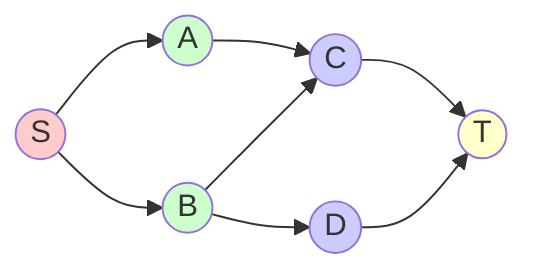
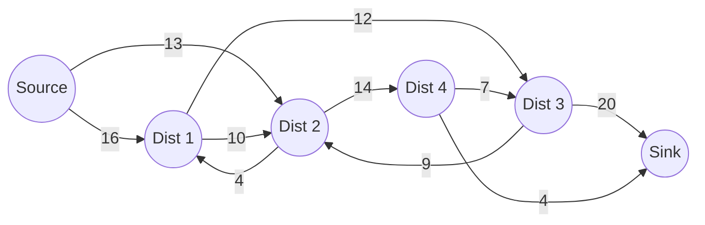

# Dinic's Algorithm

## Introduction

Dinic's Algorithm is an advanced network flow algorithm that efficiently solves the maximum flow problem. Developed by Soviet computer scientist Yefim Dinitz in 1970, it's significantly faster than the Ford-Fulkerson algorithm for many practical scenarios, with a time complexity of O(V²E) where V is the number of vertices and E is the number of edges in the graph.

In this tutorial, we'll explore how Dinic's Algorithm works, implement it in code, and see how it applies to real-world problems. This algorithm uses two key concepts: **level graphs** (for quickly finding augmenting paths) and **blocking flows** (to efficiently push flow through the network).

## Prerequisites

Before diving into Dinic's Algorithm, you should be familiar with:
- Graph representation (adjacency lists/matrices)
- Basic concepts of network flow (flow networks, residual graphs)
- Breadth-First Search (BFS)
- The concept of augmenting paths in flow networks

## Understanding Network Flow Problems

A network flow problem involves moving entities from a source to a sink through a network with capacity constraints. Each edge in the network has a capacity limiting how much flow can pass through it.

For example:
- Water flowing through pipes
- Data packets through a network
- Traffic through road systems 

The goal is to find the maximum amount that can flow from source to sink without exceeding any edge capacity.

## How Dinic's Algorithm Works

Dinic's Algorithm improves upon the Ford-Fulkerson method by using level graphs to find multiple augmenting paths simultaneously. Here's the process:

1. **Build a level graph** using BFS from the source
2. **Find blocking flows** in the level graph
3. **Update the residual graph**
4. **Repeat** until no more augmenting paths exist

### Level Graph Construction

A level graph assigns "levels" to nodes based on their shortest distance from the source. Only edges that go from level i to level i+1 are included in the level graph.



### Finding Blocking Flows

A blocking flow is a flow where every path from source to sink contains at least one saturated edge. Dinic's Algorithm uses multiple depth-first searches (DFS) to find paths in the level graph and push as much flow as possible along each path.

### The Algorithm Step by Step

1. Start with zero flow
2. Create a residual graph from the original network
3. While there exists an augmenting path from source to sink in the level graph:
   - Build a level graph using BFS
   - Find a blocking flow in the level graph
   - Add the blocking flow to the total flow
4. Return the total flow

## Implementation of Dinic's Algorithm

Let's implement Dinic's Algorithm in C++:

```cpp
#include <iostream>
#include <vector>
#include <queue>
#include <limits>

using namespace std;

struct Edge {
    int v;          // Destination vertex
    int flow;       // Current flow
    int capacity;   // Capacity
    int rev;        // Index of reverse edge in adjacency list
};

class Dinic {
private:
    vector<vector<Edge>> graph;  // Adjacency list
    vector<int> level;           // Level of each node
    vector<int> start;           // Start index for finding paths
    int n;                       // Number of nodes
    int source;                  // Source node
    int sink;                    // Sink node

    // Build level graph using BFS
    bool bfs() {
        fill(level.begin(), level.end(), -1);
        level[source] = 0;
        
        queue<int> q;
        q.push(source);
        
        while (!q.empty() && level[sink] == -1) {
            int u = q.front();
            q.pop();
            
            for (const Edge& e : graph[u]) {
                if (level[e.v] == -1 && e.flow < e.capacity) {
                    level[e.v] = level[u] + 1;
                    q.push(e.v);
                }
            }
        }
        
        return level[sink] != -1;
    }
    
    // Use DFS to find augmenting paths in level graph
    int dfs(int u, int flow) {
        if (u == sink)
            return flow;
        
        for (int& i = start[u]; i < graph[u].size(); i++) {
            Edge& e = graph[u][i];
            
            if (level[e.v] == level[u] + 1 && e.flow < e.capacity) {
                int curr_flow = min(flow, e.capacity - e.flow);
                int temp_flow = dfs(e.v, curr_flow);
                
                if (temp_flow > 0) {
                    e.flow += temp_flow;
                    graph[e.v][e.rev].flow -= temp_flow;
                    return temp_flow;
                }
            }
        }
        
        return 0;
    }
    
public:
    Dinic(int n, int source, int sink) : n(n), source(source), sink(sink) {
        graph.resize(n);
        level.resize(n);
        start.resize(n);
    }
    
    // Add an edge to the graph
    void addEdge(int u, int v, int capacity) {
        Edge a = {v, 0, capacity, (int)graph[v].size()};
        Edge b = {u, 0, 0, (int)graph[u].size()};  // Reverse edge with 0 capacity
        
        graph[u].push_back(a);
        graph[v].push_back(b);
    }
    
    // Calculate maximum flow
    int maxFlow() {
        int total_flow = 0;
        
        while (bfs()) {
            fill(start.begin(), start.end(), 0);
            
            int flow;
            while ((flow = dfs(source, INT_MAX)) > 0) {
                total_flow += flow;
            }
        }
        
        return total_flow;
    }
};
```

## Example: Water Distribution Network

Let's consider a practical example of a water distribution network where:
- We have a water source (node 0)
- Multiple distribution points (nodes 1 to n-2)
- A residential area (sink, node n-1)
- Each pipe has a maximum capacity

```cpp
int main() {
    // Example: Water distribution network
    // 0 = source (water plant)
    // 5 = sink (residential area)
    // 1-4 = distribution points
    int n = 6;  // Number of nodes
    
    Dinic dinic(n, 0, 5);
    
    // Add edges (pipes) with capacities
    dinic.addEdge(0, 1, 16);  // Source to distribution point 1 with capacity 16
    dinic.addEdge(0, 2, 13);  // Source to distribution point 2 with capacity 13
    dinic.addEdge(1, 2, 10);  // Distribution point connections
    dinic.addEdge(1, 3, 12);
    dinic.addEdge(2, 1, 4);
    dinic.addEdge(2, 4, 14);
    dinic.addEdge(3, 2, 9);
    dinic.addEdge(3, 5, 20);  // To residential area
    dinic.addEdge(4, 3, 7);
    dinic.addEdge(4, 5, 4);   // To residential area
    
    int max_flow = dinic.maxFlow();
    cout << "Maximum water flow to residential area: " << max_flow << " units" << endl;
    
    return 0;
}
```

Output:
```
Maximum water flow to residential area: 23 units
```

## Network Flow Graph Visualization

Here's how our example water distribution network might look:



## Real-World Applications

Dinic's Algorithm finds applications in numerous real-world scenarios:

### 1. Network Routing
Optimizing data packet routing in computer networks to maximize throughput.

### 2. Bipartite Matching
Finding maximum matchings in bipartite graphs, useful in job assignments.

```cpp
// Example: Converting bipartite matching to max flow
// For a bipartite graph with sets A and B
void bipartiteToMaxFlow(int n, int m, vector<vector<int>>& edges) {
    int nodes = n + m + 2;  // n nodes in A, m nodes in B, source, and sink
    int source = 0;
    int sink = nodes - 1;
    
    Dinic dinic(nodes, source, sink);
    
    // Connect source to all nodes in set A
    for (int i = 1; i <= n; i++) {
        dinic.addEdge(source, i, 1);  // Capacity 1 for one match
    }
    
    // Connect edges between sets A and B
    for (auto& edge : edges) {
        int u = edge[0];  // Node from set A
        int v = edge[1];  // Node from set B
        dinic.addEdge(u, n + v, 1);  // Capacity 1
    }
    
    // Connect all nodes in set B to sink
    for (int i = 1; i <= m; i++) {
        dinic.addEdge(n + i, sink, 1);  // Capacity 1
    }
    
    int max_matching = dinic.maxFlow();
    cout << "Maximum matching size: " << max_matching << endl;
}
```

### 3. Image Segmentation
Using max-flow/min-cut algorithms for separating foreground from background in images.

### 4. Baseball Elimination Problem
Determining if a team is mathematically eliminated from winning based on remaining games.

## Time Complexity and Optimization

The time complexity of Dinic's Algorithm is:
- O(V²E) in general graphs
- O(E√V) in unit capacity networks
- O(VE) in bipartite graphs

This makes it significantly faster than the Ford-Fulkerson algorithm (O(E|F|)) for many practical applications.

## Common Pitfalls and Tips

1. **Watch out for overflow**: Use appropriate data types for flow values
2. **Reverse edges**: Always remember to add reverse edges in the residual graph
3. **Zero-capacity edges**: Be careful with zero flow edges in the original graph
4. **Initialization**: Reset data structures properly between algorithm runs
5. **Level graph optimization**: The level graph helps avoid cycling and speeds up the algorithm

## Comparison with Other Max Flow Algorithms

| Algorithm | Time Complexity | Pros | Cons |
|-----------|-----------------|------|------|
| Ford-Fulkerson | O(E·max_flow) | Simple to implement | Slow for large capacities |
| Edmonds-Karp | O(VE²) | Guaranteed termination | Not the fastest |
| Dinic's | O(V²E) | Faster than Edmonds-Karp | More complex implementation |
| Push-Relabel | O(V²E) | Excellent practical performance | Most complex implementation |

## Summary

Dinic's Algorithm is a powerful technique for solving maximum flow problems with better efficiency than simpler approaches. It uses level graphs and blocking flows to quickly find augmenting paths, making it particularly effective for bipartite matching and unit-capacity networks.

Key takeaways:
- Dinic's Algorithm builds upon Ford-Fulkerson with better efficiency
- It uses level graphs to avoid cycles and find shortest augmenting paths
- The time complexity is O(V²E), making it suitable for large networks
- It's particularly fast for unit capacity and bipartite networks
- The algorithm has many practical applications in networking, image processing, and assignment problems

## Exercises

1. Implement Dinic's Algorithm to solve the maximum bipartite matching problem for a job assignment scenario.
2. Modify the algorithm to handle edge weights that aren't integers.
3. Use Dinic's Algorithm to solve the minimum cut problem and visualize the results.
4. Compare the performance of Dinic's Algorithm with Edmonds-Karp on different graph structures.
5. Apply the algorithm to solve a real-world problem like image segmentation or network routing.

## Additional Resources

- "Introduction to Algorithms" by Cormen, Leiserson, Rivest, and Stein
- "Algorithm Design" by Kleinberg and Tardos
- [Stanford CS Theory - Network Flow Problems](http://theory.stanford.edu/~tim/w16/l/l1.pdf)
- [Competitive Programmer's Handbook](https://cses.fi/book/book.pdf) - Chapter 20

By understanding Dinic's Algorithm, you've gained insight into one of the most efficient techniques for solving network flow problems, a valuable addition to your advanced algorithms toolkit.