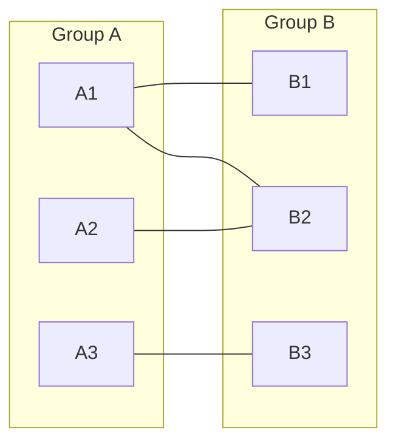
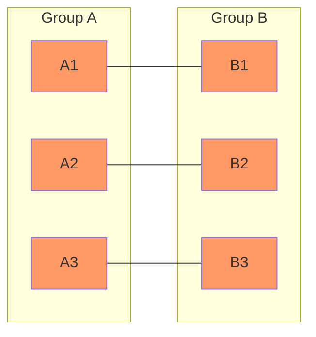
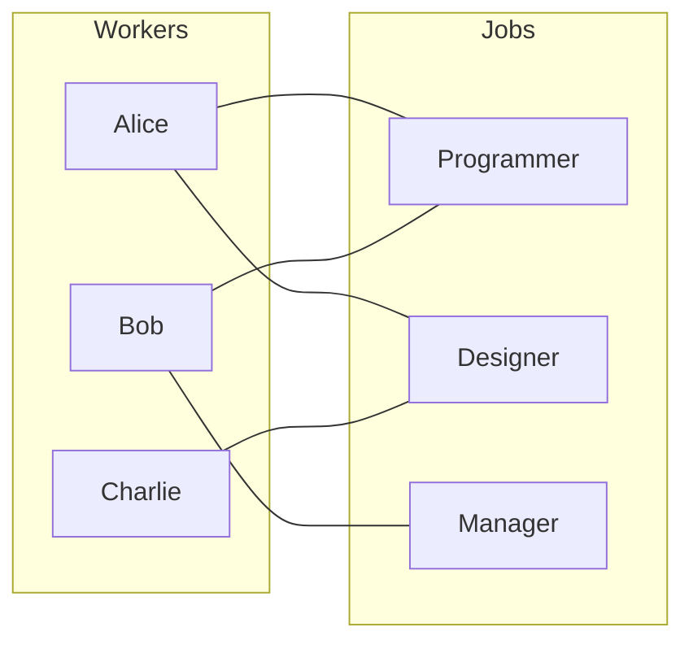

# Bipartite Matching

## Introduction

Bipartite matching is a fundamental concept in graph theory and algorithm design that focuses on finding maximum matchings in bipartite graphs. This technique has widespread applications in resource allocation, job assignment, and network flow problems.

At its core, bipartite matching answers a simple question: Given two separate groups (like job seekers and jobs), how can we optimally pair elements from one group with elements from the other?

In this tutorial, we'll explore:
- What bipartite graphs and matchings are
- Algorithms to find maximum bipartite matchings
- Real-world applications
- Step-by-step implementation

## Understanding Bipartite Graphs

A bipartite graph is a special type of graph where vertices can be divided into two distinct sets, with all edges connecting vertices from different sets. Think of it as two groups of nodes where connections only occur between groups, never within a group.



### Properties of Bipartite Graphs

1. Vertices can be divided into two disjoint sets (often called U and V)
2. Every edge connects a vertex in U to a vertex in V
3. No edges connect vertices within the same set
4. Bipartite graphs can be colored with just 2 colors (vertices of the same color never share an edge)

## What is Bipartite Matching?

A matching in a bipartite graph is a subset of edges where no two edges share a common vertex. In other words, each vertex can be matched with at most one vertex from the other group.



The highlighted edges form a matching between Group A and Group B.

### Types of Matchings

1. **Matching**: Any set of edges without common vertices
2. **Maximum Matching**: A matching with the largest possible number of edges
3. **Perfect Matching**: A matching where every vertex is matched (only possible when both partitions have the same number of vertices)

## Algorithms for Bipartite Matching

Let's explore the two most common algorithms for finding maximum bipartite matchings.

### 1. Ford-Fulkerson Algorithm

The Ford-Fulkerson algorithm approaches bipartite matching as a special case of the maximum flow problem. Here's how we adapt it for bipartite matching:

1. Create a source vertex (s) connected to all vertices in the left group
2. Create a sink vertex (t) with edges from all vertices in the right group
3. Set a capacity of 1 for all edges
4. Run the Ford-Fulkerson algorithm to find maximum flow
5. The edges with flow 1 between the original bipartite sets constitute the maximum matching

### 2. Augmenting Path Algorithm (Hungarian Algorithm)

This algorithm directly works with the bipartite graph and is often more efficient for this specific problem:

1. Start with an empty matching M
2. Find an augmenting path (a path that alternates between unmatched and matched edges, starting and ending with unmatched vertices)
3. Use this path to increase the size of the matching
4. Repeat until no more augmenting paths exist

Let's implement this approach using the efficient Hopcroft-Karp algorithm variation, which finds a maximal set of augmenting paths in each phase:

```python
def hopcroft_karp(graph, u, v):
    """
    Find maximum bipartite matching using Hopcroft-Karp algorithm.
    
    Args:
        graph: Adjacency list representation of bipartite graph
        u: Number of vertices in left set
        v: Number of vertices in right set
    
    Returns:
        Number of matches and the matching pairs
    """
    # Initialize NIL vertices and matches count
    NIL = 0
    matching = [0] * (v + 1)
    dist = [float('inf')] * (u + 1)
    
    # Return matching size
    def bfs():
        queue = []
        for i in range(1, u + 1):
            if match[i] == NIL:
                dist[i] = 0
                queue.append(i)
            else:
                dist[i] = float('inf')
                
        dist[NIL] = float('inf')
        
        while queue and dist[NIL] == float('inf'):
            current = queue.pop(0)
            
            if current != NIL:
                for v in graph[current]:
                    if dist[matching[v]] == float('inf'):
                        dist[matching[v]] = dist[current] + 1
                        queue.append(matching[v])
        
        return dist[NIL] != float('inf')
    
    def dfs(u_vertex):
        if u_vertex != NIL:
            for v_vertex in graph[u_vertex]:
                if dist[matching[v_vertex]] == dist[u_vertex] + 1:
                    if dfs(matching[v_vertex]):
                        matching[v_vertex] = u_vertex
                        match[u_vertex] = v_vertex
                        return True
            
            dist[u_vertex] = float('inf')
            return False
        
        return True
    
    # Initialize matching data structures
    match = [NIL] * (u + 1)
    match_count = 0
    
    # Main algorithm
    while bfs():
        for i in range(1, u + 1):
            if match[i] == NIL and dfs(i):
                match_count += 1
    
    # Return the matches
    result = []
    for i in range(1, v + 1):
        if matching[i] != NIL:
            result.append((matching[i], i))
    
    return match_count, result
```

Let's see how this works with an example:

```python
# Example usage
if __name__ == "__main__":
    # Example bipartite graph
    # Vertices are 1-indexed for simplicity
    # Left side vertices: 1, 2, 3, 4
    # Right side vertices: 1, 2, 3, 4
    graph = {
        1: [1, 2],
        2: [1, 3],
        3: [2, 4],
        4: [2, 3]
    }
    
    u = 4  # Number of vertices in left set
    v = 4  # Number of vertices in right set
    
    count, matching = hopcroft_karp(graph, u, v)
    
    print(f"Maximum matching: {count}")
    print("Matches:")
    for match in matching:
        print(f"Left {match[0]} -> Right {match[1]}")
```

Output:
```
Maximum matching: 4
Matches:
Left 1 -> Right 2
Left 2 -> Right 1
Left 3 -> Right 4
Left 4 -> Right 3
```

## Time Complexity Analysis

The Hopcroft-Karp algorithm achieves:
- Time complexity: O(E√V)
- Space complexity: O(V + E)

Where:
- E is the number of edges
- V is the number of vertices

This is much more efficient than the basic augmenting path approach which has O(VE) time complexity.

## Real-World Applications

Bipartite matching algorithms have numerous practical applications:

### 1. Job Assignment

Imagine you have a group of workers and a group of jobs. Each worker is qualified for certain jobs. Bipartite matching can help assign workers to jobs optimally to maximize the number of assignments.



### 2. College Admissions

Students apply to colleges, and each college has a limited number of seats. Bipartite matching can help determine optimal student-college assignments.

### 3. Network Resource Allocation

Allocating computing resources to tasks in a distributed system, where certain resources are only compatible with specific tasks.

### 4. Image Pattern Recognition

Matching features between different images for object recognition or motion tracking.

## Implementation Example: Job Assignment Problem

Let's solve a practical job assignment problem:

```python
def solve_job_assignment(candidates, jobs, qualifications):
    """
    Assign candidates to jobs based on their qualifications.
    
    Args:
        candidates: List of candidate names
        jobs: List of job titles
        qualifications: List of tuples (candidate_idx, job_idx) representing qualifications
        
    Returns:
        List of tuples representing assignments (candidate, job)
    """
    # Build the bipartite graph
    graph = {i+1: [] for i in range(len(candidates))}
    
    for candidate_idx, job_idx in qualifications:
        graph[candidate_idx + 1].append(job_idx + 1)
    
    # Find maximum bipartite matching
    count, matching = hopcroft_karp(graph, len(candidates), len(jobs))
    
    # Convert indices to names
    assignments = []
    for candidate_idx, job_idx in matching:
        assignments.append((candidates[candidate_idx - 1], jobs[job_idx - 1]))
    
    return assignments

# Example usage
candidates = ["Alice", "Bob", "Charlie", "David"]
jobs = ["Software Developer", "UI Designer", "Project Manager", "Data Analyst"]

# Qualifications (candidate_idx, job_idx)
qualifications = [
    (0, 0), (0, 3),  # Alice is qualified for Software Developer and Data Analyst
    (1, 0), (1, 2),  # Bob is qualified for Software Developer and Project Manager
    (2, 1), (2, 2),  # Charlie is qualified for UI Designer and Project Manager
    (3, 1), (3, 3)   # David is qualified for UI Designer and Data Analyst
]

assignments = solve_job_assignment(candidates, jobs, qualifications)

print("Optimal Job Assignments:")
for candidate, job in assignments:
    print(f"{candidate} -> {job}")
```

Output:
```
Optimal Job Assignments:
Alice -> Data Analyst
Bob -> Software Developer
Charlie -> Project Manager
David -> UI Designer
```

## Advanced Concepts in Bipartite Matching

### 1. Weighted Bipartite Matching

In many real scenarios, edges have weights representing costs or preferences. The Hungarian algorithm (also known as the Kuhn-Munkres algorithm) can find the maximum weight bipartite matching in O(V³) time.

### 2. Online Bipartite Matching

In online scenarios, vertices from one partition arrive one at a time, and decisions must be made immediately without knowing future arrivals.

### 3. b-Matching

A generalization where each vertex can be matched to multiple vertices up to a given capacity.

## Summary

Bipartite matching is a powerful algorithmic technique for solving assignment problems:

1. Bipartite graphs represent relationships between two distinct groups
2. Matching problems seek to pair elements from one group with another optimally
3. The Hopcroft-Karp algorithm efficiently finds maximum bipartite matchings
4. Real-world applications include job assignments, college admissions, and resource allocation

The algorithms we covered can be extended to handle more complex constraints like preferences, capacities, and weights.

## Exercises

1. Modify the Hopcroft-Karp implementation to handle weighted edges and find the maximum weight bipartite matching.
2. Implement a function to check if a graph is bipartite.
3. Solve the stable marriage problem using bipartite matching.
4. Extend the job assignment example to handle cases where each candidate can take on multiple jobs up to a certain limit.
5. Design an algorithm that finds all possible maximum matchings in a bipartite graph.

## Additional Resources

- Introduction to Algorithms (CLRS) - Chapter on Maximum Flow
- Graph Algorithms by Shimon Even - Chapter on Matching
- Network Flows: Theory, Algorithms, and Applications by Ahuja, Magnanti, and Orlin
- [Stanford CS Theory - Bipartite Matching Notes](https://theory.stanford.edu/~tim/w16/l/l7.pdf)
- [Competitive Programming Handbook - Graph Algorithms](https://cses.fi/book/book.pdf)

Understanding bipartite matching unlocks solutions to many practical problems and serves as a foundation for more advanced algorithmic techniques. By mastering this concept, you'll have a powerful tool in your algorithmic toolbox!