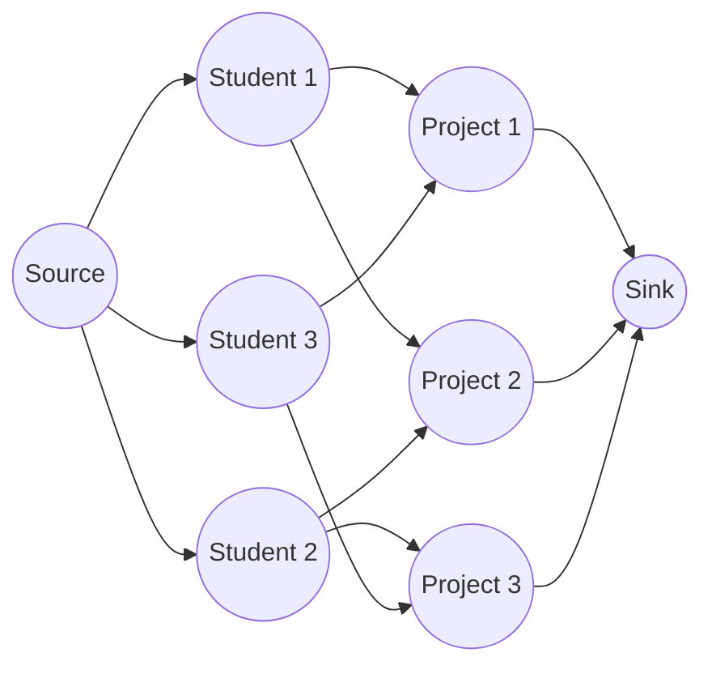
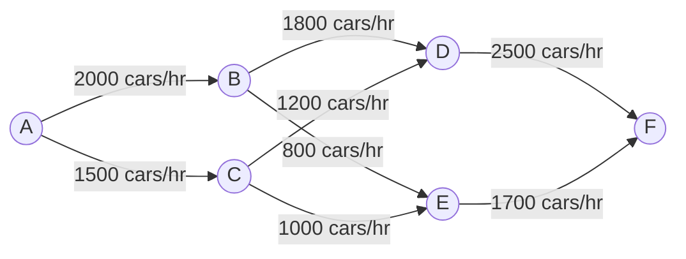

# Network Flow Applications

Network flow algorithms are powerful tools that can solve a wide range of problems beyond their obvious applications. After learning the basics of max-flow and min-cut algorithms, you might wonder where these techniques are actually used in the real world. In this tutorial, we'll explore various practical applications of network flow algorithms.

## Introduction to Network Flow Applications

Network flow algorithms model problems where resources flow through a network from a source to a sink. While originally developed for transportation and logistics problems, these algorithms have found applications in diverse fields:

- Transportation and logistics planning
- Resource allocation and scheduling
- Bipartite matching problems
- Image segmentation
- Network reliability analysis

The versatility of network flow comes from its ability to model constraints and optimize resource distribution across a system.

## Prerequisites

Before diving into applications, you should understand:
- Basic graph theory concepts
- The max-flow min-cut theorem
- Ford-Fulkerson or Edmonds-Karp algorithms

## Common Network Flow Applications

### 1. Bipartite Matching

Bipartite matching is one of the most common applications of network flow algorithms. It involves finding maximum matchings between two distinct groups.

#### Problem Setting

Consider a scenario with a group of students and a group of projects. Each student is interested in certain projects, and we want to assign each student to exactly one project they are interested in.

#### Solution Using Network Flow

We can model this as a flow network:
1. Create a source node
2. Connect the source to all student nodes (capacity = 1)
3. Connect student nodes to project nodes they're interested in (capacity = 1)
4. Connect all project nodes to a sink node (capacity = 1)
5. Find the maximum flow



#### Code Example

```python
def bipartite_matching(students, projects, preferences):
    # Create a residual graph
    graph = {}
    
    # Add source and sink
    source = "source"
    sink = "sink"
    graph[source] = {}
    graph[sink] = {}
    
    # Connect source to all students
    for student in students:
        graph[source][student] = 1
        graph[student] = {}
    
    # Connect students to their preferred projects
    for student, prefs in preferences.items():
        for project in prefs:
            graph[student][project] = 1
            
            # Ensure project node exists
            if project not in graph:
                graph[project] = {}
    
    # Connect all projects to sink
    for project in projects:
        graph[project][sink] = 1
    
    # Find maximum flow using Ford-Fulkerson
    return ford_fulkerson(graph, source, sink)

# Simple Ford-Fulkerson implementation
def ford_fulkerson(graph, source, sink):
    # Initialize flow to 0
    max_flow = 0
    
    # Find an augmenting path
    path = find_path(graph, source, sink, [])
    
    # While there is an augmenting path
    while path:
        # Find minimum residual capacity along the path
        flow = min(graph[u][v] for u, v in path)
        
        # Update residual capacities
        for u, v in path:
            if v not in graph.get(u, {}):
                graph[u][v] = 0
            if u not in graph.get(v, {}):
                graph[v][u] = 0
                
            graph[u][v] -= flow
            graph[v][u] += flow
            
            # Remove edges with no capacity
            if graph[u][v] == 0:
                del graph[u][v]
        
        max_flow += flow
        path = find_path(graph, source, sink, [])
        
    return max_flow, graph

def find_path(graph, start, end, path):
    # DFS to find a path from start to end
    if start == end:
        return path
        
    for neighbor in graph.get(start, {}):
        if graph[start][neighbor] > 0 and (start, neighbor) not in path:
            result = find_path(graph, neighbor, end, path + [(start, neighbor)])
            if result:
                return result
                
    return None

# Example usage
students = ["s1", "s2", "s3"]
projects = ["p1", "p2", "p3"]
preferences = {
    "s1": ["p1", "p2"],
    "s2": ["p2", "p3"],
    "s3": ["p1", "p3"]
}

max_matches, residual_graph = bipartite_matching(students, projects, preferences)
print(f"Maximum number of matches: {max_matches}")
```

**Output:**
```
Maximum number of matches: 3
```

### 2. Maximum Edge-Disjoint Paths

Finding the maximum number of edge-disjoint paths between two nodes is useful in network reliability and routing problems.

#### Problem Setting

Given a network, we want to find the maximum number of paths between source and sink that don't share any edges.

#### Solution Using Network Flow

We can model this by setting the capacity of each edge to 1 and finding the maximum flow from source to sink.

```python
def max_edge_disjoint_paths(graph, source, sink):
    # Create a copy of the graph with all capacities set to 1
    flow_graph = {u: {v: 1 for v in neighbors} for u, neighbors in graph.items()}
    
    # Find maximum flow
    max_flow, residual = ford_fulkerson(flow_graph, source, sink)
    
    # The maximum flow equals the number of edge-disjoint paths
    return max_flow

# Example usage
network = {
    "A": ["B", "C"],
    "B": ["D"],
    "C": ["D"],
    "D": []
}

# Convert adjacency list to graph compatible with ford_fulkerson
graph = {}
for u, neighbors in network.items():
    graph[u] = {v: 1 for v in neighbors}

disjoint_paths = max_edge_disjoint_paths(graph, "A", "D")
print(f"Maximum number of edge-disjoint paths: {disjoint_paths}")
```

**Output:**
```
Maximum number of edge-disjoint paths: 2
```

### 3. Image Segmentation Using Min-Cut

The min-cut algorithm can be used for image segmentation, separating foreground from background.

#### Problem Setting

Given an image, we want to separate objects of interest (foreground) from the background.

#### Solution Using Network Flow

We can model this by:
1. Creating a node for each pixel
2. Connecting adjacent pixels with capacities based on color similarity
3. Adding a source node connected to known foreground pixels
4. Adding a sink node connected to known background pixels
5. Computing the min-cut

```python
def image_segmentation(image, foreground_seeds, background_seeds):
    height, width = len(image), len(image[0])
    graph = {}
    source = "source"
    sink = "sink"
    
    # Create nodes for each pixel
    for i in range(height):
        for j in range(width):
            pixel = f"{i},{j}"
            graph[pixel] = {}
            
            # Connect to adjacent pixels
            for ni, nj in [(i+1, j), (i-1, j), (i, j+1), (i, j-1)]:
                if 0 <= ni < height and 0 <= nj < width:
                    neighbor = f"{ni},{nj}"
                    # Calculate capacity based on color similarity (simplified)
                    similarity = 255 - abs(image[i][j] - image[ni][nj])
                    graph[pixel][neighbor] = similarity
    
    # Connect source to foreground seeds
    graph[source] = {}
    for i, j in foreground_seeds:
        graph[source][f"{i},{j}"] = float('inf')
    
    # Connect background seeds to sink
    graph[sink] = {}
    for i, j in background_seeds:
        pixel = f"{i},{j}"
        if pixel not in graph:
            graph[pixel] = {}
        graph[pixel][sink] = float('inf')
    
    # Find the min-cut (using max-flow)
    _, residual = ford_fulkerson(graph, source, sink)
    
    # Determine segmentation: BFS from source in residual graph
    segmentation = [[0 for _ in range(width)] for _ in range(height)]
    
    # BFS to find nodes reachable from source in the residual graph
    visited = set()
    queue = [source]
    visited.add(source)
    
    while queue:
        node = queue.pop(0)
        for neighbor in residual.get(node, {}):
            if neighbor not in visited and residual[node][neighbor] > 0:
                visited.add(neighbor)
                queue.append(neighbor)
    
    # Pixels reachable from source are foreground
    for i in range(height):
        for j in range(width):
            pixel = f"{i},{j}"
            segmentation[i][j] = 1 if pixel in visited else 0
    
    return segmentation

# Example usage (simplified grayscale image)
image = [
    [100, 120, 130, 140],
    [110, 125, 135, 145],
    [150, 160, 180, 190],
    [155, 165, 185, 195]
]
foreground_seeds = [(0, 0), (0, 1)]
background_seeds = [(3, 2), (3, 3)]

result = image_segmentation(image, foreground_seeds, background_seeds)
print("Segmentation result:")
for row in result:
    print(row)
```

### 4. Baseball Elimination

Network flow can determine if a team has been eliminated from playoff contention.

#### Problem Setting

Given current standings and remaining games, determine if a team still has a chance to win.

#### Solution Using Network Flow

We can create a flow network where:
1. Source connects to nodes representing remaining games between other teams
2. Game nodes connect to team nodes
3. Team nodes connect to sink with capacity = max wins possible for our target team minus current wins

If maximum flow equals the sum of remaining games, the team still has a chance.

```python
def baseball_elimination(wins, remaining_games, team_to_check):
    n = len(wins)
    teams = list(range(n))
    
    # Maximum wins the target team can get
    max_possible_wins = wins[team_to_check] + remaining_games[team_to_check]
    
    # Total games remaining between other teams
    total_remaining = 0
    
    # Create the flow network
    graph = {}
    source = "source"
    sink = "sink"
    graph[source] = {}
    graph[sink] = {}
    
    # Add game nodes for games between other teams
    game_nodes = []
    for i in range(n):
        if i == team_to_check:
            continue
        for j in range(i+1, n):
            if j == team_to_check:
                continue
            if remaining_games[i][j] > 0:
                game_node = f"game_{i}_{j}"
                game_nodes.append((game_node, i, j, remaining_games[i][j]))
                graph[game_node] = {}
                graph[source][game_node] = remaining_games[i][j]
                total_remaining += remaining_games[i][j]
    
    # Add team nodes with capacities
    for i in range(n):
        if i == team_to_check:
            continue
        team_node = f"team_{i}"
        graph[team_node] = {sink: max(0, max_possible_wins - wins[i])}
        
        # Connect game nodes to team nodes
        for game_node, team1, team2, _ in game_nodes:
            if team1 == i or team2 == i:
                if game_node not in graph:
                    graph[game_node] = {}
                graph[game_node][team_node] = float('inf')
    
    # Find maximum flow
    max_flow, _ = ford_fulkerson(graph, source, sink)
    
    # If max flow equals total remaining games, team is not eliminated
    return max_flow == total_remaining

# Example usage
wins = [83, 80, 78, 77]
remaining_games = [
    [0, 1, 1, 1],
    [1, 0, 2, 1],
    [1, 2, 0, 0],
    [1, 1, 0, 0]
]

team_to_check = 3
if baseball_elimination(wins, remaining_games, team_to_check):
    print(f"Team {team_to_check} still has a chance!")
else:
    print(f"Team {team_to_check} has been eliminated.")
```

### 5. Maximum Flow in a Network with Multiple Sources and Sinks

Network flow algorithms can be extended to handle multiple sources and sinks.

#### Problem Setting

We have a network with multiple sources and multiple sinks, and we want to find the maximum flow through the network.

#### Solution Using Network Flow

We can transform this into a standard max-flow problem by:
1. Adding a super source connected to all original sources
2. Adding a super sink that all original sinks connect to
3. Running a standard max-flow algorithm

```python
def multi_source_sink_max_flow(graph, sources, sinks):
    # Create a new graph with super source and super sink
    new_graph = {node: neighbors.copy() for node, neighbors in graph.items()}
    
    super_source = "super_source"
    super_sink = "super_sink"
    new_graph[super_source] = {}
    new_graph[super_sink] = {}
    
    # Connect super source to all sources
    for source in sources:
        new_graph[super_source][source] = float('inf')
        if source not in new_graph:
            new_graph[source] = {}
    
    # Connect all sinks to super sink
    for sink in sinks:
        if sink not in new_graph:
            new_graph[sink] = {}
        new_graph[sink][super_sink] = float('inf')
    
    # Find maximum flow
    max_flow, _ = ford_fulkerson(new_graph, super_source, super_sink)
    return max_flow

# Example usage
graph = {
    "A": {"D": 3, "B": 2},
    "B": {"C": 5},
    "C": {"E": 2},
    "D": {"E": 4},
    "E": {}
}

sources = ["A", "B"]
sinks = ["C", "E"]

max_flow = multi_source_sink_max_flow(graph, sources, sinks)
print(f"Maximum flow with multiple sources and sinks: {max_flow}")
```

## Real-World Applications

### Traffic Flow Optimization

Network flow algorithms help optimize traffic flow in cities by modeling roads as edges with capacity equal to the maximum number of vehicles that can pass per unit time.



By calculating the maximum flow between different neighborhoods, traffic engineers can identify bottlenecks and plan infrastructure improvements.

### Supply Chain Management

Companies use network flow to optimize their supply chains:

1. Sources represent factories or suppliers
2. Intermediate nodes represent warehouses or distribution centers
3. Sinks represent stores or customers
4. Edge capacities represent transportation capacities
5. Edge costs represent transportation costs

By applying min-cost flow algorithms, companies can minimize transportation costs while meeting demand.

### Project Staffing

Network flow helps assign employees to projects optimally:

1. Source connects to employee nodes with capacity 1
2. Employee nodes connect to project nodes if the employee has the required skills
3. Project nodes connect to sink with capacity representing the number of employees needed per project

The maximum flow solution provides an optimal assignment that maximizes the number of filled positions.

## Challenges and Limitations

While network flow algorithms are powerful, they have limitations:

1. **Scale**: For very large networks, standard implementations may be too slow
2. **Dynamic Changes**: Efficiently handling changing capacities and network structure can be challenging
3. **Multiple Objectives**: Basic network flow optimizes a single objective (maximum flow or minimum cost)
4. **Uncertainty**: Standard algorithms don't handle probabilistic capacities well

Many of these challenges are addressed by specialized variations of network flow algorithms or by combining them with other techniques.

## Summary

Network flow algorithms are versatile tools with applications far beyond their original purpose:

- **Bipartite Matching**: Assign students to projects, workers to jobs, etc.
- **Edge-Disjoint Paths**: Find multiple independent routes for reliability
- **Image Segmentation**: Separate foreground from background in images
- **Baseball Elimination**: Determine if a team still has a chance to win
- **Multi-Source/Sink Problems**: Handle complex network structures

By modeling problems as flow networks and applying algorithms like Ford-Fulkerson or Edmonds-Karp, we can solve a wide range of optimization challenges efficiently.

## Exercises

1. Model a hospital assignment problem where patients need to be assigned to hospitals with limited capacity and varying distances.
2. Implement a solution for the project scheduling problem, where tasks have dependencies and resource constraints.
3. Use network flow to solve the maximum density subgraph problem.
4. Apply min-cut to segment a simple image (you can use a small grayscale matrix to represent the image).
5. Extend the baseball elimination example to include tie-breaking rules.

## Additional Resources

- "Algorithm Design" by Kleinberg and Tardos - Contains excellent examples of network flow applications
- "Introduction to Algorithms" by Cormen, Leiserson, Rivest, and Stein - Covers network flow algorithms in depth
- Stanford's CS261 course materials on Network Flow Applications

Network flow problems demonstrate how abstract algorithmic concepts can solve diverse real-world problems. As you practice applying these techniques, you'll develop an intuition for recognizing problems that can benefit from a network flow approach.