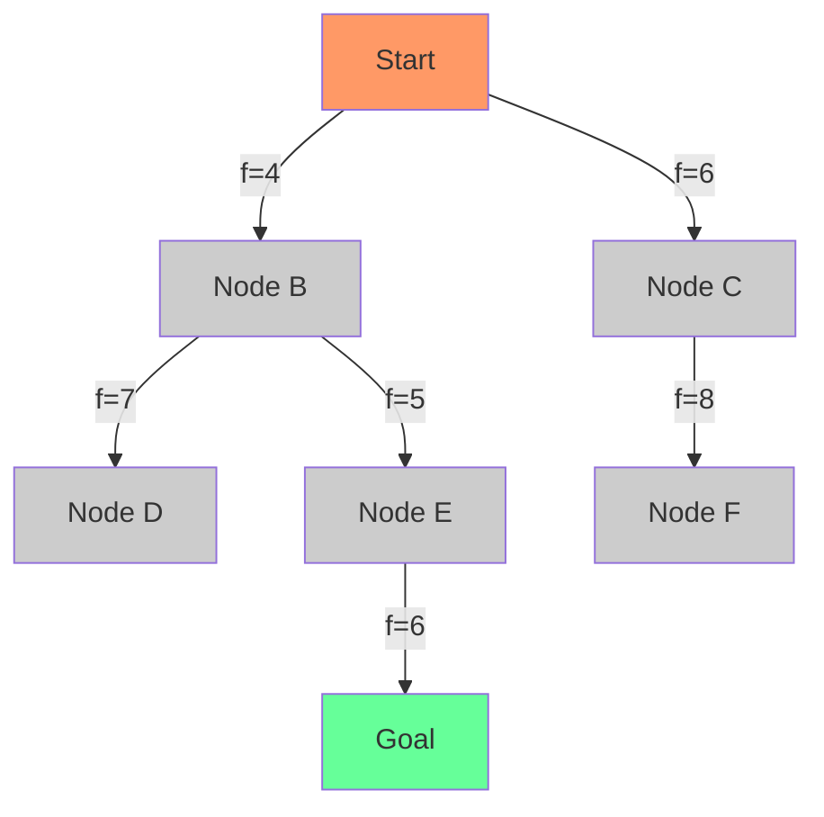

# A* Algorithm

## Introduction

The A* (pronounced "A-star") algorithm is one of the most popular and efficient pathfinding algorithms used in computer science. Developed as an extension of Edsger Dijkstra's algorithm, A* was published by Peter Hart, Nils Nilsson, and Bertram Raphael in 1968. What makes A* special is its use of heuristics to guide its search, allowing it to find the shortest path more efficiently than algorithms like Dijkstra's by exploring fewer nodes.

A* finds applications in various domains:
- Game development (character movement and navigation)
- Robotics (path planning for robots)
- Geographic Information Systems (route planning)
- Artificial intelligence (solving puzzles and optimization problems)

By the end of this tutorial, you'll understand how A* works, how to implement it, and how to apply it to real-world problems.

## How A* Works

The A* algorithm combines the strengths of two approaches:
1. **Breadth-First Search**: Which is complete and optimal
2. **Greedy Best-First Search**: Which uses heuristics to search toward the goal faster

A* uses a function `f(n)` to determine the order in which nodes are explored:

```
f(n) = g(n) + h(n)
```

Where:
- `g(n)` is the cost from the start node to the current node (known)
- `h(n)` is the estimated cost from the current node to the goal (heuristic)
- `f(n)` is the estimated total cost of the path through node n

### The A* Process

1. Maintain two sets of nodes:
   - **Open Set**: Nodes discovered but not yet evaluated
   - **Closed Set**: Nodes already evaluated

2. Start with the initial node in the open set

3. While the open set is not empty:
   - Select the node with the lowest f(n) value from the open set
   - Move it to the closed set
   - If this node is the goal, reconstruct the path and return it
   - Otherwise, examine all neighboring nodes:
     - If a neighbor is in the closed set, skip it
     - Calculate the tentative g score for the neighbor
     - If the neighbor is not in the open set or the new path is better, update the neighbor's scores and set its parent to the current node

4. If the open set becomes empty without finding the goal, there is no path

## Choosing a Heuristic

The heuristic function `h(n)` is crucial for A*'s performance. It must:
- **Never overestimate** the actual cost to the goal (for optimal solutions)
- **Be admissible**, meaning it's always less than or equal to the actual cost
- **Be consistent** (or monotonic), meaning the estimated cost from one node to another plus the cost between them is less than or equal to the estimated cost directly from the first node to the goal

Common heuristics include:

1. **Manhattan Distance**: Used for grid-based maps where movement is restricted to 4 directions (up, down, left, right)
   ```
   h(n) = |n.x - goal.x| + |n.y - goal.y|
   ```

2. **Euclidean Distance**: Used when movement can be in any direction
   ```
   h(n) = sqrt((n.x - goal.x)² + (n.y - goal.y)²)
   ```

3. **Diagonal Distance**: Used for grid-based maps with 8 directions of movement
   ```
   h(n) = max(|n.x - goal.x|, |n.y - goal.y|)
   ```

## Implementation in JavaScript

Let's implement A* for a grid-based map where each cell is either walkable or blocked:

```javascript
class PriorityQueue {
  constructor() {
    this.elements = [];
  }
  
  empty() {
    return this.elements.length === 0;
  }
  
  put(item, priority) {
    this.elements.push({item, priority});
    this.elements.sort((a, b) => a.priority - b.priority);
  }
  
  get() {
    return this.elements.shift().item;
  }
}

function aStar(grid, start, goal) {
  // Initialize open set with start node
  const openSet = new PriorityQueue();
  openSet.put(start, 0);
  
  // For node n, cameFrom[n] is the node immediately preceding it on the cheapest path from start
  const cameFrom = new Map();
  
  // For node n, gScore[n] is the cost of the cheapest path from start to n currently known
  const gScore = new Map();
  gScore.set(start.toString(), 0);
  
  // For node n, fScore[n] := gScore[n] + h(n)
  const fScore = new Map();
  fScore.set(start.toString(), heuristic(start, goal));
  
  // Function to get neighbors of a node
  function getNeighbors(node) {
    const [x, y] = node;
    const neighbors = [];
    
    const directions = [
      [0, 1], [1, 0], [0, -1], [-1, 0] // 4-directional movement
      // Add [1, 1], [1, -1], [-1, 1], [-1, -1] for 8-directional movement
    ];
    
    for (const [dx, dy] of directions) {
      const nx = x + dx;
      const ny = y + dy;
      
      // Check if neighbor is within grid bounds and walkable
      if (nx >= 0 && nx < grid.length && 
          ny >= 0 && ny < grid[0].length && 
          grid[nx][ny] === 0) { // 0 means walkable
        neighbors.push([nx, ny]);
      }
    }
    
    return neighbors;
  }
  
  // Function to calculate heuristic (Manhattan distance)
  function heuristic(a, b) {
    return Math.abs(a[0] - b[0]) + Math.abs(a[1] - b[1]);
  }
  
  // Function to reconstruct path
  function reconstructPath(cameFrom, current) {
    const totalPath = [current];
    while (cameFrom.has(current.toString())) {
      current = cameFrom.get(current.toString());
      totalPath.unshift(current);
    }
    return totalPath;
  }
  
  while (!openSet.empty()) {
    // Current is the node in openSet with the lowest fScore
    const current = openSet.get();
    const currentStr = current.toString();
    
    // If current is goal, we're done
    if (current[0] === goal[0] && current[1] === goal[1]) {
      return reconstructPath(cameFrom, current);
    }
    
    // Explore neighbors
    for (const neighbor of getNeighbors(current)) {
      const neighborStr = neighbor.toString();
      
      // Tentative gScore is distance from start to the neighbor through current
      const tentativeGScore = gScore.get(currentStr) + 1; // Assuming uniform cost of 1
      
      // If this path to neighbor is better than any previous one, record it
      if (!gScore.has(neighborStr) || tentativeGScore < gScore.get(neighborStr)) {
        cameFrom.set(neighborStr, current);
        gScore.set(neighborStr, tentativeGScore);
        const f = tentativeGScore + heuristic(neighbor, goal);
        fScore.set(neighborStr, f);
        
        // Add neighbor to openSet if not already there
        openSet.put(neighbor, f);
      }
    }
  }
  
  // If we get here, there's no path
  return null;
}
```

## Example Usage

Let's solve a simple maze using our A* implementation:

```javascript
// 0 = walkable, 1 = obstacle
const grid = [
  [0, 0, 0, 0, 0],
  [0, 1, 1, 1, 0],
  [0, 0, 0, 1, 0],
  [1, 1, 0, 1, 0],
  [0, 0, 0, 0, 0]
];

const start = [0, 0];
const goal = [4, 4];

const path = aStar(grid, start, goal);

if (path) {
  console.log("Path found:", path);
  
  // Visualize the path in the grid
  const visual = grid.map(row => [...row]);
  for (const [x, y] of path) {
    visual[x][y] = 2;  // Mark path with 2
  }
  
  // Convert to a more readable format
  console.log("Maze with path:");
  console.log(visual.map(row => 
    row.map(cell => cell === 0 ? '.' : cell === 1 ? '#' : 'P').join(' ')
  ).join('\n'));
} else {
  console.log("No path found.");
}
```

Output:
```
Path found: [[0,0], [0,1], [0,2], [0,3], [0,4], [1,4], [2,4], [3,4], [4,4]]

Maze with path:
P P P P P
. # # # P
. . . # P
# # . # P
. . . . P
```

## Visualizing A* Search

Let's visualize the A* search process using a Mermaid diagram:



## Real-World Applications

### 1. GPS Navigation Systems

Navigation apps like Google Maps use variations of A* to find the shortest or fastest routes between locations. They consider:
- Road distances (for g(n))
- Straight-line distances to destination (for h(n))
- Traffic conditions
- Road types (highways vs. local roads)

### 2. Game AI Pathfinding

In games like strategy games or RPGs, AI characters need to navigate complex terrain:

```javascript
function gameCharacterMovement(gameMap, character, destination) {
  // Get current character position
  const start = [character.x, character.y];
  const goal = [destination.x, destination.y];
  
  // Calculate path using A*
  const path = aStar(gameMap, start, goal);
  
  if (path) {
    // Follow the path
    character.followPath(path);
  } else {
    console.log("Character cannot reach destination");
  }
}
```

### 3. Robotics

Robots use A* for navigating physical spaces:

```javascript
function robotNavigation(environmentMap, robotPosition, targetPosition) {
  // Add safety buffer around obstacles
  const safeMap = addSafetyBuffer(environmentMap, robotRadius);
  
  // Find path using A*
  const path = aStar(safeMap, robotPosition, targetPosition);
  
  // Execute path with motion controllers
  return path;
}
```

### 4. Puzzle Solving

A* can solve puzzles like the 8-puzzle or 15-puzzle:

```javascript
function solvePuzzle(initialState, goalState) {
  // Define heuristic as number of misplaced tiles
  function heuristic(state) {
    let count = 0;
    for (let i = 0; i < state.length; i++) {
      if (state[i] !== goalState[i] && state[i] !== 0) {
        count++;
      }
    }
    return count;
  }
  
  // Use A* to find sequence of moves
  // (Implementation would be adapted for the puzzle state space)
}
```

## Optimizations

1. **Bidirectional Search**: Run two simultaneous searches (from start to goal and from goal to start)
2. **Jump Point Search**: An optimization for grid-based maps that skips many nodes
3. **Hierarchical Pathfinding**: Break the map into regions and find paths between them
4. **Memory-efficient implementations**: Use binary heaps for the open set, and more compact data structures

## Common Pitfalls

1. **Poor heuristic design**: A bad heuristic can make A* perform worse than Dijkstra's algorithm
2. **Memory limitations**: For large search spaces, A* can consume excessive memory
3. **Not adapting to the domain**: Using the wrong distance metric for your problem
4. **Ignoring tie-breaking**: When multiple paths have the same f-value, choosing poorly affects performance

## Summary

The A* algorithm is a powerful and flexible pathfinding algorithm that combines the completeness and optimality of Dijkstra's algorithm with the speed of best-first search algorithms. It uses a heuristic function to guide its search toward the goal, making it more efficient than algorithms that don't use domain knowledge.

Key points to remember:
- A* uses the formula f(n) = g(n) + h(n) to determine which nodes to explore
- The heuristic h(n) must be admissible to guarantee optimal solutions
- A* maintains open and closed sets to track unexplored and explored nodes
- The algorithm is widely applicable to pathfinding, route planning, and puzzle solving
- Different heuristics can be used depending on the problem domain

With a solid understanding of A*, you now have a powerful tool for solving a wide range of problems efficiently!

## Additional Resources and Exercises

### Resources

- "Introduction to Algorithms" by Cormen, Leiserson, Rivest, and Stein
- "Artificial Intelligence: A Modern Approach" by Russell and Norvig
- [Red Blob Games' Interactive A* Tutorial](http://www.redblobgames.com/pathfinding/a-star/)

### Exercises

1. **Modify the A* Implementation**: Add diagonal movement to the grid-based implementation.
2. **Create a Weighted A* Algorithm**: Modify the algorithm to handle different costs for different types of terrain.
3. **Implement a Different Heuristic**: Try using Euclidean distance instead of Manhattan distance and compare performance.
4. **Solve the 8-Puzzle**: Implement A* to solve the classic 8-puzzle (sliding puzzle).
5. **Memory Optimization**: Implement A* using a binary heap for the priority queue.

```javascript
// Exercise starter code:
function weightedAStar(grid, start, goal, terrainCosts) {
  // TODO: Implement A* with different costs for different terrain types
  // terrainCosts is a map of terrain type to movement cost
}

// Try implementing this function as an exercise!
```

Happy pathfinding!