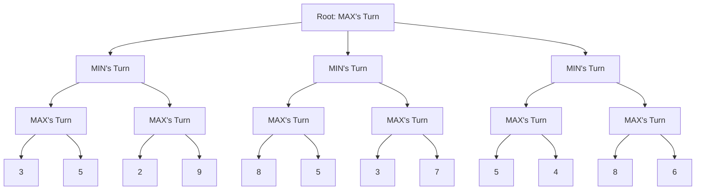
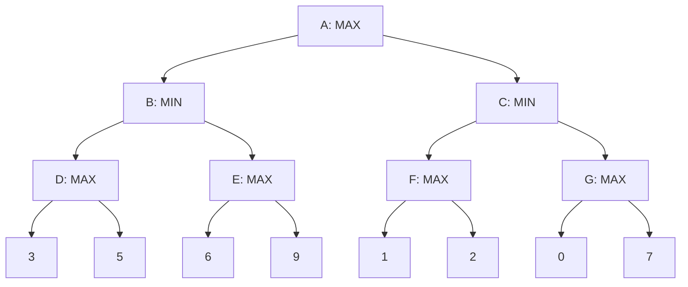

# Alpha Beta Pruning

## Introduction

Alpha Beta Pruning is an optimization technique for the Minimax algorithm, commonly used in two-player, zero-sum games like Chess, Tic-Tac-Toe, and Connect Four. While Minimax explores all possible moves to determine the best one, Alpha Beta Pruning intelligently eliminates (or "prunes") branches that won't influence the final decision, significantly reducing the search space and computational time.

This technique gets its name from the two parameters it uses:
- **Alpha**: The best (maximum) value found so far for the maximizing player
- **Beta**: The best (minimum) value found so far for the minimizing player

By comparing these values during tree traversal, we can avoid exploring branches that won't yield better results than what we've already found.

## Prerequisites

Before diving into Alpha Beta Pruning, you should be familiar with:
- Basic tree data structures
- Recursion concepts
- The Minimax algorithm

## Understanding Minimax Algorithm

The Minimax algorithm is the foundation for Alpha Beta Pruning. In a two-player game, it assumes:
1. One player tries to maximize their score (MAX player)
2. The other tries to minimize the opponent's score (MIN player)

The algorithm creates a game tree of all possible moves and recursively evaluates each position, assuming both players play optimally.



The problem with pure Minimax is that it evaluates every leaf node, which becomes computationally expensive as the game tree depth increases.

## Alpha Beta Pruning: The Optimization

Alpha Beta Pruning enhances Minimax by determining when branches can be ignored without affecting the final decision. The key insight is that once we know a move is worse than a previously examined move, we can stop evaluating it further.

### How It Works

1. We maintain two values, alpha and beta:
   - Alpha: Best already explored option for MAX player (initially -∞)
   - Beta: Best already explored option for MIN player (initially +∞)

2. At each node:
   - MAX player tries to increase alpha
   - MIN player tries to decrease beta

3. If alpha ≥ beta at any point, we can prune (stop exploring) the remaining branches from that node.

This condition is called a "cutoff" and is the core optimization of Alpha Beta Pruning.

## Algorithm Implementation

Here's a Python implementation of the Alpha Beta Pruning algorithm:

```python
def alpha_beta_pruning(node, depth, alpha, beta, is_maximizing_player):
    # Base case: leaf node or maximum depth reached
    if depth == 0 or node.is_terminal():
        return node.evaluate()
    
    # Maximizing player's turn
    if is_maximizing_player:
        max_eval = float('-inf')
        for child in node.get_children():
            eval = alpha_beta_pruning(child, depth - 1, alpha, beta, False)
            max_eval = max(max_eval, eval)
            alpha = max(alpha, eval)
            if beta <= alpha:
                break  # Beta cutoff
        return max_eval
    
    # Minimizing player's turn
    else:
        min_eval = float('inf')
        for child in node.get_children():
            eval = alpha_beta_pruning(child, depth - 1, alpha, beta, True)
            min_eval = min(min_eval, eval)
            beta = min(beta, eval)
            if beta <= alpha:
                break  # Alpha cutoff
        return min_eval

# Usage:
# best_move = alpha_beta_pruning(root_node, depth=5, alpha=float('-inf'), beta=float('inf'), is_maximizing_player=True)
```

## Step-by-Step Example

Let's walk through a simplified example using a small game tree:



Step-by-step evaluation with Alpha Beta Pruning:

1. Start at node A with α=-∞, β=∞
2. Explore node B (MIN node):
   - Explore node D (MAX node):
     - Node H returns 3; update α=3
     - Node I returns 5; update α=5
     - D returns 5
   - Explore node E (MAX node):
     - Node J returns 6; update α=6
     - Node K returns 9; update α=9
     - E returns 9
   - B returns min(5,9) = 5; update β=5
3. Explore node C (MIN node):
   - Explore node F (MAX node):
     - Node L returns 1; update α=1
     - We've established that F will return at least 1
     - But B already returned 5, so A will choose B over C
     - Since α=1 < β=5, we continue
     - Node M returns 2; update α=2
     - F returns 2
   - Explore node G (MAX node):
     - Node N returns 0
     - Since even this value (0) is less than what node B offers (5),
       we can prune the rest of G's children (including node O)
     - G returns 0
   - C returns min(2,0) = 0
4. A returns max(5,0) = 5

**Pruning occurred**: We didn't need to evaluate node O because node G would return at most 0, which is worse than the 5 we already found from node B.

## Efficiency Gains

The efficiency of Alpha Beta Pruning depends on the order in which nodes are evaluated:

- **Best case**: When the best moves are examined first, approximately √b^d nodes are evaluated (where b is the branching factor and d is the depth)
- **Worst case**: When the worst moves are examined first, all nodes are evaluated (same as regular Minimax)
- **Average case**: Approximately b^(3d/4) nodes are evaluated

This means that with good move ordering, Alpha Beta Pruning can effectively double the search depth compared to Minimax in the same amount of time.

## Real-World Applications

Alpha Beta Pruning is widely used in:

1. **Chess Engines**: Programs like Stockfish use advanced versions of Alpha Beta Pruning to evaluate positions and determine the best moves.

2. **Game AI**: Commercial video games use this technique to create challenging computer opponents in games like checkers, Connect Four, and even more complex strategy games.

3. **Decision-Making Systems**: Beyond games, the algorithm is used in systems that need to evaluate multiple decision paths with opposing objectives.

## Implementation Example: Tic-Tac-Toe

Here's a practical implementation of Alpha Beta Pruning for a Tic-Tac-Toe game:

```python
class TicTacToe:
    def __init__(self):
        # Initialize empty 3x3 board
        self.board = [[' ' for _ in range(3)] for _ in range(3)]
        self.current_player = 'X'  # X starts
    
    def print_board(self):
        for row in self.board:
            print('|'.join(row))
            print('-' * 5)
    
    def available_moves(self):
        moves = []
        for i in range(3):
            for j in range(3):
                if self.board[i][j] == ' ':
                    moves.append((i, j))
        return moves
    
    def make_move(self, move, player):
        i, j = move
        if self.board[i][j] == ' ':
            self.board[i][j] = player
            return True
        return False
    
    def undo_move(self, move):
        i, j = move
        self.board[i][j] = ' '
    
    def is_winner(self, player):
        # Check rows
        for i in range(3):
            if all(self.board[i][j] == player for j in range(3)):
                return True
        
        # Check columns
        for j in range(3):
            if all(self.board[i][j] == player for i in range(3)):
                return True
        
        # Check diagonals
        if all(self.board[i][i] == player for i in range(3)) or \
           all(self.board[i][2-i] == player for i in range(3)):
            return True
        
        return False
    
    def is_board_full(self):
        return all(self.board[i][j] != ' ' for i in range(3) for j in range(3))
    
    def game_over(self):
        return self.is_winner('X') or self.is_winner('O') or self.is_board_full()
    
    def evaluate(self):
        if self.is_winner('X'):
            return 10
        if self.is_winner('O'):
            return -10
        return 0
    
    def alpha_beta(self, depth, alpha, beta, is_maximizing):
        if self.is_winner('X'):
            return 10
        if self.is_winner('O'):
            return -10
        if self.is_board_full():
            return 0
        
        if is_maximizing:
            max_eval = float('-inf')
            for move in self.available_moves():
                self.make_move(move, 'X')
                eval = self.alpha_beta(depth + 1, alpha, beta, False)
                self.undo_move(move)
                max_eval = max(max_eval, eval)
                alpha = max(alpha, eval)
                if beta <= alpha:
                    break  # Beta cutoff
            return max_eval
        else:
            min_eval = float('inf')
            for move in self.available_moves():
                self.make_move(move, 'O')
                eval = self.alpha_beta(depth + 1, alpha, beta, True)
                self.undo_move(move)
                min_eval = min(min_eval, eval)
                beta = min(beta, eval)
                if beta <= alpha:
                    break  # Alpha cutoff
            return min_eval
    
    def best_move(self):
        best_val = float('-inf')
        best_move = None
        
        for move in self.available_moves():
            self.make_move(move, 'X')
            move_val = self.alpha_beta(0, float('-inf'), float('inf'), False)
            self.undo_move(move)
            
            if move_val > best_val:
                best_val = move_val
                best_move = move
        
        return best_move
```

Example usage:

```python
# Create a new game
game = TicTacToe()

# Initial board
game.print_board()

# Let's say the human plays 'O' at position (0, 0)
game.make_move((0, 0), 'O')
game.print_board()

# Computer plays 'X' using Alpha Beta Pruning
computer_move = game.best_move()
game.make_move(computer_move, 'X')
print(f"Computer plays at {computer_move}")
game.print_board()
```

## Common Optimizations

Beyond basic Alpha Beta Pruning, several optimizations are commonly used:

1. **Move Ordering**: Examining the most promising moves first improves pruning efficiency. Common techniques include:
   - Using the history of good moves from previous searches
   - Examining captures before non-captures in chess
   - Using iterative deepening to find good moves at shallow depths

2. **Transposition Tables**: Store and reuse evaluations of positions that can be reached through different move sequences.

3. **Quiescence Search**: Continue searching beyond the depth limit in "active" positions to avoid the horizon effect.

4. **Null Move Pruning**: Skip a turn to quickly identify positions where one side has a clear advantage.

## Summary

Alpha Beta Pruning is a powerful optimization technique that dramatically improves the efficiency of the Minimax algorithm by eliminating branches that won't affect the final decision. Key points to remember:

- It uses two values (alpha and beta) to track the best options for both players
- Pruning occurs when alpha ≥ beta (a cutoff)
- The efficiency depends greatly on move ordering
- In the best case, it effectively doubles the search depth compared to Minimax

By implementing Alpha Beta Pruning, you can create game AI that explores strategic positions much more deeply, leading to stronger play without a major increase in computing resources.

## Exercises

1. Implement Alpha Beta Pruning for Connect Four game.
2. Modify the Tic-Tac-Toe example to include move ordering based on center and corner positions.
3. Compare the number of nodes evaluated by Minimax versus Alpha Beta Pruning for different game tree depths.
4. Implement a transposition table to further optimize the Alpha Beta algorithm.
5. Create a simple chess position evaluator and use Alpha Beta Pruning to find the best move.

## Additional Resources

- **Books**: 
  - "Artificial Intelligence: A Modern Approach" by Stuart Russell and Peter Norvig
  - "Algorithms and Data Structures for Game Developers" by Allen Sherrod

- **Online Courses**:
  - Stanford's CS221 (Artificial Intelligence)
  - Berkeley's CS188 (Introduction to Artificial Intelligence)

- **Interactive Tools**:
  - Various online Alpha Beta Pruning visualizers can help you understand the algorithm's execution flow

Happy coding and game development!