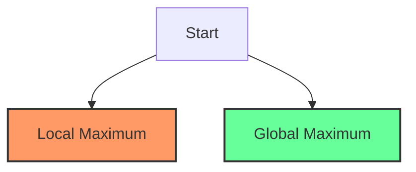

# Simulated Annealing

## Introduction

Simulated Annealing (SA) is a probabilistic technique for approximating the global optimum of a given function, particularly useful for optimization problems with large search spaces. The algorithm is inspired by the annealing process in metallurgy, a technique involving heating and controlled cooling of a material to reduce defects and increase the size of its crystals.

In computational terms, simulated annealing mimics this physical process. The algorithm starts with a high "temperature" (allowing many suboptimal moves) and gradually "cools down" (becoming more selective about accepting worse solutions), helping it escape local optima and potentially find the global optimum.

## Why Simulated Annealing?

Traditional hill-climbing algorithms often get stuck in local optima. Consider the following scenario:



A simple hill-climbing algorithm starting at point A might climb to local maximum B and stop, never finding the global maximum C. Simulated annealing addresses this limitation by occasionally accepting worse solutions, allowing the algorithm to escape local maxima.

## How Simulated Annealing Works

The simulated annealing algorithm follows these steps:

1. **Initialize** with a random solution and set a high initial temperature
2. **Generate** a neighboring solution
3. **Evaluate** the quality of the new solution
4. **Decide** whether to accept the new solution:
   - If better, always accept it
   - If worse, accept it with a probability based on:
     - How much worse it is
     - The current temperature
5. **Reduce** the temperature gradually
6. **Repeat** steps 2-5 until stopping criteria are met

The probability of accepting a worse solution follows the Boltzmann distribution:

$$P(\text{accept}) = e^{-\Delta E / T}$$

Where:
- $\Delta E$ is the change in energy (cost difference between current and new solution)
- $T$ is the current temperature

## Simulated Annealing Algorithm Implementation

Here's a Python implementation of the simulated annealing algorithm:

```python
import math
import random

def simulated_annealing(initial_solution, cost_function, neighbor_function, 
                       temperature, cooling_rate, stopping_temperature, max_iterations):
    current_solution = initial_solution
    current_cost = cost_function(current_solution)
    best_solution = current_solution
    best_cost = current_cost
    
    iteration = 1
    
    while temperature > stopping_temperature and iteration < max_iterations:
        # Generate a neighbor solution
        new_solution = neighbor_function(current_solution)
        new_cost = cost_function(new_solution)
        
        # Calculate the acceptance probability
        cost_difference = new_cost - current_cost
        
        # If the new solution is better, accept it
        # If the new solution is worse, accept it with a probability
        if cost_difference < 0 or random.random() < math.exp(-cost_difference / temperature):
            current_solution = new_solution
            current_cost = new_cost
            
            # Update the best solution if current is better
            if current_cost < best_cost:
                best_solution = current_solution
                best_cost = current_cost
                
        # Cool down the temperature
        temperature *= cooling_rate
        iteration += 1
        
    return best_solution, best_cost
```

## Example: Traveling Salesman Problem (TSP)

Let's apply simulated annealing to the classic Traveling Salesman Problem, where we need to find the shortest route visiting all cities exactly once.

```python
import numpy as np
import matplotlib.pyplot as plt

# Generate random cities
def generate_random_cities(n, width=1000, height=1000):
    cities = []
    for _ in range(n):
        cities.append((random.randint(0, width), random.randint(0, height)))
    return cities

# Calculate the total distance of a route
def calculate_distance(route, cities):
    total_distance = 0
    for i in range(len(route) - 1):
        city1 = cities[route[i]]
        city2 = cities[route[i + 1]]
        total_distance += math.sqrt((city2[0] - city1[0])**2 + (city2[1] - city1[1])**2)
    
    # Return to the starting city
    total_distance += math.sqrt((cities[route[0]][0] - cities[route[-1]][0])**2 + 
                               (cities[route[0]][1] - cities[route[-1]][1])**2)
    return total_distance

# Generate a neighbor solution by swapping two random cities
def get_neighbor(route):
    new_route = route.copy()
    i, j = random.sample(range(len(route)), 2)
    new_route[i], new_route[j] = new_route[j], new_route[i]
    return new_route

# Example usage
if __name__ == "__main__":
    # Parameters
    num_cities = 20
    initial_temp = 1000
    cooling_rate = 0.995
    stopping_temp = 0.01
    max_iterations = 10000
    
    # Generate cities and initial route
    cities = generate_random_cities(num_cities)
    initial_route = list(range(num_cities))
    random.shuffle(initial_route)
    
    # Define cost function for TSP
    cost_function = lambda route: calculate_distance(route, cities)
    
    # Run simulated annealing
    best_route, best_distance = simulated_annealing(
        initial_route,
        cost_function,
        get_neighbor,
        initial_temp,
        cooling_rate,
        stopping_temp,
        max_iterations
    )
    
    print(f"Best distance found: {best_distance:.2f}")
    print(f"Best route: {best_route}")
```

**Output example:**
```
Best distance found: 4285.73
Best route: [12, 8, 19, 0, 14, 13, 4, 17, 16, 9, 11, 5, 1, 18, 7, 15, 3, 10, 2, 6]
```

## Visualizing the Result

We can visualize the solution:

```python
def plot_route(cities, route):
    plt.figure(figsize=(10, 6))
    
    # Plot cities
    x = [cities[i][0] for i in range(len(cities))]
    y = [cities[i][1] for i in range(len(cities))]
    plt.scatter(x, y, c='blue', s=50)
    
    # Plot route
    for i in range(len(route) - 1):
        plt.plot([cities[route[i]][0], cities[route[i+1]][0]], 
                 [cities[route[i]][1], cities[route[i+1]][1]], 'k-', alpha=0.5)
        
    # Connect last city to first
    plt.plot([cities[route[-1]][0], cities[route[0]][0]], 
             [cities[route[-1]][1], cities[route[0]][1]], 'k-', alpha=0.5)
    
    plt.title("TSP Route")
    plt.xlabel("X")
    plt.ylabel("Y")
    plt.grid(True)
    plt.show()

# After finding the best route
plot_route(cities, best_route)
```

## Key Parameters in Simulated Annealing

The performance of simulated annealing depends significantly on several parameters:

1. **Initial Temperature**: Controls the initial probability of accepting worse solutions. Higher values allow more exploration at the start.

2. **Cooling Schedule**: Determines how the temperature decreases over iterations. Common approaches include:
   - Linear: `T = T - α`
   - Geometric: `T = T * α` (most common, used in our example)
   - Logarithmic: `T = T / log(1 + iteration)`

3. **Neighbor Generation Function**: Defines how we move from one solution to another.

4. **Stopping Criteria**: Usually a combination of minimum temperature and maximum iterations.

## Practical Applications

Simulated annealing has been applied to numerous real-world problems:

1. **Circuit Design**: Minimizing wire length and optimizing component placement in VLSI chip design.

2. **Image Processing**: Noise reduction and image reconstruction.

3. **Machine Learning**: Training neural networks and hyperparameter optimization.

4. **Logistics**: Vehicle routing, facility location, and scheduling problems.

5. **Financial Portfolio Optimization**: Balancing return and risk in investment portfolios.

## When to Use Simulated Annealing

Simulated annealing is particularly useful for problems that:

1. Have many local optima
2. Have a large, complex search space
3. Require an approximate solution in reasonable time
4. Can't be easily solved with exact methods
5. Allow for a meaningful "neighbor" definition

## Example: Knapsack Problem

Let's implement another example using the 0-1 Knapsack problem:

```python
# Knapsack problem with simulated annealing
def knapsack_sa():
    # Items: (value, weight)
    items = [
        (60, 10),
        (100, 20),
        (120, 30),
        (80, 40),
        (90, 50),
        (110, 60),
    ]
    max_weight = 100
    
    # Initialize with random solution
    def random_solution():
        return [random.randint(0, 1) for _ in range(len(items))]
    
    # Cost function (we maximize value, so return negative)
    def cost(solution):
        total_value = 0
        total_weight = 0
        
        for i, include in enumerate(solution):
            if include:
                total_value += items[i][0]
                total_weight += items[i][1]
        
        # Heavy penalty for exceeding weight limit
        if total_weight > max_weight:
            return -total_value + 1000 * (total_weight - max_weight)
        return -total_value
    
    # Neighbor function: flip one item
    def neighbor(solution):
        new_sol = solution.copy()
        idx = random.randint(0, len(solution) - 1)
        new_sol[idx] = 1 - new_sol[idx]  # Flip 0 to 1 or 1 to 0
        return new_sol
    
    # Run simulated annealing
    initial_solution = random_solution()
    best_solution, best_cost = simulated_annealing(
        initial_solution,
        cost,
        neighbor,
        1000,  # initial temperature
        0.95,  # cooling rate
        1,     # stopping temperature
        10000  # max iterations
    )
    
    # Calculate total value and weight
    total_value = 0
    total_weight = 0
    selected_items = []
    
    for i, include in enumerate(best_solution):
        if include:
            total_value += items[i][0]
            total_weight += items[i][1]
            selected_items.append(i)
    
    print(f"Best solution found: {best_solution}")
    print(f"Selected items: {selected_items}")
    print(f"Total value: {total_value}")
    print(f"Total weight: {total_weight}/{max_weight}")

# Run the knapsack example
knapsack_sa()
```

**Output example:**
```
Best solution found: [1, 1, 1, 0, 0, 0]
Selected items: [0, 1, 2]
Total value: 280
Total weight: 60/100
```

## Advantages and Disadvantages

### Advantages:
- Can escape local optima
- Applicable to a wide range of problems
- Relatively easy to implement
- Works well with complex, noisy, and large search spaces
- Can handle non-differentiable and discontinuous functions

### Disadvantages:
- Results may vary between runs due to randomness
- Parameter tuning (initial temperature, cooling schedule) can be challenging
- May be slower than specialized algorithms for specific problems
- No guarantee of finding the global optimum in finite time

## Summary

Simulated annealing is a powerful metaheuristic inspired by the physical annealing process. It works by starting with a high "temperature" that allows accepting worse solutions with high probability, and then gradually reducing this temperature to become more selective. This cooling process helps the algorithm escape local optima and potentially find the global optimum.

Key aspects of the algorithm include:
1. A gradual transition from exploration to exploitation
2. Probabilistic acceptance of worse solutions based on the Boltzmann distribution
3. A cooling schedule that controls the annealing process

While not guaranteeing the optimal solution, simulated annealing provides good approximations for many complex optimization problems where exact methods are impractical.

## Additional Resources

For those interested in learning more about simulated annealing:

1. **Books**:
   - "Optimization by Simulated Annealing" by Kirkpatrick, Gelatt, and Vecchi
   - "Introduction to Algorithms" by Cormen, Leiserson, Rivest, and Stein

2. **Online Courses**:
   - Coursera: Discrete Optimization
   - edX: Optimization Methods for Business Analytics

## Exercises

1. **Basic**: Modify the TSP example to use a different cooling schedule and compare the results.

2. **Intermediate**: Implement simulated annealing to solve the Graph Coloring Problem, where the goal is to color vertices such that no adjacent vertices have the same color, using the minimum number of colors.

3. **Advanced**: Apply simulated annealing to a real-world scheduling problem, such as job shop scheduling or university timetabling.

4. **Challenge**: Implement a hybrid algorithm combining simulated annealing with another optimization technique (like genetic algorithms) to solve a complex optimization problem of your choice.