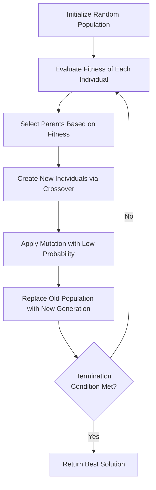

# Genetic Algorithms

## Introduction

Genetic algorithms (GAs) are search and optimization techniques inspired by the principles of natural selection and genetics. First introduced by John Holland in the 1970s, genetic algorithms have become a powerful tool in the programmer's toolkit for solving complex problems that traditional algorithms struggle with.

Unlike conventional algorithms that follow a fixed path, genetic algorithms use principles of evolution—selection, crossover (reproduction), and mutation—to "evolve" solutions to problems over multiple generations. This makes them particularly useful for problems with large search spaces, multiple objectives, or where finding an exact solution is computationally expensive.

In this tutorial, we'll explore how genetic algorithms work, implement one from scratch, and look at real-world applications where they shine.

## Key Concepts of Genetic Algorithms

Before diving into code, let's understand the fundamental biological inspiration and components of genetic algorithms:

### Biological Inspiration

Genetic algorithms draw inspiration from Darwin's theory of evolution, where:

- Individuals in a population compete for resources and mates
- The fittest individuals survive and reproduce
- Their genetic material propagates to future generations
- Over time, species adapt to their environment

### Core Components of a Genetic Algorithm

1. **Chromosome/Individual**: A potential solution to the problem, usually encoded as a string of values (often binary)
2. **Population**: A collection of potential solutions (chromosomes)
3. **Fitness Function**: Evaluates how "good" a potential solution is
4. **Selection**: Process of choosing which individuals will reproduce
5. **Crossover**: Combining genetic material from parent solutions
6. **Mutation**: Random changes to maintain genetic diversity

## The Genetic Algorithm Process

The general process of a genetic algorithm follows these steps:



Now let's break down each step in detail:

### 1. Population Initialization

We start by creating a random population of potential solutions. Each solution (chromosome) is represented using an appropriate encoding scheme for the problem.

### 2. Fitness Evaluation

Each solution is evaluated using a fitness function that measures how well it solves the problem. The fitness function is problem-specific and must be carefully designed.

### 3. Selection

Individuals are selected for reproduction based on their fitness. Better solutions have a higher chance of being selected, following the "survival of the fittest" principle.

Common selection methods include:
- Roulette wheel selection (fitness-proportionate)
- Tournament selection
- Rank-based selection

### 4. Crossover

Selected parents exchange genetic information to create offspring. This mimics biological reproduction, combining traits from both parents.

### 5. Mutation

Random changes are introduced to some individuals with a small probability. This helps maintain genetic diversity and prevents premature convergence.

### 6. Replacement

The new generation replaces the old one, and the process repeats until a termination criterion is met (e.g., finding a satisfactory solution, completing a set number of generations).

## Implementing a Genetic Algorithm

Let's implement a genetic algorithm to solve a classic problem: finding the maximum value of the function f(x) = x² in the range [0, 31].

First, we'll represent our solutions as 5-bit binary strings (since 31 = 2⁵-1).

```python
import random
import matplotlib.pyplot as plt

# Parameters for our genetic algorithm
POPULATION_SIZE = 10
CHROMOSOME_LENGTH = 5  # 5 bits can represent 0-31
GENERATIONS = 30
MUTATION_RATE = 0.1
CROSSOVER_RATE = 0.8

# Function to create an initial population
def create_initial_population(pop_size, chrom_length):
    population = []
    for _ in range(pop_size):
        # Generate a random binary string
        chromosome = ''.join(random.choice('01') for _ in range(chrom_length))
        population.append(chromosome)
    return population

# Fitness function (in our case, f(x) = x²)
def calculate_fitness(chromosome):
    # Convert binary to decimal
    x = int(chromosome, 2)
    return x ** 2  # Our fitness is x²

# Select parents using roulette wheel selection
def select_parent(population, fitness_values):
    # Calculate the sum of all fitness values
    total_fitness = sum(fitness_values)
    
    # Generate a random value between 0 and total_fitness
    selection_point = random.uniform(0, total_fitness)
    
    # Find the individual that corresponds to the selection point
    current_sum = 0
    for i, fitness in enumerate(fitness_values):
        current_sum += fitness
        if current_sum >= selection_point:
            return population[i]
    
    # In case of rounding errors, return the last individual
    return population[-1]

# Perform crossover between two parents
def crossover(parent1, parent2):
    if random.random() < CROSSOVER_RATE:
        # Choose a random crossover point
        crossover_point = random.randint(1, len(parent1) - 1)
        
        # Create offspring by combining parts of each parent
        child1 = parent1[:crossover_point] + parent2[crossover_point:]
        child2 = parent2[:crossover_point] + parent1[crossover_point:]
        
        return child1, child2
    else:
        # No crossover, just return the parents
        return parent1, parent2

# Apply mutation to a chromosome
def mutate(chromosome):
    mutated = ''
    for gene in chromosome:
        if random.random() < MUTATION_RATE:
            # Flip the bit (0 becomes 1, 1 becomes 0)
            mutated += '1' if gene == '0' else '0'
        else:
            mutated += gene
    return mutated

# Main genetic algorithm function
def genetic_algorithm():
    # Create initial population
    population = create_initial_population(POPULATION_SIZE, CHROMOSOME_LENGTH)
    
    # Track the best solutions across generations
    best_chromosomes = []
    average_fitness = []
    
    # Evolution through generations
    for generation in range(GENERATIONS):
        # Calculate fitness for each individual
        fitness_values = [calculate_fitness(chrom) for chrom in population]
        
        # Record statistics
        best_idx = fitness_values.index(max(fitness_values))
        best_chromosomes.append((generation, int(population[best_idx], 2), max(fitness_values)))
        average_fitness.append(sum(fitness_values) / len(fitness_values))
        
        # Create new population
        new_population = []
        
        # Generate new individuals through selection, crossover, and mutation
        while len(new_population) < POPULATION_SIZE:
            # Select parents
            parent1 = select_parent(population, fitness_values)
            parent2 = select_parent(population, fitness_values)
            
            # Create offspring through crossover
            child1, child2 = crossover(parent1, parent2)
            
            # Apply mutation
            child1 = mutate(child1)
            child2 = mutate(child2)
            
            # Add to the new population
            new_population.append(child1)
            new_population.append(child2)
        
        # Keep population size consistent by truncating if necessary
        population = new_population[:POPULATION_SIZE]
    
    # Calculate final fitness for each individual
    final_fitness = [calculate_fitness(chrom) for chrom in population]
    best_idx = final_fitness.index(max(final_fitness))
    
    return population[best_idx], int(population[best_idx], 2), max(final_fitness), best_chromosomes, average_fitness

# Run the genetic algorithm
best_chromosome, best_x, best_fitness, history, avg_fitness = genetic_algorithm()

print(f"Best chromosome: {best_chromosome}")
print(f"Best x value: {best_x}")
print(f"Best fitness (x²): {best_fitness}")

# Plot the evolution of the best solution and average fitness
generations = [gen for gen, _, _ in history]
best_x_values = [x for _, x, _ in history]
best_fitness_values = [fitness for _, _, fitness in history]

plt.figure(figsize=(12, 5))

plt.subplot(1, 2, 1)
plt.plot(generations, best_x_values, 'b-', label='Best x value')
plt.xlabel('Generation')
plt.ylabel('Best x value')
plt.title('Evolution of Best Solution')
plt.grid(True)
plt.legend()

plt.subplot(1, 2, 2)
plt.plot(generations, best_fitness_values, 'r-', label='Best fitness')
plt.plot(generations, avg_fitness, 'g-', label='Average fitness')
plt.xlabel('Generation')
plt.ylabel('Fitness (x²)')
plt.title('Fitness Evolution')
plt.grid(True)
plt.legend()

plt.tight_layout()
plt.show()
```

### Sample Output

When you run this code, you'll see something like:

```
Best chromosome: 11111
Best x value: 31
Best fitness (x²): 961
```

The algorithm successfully finds that x = 31 gives the maximum value in our range, with a fitness of 31² = 961.

## Understanding the Implementation

Let's break down the key parts of our implementation:

1. **Chromosome Representation**: We used binary strings where each 5-bit string represents a number between 0 and 31.

2. **Population Initialization**: We created random binary strings to form our initial population.

3. **Fitness Function**: Our fitness function calculates x², which we're trying to maximize.

4. **Selection**: We implemented roulette wheel selection where individuals with higher fitness have a proportionally higher chance of being selected.

5. **Crossover**: Two parents exchange genetic material at a random point, creating two children with traits from both parents.

6. **Mutation**: With a small probability, bits in the chromosome are flipped to maintain genetic diversity.

7. **Termination**: The algorithm runs for a fixed number of generations.

## Real-World Applications of Genetic Algorithms

Genetic algorithms excel in various domains where traditional algorithms face limitations:

### 1. Optimization Problems

- **Route Optimization**: Finding optimal delivery routes for logistics companies
- **Resource Allocation**: Distributing resources efficiently in manufacturing or scheduling
- **Portfolio Optimization**: Balancing risk and return in financial investments

### 2. Machine Learning and AI

- **Neural Network Training**: Optimizing weights and architectures in neural networks
- **Feature Selection**: Finding the most relevant features for classification tasks
- **Reinforcement Learning**: Evolving strategies for agents in complex environments

### 3. Design and Engineering

- **Circuit Design**: Optimizing electronic circuit layouts
- **Structural Engineering**: Finding efficient designs that meet constraints
- **Antenna Design**: Creating antennas with optimal radiation patterns

### 4. Game Development

- **Character AI**: Evolving complex behaviors for NPCs (non-player characters)
- **Procedural Content Generation**: Creating levels, landscapes, or other game content
- **Parameter Tuning**: Balancing game mechanics and difficulty

### Case Study: Timetable Scheduling

Let's consider a university timetable scheduling problem, which is notoriously difficult to solve with traditional algorithms:

1. **Problem**: Schedule classes to rooms and time slots while minimizing conflicts
2. **Constraints**: Room capacity, teacher availability, course prerequisites, etc.
3. **Solution using GA**:
   - **Chromosome**: Representation of a complete schedule
   - **Fitness**: Inverse of the number of conflicts (fewer conflicts = higher fitness)
   - **Evolution**: Over generations, schedules evolve to minimize conflicts

## Advanced Concepts

### 1. Encoding Schemes

Different problems require different chromosome representations:

- **Binary Encoding**: Useful for problems with discrete values
- **Real-Value Encoding**: Better for continuous optimization problems
- **Permutation Encoding**: Ideal for ordering problems like TSP (Traveling Salesman Problem)
- **Tree Encoding**: Used for evolving programs or expressions (Genetic Programming)

### 2. Multi-Objective Optimization

Many real-world problems have multiple, often conflicting, objectives. Multi-objective genetic algorithms (MOGAs) find a set of solutions that represent different trade-offs between objectives.

### 3. Adaptive Parameters

Instead of using fixed rates for crossover and mutation, some advanced implementations adapt these parameters during the run:

```python
def adaptive_mutation_rate(generation, max_generations):
    # Higher mutation at the beginning, lower at the end
    return 0.1 * (1 - generation / max_generations)
```

### 4. Parallel Genetic Algorithms

To improve performance, genetic algorithms can be parallelized in different ways:

- **Global Parallelization**: Fitness evaluation in parallel
- **Island Model**: Multiple sub-populations evolving separately with occasional migration
- **Cellular GA**: Individuals interact only with their neighbors in a grid structure

## Common Challenges and Solutions

### Premature Convergence

**Problem**: Population converges too quickly to a suboptimal solution.
**Solutions**:
- Increase mutation rate
- Use diverse selection methods
- Implement niching techniques

### Parameter Tuning

**Problem**: GA performance depends heavily on parameter settings.
**Solutions**:
- Use self-adaptive parameters
- Perform parameter sweeps
- Apply meta-optimization (using another GA to optimize GA parameters)

### Computational Cost

**Problem**: GAs can be computationally expensive for complex fitness evaluations.
**Solutions**:
- Use surrogate fitness models
- Implement parallelization
- Apply fitness approximation techniques

## Summary

Genetic algorithms offer a powerful, nature-inspired approach to solving complex optimization problems. By mimicking the process of natural selection, they can explore vast solution spaces efficiently and find innovative solutions that traditional algorithms might miss.

Key takeaways:
- GAs follow the evolutionary principles of selection, crossover, and mutation
- They excel at problems with large search spaces or multiple objectives
- The implementation involves representing solutions as chromosomes and defining a fitness function
- Many real-world applications benefit from genetic algorithms, from engineering design to machine learning

While GAs require careful design of encoding schemes and fitness functions, they reward you with robust optimization capabilities and the ability to solve problems that might otherwise be intractable.

## Exercises

1. Modify the example code to find the minimum of f(x) = |x - 15| in the range [0, 31].
2. Implement a genetic algorithm to solve the knapsack problem where you have items with different weights and values, and need to maximize value while staying under a weight limit.
3. Create a genetic algorithm that evolves a string to match a target string (e.g., "HELLO WORLD").
4. Experiment with different selection methods (tournament selection, rank-based selection) and compare their performance.
5. Implement an adaptive mutation rate that changes based on population diversity.

## Further Reading

- "Introduction to Genetic Algorithms" by Melanie Mitchell
- "Genetic Algorithms in Search, Optimization, and Machine Learning" by David E. Goldberg
- "Evolutionary Computation: A Unified Approach" by Kenneth De Jong
- DEAP (Distributed Evolutionary Algorithms in Python) library documentation

Genetic algorithms are just the beginning of evolutionary computation. As you explore this field further, you'll discover related techniques like genetic programming, evolutionary strategies, and swarm intelligence algorithms, each with its own strengths and applications.