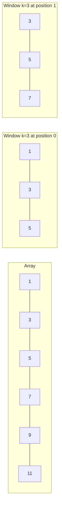

# Sliding Window Technique

## Introduction

The sliding window technique is a powerful algorithmic pattern used to efficiently process arrays, strings, and other sequential data structures. As the name suggests, this technique involves creating a "window" that slides through the data, allowing us to solve problems with linear time complexity that might otherwise require nested loops and quadratic time.

This technique is particularly useful for problems that involve finding subarrays or substrings that satisfy certain conditions, like:
- Finding the maximum sum subarray of fixed size k
- Finding the longest substring with distinct characters
- Finding the smallest subarray with a sum greater than or equal to a given value

## Understanding the Core Concept

The sliding window technique works by maintaining a subset of items (the "window") as we iterate through the data. Instead of recomputing everything from scratch when moving the window, we:

1. Add new elements as they come into the window
2. Remove elements that no longer belong in the window
3. Update any variables tracking the current state of the window

This allows us to avoid redundant work and achieve a more efficient solution.



## Types of Sliding Windows

There are two main variations of the sliding window technique:

1. **Fixed-size window**: The window size remains constant as it slides through the array.
2. **Dynamic-size window**: The window size can grow or shrink depending on certain conditions.

Let's explore both with examples.

## Fixed-Size Sliding Window

A fixed-size sliding window is used when we need to consider exactly k consecutive elements at a time.

### Example 1: Maximum Sum Subarray of Size K

**Problem**: Given an array of integers and a number k, find the maximum sum of a subarray of size k.

**Input**:
- Array: `[1, 4, 2, 10, 2, 3, 1, 0, 20]`
- k: 3

**Output**: 24 (from the subarray `[2, 3, 19]`)

Let's solve this step by step:

```javascript
function maxSubarraySum(arr, k) {
  // Handle edge cases
  if (arr.length < k) {
    return null;
  }
  
  // Initialize variables
  let maxSum = 0;
  let tempSum = 0;
  
  // Calculate sum of first window
  for (let i = 0; i < k; i++) {
    maxSum += arr[i];
  }
  
  // Initial window sum becomes current max
  tempSum = maxSum;
  
  // Slide the window
  for (let i = k; i < arr.length; i++) {
    // Update the window sum by adding the new element and removing the element that's no longer in the window
    tempSum = tempSum - arr[i - k] + arr[i];
    // Update maxSum if we found a bigger sum
    maxSum = Math.max(maxSum, tempSum);
  }
  
  return maxSum;
}

// Example usage
const arr = [1, 4, 2, 10, 2, 3, 1, 0, 20];
const k = 3;
console.log(maxSubarraySum(arr, k)); // Output: 24
```

Here's what happens:
1. We calculate the sum of the first k elements: `1 + 4 + 2 = 7`
2. We slide the window by removing the first element (1) and adding the next element (10): `7 - 1 + 10 = 16`
3. We continue sliding the window: `16 - 4 + 2 = 14`, then `14 - 2 + 3 = 15`, and so on
4. At each step, we keep track of the maximum sum we've seen

Instead of recalculating the entire sum for each window (which would be O(n*k)), we achieve O(n) time complexity.

## Dynamic-Size Sliding Window

A dynamic-size sliding window can grow or shrink based on specific conditions.

### Example 2: Smallest Subarray with Sum >= Target

**Problem**: Find the smallest subarray with a sum greater than or equal to a given value.

**Input**:
- Array: `[2, 1, 5, 2, 3, 2]`
- Target Sum: 7

**Output**: 2 (the subarray `[5, 2]` has sum = 7)

```javascript
function smallestSubarrayWithSum(arr, targetSum) {
  let windowSum = 0;
  let minLength = Infinity;
  let windowStart = 0;
  
  for (let windowEnd = 0; windowEnd < arr.length; windowEnd++) {
    // Add the next element to the window
    windowSum += arr[windowEnd];
    
    // Shrink the window as small as possible while maintaining the sum >= targetSum
    while (windowSum >= targetSum) {
      // Update our result
      minLength = Math.min(minLength, windowEnd - windowStart + 1);
      // Remove the leftmost element
      windowSum -= arr[windowStart];
      // Move the window start
      windowStart++;
    }
  }
  
  return minLength === Infinity ? 0 : minLength;
}

// Example usage
const arr = [2, 1, 5, 2, 3, 2];
const targetSum = 7;
console.log(smallestSubarrayWithSum(arr, targetSum)); // Output: 2
```

In this example:
1. We expand the window by adding elements until we reach or exceed the target sum
2. Once we reach the target sum, we try to shrink the window from the left as much as possible while still maintaining the sum >= target
3. We keep track of the minimum window size we've found that satisfies our condition

## Example 3: Longest Substring with K Distinct Characters

**Problem**: Find the longest substring with at most K distinct characters.

**Input**: 
- String: "araaci"
- K: 2

**Output**: 4 (The longest substring with at most 2 distinct characters is "araa")

```javascript
function longestSubstringKDistinct(str, k) {
  if (str.length === 0 || k === 0) {
    return 0;
  }
  
  let windowStart = 0;
  let maxLength = 0;
  let charFrequency = {};
  
  // Try to extend the range [windowStart, windowEnd]
  for (let windowEnd = 0; windowEnd < str.length; windowEnd++) {
    const rightChar = str[windowEnd];
    // Add the current character to the frequency map
    if (!(rightChar in charFrequency)) {
      charFrequency[rightChar] = 0;
    }
    charFrequency[rightChar]++;
    
    // Shrink the sliding window, until we have at most 'k' distinct characters in the frequency map
    while (Object.keys(charFrequency).length > k) {
      const leftChar = str[windowStart];
      charFrequency[leftChar]--;
      if (charFrequency[leftChar] === 0) {
        delete charFrequency[leftChar];
      }
      windowStart++;
    }
    
    // Update the maximum length
    maxLength = Math.max(maxLength, windowEnd - windowStart + 1);
  }
  
  return maxLength;
}

// Example usage
const str = "araaci";
const k = 2;
console.log(longestSubstringKDistinct(str, k)); // Output: 4
```

In this example:
1. We use a hash map (`charFrequency`) to keep track of the frequency of each character in our current window
2. We expand the window by adding characters from the right
3. If at any point we have more than k distinct characters, we shrink the window from the left
4. We keep track of the maximum window size we've seen that satisfies our condition

## When to Use the Sliding Window Technique

The sliding window technique is most effective when:

1. You need to find a subarray or substring that satisfies certain conditions
2. The problem involves sequential data (arrays, strings, linked lists)
3. The solution requires tracking a running sum, maximum, minimum, or some other property

Common problem types include:
- Maximum/minimum sum of a subarray of size k
- Longest/shortest substring with some constraint
- Finding a subarray with a specific sum
- Calculating a running average

## Real-World Applications

The sliding window pattern has many practical applications:

1. **Network Packet Analysis**: Monitoring network traffic over fixed time intervals.
2. **Moving Average in Stock Prices**: Calculating the moving average of stock prices over a specific time frame.
3. **Data Streaming**: Processing continuous data streams in chunks.
4. **Image Processing**: Applying filters to images by processing pixel neighborhoods.

### Moving Average Example

```javascript
function calculateMovingAverage(prices, windowSize) {
  if (prices.length < windowSize) {
    return [];
  }
  
  const result = [];
  let windowSum = 0;
  
  // Calculate sum of first window
  for (let i = 0; i < windowSize; i++) {
    windowSum += prices[i];
  }
  
  // Record first average
  result.push(windowSum / windowSize);
  
  // Calculate remaining averages
  for (let i = windowSize; i < prices.length; i++) {
    windowSum = windowSum - prices[i - windowSize] + prices[i];
    result.push(windowSum / windowSize);
  }
  
  return result;
}

// Example: 5-day moving average of stock prices
const stockPrices = [100, 110, 105, 112, 115, 118, 120, 110, 108, 112];
console.log(calculateMovingAverage(stockPrices, 5));
// Output: [108.4, 112, 114, 115, 114.2, 113.6]
```

## Common Mistakes and Optimization Tips

### Common Mistakes:
1. **Not handling edge cases**: Always check if the array/string has enough elements for the window size.
2. **Incorrect window updates**: Be careful about the order of operations when sliding the window.
3. **Off-by-one errors**: Pay attention to window boundaries and indices.

### Optimization Tips:
1. **Use Maps for character frequencies**: When dealing with strings, using a Map is often more efficient than counting arrays.
2. **Minimize redundant calculations**: The key advantage of sliding window is avoiding recalculations.
3. **Use appropriate data structures**: Sometimes, using a queue or deque can make window operations clearer.

## Summary

The sliding window technique is a powerful pattern that helps solve a wide range of sequential data problems efficiently. By maintaining and updating a "window" of elements, we can avoid redundant calculations and achieve better time complexity compared to brute force approaches.

Key points to remember:
- Fixed-size windows are used when the subarray size is constant
- Dynamic-size windows can grow or shrink based on conditions
- The technique excels at finding optimal subarrays or substrings
- Time complexity is typically O(n), a significant improvement from the O(n²) of nested loops

## Practice Exercises

To master this technique, try solving these problems:

1. Find the maximum sum of a subarray of size k.
2. Find the smallest subarray with a sum greater than or equal to S.
3. Find the longest substring with at most K distinct characters.
4. Find the longest substring without repeating characters.
5. Find all anagrams in a string.

## Additional Resources

- [Leetcode Problems on Sliding Window](https://leetcode.com/tag/sliding-window/)
- [Grokking the Coding Interview: Sliding Window problems](https://www.educative.io/courses/grokking-the-coding-interview)
- [Sliding Window Algorithms on GeeksforGeeks](https://www.geeksforgeeks.org/window-sliding-technique/)

Remember, the key to mastering this technique is practice. Start with simple fixed-window problems before moving on to the more complex dynamic-window challenges.