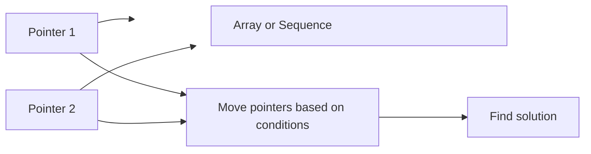

# Two Pointers Technique

## Introduction

The Two Pointers technique is a simple yet powerful problem-solving pattern that allows us to process arrays or sequences efficiently. As the name suggests, it involves using two pointers (or references) to traverse through the data. These pointers can move toward each other, in the same direction at different speeds, or even start from different positions.

This technique is particularly effective for:
- Searching for pairs in a sorted array
- Comparing elements from opposite ends of an array
- Finding subarrays that satisfy certain conditions
- Removing duplicates from sorted arrays

The main advantage of the Two Pointers approach is that it often reduces the time complexity from O(n²) to O(n), making our solutions much more efficient.

## Basic Concept

At its core, the Two Pointers technique involves:

1. Initialize two pointers to appropriate positions in the data structure
2. Move the pointers according to certain conditions
3. Solve the problem by analyzing the elements at the pointer positions

Let's visualize this with a simple diagram:



## Common Two Pointer Patterns

There are several common patterns in the Two Pointers technique:

### 1. Opposite Directional Pointers

In this pattern, we start with one pointer at the beginning and another at the end. The pointers move toward each other.

**Example: Two Sum in Sorted Array**

Let's solve the problem: Given a sorted array and a target sum, find if there exists a pair whose sum equals the target.

```javascript
function findPair(arr, targetSum) {
  let left = 0;
  let right = arr.length - 1;
  
  while (left < right) {
    const currentSum = arr[left] + arr[right];
    
    if (currentSum === targetSum) {
      return [left, right]; // Found the pair
    }
    
    if (currentSum < targetSum) {
      left++; // Need a larger sum, move left pointer to the right
    } else {
      right--; // Need a smaller sum, move right pointer to the left
    }
  }
  
  return [-1, -1]; // No pair found
}

// Example usage
const sortedArray = [1, 3, 4, 5, 7, 10, 11];
const target = 9;
console.log(findPair(sortedArray, target)); // Output: [1, 4] (indices of values 3 and 7)
```

Let's walk through this example:

1. We initialize `left = 0` and `right = 6`
2. Calculate the sum: `arr[0] + arr[6] = 1 + 11 = 12`
3. Since 12 > 9, we move the right pointer: `right = 5`
4. Calculate the sum: `arr[0] + arr[5] = 1 + 10 = 11`
5. Since 11 > 9, we move the right pointer: `right = 4`
6. Calculate the sum: `arr[0] + arr[4] = 1 + 7 = 8`
7. Since 8 < 9, we move the left pointer: `left = 1`
8. Calculate the sum: `arr[1] + arr[4] = 3 + 7 = 9`
9. We found the target sum, return `[1, 4]`

### 2. Same Directional Pointers

This pattern involves two pointers moving in the same direction, often at different speeds or with different conditions for movement.

**Example: Remove Duplicates from Sorted Array**

Let's solve the problem: Given a sorted array, remove duplicates in-place and return the length of the new array.

```javascript
function removeDuplicates(nums) {
  if (nums.length === 0) return 0;
  
  let slow = 0; // Pointer for the unique elements
  
  for (let fast = 1; fast < nums.length; fast++) {
    if (nums[fast] !== nums[slow]) {
      slow++;
      nums[slow] = nums[fast];
    }
  }
  
  return slow + 1; // Length of the array with duplicates removed
}

// Example usage
const nums = [0, 0, 1, 1, 1, 2, 2, 3, 4, 4];
const newLength = removeDuplicates(nums);
console.log(newLength); // Output: 5
console.log(nums.slice(0, newLength)); // Output: [0, 1, 2, 3, 4]
```

In this example:
- The `slow` pointer keeps track of the position where the next unique element should be placed
- The `fast` pointer scans through the array to find unique elements
- When a new unique element is found, we move the `slow` pointer and update the array

### 3. Fast and Slow Pointers (Floyd's Cycle-Finding Algorithm)

This is a specialized variant of the Two Pointers technique where one pointer moves twice as fast as the other. It's particularly useful for detecting cycles in linked lists.

**Example: Detecting a Cycle in a Linked List**

```javascript
function hasCycle(head) {
  if (!head || !head.next) return false;
  
  let slow = head;
  let fast = head;
  
  while (fast && fast.next) {
    slow = slow.next;       // Move one step
    fast = fast.next.next;  // Move two steps
    
    if (slow === fast) {
      return true; // Cycle detected
    }
  }
  
  return false; // No cycle found
}

// Example usage (with a linked list containing a cycle)
// 1 -> 2 -> 3 -> 4 -> 5 -> 3 (pointing back to node 3)
class ListNode {
  constructor(val) {
    this.val = val;
    this.next = null;
  }
}

function createLinkedListWithCycle() {
  const node1 = new ListNode(1);
  const node2 = new ListNode(2);
  const node3 = new ListNode(3);
  const node4 = new ListNode(4);
  const node5 = new ListNode(5);
  
  node1.next = node2;
  node2.next = node3;
  node3.next = node4;
  node4.next = node5;
  node5.next = node3; // Creating a cycle
  
  return node1;
}

const head = createLinkedListWithCycle();
console.log(hasCycle(head)); // Output: true
```

In this algorithm:
1. If there's no cycle, the fast pointer will reach the end of the list
2. If there's a cycle, the fast pointer will eventually meet the slow pointer inside the cycle
3. This happens because when the slow pointer enters the cycle, the fast pointer is already inside it
4. The fast pointer will "catch up" to the slow pointer after some number of iterations

## Practical Applications

Let's look at more real-world problems that can be efficiently solved using the Two Pointers technique:

### 1. Three Sum Problem

Find all unique triplets in an array that sum up to zero.

```javascript
function threeSum(nums) {
  const result = [];
  nums.sort((a, b) => a - b); // Sort the array
  
  for (let i = 0; i < nums.length - 2; i++) {
    // Skip duplicate values for i
    if (i > 0 && nums[i] === nums[i - 1]) continue;
    
    let left = i + 1;
    let right = nums.length - 1;
    
    while (left < right) {
      const sum = nums[i] + nums[left] + nums[right];
      
      if (sum < 0) {
        left++;
      } else if (sum > 0) {
        right--;
      } else {
        // Found a triplet
        result.push([nums[i], nums[left], nums[right]]);
        
        // Skip duplicates
        while (left < right && nums[left] === nums[left + 1]) left++;
        while (left < right && nums[right] === nums[right - 1]) right--;
        
        left++;
        right--;
      }
    }
  }
  
  return result;
}

// Example usage
const numbers = [-1, 0, 1, 2, -1, -4];
console.log(threeSum(numbers));
// Output: [[-1, -1, 2], [-1, 0, 1]]
```

This solution:
1. Sorts the array first
2. Uses a fixed pointer (i) and two moving pointers (left and right)
3. Takes care to skip duplicate values to avoid duplicate triplets
4. Has a time complexity of O(n²), which is much better than the naive O(n³) approach

### 2. Container With Most Water

Given n non-negative integers representing an elevation map where the width of each bar is 1, compute how much water the container can trap.

```javascript
function maxArea(height) {
  let left = 0;
  let right = height.length - 1;
  let maxWater = 0;
  
  while (left < right) {
    // Calculate current water
    const width = right - left;
    const currentHeight = Math.min(height[left], height[right]);
    const water = width * currentHeight;
    
    maxWater = Math.max(maxWater, water);
    
    // Move the pointer at the lower height
    if (height[left] < height[right]) {
      left++;
    } else {
      right--;
    }
  }
  
  return maxWater;
}

// Example usage
const heights = [1, 8, 6, 2, 5, 4, 8, 3, 7];
console.log(maxArea(heights)); // Output: 49
```

The key insight here is that the area of water is limited by the shorter line, so we always move the pointer pointing to the shorter line.

### 3. Trapping Rain Water

Given an array representing heights of bars, calculate how much water can be trapped between them.

```javascript
function trap(height) {
  if (height.length === 0) return 0;
  
  let left = 0;
  let right = height.length - 1;
  let leftMax = height[left];
  let rightMax = height[right];
  let water = 0;
  
  while (left < right) {
    if (leftMax < rightMax) {
      left++;
      leftMax = Math.max(leftMax, height[left]);
      water += leftMax - height[left];
    } else {
      right--;
      rightMax = Math.max(rightMax, height[right]);
      water += rightMax - height[right];
    }
  }
  
  return water;
}

// Example usage
const heights = [0, 1, 0, 2, 1, 0, 1, 3, 2, 1, 2, 1];
console.log(trap(heights)); // Output: 6
```

This elegant solution:
1. Uses two pointers from both ends
2. Keeps track of the maximum height seen from both sides
3. Adds water at each position based on the difference between the current height and the maximum height seen so far from that direction

## Time and Space Complexity Analysis

One of the main advantages of the Two Pointers technique is its efficiency:

- **Time Complexity**: Often O(n) for a single pass through the array, compared to O(n²) for nested loop approaches.
- **Space Complexity**: Usually O(1) because we only need a constant amount of extra space regardless of input size.

This makes the Two Pointers technique an excellent choice for problems that might otherwise require a brute force approach with quadratic time complexity.

## When to Use the Two Pointers Technique

Consider using the Two Pointers technique when:

1. You're dealing with sorted arrays or linked lists
2. You need to find pairs in an array
3. You need to compare elements from different positions in an array
4. The problem involves detecting cycles
5. You want to reduce the time complexity from O(n²) to O(n)

## Common Mistakes and Pitfalls

1. **Forgetting to check for empty arrays**: Always handle edge cases.
2. **Incorrect pointer movement**: Make sure your pointers move according to the right conditions.
3. **Off-by-one errors**: Be careful with the indices, especially when checking array boundaries.
4. **Not handling duplicates correctly**: In some problems, you may need to skip duplicate values to avoid duplicate results.
5. **Using the technique on unsorted data** when the algorithm requires sorted input.

## Summary

The Two Pointers technique is a versatile and efficient problem-solving pattern that can dramatically improve the performance of your algorithms. By maintaining two pointers and moving them according to specific conditions, we can solve a wide range of problems with optimal time complexity.

Remember these key patterns:
- Opposite directional pointers (start from both ends)
- Same directional pointers (often with different speeds)
- Fast and slow pointers (especially for cycle detection)

This technique shines when working with sorted arrays, linked lists, or when searching for element combinations that satisfy certain conditions.

## Practice Exercises

To master the Two Pointers technique, try solving these problems:

1. **Valid Palindrome**: Given a string, determine if it's a palindrome, considering only alphanumeric characters and ignoring case.

2. **Merge Sorted Arrays**: Merge two sorted arrays into a single sorted array.

3. **Remove Element**: Given an array and a value, remove all instances of that value in-place and return the new length.

4. **Sort Colors (Dutch National Flag Problem)**: Sort an array of 0s, 1s, and 2s in a single pass.

5. **Four Sum**: Find all unique quadruplets in an array that sum to a specific target.

Each of these exercises will help you strengthen your understanding of different aspects of the Two Pointers technique.

Happy coding!