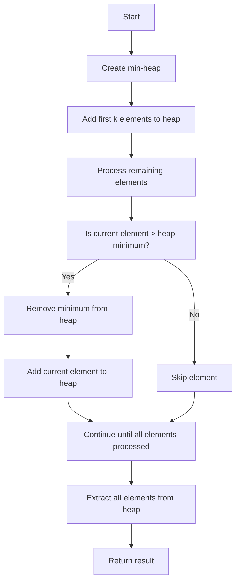

# Top K Elements

## Introduction

The "Top K Elements" pattern deals with finding the k largest or smallest elements in a collection such as an array, list, or stream of data. This pattern is highly useful in scenarios where we need to identify a subset of elements with extreme values without fully sorting the entire collection.

Whether it's finding the k most frequent items, the k closest points to a given location, or the k largest numbers in a dataset, this pattern provides an efficient approach to solving these types of problems.

## Understanding the Pattern

The core idea behind the Top K Elements pattern is to:

1. Identify the k elements that represent the "top" (largest, smallest, most frequent, etc.) of the collection
2. Do so more efficiently than sorting the entire collection

While you could solve these problems by sorting the entire dataset (with O(n log n) time complexity), the Top K Elements pattern typically uses a priority queue or heap data structure to achieve better efficiency for large datasets.

## When to Use the Top K Elements Pattern

This pattern is applicable when:

- You need to find the k largest or smallest elements in a collection
- You want to find the k most frequent elements
- You need to find the k closest points to a given point
- You're dealing with a stream of data and need to maintain the top k elements at any time

## Implementation Approaches

### 1. Using Sorting

The most straightforward approach is to sort the collection and then pick the first k elements:

```javascript
function findTopKElements(nums, k) {
  // Sort in descending order
  const sortedArray = [...nums].sort((a, b) => b - a);
  // Return first k elements
  return sortedArray.slice(0, k);
}

// Example
const nums = [3, 1, 5, 12, 2, 11];
const k = 3;
console.log(findTopKElements(nums, k)); // Output: [12, 11, 5]
```

Time Complexity: O(n log n) where n is the number of elements in the collection.

### 2. Using a Heap (Priority Queue)

A more efficient approach for large datasets uses a min-heap to keep track of the top k elements:

```javascript
class MinHeap {
  constructor() {
    this.heap = [];
  }

  push(val) {
    this.heap.push(val);
    this.bubbleUp();
  }

  pop() {
    if (this.isEmpty()) return null;
    
    const min = this.heap[0];
    const last = this.heap.pop();
    
    if (this.heap.length > 0) {
      this.heap[0] = last;
      this.sinkDown(0);
    }
    
    return min;
  }

  peek() {
    return this.isEmpty() ? null : this.heap[0];
  }

  isEmpty() {
    return this.heap.length === 0;
  }

  size() {
    return this.heap.length;
  }

  bubbleUp() {
    let index = this.heap.length - 1;
    const element = this.heap[index];

    while (index > 0) {
      const parentIndex = Math.floor((index - 1) / 2);
      const parent = this.heap[parentIndex];

      if (element >= parent) break;
      
      // Swap with parent
      this.heap[parentIndex] = element;
      this.heap[index] = parent;
      index = parentIndex;
    }
  }

  sinkDown(index) {
    const length = this.heap.length;
    const element = this.heap[index];

    while (true) {
      const leftChildIdx = 2 * index + 1;
      const rightChildIdx = 2 * index + 2;
      let leftChild, rightChild;
      let swap = null;

      if (leftChildIdx < length) {
        leftChild = this.heap[leftChildIdx];
        if (leftChild < element) {
          swap = leftChildIdx;
        }
      }

      if (rightChildIdx < length) {
        rightChild = this.heap[rightChildIdx];
        if (
          (swap === null && rightChild < element) || 
          (swap !== null && rightChild < leftChild)
        ) {
          swap = rightChildIdx;
        }
      }

      if (swap === null) break;
      
      this.heap[index] = this.heap[swap];
      this.heap[swap] = element;
      index = swap;
    }
  }
}

function findTopKElements(nums, k) {
  const minHeap = new MinHeap();
  
  // Process the first k elements
  for (let i = 0; i < k; i++) {
    minHeap.push(nums[i]);
  }
  
  // For each remaining element, if it's larger than the smallest in heap,
  // remove the smallest and add this element
  for (let i = k; i < nums.length; i++) {
    if (nums[i] > minHeap.peek()) {
      minHeap.pop();
      minHeap.push(nums[i]);
    }
  }
  
  // Extract all elements from the heap
  const result = [];
  while (!minHeap.isEmpty()) {
    result.unshift(minHeap.pop()); // Add to front to get descending order
  }
  
  return result;
}

// Example
const nums = [3, 1, 5, 12, 2, 11];
const k = 3;
console.log(findTopKElements(nums, k)); // Output: [12, 11, 5]
```

Time Complexity: O(n log k) where n is the number of elements in the collection and k is the size of the heap.

## Flow of the Heap-based Solution



## Common Variations of Top K Elements Problems

### 1. K Closest Points to Origin

Find the k points that are closest to the origin (0, 0) in a 2D plane.

```javascript
function kClosest(points, k) {
  // Use a max heap to keep track of k closest points
  const maxHeap = [];
  
  for (const [x, y] of points) {
    // Calculate distance from origin
    const distance = x * x + y * y;
    
    if (maxHeap.length < k) {
      // If heap has fewer than k elements, add the point
      maxHeap.push({point: [x, y], distance});
      maxHeap.sort((a, b) => a.distance - b.distance);
    } else if (distance < maxHeap[maxHeap.length - 1].distance) {
      // If distance is smaller than the largest in heap, replace it
      maxHeap.pop();
      maxHeap.push({point: [x, y], distance});
      maxHeap.sort((a, b) => a.distance - b.distance);
    }
  }
  
  // Extract points from the heap
  return maxHeap.map(item => item.point);
}

// Example
const points = [[1, 3], [3, 4], [2, -1], [4, 1], [-1, -1]];
const k = 3;
console.log(kClosest(points, k)); // Output: [[1, 3], [2, -1], [-1, -1]]
```

### 2. Top K Frequent Elements

Find the k most frequent elements in an array.

```javascript
function topKFrequent(nums, k) {
  // Count frequencies
  const frequencyMap = new Map();
  for (const num of nums) {
    frequencyMap.set(num, (frequencyMap.get(num) || 0) + 1);
  }
  
  // Use a min heap based on frequency
  const minHeap = [];
  
  for (const [num, freq] of frequencyMap.entries()) {
    if (minHeap.length < k) {
      minHeap.push({num, freq});
      minHeap.sort((a, b) => a.freq - b.freq);
    } else if (freq > minHeap[0].freq) {
      minHeap.shift();
      minHeap.push({num, freq});
      minHeap.sort((a, b) => a.freq - b.freq);
    }
  }
  
  return minHeap.map(item => item.num);
}

// Example
const nums = [1, 1, 1, 2, 2, 3];
const k = 2;
console.log(topKFrequent(nums, k)); // Output: [1, 2]
```

### 3. K Closest Elements to a Value

Find the k closest elements to a given value x from a sorted array.

```javascript
function findClosestElements(arr, k, x) {
  // Use binary search to find the closest element to x
  let left = 0;
  let right = arr.length - k;
  
  while (left < right) {
    const mid = left + Math.floor((right - left) / 2);
    
    if (x - arr[mid] > arr[mid + k] - x) {
      left = mid + 1;
    } else {
      right = mid;
    }
  }
  
  // Return the k closest elements
  return arr.slice(left, left + k);
}

// Example
const arr = [1, 2, 3, 4, 5];
const k = 3;
const x = 3;
console.log(findClosestElements(arr, k, x)); // Output: [2, 3, 4]
```

## Real-World Applications

1. **Search Functionality**: Search engines use Top K algorithms to return the most relevant results.
   
2. **Recommendation Systems**: Streaming platforms use this pattern to recommend the top k movies or songs based on user preferences.
   
3. **Data Analytics**: When analyzing large datasets, focusing on just the top k elements often provides the most valuable insights.

4. **Geospatial Applications**: Finding the k nearest restaurants, stores, or other points of interest from your current location.

5. **Network Traffic Analysis**: Identifying the top k IP addresses that are generating the most traffic.

## Summary

The Top K Elements pattern is a powerful approach for efficiently finding a subset of elements with extreme values in a collection. While sorting can be used for small datasets, using a heap or priority queue provides better performance for large datasets.

Key points to remember:
- Use a min-heap for finding top k largest elements
- Use a max-heap for finding top k smallest elements
- Time complexity using a heap: O(n log k), which is better than O(n log n) for sorting
- This pattern is highly versatile and applies to many real-world problems

## Practice Exercises

To strengthen your understanding of the Top K Elements pattern, try solving these problems:

1. Find the kth largest element in an unsorted array.
2. Find the k most frequent words in a collection of texts.
3. Find the k closest stars to Earth (given their 3D coordinates).
4. Find the k largest pairs from two sorted arrays.
5. Find the k largest sum pairs from two arrays.

## Additional Resources

- [Heap Data Structure](https://en.wikipedia.org/wiki/Heap_(data_structure))
- [Priority Queue in JavaScript](https://developer.mozilla.org/en-US/docs/Web/JavaScript/Reference/Global_Objects/Array/sort)
- [Time Complexity Analysis](https://en.wikipedia.org/wiki/Time_complexity)

With the Top K Elements pattern in your toolkit, you'll be able to efficiently solve a wide range of problems that require finding elements with extreme values in large collections.