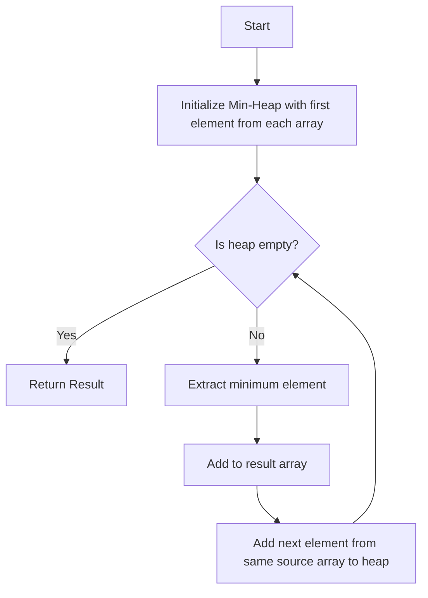

# K-way Merge

## Introduction

K-way merge is a powerful algorithmic pattern used to efficiently combine multiple sorted collections into a single sorted result. This technique is fundamental in many areas of computer science, particularly in external sorting algorithms, database operations, and distributed systems.

The "K" in K-way merge refers to the number of collections being merged. While a simple merge operation (as seen in merge sort) combines two sorted arrays, K-way merge extends this concept to efficiently handle multiple sorted collections simultaneously.

## Understanding K-way Merge

### Basic Concept

At its core, K-way merge works on a simple principle: when you have K sorted collections, you can efficiently merge them by:

1. Looking at the first element of each collection
2. Selecting the smallest (or largest, if sorting in descending order) among them
3. Moving that element to the output collection
4. Advancing the pointer in the collection from which the element was taken
5. Repeating until all collections are exhausted

### K-way Merge vs. Simple Merge

Let's compare the simple 2-way merge (from merge sort) with K-way merge:

- **2-way merge**: Combines 2 sorted arrays into a single sorted array
- **K-way merge**: Combines K sorted arrays into a single sorted array

While we could perform K-way merge by repeatedly applying 2-way merge, this approach would be less efficient. A direct K-way merge processes all K collections simultaneously.

## Implementation Approaches

### Approach 1: Using a Min-Heap (Priority Queue)

The most efficient implementation of K-way merge uses a min-heap (or priority queue) data structure:

```javascript
function kWayMerge(arrays) {
    // Create a min-heap (priority queue)
    const heap = new MinHeap();
    const result = [];
    
    // Initialize with the first element from each array
    for (let i = 0; i < arrays.length; i++) {
        if (arrays[i].length > 0) {
            heap.insert({
                value: arrays[i][0],
                arrayIndex: i,
                elementIndex: 0
            });
        }
    }
    
    // Process the heap until empty
    while (!heap.isEmpty()) {
        // Get the smallest element
        const { value, arrayIndex, elementIndex } = heap.extractMin();
        
        // Add to result
        result.push(value);
        
        // If there are more elements in the same array, add the next one to the heap
        if (elementIndex + 1 < arrays[arrayIndex].length) {
            heap.insert({
                value: arrays[arrayIndex][elementIndex + 1],
                arrayIndex,
                elementIndex: elementIndex + 1
            });
        }
    }
    
    return result;
}
```

For simplicity, this code assumes a `MinHeap` class is available. In practice, you would either implement this yourself or use a library.

### Approach 2: Simple Comparison (Less Efficient)

For educational purposes, here's a simpler approach without using a heap:

```javascript
function simpleKWayMerge(arrays) {
    const result = [];
    // Array of pointers to the current position in each array
    const pointers = new Array(arrays.length).fill(0);
    
    while (true) {
        let minValue = Infinity;
        let minArrayIndex = -1;
        
        // Find the minimum value across all arrays
        for (let i = 0; i < arrays.length; i++) {
            if (pointers[i] < arrays[i].length && arrays[i][pointers[i]] < minValue) {
                minValue = arrays[i][pointers[i]];
                minArrayIndex = i;
            }
        }
        
        // If we didn't find a minimum, we're done
        if (minArrayIndex === -1) break;
        
        // Add minimum to result and advance pointer
        result.push(minValue);
        pointers[minArrayIndex]++;
    }
    
    return result;
}
```

This approach works but has O(nK) time complexity, where n is the total number of elements and K is the number of arrays, making it less efficient for large K.

## Time and Space Complexity

### Min-Heap Implementation:
- **Time Complexity**: O(n log K) where n is the total number of elements across all arrays, and K is the number of arrays.
  - Each element is inserted into and extracted from the heap once, and each operation takes O(log K) time.
- **Space Complexity**: O(K) for storing the heap and O(n) for the output array.

### Simple Comparison Implementation:
- **Time Complexity**: O(nK) which is worse than the heap-based approach for large K.
- **Space Complexity**: O(K) for the pointers array and O(n) for the output array.

## Example Walkthrough

Let's go through a detailed example of merging three sorted arrays using the K-way merge algorithm with a min-heap:

Input:
```
arrays = [
    [1, 5, 7],
    [2, 3, 8],
    [4, 6, 9]
]
```

Step-by-step execution:

1. Initialize the min-heap with the first element from each array:
   - Heap: [1, 2, 4]
   - (with associated array and element indices)

2. Extract min (1) and add it to the result:
   - Result: [1]
   - Add next element from array 0: 5
   - Heap: [2, 5, 4]

3. Extract min (2) and add it to the result:
   - Result: [1, 2]
   - Add next element from array 1: 3
   - Heap: [3, 5, 4]

4. Extract min (3) and add it to the result:
   - Result: [1, 2, 3]
   - Add next element from array 1: 8
   - Heap: [4, 5, 8]

And so on... The final result will be: [1, 2, 3, 4, 5, 6, 7, 8, 9]

## Real-World Applications

### 1. External Sorting

When sorting data that doesn't fit into memory, K-way merge is essential:

```javascript
function externalSort(file, memoryLimit) {
    // Step 1: Read chunks of data that fit in memory
    const chunks = readChunksFromFile(file, memoryLimit);
    
    // Step 2: Sort each chunk and write to temporary files
    const sortedChunkFiles = [];
    for (const chunk of chunks) {
        const sortedChunk = chunk.sort((a, b) => a - b);
        const tempFile = writeToDisk(sortedChunk);
        sortedChunkFiles.push(tempFile);
    }
    
    // Step 3: Use K-way merge to combine sorted chunks
    return kWayMergeFiles(sortedChunkFiles);
}
```

### 2. Merge K Sorted Linked Lists

A common interview question involves merging K sorted linked lists into a single sorted linked list:

```javascript
class ListNode {
    constructor(val) {
        this.val = val;
        this.next = null;
    }
}

function mergeKLists(lists) {
    // Create dummy head
    const dummy = new ListNode(0);
    let current = dummy;
    
    // Create min heap
    const heap = new MinHeap();
    
    // Add first node from each list to heap
    for (let i = 0; i < lists.length; i++) {
        if (lists[i]) {
            heap.insert({node: lists[i], listIndex: i});
        }
    }
    
    // Process until heap is empty
    while (!heap.isEmpty()) {
        const {node, listIndex} = heap.extractMin();
        
        // Add to result
        current.next = node;
        current = current.next;
        
        // If there are more nodes in this list, add the next one
        if (node.next) {
            heap.insert({node: node.next, listIndex});
        }
    }
    
    return dummy.next;
}
```

### 3. Database Query Optimization

Database systems use K-way merge when executing queries that involve sorting or merging multiple sorted data sources:

```javascript
function mergeSortedDatabaseResults(queryResults) {
    // Each query result is already sorted by timestamp
    return kWayMerge(queryResults);
}
```

## Visualizing the K-way Merge Process

This diagram illustrates the K-way merge process using a min-heap:



## Optimizations and Variations

### 1. Limiting Memory Usage

For very large datasets, we can limit how much of each input array is loaded into memory at once:

```javascript
function streamingKWayMerge(arrayStreams, batchSize) {
    const result = [];
    const buffers = arrayStreams.map(stream => stream.nextBatch(batchSize));
    const pointers = new Array(buffers.length).fill(0);
    
    // Implementation similar to k-way merge but with buffer refilling
    // when a buffer is exhausted
    
    return result;
}
```

### 2. Parallel K-way Merge

In multi-core systems, we can parallelize parts of the merge process:

```javascript
function parallelKWayMerge(arrays, numWorkers) {
    // Split the arrays among workers
    const chunks = splitArraysAmongWorkers(arrays, numWorkers);
    
    // Parallel merge within each worker
    const partialResults = parallelMap(chunks, chunk => kWayMerge(chunk));
    
    // Final merge of the worker results
    return kWayMerge(partialResults);
}
```

## Summary

K-way merge is a powerful and efficient algorithm for combining multiple sorted collections. It's a fundamental pattern that extends beyond simple sorting problems and has applications in various domains of computer science:

1. It efficiently merges K sorted collections in O(n log K) time using a min-heap.
2. It's essential for external sorting algorithms when data doesn't fit in memory.
3. It has practical applications in database systems, distributed computing, and more.

Understanding this pattern provides valuable insights into efficient data handling techniques and opens the door to solving complex problems involving multiple sorted datasets.

## Exercises to Practice

1. **Basic K-way Merge**: Implement the K-way merge algorithm using both the min-heap approach and the simple comparison approach.

2. **Merge K Sorted Linked Lists**: Implement a function that merges K sorted linked lists into a single sorted linked list.

3. **External Sort**: Implement a simplified version of external sort using K-way merge.

4. **Streaming Data**: Modify the K-way merge to work with streaming data where not all elements are available at once.

5. **K-way Merge with Duplicates**: Implement a variant that removes duplicates during the merge process.

## Additional Resources

- [Merge Sort and External Sorting](https://en.wikipedia.org/wiki/External_sorting)
- [Priority Queues and Heaps](https://en.wikipedia.org/wiki/Priority_queue)
- [External Merge Sort Algorithm](https://en.wikipedia.org/wiki/External_sorting#External_merge_sort)

By mastering the K-way merge pattern, you'll be equipped with a powerful tool for handling large-scale sorted data efficiently.