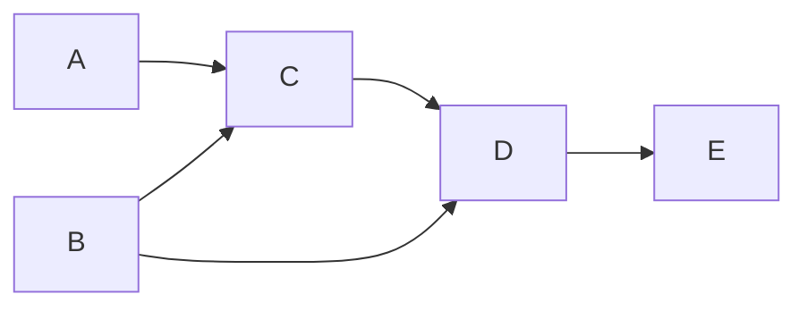

# Topological Sort Pattern

## Introduction

Topological Sort is a linear ordering of vertices in a directed graph such that for every directed edge (u, v), vertex u comes before vertex v in the ordering. In simpler terms, if there is a path from vertex A to vertex B in the graph, then vertex A appears before vertex B in the topological ordering.

This pattern is particularly useful when you need to:
- Schedule tasks with dependencies
- Determine build order of software packages
- Resolve class dependencies in programming languages
- Find a valid course sequence when courses have prerequisites

The key insight is that topological sort helps us solve problems where we need to process elements in an order that respects their dependencies.

## Prerequisites

To understand the Topological Sort pattern, you should be familiar with:
- Basic graph concepts (vertices, edges, directed graphs)
- Graph representation (adjacency list/matrix)
- Depth-First Search (DFS) or Breadth-First Search (BFS)

## How Topological Sort Works

A topological sort can only be applied to a **Directed Acyclic Graph (DAG)** - a directed graph with no cycles. If the graph contains a cycle, no valid topological ordering exists since there would be circular dependencies.

There are two primary algorithms for implementing topological sort:

1. **Kahn's Algorithm** (Using BFS)
2. **DFS-based Algorithm**

Let's explore both approaches:

### Kahn's Algorithm (BFS Approach)

Kahn's algorithm uses a breadth-first approach:

1. Calculate the in-degree (number of incoming edges) for each vertex
2. Identify vertices with in-degree 0 (no dependencies) and add them to a queue
3. While the queue is not empty:
   - Remove a vertex from the queue
   - Add it to the result list
   - Decrease the in-degree of its adjacent vertices by 1
   - If the in-degree of any adjacent vertex becomes 0, add it to the queue
4. If the result list has fewer elements than the number of vertices, the graph has a cycle

Let's implement this:

```javascript
function topologicalSortKahn(graph) {
  const result = [];
  const inDegree = {}; // Track in-degree for each vertex
  const queue = [];
  
  // Initialize in-degree for all vertices
  for (const node in graph) {
    inDegree[node] = inDegree[node] || 0;
    for (const neighbor of graph[node]) {
      inDegree[neighbor] = (inDegree[neighbor] || 0) + 1;
    }
  }
  
  // Add all vertices with 0 in-degree to the queue
  for (const node in inDegree) {
    if (inDegree[node] === 0) {
      queue.push(node);
    }
  }
  
  // Process the queue
  while (queue.length > 0) {
    const currentNode = queue.shift();
    result.push(currentNode);
    
    // Reduce in-degree of each neighbor by 1
    if (graph[currentNode]) {
      for (const neighbor of graph[currentNode]) {
        inDegree[neighbor]--;
        
        // If in-degree becomes 0, add to the queue
        if (inDegree[neighbor] === 0) {
          queue.push(neighbor);
        }
      }
    }
  }
  
  // Check if there was a cycle
  if (result.length !== Object.keys(inDegree).length) {
    return null; // Graph has at least one cycle
  }
  
  return result;
}
```

### DFS-based Algorithm

The DFS approach:

1. Run DFS for each unvisited vertex
2. During DFS, after exploring all neighbors of a vertex, add it to the front of the result list
3. The final reversed list is the topological order

Here's the implementation:

```javascript
function topologicalSortDFS(graph) {
  const visited = new Set();
  const visiting = new Set();  // Track nodes in the current DFS path
  const result = [];
  
  function dfs(node) {
    // Check for cycles
    if (visiting.has(node)) {
      return false;  // Found a cycle
    }
    
    if (visited.has(node)) {
      return true;  // Already processed this node
    }
    
    visiting.add(node);
    
    // Visit all neighbors
    if (graph[node]) {
      for (const neighbor of graph[node]) {
        if (!dfs(neighbor)) {
          return false;  // Propagate cycle detection
        }
      }
    }
    
    // Remove from visiting set and add to visited set
    visiting.delete(node);
    visited.add(node);
    
    // Add to result - prepend for correct order
    result.unshift(node);
    
    return true;
  }
  
  // Process all nodes
  for (const node in graph) {
    if (!visited.has(node)) {
      if (!dfs(node)) {
        return null;  // Graph has at least one cycle
      }
    }
  }
  
  return result;
}
```

## Visual Representation

Let's visualize the topological sort process on a simple directed graph:



In this graph, a valid topological ordering would be: `A, B, C, D, E` or `B, A, C, D, E`

Let's see how Kahn's algorithm processes this graph:

1. Calculate in-degrees: A(0), B(0), C(2), D(2), E(1)
2. Add A and B to the queue (in-degree 0)
3. Process A: Remove A from queue, add to result. Decrease C's in-degree to 1
4. Process B: Remove B from queue, add to result. Decrease C's in-degree to 0 and D's to 1
5. Add C to queue (in-degree now 0)
6. Process C: Remove C from queue, add to result. Decrease D's in-degree to 0
7. Add D to queue (in-degree now 0)
8. Process D: Remove D from queue, add to result. Decrease E's in-degree to 0
9. Add E to queue (in-degree now 0)
10. Process E: Remove E from queue, add to result
11. Queue is empty, resulting ordering: `A, B, C, D, E`

## Example Problems

### 1. Course Schedule

**Problem**: There are n courses you need to take, labeled from 0 to n-1. Some courses have prerequisites. For example, to take course 0 you have to first take course 1, which is expressed as a pair [0,1]. Given the total number of courses and a list of prerequisite pairs, determine if you can finish all courses.

**Input**:
- n = 4
- prerequisites = [[1,0],[2,0],[3,1],[3,2]]

**Explanation**: To take course 1, you should have finished course 0. To take course 2, you should have finished course 0. To take course 3, you should have finished courses 1 and 2.

**Solution**:

```javascript
function canFinish(numCourses, prerequisites) {
  // Build adjacency list
  const graph = Array(numCourses).fill(0).map(() => []);
  for (const [course, prereq] of prerequisites) {
    graph[prereq].push(course);
  }
  
  // Count in-degree for each course
  const inDegree = Array(numCourses).fill(0);
  for (const [course, prereq] of prerequisites) {
    inDegree[course]++;
  }
  
  // Add all courses with no prerequisites to the queue
  const queue = [];
  for (let i = 0; i < numCourses; i++) {
    if (inDegree[i] === 0) {
      queue.push(i);
    }
  }
  
  // Process the queue
  let count = 0;
  while (queue.length > 0) {
    const course = queue.shift();
    count++;
    
    // For each course unlocked by this prerequisite
    for (const nextCourse of graph[course]) {
      inDegree[nextCourse]--;
      if (inDegree[nextCourse] === 0) {
        queue.push(nextCourse);
      }
    }
  }
  
  // Check if we can take all courses
  return count === numCourses;
}
```

For our example:
- Input: n = 4, prerequisites = [[1,0],[2,0],[3,1],[3,2]]
- Output: true
- We can complete all courses by taking them in the order: 0, 1, 2, 3

### 2. Alien Dictionary

**Problem**: Given a sorted dictionary of an alien language, find the order of characters in the alphabet.

**Input**: Words = ["wrt", "wrf", "er", "ett", "rftt"]

**Output**: "wertf"

**Explanation**: From the given words, we can determine:
- 'w' comes before 'e' (comparing "wrt" and "er")
- 'e' comes before 'r' (comparing "er" and "rftt")
- 'r' comes before 't' (comparing "wrt" and "wrf")
- 't' comes before 'f' (comparing "wrt" and "wrf")

**Solution**:

```javascript
function alienOrder(words) {
  // Build a graph
  const graph = {};
  const inDegree = {};
  
  // Initialize graph and in-degree for all chars
  for (const word of words) {
    for (const char of word) {
      graph[char] = graph[char] || [];
      inDegree[char] = inDegree[char] || 0;
    }
  }
  
  // Build the graph by comparing adjacent words
  for (let i = 0; i < words.length - 1; i++) {
    const word1 = words[i];
    const word2 = words[i + 1];
    
    // Check for invalid input where a longer word is before
    // a shorter word it starts with
    if (word1.length > word2.length && word1.startsWith(word2)) {
      return "";
    }
    
    // Find the first different character
    for (let j = 0; j < Math.min(word1.length, word2.length); j++) {
      if (word1[j] !== word2[j]) {
        graph[word1[j]].push(word2[j]);
        inDegree[word2[j]]++;
        break;
      }
    }
  }
  
  // Perform topological sort
  const queue = [];
  const result = [];
  
  // Add all vertices with 0 in-degree to the queue
  for (const char in inDegree) {
    if (inDegree[char] === 0) {
      queue.push(char);
    }
  }
  
  // Process the queue
  while (queue.length > 0) {
    const char = queue.shift();
    result.push(char);
    
    // Decrease in-degree of neighbors
    for (const nextChar of graph[char]) {
      inDegree[nextChar]--;
      if (inDegree[nextChar] === 0) {
        queue.push(nextChar);
      }
    }
  }
  
  // Check if there's a cycle
  if (result.length !== Object.keys(inDegree).length) {
    return "";  // Graph has a cycle
  }
  
  return result.join('');
}
```

For our example:
- Input: ["wrt", "wrf", "er", "ett", "rftt"]
- Output: "wertf"

## Practical Applications

Topological sort has many practical applications:

1. **Build Systems**: Tools like Make, Maven, or Gradle use topological sorting to determine the build order of dependencies.

2. **Task Scheduling**: When tasks have dependencies (one task must be completed before another can start), topological sort helps find a valid execution order.

3. **Course Planning**: Universities use topological sorting to help students plan their course schedules when courses have prerequisites.

4. **Package Management**: NPM, pip, and other package managers use dependency resolution algorithms based on topological sorting.

5. **Data Processing Pipelines**: ETL (Extract, Transform, Load) workflows often have dependencies that can be modeled as a graph.

## Time and Space Complexity

For both the DFS and BFS (Kahn's) implementations:

- **Time Complexity**: O(V + E) where V is the number of vertices and E is the number of edges in the graph.
- **Space Complexity**: O(V + E) to store the graph, plus O(V) for the output.

## Common Pitfalls

1. **Forgetting to check for cycles**: A valid topological sort exists only for DAGs (Directed Acyclic Graphs).

2. **Not handling disconnected components**: Your algorithm should process all vertices, even if the graph is not fully connected.

3. **Confusing edge direction**: In a topological sort, if there's an edge from A to B, it means A must come before B (not the other way around).

## Summary

The Topological Sort pattern is a powerful technique for solving dependency-related problems. It allows us to:

- Find a linear ordering of tasks that respects all dependencies
- Detect cycles in directed graphs
- Resolve complex dependency chains

Remember that topological sort can only be applied to Directed Acyclic Graphs (DAGs). If your problem involves determining a valid processing order based on dependencies, topological sort is likely the right approach.

## Practice Exercises

1. **Build Order**: Given a list of projects and a list of dependencies (where a dependency [A, B] means B depends on A), find a build order that allows the projects to be built.

2. **Parallel Task Scheduling**: Given a directed acyclic graph representing task dependencies and task completion times, find the minimum time to complete all tasks if you can run multiple tasks in parallel.

3. **Implement Course Schedule II**: Return the ordering of courses you should take to finish all courses, given the dependencies.

4. **Recipe Steps**: Given a recipe with steps and dependencies between steps (some steps must be completed before others), determine a valid order to execute the recipe.

## Additional Resources

- [Khan Academy: Topological Sort](https://www.khanacademy.org/computing/computer-science/algorithms/graph-representation/a/representing-graphs)
- [GeeksforGeeks: Topological Sorting](https://www.geeksforgeeks.org/topological-sorting/)
- [Visualgo: Graph Algorithms](https://visualgo.net/en/dfsbfs)

With the Topological Sort pattern in your toolkit, you'll be well-equipped to tackle a wide range of graph-based dependency problems efficiently!