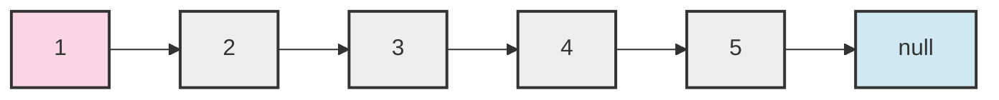

# Fast and Slow Pointers

## Introduction

The Fast and Slow Pointers pattern (also known as the "Hare and Tortoise" algorithm) is a pointer technique that uses two pointers moving through a sequence at different speeds. This elegant approach is particularly useful for:

- Detecting cycles in a linked list
- Finding the middle of a linked list
- Determining if a linked list is a palindrome
- Finding a specific element in a circular array

The beauty of this technique lies in its simplicity and efficiency. By using two pointers that move at different speeds, we can solve problems with O(n) time complexity and O(1) space complexity.

## How It Works

The core idea is straightforward:

1. Initialize two pointers at the beginning of a sequence
2. Move the "slow" pointer one step at a time
3. Move the "fast" pointer two (or more) steps at a time
4. Analyze what happens based on how these pointers move and potentially intersect

Let's visualize this pattern:



In the standard implementation:
- The slow pointer starts at the head (node 1)
- The fast pointer also starts at the head (node 1)

After one iteration:
- Slow moves to node 2
- Fast moves to node 3

## Common Applications

### 1. Detecting Cycles in a Linked List

One of the most well-known applications is detecting if a linked list has a cycle.

```javascript
function hasCycle(head) {
  if (!head || !head.next) return false;
  
  let slow = head;
  let fast = head;
  
  // Move slow by 1 and fast by 2
  while (fast !== null && fast.next !== null) {
    slow = slow.next;
    fast = fast.next.next;
    
    // If they meet, there's a cycle
    if (slow === fast) {
      return true;
    }
  }
  
  return false;
}
```

**How it works:**
- In a linked list without a cycle, the fast pointer will eventually reach the end
- In a linked list with a cycle, the fast pointer will eventually catch up to the slow pointer

**Example:**

```
Input: 1 → 2 → 3 → 4 → 2 (cycles back to 2)
Output: true

Input: 1 → 2 → 3 → 4 → null
Output: false
```

### 2. Finding the Middle of a Linked List

Finding the middle element efficiently in a single pass:

```javascript
function findMiddle(head) {
  if (!head) return null;
  
  let slow = head;
  let fast = head;
  
  // When fast reaches the end, slow will be at the middle
  while (fast !== null && fast.next !== null) {
    slow = slow.next;
    fast = fast.next.next;
  }
  
  return slow;
}
```

**Example:**

```
Input: 1 → 2 → 3 → 4 → 5 → null
Output: 3 (the middle node)

Input: 1 → 2 → 3 → 4 → null
Output: 3 (for even length lists, we return the second middle node)
```

### 3. Finding the Start of a Cycle

Once we've detected a cycle, we can find where it begins:

```javascript
function detectCycleStart(head) {
  if (!head || !head.next) return null;
  
  let slow = head;
  let fast = head;
  let hasCycle = false;
  
  // Detect if there's a cycle
  while (fast !== null && fast.next !== null) {
    slow = slow.next;
    fast = fast.next.next;
    
    if (slow === fast) {
      hasCycle = true;
      break;
    }
  }
  
  if (!hasCycle) return null;
  
  // Find the start of the cycle
  slow = head;
  while (slow !== fast) {
    slow = slow.next;
    fast = fast.next;
  }
  
  return slow;
}
```

**How it works:**
1. First, we detect if there's a cycle using the standard algorithm
2. Then, we reset the slow pointer to head
3. Move both pointers at the same pace (one step each)
4. The point where they meet is the start of the cycle

### 4. Determining If a Linked List is a Palindrome

We can use fast and slow pointers to efficiently check if a linked list is a palindrome:

```javascript
function isPalindrome(head) {
  if (!head || !head.next) return true;
  
  // Find the middle of the linked list
  let slow = head;
  let fast = head;
  
  while (fast.next !== null && fast.next.next !== null) {
    slow = slow.next;
    fast = fast.next.next;
  }
  
  // Reverse the second half
  let secondHalfHead = reverseList(slow.next);
  let firstHalfPtr = head;
  let secondHalfPtr = secondHalfHead;
  
  // Compare the two halves
  let result = true;
  while (secondHalfPtr !== null) {
    if (firstHalfPtr.val !== secondHalfPtr.val) {
      result = false;
      break;
    }
    firstHalfPtr = firstHalfPtr.next;
    secondHalfPtr = secondHalfPtr.next;
  }
  
  // Restore the list (optional)
  slow.next = reverseList(secondHalfHead);
  
  return result;
}

function reverseList(head) {
  let prev = null;
  let current = head;
  
  while (current !== null) {
    let next = current.next;
    current.next = prev;
    prev = current;
    current = next;
  }
  
  return prev;
}
```

## Challenge: Find the Happy Number

A "happy number" is defined by the following process:
- Starting with any positive integer, replace the number by the sum of the squares of its digits
- Repeat the process until the number equals 1 (where it will stay), or it loops endlessly in a cycle
- Those numbers for which this process ends in 1 are happy numbers

We can solve this using fast and slow pointers:

```javascript
function isHappy(n) {
  let slow = n;
  let fast = n;
  
  do {
    slow = calculateSquareSum(slow);
    fast = calculateSquareSum(calculateSquareSum(fast));
  } while (slow !== fast);
  
  return slow === 1;
}

function calculateSquareSum(n) {
  let sum = 0;
  while (n > 0) {
    let digit = n % 10;
    sum += digit * digit;
    n = Math.floor(n / 10);
  }
  return sum;
}
```

**Example:**

```
Input: 19
Output: true
Explanation:
1² + 9² = 82
8² + 2² = 68
6² + 8² = 100
1² + 0² + 0² = 1
```

## When to Use Fast and Slow Pointers

Use this pattern when:

1. Dealing with cyclic linked lists or arrays
2. You need to find a specific position in a linked list (like the middle element)
3. Problems involving cycle detection
4. You need O(1) space complexity 

## Common Variations

1. **Different starting positions**: Sometimes the fast pointer starts one node ahead
2. **Different speeds**: Though commonly the fast pointer moves twice as fast as the slow one, this ratio can be adjusted
3. **More than two pointers**: Some complex problems might require three or more pointers moving at different speeds

## Summary

The Fast and Slow Pointers technique is an elegant solution for many linked list problems, offering optimal space complexity. It's especially powerful for:

- Cycle detection
- Finding the middle element
- Finding the start of a cycle
- Checking for palindromes
- Solving certain mathematical problems like detecting happy numbers

The key insight is that by having pointers move at different speeds, we can infer properties about the data structure based on if, when, and where they meet.

## Practice Exercises

1. Find if a linked list has a cycle
2. Find the length of a cycle in a linked list
3. Find the middle node of a linked list
4. Determine if a linked list is a palindrome
5. Find the node where two linked lists intersect
6. Implement the "happy number" algorithm

## Additional Resources

- Floyd's Cycle-Finding Algorithm (the mathematical foundation)
- Tortoise and Hare algorithm variations
- Problems involving cyclical detection in arrays

Remember, the Fast and Slow Pointers pattern is a fundamental technique that every programmer should master. It's a perfect example of how a simple idea can lead to elegant and efficient solutions.