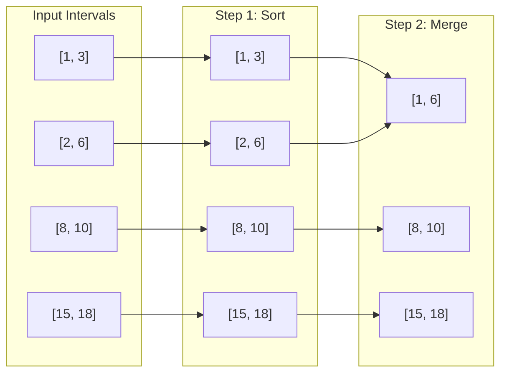

# Merge Intervals

## Introduction

The Merge Intervals pattern is a powerful technique for solving problems that involve overlapping intervals or ranges. This pattern is particularly useful when you need to:

- Merge overlapping intervals into a single interval
- Find intersections between intervals
- Determine if intervals overlap
- Schedule resources efficiently

In this tutorial, we'll explore the Merge Intervals pattern in depth, understand when to use it, and solve common problems that benefit from this approach.

## What are Intervals?

An interval represents a range with a start and end point. Intervals are commonly represented as:

- An array of two values: `[start, end]`
- An object with start and end properties: `{ start: value, end: value }`

For example, the interval `[1, 5]` represents all values from 1 to 5 (inclusive). Intervals can represent time periods, numerical ranges, or any concept with a defined start and end.

## The Core Merge Intervals Algorithm

The fundamental operation in this pattern is merging overlapping intervals. Here's a step-by-step approach:

1. Sort the intervals based on their start times
2. Initialize a result array with the first interval
3. Iterate through the remaining intervals:
   - If the current interval overlaps with the last interval in the result, merge them
   - Otherwise, add the current interval to the result

Let's implement this algorithm in JavaScript:

```javascript
function mergeIntervals(intervals) {
  if (intervals.length <= 1) {
    return intervals;
  }
  
  // Sort intervals based on start values
  intervals.sort((a, b) => a[0] - b[0]);
  
  const result = [intervals[0]];
  
  for (let i = 1; i < intervals.length; i++) {
    const currentInterval = intervals[i];
    const lastInterval = result[result.length - 1];
    
    // Check if intervals overlap
    if (currentInterval[0] <= lastInterval[1]) {
      // Merge overlapping intervals
      lastInterval[1] = Math.max(lastInterval[1], currentInterval[1]);
    } else {
      // Add non-overlapping interval to result
      result.push(currentInterval);
    }
  }
  
  return result;
}
```

### Example:

```javascript
const intervals = [[1, 3], [2, 6], [8, 10], [15, 18]];
console.log(mergeIntervals(intervals));
// Output: [[1, 6], [8, 10], [15, 18]]
```

## Visualizing the Merge Process

Let's visualize how the merging process works with our example:



## Common Variations and Related Problems

### 1. Interval Intersection

Finding the intersection of two interval lists is another common problem that uses a similar approach:

```javascript
function intervalIntersection(listA, listB) {
  const result = [];
  let i = 0, j = 0;
  
  while (i < listA.length && j < listB.length) {
    // Find the bounds of the intersection
    const low = Math.max(listA[i][0], listB[j][0]);
    const high = Math.min(listA[i][1], listB[j][1]);
    
    // If there is an intersection, add it to result
    if (low <= high) {
      result.push([low, high]);
    }
    
    // Move pointer of the interval with the smaller end time
    if (listA[i][1] < listB[j][1]) {
      i++;
    } else {
      j++;
    }
  }
  
  return result;
}
```

Example:
```javascript
const A = [[0, 2], [5, 10], [13, 23], [24, 25]];
const B = [[1, 5], [8, 12], [15, 24], [25, 26]];
console.log(intervalIntersection(A, B));
// Output: [[1, 2], [5, 5], [8, 10], [15, 23], [24, 24], [25, 25]]
```

### 2. Insert Interval

Given a set of non-overlapping intervals and a new interval, the task is to insert the new interval at the correct position and merge if necessary:

```javascript
function insertInterval(intervals, newInterval) {
  const result = [];
  let i = 0;
  
  // Add all intervals that come before the new interval
  while (i < intervals.length && intervals[i][1] < newInterval[0]) {
    result.push(intervals[i]);
    i++;
  }
  
  // Merge all overlapping intervals
  while (i < intervals.length && intervals[i][0] <= newInterval[1]) {
    newInterval[0] = Math.min(newInterval[0], intervals[i][0]);
    newInterval[1] = Math.max(newInterval[1], intervals[i][1]);
    i++;
  }
  
  // Add the merged interval
  result.push(newInterval);
  
  // Add the rest of the intervals
  while (i < intervals.length) {
    result.push(intervals[i]);
    i++;
  }
  
  return result;
}
```

Example:
```javascript
const intervals = [[1, 3], [6, 9]];
const newInterval = [2, 5];
console.log(insertInterval(intervals, newInterval));
// Output: [[1, 5], [6, 9]]
```

### 3. Meeting Rooms

Determining if a person can attend all meetings, given their start and end times:

```javascript
function canAttendAllMeetings(intervals) {
  // Sort intervals based on start time
  intervals.sort((a, b) => a[0] - b[0]);
  
  // Check for any overlapping meetings
  for (let i = 1; i < intervals.length; i++) {
    if (intervals[i][0] < intervals[i - 1][1]) {
      return false; // Overlap found
    }
  }
  
  return true; // No overlaps
}
```

Example:
```javascript
const meetings1 = [[0, 30], [5, 10], [15, 20]];
console.log(canAttendAllMeetings(meetings1)); // Output: false

const meetings2 = [[7, 10], [2, 4]];
console.log(canAttendAllMeetings(meetings2)); // Output: true
```

### 4. Minimum Meeting Rooms

Finding the minimum number of meeting rooms required to schedule all meetings:

```javascript
function minMeetingRooms(intervals) {
  const starts = intervals.map(interval => interval[0]).sort((a, b) => a - b);
  const ends = intervals.map(interval => interval[1]).sort((a, b) => a - b);
  
  let rooms = 0;
  let endPointer = 0;
  
  for (let i = 0; i < starts.length; i++) {
    if (starts[i] < ends[endPointer]) {
      // Need a new room
      rooms++;
    } else {
      // Can reuse a room that's freed up
      endPointer++;
    }
  }
  
  return rooms;
}
```

Example:
```javascript
const meetings = [[0, 30], [5, 10], [15, 20]];
console.log(minMeetingRooms(meetings)); // Output: 2
```

## Real-World Applications

The Merge Intervals pattern is incredibly useful in real-world scenarios:

### 1. Calendar Scheduling

When managing a calendar application, you might need to:
- Find available time slots
- Detect overlapping appointments
- Merge related events

```javascript
function findAvailableSlots(meetings, dayStart, dayEnd) {
  // Add day boundaries
  const intervals = [...meetings];
  
  // Sort meetings
  intervals.sort((a, b) => a[0] - b[0]);
  
  // Merge overlapping meetings
  const mergedMeetings = mergeIntervals(intervals);
  
  // Find available slots
  const availableSlots = [];
  let currentTime = dayStart;
  
  for (const meeting of mergedMeetings) {
    if (currentTime < meeting[0]) {
      availableSlots.push([currentTime, meeting[0]]);
    }
    currentTime = Math.max(currentTime, meeting[1]);
  }
  
  if (currentTime < dayEnd) {
    availableSlots.push([currentTime, dayEnd]);
  }
  
  return availableSlots;
}
```

Example:
```javascript
const meetings = [[9, 10.5], [12, 13], [16, 18]];
const dayStart = 8;
const dayEnd = 20;
console.log(findAvailableSlots(meetings, dayStart, dayEnd));
// Output: [[8, 9], [10.5, 12], [13, 16], [18, 20]]
```

### 2. Resource Allocation

When managing resources like servers, rooms, or equipment:

```javascript
function minimumResourcesRequired(tasks) {
  // Similar to the minimum meeting rooms problem
  const starts = tasks.map(task => task[0]).sort((a, b) => a - b);
  const ends = tasks.map(task => task[1]).sort((a, b) => a - b);
  
  let resources = 0;
  let endPointer = 0;
  
  for (let i = 0; i < starts.length; i++) {
    if (starts[i] < ends[endPointer]) {
      resources++;
    } else {
      endPointer++;
    }
  }
  
  return resources;
}
```

Example:
```javascript
const serverTasks = [[1, 4], [2, 5], [3, 6], [6, 8]];
console.log(minimumResourcesRequired(serverTasks)); // Output: 3
```

### 3. Network Coverage

Calculating total coverage of network signals:

```javascript
function calculateCoverage(ranges) {
  if (ranges.length === 0) return 0;
  
  // Merge overlapping ranges
  const mergedRanges = mergeIntervals(ranges);
  
  // Calculate total coverage
  let totalCoverage = 0;
  for (const range of mergedRanges) {
    totalCoverage += (range[1] - range[0]);
  }
  
  return totalCoverage;
}
```

Example:
```javascript
const networkCoverage = [[1, 5], [3, 7], [10, 15]];
console.log(calculateCoverage(networkCoverage)); // Output: 12
```

## Performance Considerations

The time complexity of the merge intervals algorithm is dominated by the sorting operation:

- Time Complexity: O(n log n) - due to the initial sorting
- Space Complexity: O(n) - for storing the result

For large datasets, consider:
- Using more efficient data structures like interval trees for repeated queries
- Implementing efficient searching when dealing with very large numbers of intervals
- Pre-sorting data if possible to avoid repeated sorting operations

## Summary

The Merge Intervals pattern is a versatile approach for solving problems involving overlapping ranges. Key steps include:

1. Sort intervals based on start times
2. Process intervals sequentially, merging when overlaps occur
3. Handle edge cases properly (empty input, single intervals, etc.)

This pattern is particularly valuable for:
- Calendar and scheduling problems
- Resource allocation
- Time-based data processing
- Range-based analyses

By mastering this pattern, you'll gain a powerful tool for solving a wide range of real-world problems involving intervals and ranges.

## Practice Exercises

Here are some exercises to strengthen your understanding of the Merge Intervals pattern:

1. **Employee Free Time**: Given the working hours of multiple employees, find the common free time slots.
2. **Maximum CPU Load**: Given start and end times of CPU tasks with their load, find the maximum CPU load at any time.
3. **Interval List Coverage**: Determine if one set of intervals completely covers another set.
4. **Minimum Interval Removal**: Find the minimum number of intervals to remove to make the rest non-overlapping.
5. **Maximum Meeting Capacity**: Calculate the maximum number of concurrent meetings occurring at any time.

## Additional Resources

- [LeetCode Interval Problems Collection](https://leetcode.com/tag/interval/)
- [GeeksforGeeks Merge Overlapping Intervals](https://www.geeksforgeeks.org/merging-intervals/)
- "Algorithms" by Robert Sedgewick - Chapter on Interval Search Trees

Happy coding and interval merging!