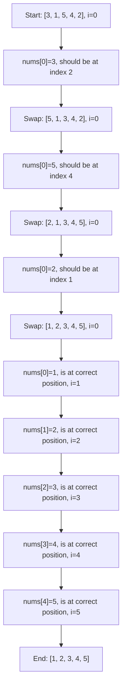

# Cyclic Sort

In this lesson, you'll learn about the **Cyclic Sort** pattern, a specialized sorting algorithm that works exceptionally well for a specific type of problem. While not as widely known as quicksort or merge sort, this pattern is incredibly powerful when dealing with arrays containing numbers in a given range.

## Introduction

Cyclic Sort is particularly useful when you're dealing with arrays containing numbers in the range of 1 to n (or 0 to n-1). The key insight behind this pattern is that if you know the range of numbers, you can use that information to efficiently sort the array with just a single pass, achieving O(n) time complexity.

The pattern gets its name because it uses cycles of swaps to place elements in their correct positions.

## How Cyclic Sort Works

The idea is simple but powerful:

1. Every element in the array should be at the index equal to its value (minus 1 for 1-based arrays)
2. We iterate through the array, and if an element is not at its correct position, we swap it to where it should go
3. After a swap, we don't move to the next element immediately because the new element at our current position might also be out of place
4. We continue swapping until we place an element in its correct position or detect a duplicate

Let's understand this with a step-by-step example.

## Basic Implementation

Here's a basic implementation of the Cyclic Sort algorithm for an array containing numbers from 1 to n:

```javascript
function cyclicSort(nums) {
  let i = 0;
  
  // Iterate through the array
  while (i < nums.length) {
    // Correct position for current element
    const correctPos = nums[i] - 1;
    
    // If the element is not at the correct position, swap
    if (nums[i] !== nums[correctPos]) {
      [nums[i], nums[correctPos]] = [nums[correctPos], nums[i]];
    } else {
      // Move to the next element only if current element is in correct position
      i++;
    }
  }
  
  return nums;
}
```

## Step-by-Step Example

Let's trace through the algorithm using an example:

Input array: `[3, 1, 5, 4, 2]`

The goal is to sort this array using the cyclic sort pattern:



Let's break down what's happening step by step:

1. We start with `i = 0` and `nums[0] = 3`
2. The correct position for 3 is at index 2 (3-1)
3. We swap 3 with the element at index 2, so array becomes `[5, 1, 3, 4, 2]`
4. Now at `i = 0`, we have `nums[0] = 5`
5. The correct position for 5 is at index 4 (5-1)
6. We swap 5 with element at index 4, so array becomes `[2, 1, 3, 4, 5]`
7. Now at `i = 0`, we have `nums[0] = 2`
8. The correct position for 2 is at index 1 (2-1)
9. We swap 2 with element at index 1, so array becomes `[1, 2, 3, 4, 5]`
10. Now at `i = 0`, we have `nums[0] = 1`
11. 1 is at the correct position (index 0), so we increment i to 1
12. We continue this process, but all remaining elements are already in their correct positions
13. The final sorted array is `[1, 2, 3, 4, 5]`

## Time and Space Complexity

- **Time Complexity**: O(n) - We perform at most n-1 swaps and each element is visited at most twice.
- **Space Complexity**: O(1) - We sort in-place without using any extra space.

## Variations and Applications

This pattern is extremely useful for solving a variety of problems. Here are some common variations:

### 1. Finding Missing Numbers

The Cyclic Sort pattern is excellent for finding missing numbers in an array containing numbers in a given range.

```javascript
function findMissingNumber(nums) {
  let i = 0;
  
  // Apply cyclic sort
  while (i < nums.length) {
    const correctPos = nums[i];
    if (nums[i] < nums.length && nums[i] !== nums[correctPos]) {
      [nums[i], nums[correctPos]] = [nums[correctPos], nums[i]];
    } else {
      i++;
    }
  }
  
  // Find the missing number
  for (i = 0; i < nums.length; i++) {
    if (nums[i] !== i) {
      return i;
    }
  }
  
  return nums.length;
}

// Example: Find the missing number in [3, 0, 1]
console.log(findMissingNumber([3, 0, 1])); // Output: 2
```

### 2. Finding Duplicate Numbers

Another common application is finding duplicates in an array:

```javascript
function findDuplicate(nums) {
  let i = 0;
  
  while (i < nums.length) {
    const correctPos = nums[i] - 1;
    if (nums[i] !== nums[correctPos]) {
      [nums[i], nums[correctPos]] = [nums[correctPos], nums[i]];
    } else if (i !== correctPos) {
      // If the element is not at its correct position but is already equal to
      // the element at its correct position, we've found a duplicate
      return nums[i];
    } else {
      i++;
    }
  }
  
  return -1; // No duplicate found
}

// Example: Find the duplicate in [1, 3, 4, 2, 2]
console.log(findDuplicate([1, 3, 4, 2, 2])); // Output: 2
```

### 3. Finding All Missing Numbers

We can extend this pattern to find all missing numbers in an array:

```javascript
function findAllMissingNumbers(nums) {
  let i = 0;
  
  // Apply cyclic sort
  while (i < nums.length) {
    const correctPos = nums[i] - 1;
    if (nums[i] > 0 && nums[i] <= nums.length && nums[i] !== nums[correctPos]) {
      [nums[i], nums[correctPos]] = [nums[correctPos], nums[i]];
    } else {
      i++;
    }
  }
  
  // Find all missing numbers
  const missingNumbers = [];
  for (i = 0; i < nums.length; i++) {
    if (nums[i] !== i + 1) {
      missingNumbers.push(i + 1);
    }
  }
  
  return missingNumbers;
}

// Example: Find all missing numbers in [4, 3, 2, 7, 8, 2, 3, 1]
console.log(findAllMissingNumbers([4, 3, 2, 7, 8, 2, 3, 1])); // Output: [5, 6]
```

## Real-World Applications

1. **Data Validation**: Cyclic Sort can be used to quickly validate if a range of numbers is complete.

2. **Sensor Data Analysis**: In IoT applications, when sensors report data with sequence numbers, Cyclic Sort can help identify missing readings.

3. **Database Integrity**: When records are supposed to have sequential IDs, this pattern can help find gaps or duplicates.

4. **Attendance Systems**: In an attendance tracking system, you can use this pattern to quickly identify absent students.

## When to Use Cyclic Sort

Cyclic Sort is most effective when:

1. The problem involves an array containing numbers in a specific range (typically 1 to n or 0 to n-1)
2. You need to find missing numbers, duplicates, or sort the array efficiently
3. You want a solution with O(n) time complexity and O(1) space complexity
4. The array elements have a natural "home" position based on their values

## Summary

The Cyclic Sort pattern is a powerful technique for efficiently solving problems that involve arrays of numbers in a specific range. By leveraging the relationship between array indices and values, it achieves O(n) time complexity with O(1) space complexity.

Key takeaways:
- Works best for arrays containing numbers in a range like 1 to n
- Can be used to sort arrays, find missing numbers, or identify duplicates
- Uses cycles of swaps to place elements where they belong
- Usually achieves O(n) time complexity with O(1) space complexity

## Practice Exercises

To reinforce your understanding of the Cyclic Sort pattern, try these exercises:

1. Implement the Cyclic Sort algorithm for an array of numbers from 0 to n-1.
2. Find the smallest missing positive number in an unsorted array.
3. Find all duplicates in an array where each integer appears once or twice.
4. Given an array of n+1 integers in the range 1 to n, find the one that appears twice.
5. Find the first k missing positive numbers in an array.

## Additional Resources

- [Leetcode Problems on Cyclic Sort](https://leetcode.com/tag/sort/) - Many problems can be efficiently solved using this pattern.
- [GeeksforGeeks - Cycle Sort](https://www.geeksforgeeks.org/cycle-sort/) - Additional explanation and examples.

Happy coding!