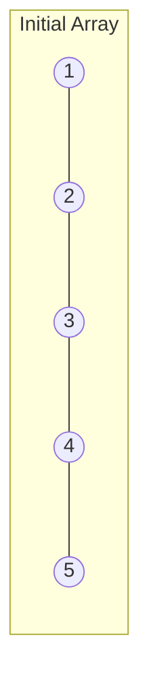
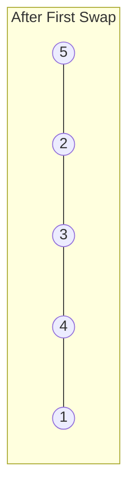
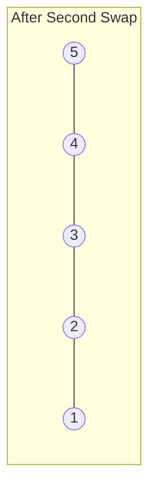
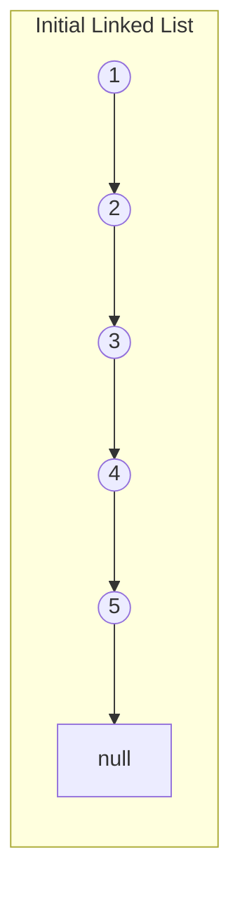
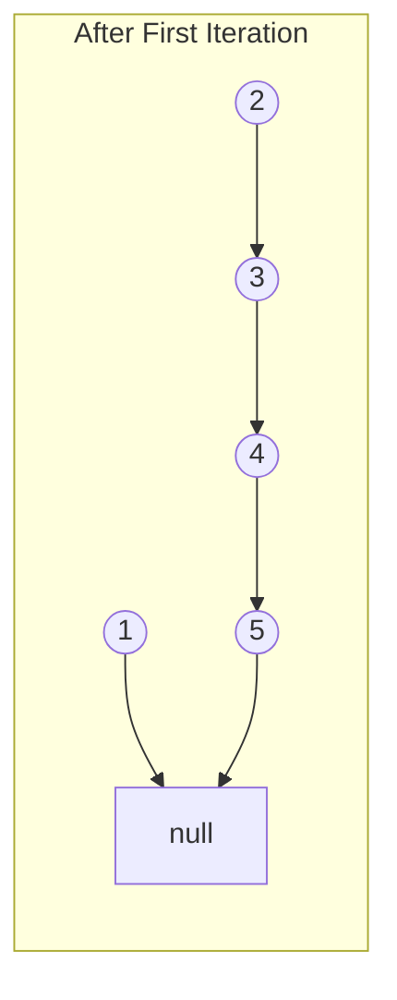
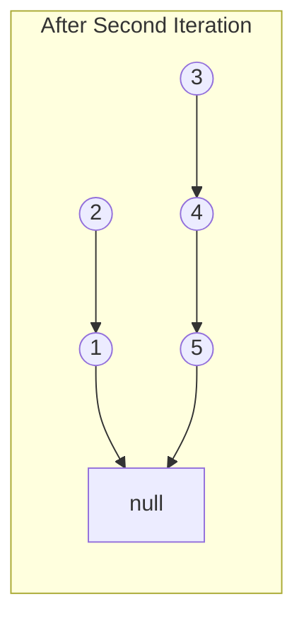

# In-place Reversal

## Introduction

In-place reversal is a powerful problem-solving pattern that allows you to modify data structures like arrays and linked lists without using additional space. As the name suggests, this pattern involves reversing elements "in place"—meaning you manipulate the original data structure directly rather than creating a new one.

This technique is particularly valuable when:
- You need to optimize for space complexity
- You're working with problems involving reversal of sequences
- You need to reorder elements in a specific way

In this guide, we'll explore how in-place reversal works, when to use it, and walk through several common problems where this pattern shines.

## Understanding In-place Reversal

### What Does "In-place" Mean?

An algorithm is considered "in-place" when it operates directly on the input data structure without requiring significant additional memory proportional to the input size. Typically, in-place algorithms have O(1) space complexity, meaning they use only a constant amount of extra space regardless of input size.

### Basic In-place Reversal Technique

The core idea behind in-place reversal is simple:
1. Use pointers or indices to track positions
2. Swap or reassign elements directly in the original structure
3. Maintain proper connections between elements throughout the process

## In-place Reversal with Arrays

Let's start with the simplest application: reversing an array in-place.

### Array Reversal Example

```javascript
function reverseArray(arr) {
  let start = 0;
  let end = arr.length - 1;
  
  while (start < end) {
    // Swap elements at start and end positions
    let temp = arr[start];
    arr[start] = arr[end];
    arr[end] = temp;
    
    // Move pointers toward the center
    start++;
    end--;
  }
  
  return arr;
}

// Example usage
const numbers = [1, 2, 3, 4, 5];
console.log("Original array:", numbers);
reverseArray(numbers);
console.log("Reversed array:", numbers);
```

**Output:**
```
Original array: [1, 2, 3, 4, 5]
Reversed array: [5, 4, 3, 2, 1]
```

### How It Works

Let's visualize the reversal process step by step:



1. We start with two pointers: `start` at the beginning and `end` at the end.
2. We swap elements at these positions and move the pointers inward.

First iteration:
- Swap `arr[0]` (1) with `arr[4]` (5)
- Increment `start` to 1
- Decrement `end` to 3



Second iteration:
- Swap `arr[1]` (2) with `arr[3]` (4)
- Increment `start` to 2
- Decrement `end` to 2



Since `start` is no longer less than `end`, we stop the algorithm. The array is now reversed!

### Time and Space Complexity

- **Time Complexity:** O(n) - we process each element once
- **Space Complexity:** O(1) - we only use a constant amount of extra space

## In-place Reversal with Linked Lists

Reversing a linked list in-place is slightly more complex but follows the same general principle.

### Linked List Reversal Example

```javascript
class ListNode {
  constructor(val, next = null) {
    this.val = val;
    this.next = next;
  }
}

function reverseLinkedList(head) {
  let prev = null;
  let current = head;
  let next = null;
  
  while (current !== null) {
    // Store next node before we change reference
    next = current.next;
    
    // Reverse the pointer
    current.next = prev;
    
    // Move pointers one position ahead
    prev = current;
    current = next;
  }
  
  // The new head is the previous tail
  return prev;
}

// Helper function to create a linked list from array
function createLinkedList(arr) {
  if (!arr.length) return null;
  let head = new ListNode(arr[0]);
  let current = head;
  for (let i = 1; i < arr.length; i++) {
    current.next = new ListNode(arr[i]);
    current = current.next;
  }
  return head;
}

// Helper function to print linked list
function printLinkedList(head) {
  const values = [];
  let current = head;
  while (current) {
    values.push(current.val);
    current = current.next;
  }
  return values.join(" -> ");
}

// Example usage
const list = createLinkedList([1, 2, 3, 4, 5]);
console.log("Original list:", printLinkedList(list));
const reversedList = reverseLinkedList(list);
console.log("Reversed list:", printLinkedList(reversedList));
```

**Output:**
```
Original list: 1 -> 2 -> 3 -> 4 -> 5
Reversed list: 5 -> 4 -> 3 -> 2 -> 1
```

### How It Works

Let's visualize the linked list reversal step by step:



We use three pointers:
- `prev` (initially `null`)
- `current` (initially points to the head)
- `next` (used to temporarily store the next node)

First iteration:
- `next = current.next` (saves node 2)
- `current.next = prev` (points node 1 to null)
- Move `prev` to node 1 and `current` to node 2



Second iteration:
- `next = current.next` (saves node 3)
- `current.next = prev` (points node 2 to node 1)
- Move `prev` to node 2 and `current` to node 3



This process continues until `current` becomes null, at which point `prev` points to the new head of the reversed linked list.

### Time and Space Complexity

- **Time Complexity:** O(n) - we visit each node once
- **Space Complexity:** O(1) - we only use a constant amount of extra space

## Common Problems Using In-place Reversal

### Reversing a Subarray

Sometimes, you might need to reverse only a portion of an array:

```javascript
function reverseSubarray(arr, start, end) {
  while (start < end) {
    // Swap elements
    let temp = arr[start];
    arr[start] = arr[end];
    arr[end] = temp;
    
    // Move pointers toward center
    start++;
    end--;
  }
  return arr;
}

// Example usage
const array = [1, 2, 3, 4, 5, 6, 7, 8];
console.log("Original array:", array);
reverseSubarray(array, 2, 5); // Reverse elements from index 2 to 5
console.log("Array with reversed subarray:", array);
```

**Output:**
```
Original array: [1, 2, 3, 4, 5, 6, 7, 8]
Array with reversed subarray: [1, 2, 6, 5, 4, 3, 7, 8]
```

### Rotating an Array

In-place reversal is particularly useful for array rotation problems:

```javascript
function rotateArray(arr, k) {
  const n = arr.length;
  // Normalize k to handle cases where k > length
  k = k % n;
  
  // Reverse the whole array
  reverseSubarray(arr, 0, n - 1);
  // Reverse first k elements
  reverseSubarray(arr, 0, k - 1);
  // Reverse the remaining elements
  reverseSubarray(arr, k, n - 1);
  
  return arr;
}

// Helper function
function reverseSubarray(arr, start, end) {
  while (start < end) {
    let temp = arr[start];
    arr[start] = arr[end];
    arr[end] = temp;
    start++;
    end--;
  }
}

// Example usage
const numbers = [1, 2, 3, 4, 5, 6, 7];
const k = 3;
console.log("Original array:", numbers);
rotateArray(numbers, k);
console.log("Array rotated right by", k, "positions:", numbers);
```

**Output:**
```
Original array: [1, 2, 3, 4, 5, 6, 7]
Array rotated right by 3 positions: [5, 6, 7, 1, 2, 3, 4]
```

### Reversing Nodes in K-Group (Linked List)

Here's a more complex example that showcases the power of in-place reversal with linked lists:

```javascript
function reverseKGroup(head, k) {
  if (!head || k === 1) return head;
  
  const dummy = new ListNode(0);
  dummy.next = head;
  let prev = dummy;
  let current = head;
  let count = 0;
  
  // Count the length of the linked list
  let temp = head;
  while (temp) {
    count++;
    temp = temp.next;
  }
  
  // Process nodes in groups of k
  while (count >= k) {
    let groupStart = current;
    let groupPrev = prev;
    
    // Reverse the k nodes
    for (let i = 0; i < k; i++) {
      const next = current.next;
      current.next = groupPrev;
      groupPrev = current;
      current = next;
    }
    
    // Connect the reversed group to the rest of the list
    prev.next = groupPrev;
    groupStart.next = current;
    
    // Update pointers for the next group
    prev = groupStart;
    count -= k;
  }
  
  return dummy.next;
}

// Example usage
const list = createLinkedList([1, 2, 3, 4, 5, 6, 7, 8]);
console.log("Original list:", printLinkedList(list));
const reversedByGroups = reverseKGroup(list, 3);
console.log("List with groups of 3 reversed:", printLinkedList(reversedByGroups));
```

**Output:**
```
Original list: 1 -> 2 -> 3 -> 4 -> 5 -> 6 -> 7 -> 8
List with groups of 3 reversed: 3 -> 2 -> 1 -> 6 -> 5 -> 4 -> 7 -> 8
```

## Real-world Applications

In-place reversal algorithms are not just theoretical exercises—they have practical applications in various domains:

### Text Editors and Word Processing
- Reversing text selections
- Implementing undo/redo functionality
- Text manipulation operations

### Image Processing
- Flipping images horizontally or vertically
- Rotating images by multiples of 90 degrees

### Memory-constrained Systems
- Embedded systems with limited RAM
- Mobile applications that need to be memory-efficient
- Processing large datasets without additional memory allocation

### Database Operations
- Sorting records in-place
- Rearranging data for optimized access patterns

## Common Mistakes and Pitfalls

When implementing in-place reversal, watch out for these common issues:

1. **Off-by-one errors:** Be careful with index bounds when working with arrays.

2. **Null pointer exceptions:** Always check for null references in linked list operations.

3. **Not handling edge cases:** Consider empty collections, single elements, or even-vs-odd length collections.

4. **Breaking connections:** In linked lists, ensure you don't lose references to nodes during reversal.

5. **Forgetting to return the new head:** After reversing a linked list, the head changes.

## Summary

The in-place reversal pattern is a powerful technique that allows you to efficiently manipulate arrays and linked lists without using extra space. It's particularly useful when:

- You need to reverse all or part of a sequential data structure
- You're working in a memory-constrained environment
- You want to achieve O(1) space complexity

The core principles involve careful pointer manipulation and maintaining proper connections between elements throughout the transformation process.

By mastering this pattern, you'll be able to solve a wide range of problems more efficiently and with less memory overhead.

## Practice Exercises

To strengthen your understanding of the in-place reversal pattern, try solving these exercises:

1. **Palindrome Check:** Write a function that checks if a linked list is a palindrome using in-place reversal on half of the list.

2. **Reverse Alternating K-element Groups:** Given a linked list, reverse alternate groups of k nodes at a time.

3. **Reorder List:** Given a singly linked list L: L0→L1→…→Ln-1→Ln, reorder it to: L0→Ln→L1→Ln-1→L2→Ln-2→…

4. **Reverse Words in a String III:** Given a string, reverse the order of characters in each word while preserving whitespace and initial word order.

5. **Rotate Image:** You are given an n×n 2D matrix representing an image. Rotate the image by 90 degrees clockwise in-place.

## Additional Resources

- [GeeksforGeeks: In-Place Algorithms](https://www.geeksforgeeks.org/in-place-algorithm/)
- [LeetCode: Reverse Linked List Problem](https://leetcode.com/problems/reverse-linked-list/)
- [LeetCode: Rotate Array Problem](https://leetcode.com/problems/rotate-array/)
- "Cracking the Coding Interview" by Gayle Laakmann McDowell - Contains several problems that can be solved with in-place reversal

Remember, the key to mastering any algorithm pattern is practice. Start with simple problems and gradually work your way up to more complex ones!