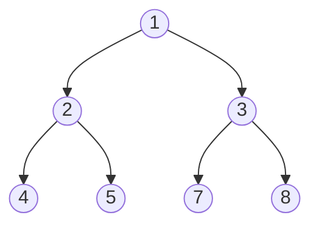

# Tree DFS Pattern

## Introduction

The Depth-First Search (DFS) is a fundamental algorithm pattern for traversing or searching tree data structures. Unlike breadth-first search which explores all nodes at a given depth before moving deeper, DFS explores as far down a branch as possible before backtracking.

DFS is like exploring a maze by following a path until you hit a dead end, then backtracking to the last intersection to try a different path. This approach is especially powerful for tree problems where you need to explore paths or search for specific patterns in the tree.

## The Basics of Tree DFS

### What is a Tree?

Before diving into DFS, let's quickly review what a tree is:

- A tree is a hierarchical data structure consisting of nodes connected by edges
- Each tree has a root node (the topmost node)
- Each node (except the root) has exactly one parent node
- Each node can have zero or more child nodes
- There are no cycles in a tree

Here's a simple representation of a binary tree:



### How DFS Works

DFS traverses a tree by exploring:
1. The current node
2. Then recursively exploring all child nodes, one subtree at a time
3. Backtracking when there are no more unexplored paths

Depending on when we process the current node relative to its children, DFS can follow three main patterns:

1. **Pre-order**: Process current node, then left subtree, then right subtree
2. **In-order**: Process left subtree, then current node, then right subtree
3. **Post-order**: Process left subtree, then right subtree, then current node

## Implementing Tree DFS

Here's the basic structure of a binary tree node:

```javascript
class TreeNode {
  constructor(val) {
    this.val = val;
    this.left = null;
    this.right = null;
  }
}
```

### Pre-order Traversal

In pre-order traversal, we process the current node first, then recursively visit the left and right subtrees.

```javascript
function preOrderTraversal(root) {
  const result = [];
  
  function dfs(node) {
    if (node === null) return;
    
    // Process the current node
    result.push(node.val);
    
    // Process left subtree
    dfs(node.left);
    
    // Process right subtree
    dfs(node.right);
  }
  
  dfs(root);
  return result;
}
```

For the tree shown above, pre-order traversal would produce: `[1, 2, 4, 5, 3, 7, 8]`

### In-order Traversal

In in-order traversal, we process the left subtree first, then the current node, and finally the right subtree.

```javascript
function inOrderTraversal(root) {
  const result = [];
  
  function dfs(node) {
    if (node === null) return;
    
    // Process left subtree
    dfs(node.left);
    
    // Process the current node
    result.push(node.val);
    
    // Process right subtree
    dfs(node.right);
  }
  
  dfs(root);
  return result;
}
```

For the tree shown above, in-order traversal would produce: `[4, 2, 5, 1, 7, 3, 8]`

### Post-order Traversal

In post-order traversal, we process both subtrees before processing the current node.

```javascript
function postOrderTraversal(root) {
  const result = [];
  
  function dfs(node) {
    if (node === null) return;
    
    // Process left subtree
    dfs(node.left);
    
    // Process right subtree
    dfs(node.right);
    
    // Process the current node
    result.push(node.val);
  }
  
  dfs(root);
  return result;
}
```

For the tree shown above, post-order traversal would produce: `[4, 5, 2, 7, 8, 3, 1]`

## Iterative Approach to DFS

While recursion provides a clean and intuitive way to implement DFS, it can lead to stack overflow for very deep trees. Here's how to implement pre-order traversal iteratively using a stack:

```javascript
function preOrderIterative(root) {
  if (root === null) return [];
  
  const result = [];
  const stack = [root];
  
  while (stack.length > 0) {
    const current = stack.pop();
    
    // Process the current node
    result.push(current.val);
    
    // Push right child first so that left child gets processed first
    if (current.right) stack.push(current.right);
    if (current.left) stack.push(current.left);
  }
  
  return result;
}
```

## Common Tree DFS Problems

### Problem 1: Path Sum

Given a binary tree and a sum, determine if the tree has a root-to-leaf path such that adding up all the values along the path equals the given sum.

```javascript
function hasPathSum(root, targetSum) {
  // Base case: empty tree
  if (root === null) return false;
  
  // If we're at a leaf node, check if its value equals the remaining target sum
  if (root.left === null && root.right === null) {
    return root.val === targetSum;
  }
  
  // Check if either the left or right subtree has a path with the remaining sum
  return hasPathSum(root.left, targetSum - root.val) ||
         hasPathSum(root.right, targetSum - root.val);
}
```

**Example:**
```
Input: 
Tree:
    5
   / \
  4   8
 /   / \
11  13  4
/  \      \
7    2      1
targetSum = 22

Output: true (5 + 4 + 11 + 2 = 22)
```

### Problem 2: Maximum Depth of Binary Tree

Find the maximum depth (or height) of a binary tree - that is, the number of nodes along the longest path from the root node down to the farthest leaf node.

```javascript
function maxDepth(root) {
  // Base case: empty tree has height 0
  if (root === null) return 0;
  
  // Recursively find the max depth of left and right subtrees
  const leftDepth = maxDepth(root.left);
  const rightDepth = maxDepth(root.right);
  
  // Return the larger depth + 1 (for the current node)
  return Math.max(leftDepth, rightDepth) + 1;
}
```

**Example:**
```
Input:
    3
   / \
  9  20
    /  \
   15   7

Output: 3
```

## Real-World Applications of Tree DFS

1. **File System Navigation**: Exploring directories and subdirectories in a file system.
   
2. **Decision Trees**: Evaluating all possible decisions and their consequences in an AI algorithm.

3. **Syntax Tree Parsing**: Compilers use DFS to parse expressions and generate code.

4. **Finding Connected Components**: In graph databases, identifying connected entities.

5. **Game Analysis**: Evaluating game states in games like chess (using decision trees).

### Practical Example: Creating a Directory Tree Viewer

Here's a function that uses DFS to print a directory structure:

```javascript
function printDirectoryTree(directory, prefix = "") {
  console.log(prefix + directory.name);
  
  const newPrefix = prefix + "  ";
  
  // Process all subdirectories (children)
  for (let i = 0; i < directory.children.length; i++) {
    printDirectoryTree(directory.children[i], newPrefix);
  }
}

// Example usage:
const fileSystem = {
  name: "root",
  children: [
    {
      name: "src",
      children: [
        { name: "index.js", children: [] },
        { name: "app.js", children: [] }
      ]
    },
    {
      name: "public",
      children: [
        { name: "index.html", children: [] },
        { name: "styles.css", children: [] }
      ]
    }
  ]
};

printDirectoryTree(fileSystem);

/* Output:
root
  src
    index.js
    app.js
  public
    index.html
    styles.css
*/
```

## Time and Space Complexity

For a tree with n nodes:

- **Time Complexity**: O(n) - Each node is visited exactly once
- **Space Complexity**: O(h) where h is the height of the tree
  - Best case (balanced tree): O(log n)
  - Worst case (skewed tree): O(n)

## Best Practices and Tips

1. **Choose the Right Traversal**: Select the traversal order based on your problem:
   - Pre-order: When you need to explore roots before leaves
   - In-order: When you need to process nodes in a sorted order (for BSTs)
   - Post-order: When processing children before parents is required

2. **Watch for Edge Cases**:
   - Empty trees (null root)
   - Single-node trees
   - Skewed trees

3. **Recognize DFS Patterns**:
   - Problems involving paths from root to leaf
   - Problems requiring information from subtrees to make decisions at parent nodes
   - Problems involving tree serialization

4. **Consider Memoization**: For problems where the same subtree might be evaluated multiple times, consider caching results.

## Summary

The Tree DFS pattern is a powerful approach to explore tree data structures. It excels at problems involving path finding, computation that depends on parent-child relationships, and situations where you need to explore the tree's depth before its breadth.

Key points to remember:
- DFS explores as far down a branch as possible before backtracking
- There are three main traversal orders: pre-order, in-order, and post-order
- DFS can be implemented both recursively and iteratively
- The time complexity is O(n) and space complexity is O(h), where h is the tree height

## Practice Exercises

1. **Binary Tree Path Sum II**: Find all root-to-leaf paths where each path's sum equals the given target sum.

2. **Validate Binary Search Tree**: Determine if a binary tree is a valid binary search tree.

3. **Lowest Common Ancestor**: Find the lowest common ancestor of two nodes in a binary tree.

4. **Flatten Binary Tree to Linked List**: Flatten a binary tree to a "linked list" using in-place rearrangement.

5. **Count Unival Subtrees**: Count the number of subtrees where all nodes have the same value.

## Additional Resources

- [Tree Traversal Visualizations](https://visualgo.net/en/bst)
- "Cracking the Coding Interview" by Gayle Laakmann McDowell has excellent tree problem examples
- "Introduction to Algorithms" by Cormen, Leiserson, Rivest, and Stein for deeper algorithmic understanding

Happy coding and keep exploring the depths of trees with DFS!