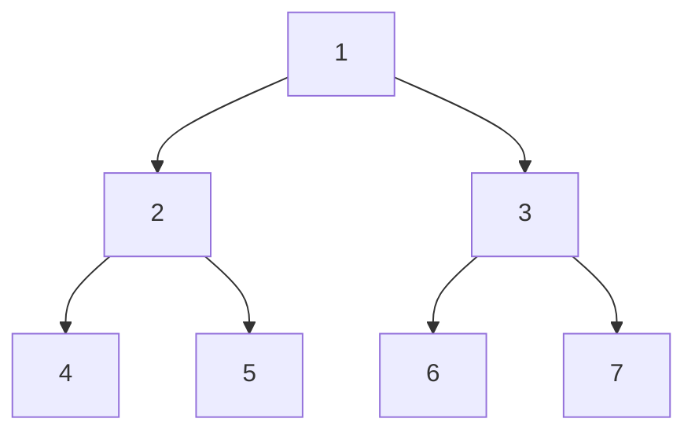

# Tree BFS Pattern

## Introduction

Breadth-First Search (BFS) is a fundamental algorithm for traversing or searching tree and graph data structures. Unlike Depth-First Search (DFS) which explores as far as possible along each branch before backtracking, BFS explores all the neighbors at the present depth before moving to nodes at the next depth level.

The Tree BFS pattern is particularly useful when:
- You need to find the shortest path between two nodes
- You need to traverse a tree level by level
- You need to find nodes closest to the root

## Understanding the BFS Algorithm

BFS uses a **queue** data structure to keep track of nodes to be explored:

1. Start with the root node and add it to a queue
2. While the queue is not empty:
   - Remove the first node from the queue
   - Process the node (e.g., check if it's the target, print its value)
   - Add all of its children/neighbors to the queue
3. Continue until the queue is empty or the target is found

## Basic Implementation of Tree BFS

Here's a basic implementation of BFS for a binary tree in JavaScript:

```javascript
class TreeNode {
  constructor(value) {
    this.value = value;
    this.left = null;
    this.right = null;
  }
}

function bfs(root) {
  if (!root) return [];
  
  const result = [];
  const queue = [root];
  
  while (queue.length > 0) {
    const currentNode = queue.shift();
    result.push(currentNode.value);
    
    if (currentNode.left) {
      queue.push(currentNode.left);
    }
    
    if (currentNode.right) {
      queue.push(currentNode.right);
    }
  }
  
  return result;
}

// Example usage
const root = new TreeNode(1);
root.left = new TreeNode(2);
root.right = new TreeNode(3);
root.left.left = new TreeNode(4);
root.left.right = new TreeNode(5);
root.right.left = new TreeNode(6);
root.right.right = new TreeNode(7);

console.log(bfs(root)); // Output: [1, 2, 3, 4, 5, 6, 7]
```

This code creates a tree with the following structure:



When we run BFS on this tree, it visits the nodes in the order: 1, 2, 3, 4, 5, 6, 7.

## Level-Order Traversal

One of the most common applications of the BFS pattern is level-order traversal, where we process the tree level by level:

```javascript
function levelOrderTraversal(root) {
  if (!root) return [];
  
  const result = [];
  const queue = [root];
  
  while (queue.length > 0) {
    const levelSize = queue.length;
    const currentLevel = [];
    
    for (let i = 0; i < levelSize; i++) {
      const currentNode = queue.shift();
      currentLevel.push(currentNode.value);
      
      if (currentNode.left) {
        queue.push(currentNode.left);
      }
      
      if (currentNode.right) {
        queue.push(currentNode.right);
      }
    }
    
    result.push(currentLevel);
  }
  
  return result;
}

// Example usage with the same tree as above
console.log(levelOrderTraversal(root));
// Output: [[1], [2, 3], [4, 5, 6, 7]]
```

This separates the nodes by their level in the tree.

## Common BFS Pattern Problems

### 1. Binary Tree Level Averages

Find the average value at each level of a binary tree:

```javascript
function findLevelAverages(root) {
  if (!root) return [];
  
  const result = [];
  const queue = [root];
  
  while (queue.length > 0) {
    const levelSize = queue.length;
    let levelSum = 0;
    
    for (let i = 0; i < levelSize; i++) {
      const currentNode = queue.shift();
      levelSum += currentNode.value;
      
      if (currentNode.left) {
        queue.push(currentNode.left);
      }
      
      if (currentNode.right) {
        queue.push(currentNode.right);
      }
    }
    
    result.push(levelSum / levelSize);
  }
  
  return result;
}

// Example usage
const root = new TreeNode(12);
root.left = new TreeNode(7);
root.right = new TreeNode(1);
root.left.left = new TreeNode(9);
root.left.right = new TreeNode(2);
root.right.left = new TreeNode(10);
root.right.right = new TreeNode(5);

console.log(findLevelAverages(root));
// Output: [12, 4, 6.5]
```

### 2. Minimum Depth of a Binary Tree

Find the minimum depth (shortest path from root to a leaf node):

```javascript
function findMinimumDepth(root) {
  if (!root) return 0;
  
  const queue = [root];
  let depth = 0;
  
  while (queue.length > 0) {
    depth++;
    const levelSize = queue.length;
    
    for (let i = 0; i < levelSize; i++) {
      const currentNode = queue.shift();
      
      // Check if this is a leaf node
      if (!currentNode.left && !currentNode.right) {
        return depth;
      }
      
      if (currentNode.left) {
        queue.push(currentNode.left);
      }
      
      if (currentNode.right) {
        queue.push(currentNode.right);
      }
    }
  }
  
  return depth;
}
```

### 3. Right Side View of a Binary Tree

Return the values visible from the right side of the tree:

```javascript
function rightSideView(root) {
  if (!root) return [];
  
  const result = [];
  const queue = [root];
  
  while (queue.length > 0) {
    const levelSize = queue.length;
    
    for (let i = 0; i < levelSize; i++) {
      const currentNode = queue.shift();
      
      // If this is the last node in the current level, add it to result
      if (i === levelSize - 1) {
        result.push(currentNode.value);
      }
      
      if (currentNode.left) {
        queue.push(currentNode.left);
      }
      
      if (currentNode.right) {
        queue.push(currentNode.right);
      }
    }
  }
  
  return result;
}
```

## Real-World Applications

### 1. Shortest Path in a Maze

BFS is ideal for finding the shortest path in a grid/maze:

```javascript
function shortestPathInMaze(maze, start, end) {
  const rows = maze.length;
  const cols = maze[0].length;
  
  // Directions: up, right, down, left
  const directions = [[-1, 0], [0, 1], [1, 0], [0, -1]];
  
  // Queue to store positions and distances
  const queue = [[start[0], start[1], 0]]; // [row, col, distance]
  
  // Mark the start cell as visited
  const visited = Array(rows).fill().map(() => Array(cols).fill(false));
  visited[start[0]][start[1]] = true;
  
  while (queue.length > 0) {
    const [row, col, distance] = queue.shift();
    
    // If we reached the end
    if (row === end[0] && col === end[1]) {
      return distance;
    }
    
    // Explore all four directions
    for (const [dx, dy] of directions) {
      const newRow = row + dx;
      const newCol = col + dy;
      
      // Check if the new position is valid and not visited
      if (
        newRow >= 0 && newRow < rows &&
        newCol >= 0 && newCol < cols &&
        maze[newRow][newCol] === 0 && // 0 represents an open cell
        !visited[newRow][newCol]
      ) {
        // Mark as visited and add to queue
        visited[newRow][newCol] = true;
        queue.push([newRow, newCol, distance + 1]);
      }
    }
  }
  
  // If no path is found
  return -1;
}

// Example usage
const maze = [
  [0, 0, 1, 0, 0],
  [0, 0, 0, 0, 0],
  [0, 0, 0, 1, 0],
  [1, 1, 0, 1, 1],
  [0, 0, 0, 0, 0]
];
const start = [0, 0];
const end = [4, 4];

console.log(shortestPathInMaze(maze, start, end)); // Output: 8
```

### 2. Web Crawler

A web crawler can use BFS to explore links from a starting page:

```javascript
function webCrawler(startUrl, maxDepth) {
  const visited = new Set();
  const queue = [[startUrl, 0]]; // [url, depth]
  visited.add(startUrl);
  
  while (queue.length > 0) {
    const [url, depth] = queue.shift();
    
    console.log(`Visiting: ${url}`);
    
    // If we've reached the maximum depth, don't add more links
    if (depth >= maxDepth) {
      continue;
    }
    
    // In a real implementation, we'd fetch the page and extract links here
    const links = getLinksFromPage(url); // Hypothetical function
    
    for (const link of links) {
      if (!visited.has(link)) {
        visited.add(link);
        queue.push([link, depth + 1]);
      }
    }
  }
  
  return visited;
}

// Note: This is a simplified example. A real web crawler would be more complex.
```

## Time and Space Complexity

For a tree with n nodes:
- **Time Complexity**: O(n) - Each node is processed exactly once
- **Space Complexity**: O(n) - In the worst case, the queue could contain all nodes at the leaf level, which could be up to n/2 nodes in a balanced binary tree

## When to Use the Tree BFS Pattern

Use BFS when:
1. You need to find the shortest path between two nodes
2. You need to process nodes level by level
3. The tree/graph is not too deep (to avoid memory issues)
4. You need to find all nodes at a given distance from the starting node

## When Not to Use BFS

BFS may not be ideal when:
1. The tree/graph is very deep with many levels
2. Memory is a constraint (since BFS uses a queue that can grow large)
3. You need to search for a node that's likely to be deep in the tree

## Summary

The Tree BFS pattern is a powerful approach for traversing trees and graphs level by level. It uses a queue to keep track of nodes to be processed, ensuring that all nodes at the current level are processed before moving to the next level.

Key points to remember:
- BFS uses a queue data structure (FIFO - First In, First Out)
- It's ideal for level-order traversals and finding shortest paths
- The time complexity is O(n) where n is the number of nodes
- The space complexity can be significant for wide trees

## Practice Exercises

1. Implement a function to find the maximum value at each level of a binary tree.
2. Find the zigzag level order traversal of a binary tree (left to right, then right to left, and so on).
3. Given a binary tree, find the level with the maximum sum.
4. Implement a function to connect all nodes at the same level with "next" pointers.
5. Find the largest value in each level of a binary tree.

## Additional Resources

- [Visualizing BFS](https://www.cs.usfca.edu/~galles/visualization/BFS.html)
- [Tree Traversal Techniques - GeeksforGeeks](https://www.geeksforgeeks.org/tree-traversals-inorder-preorder-and-postorder/)
- [BFS vs DFS for Binary Tree - Programiz](https://www.programiz.com/dsa/binary-tree)

Understanding the Tree BFS pattern will greatly enhance your problem-solving skills for tree and graph problems. Practice with different types of problems to master this technique!