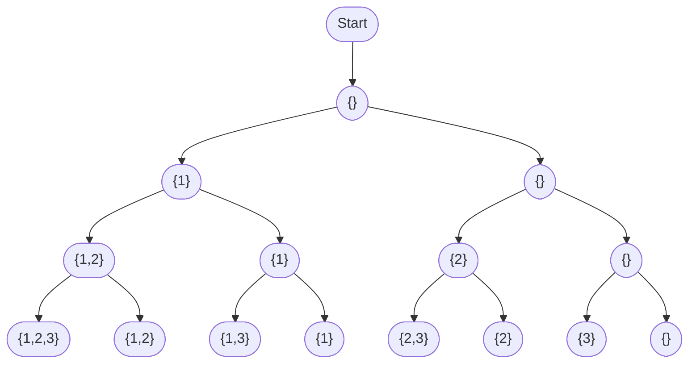

# Subsets Pattern

## Introduction

The Subsets Pattern is a common problem-solving technique that deals with generating all possible subsets (combinations) of a given set of elements. This pattern is incredibly valuable for solving problems that require exploring all possible combinations or arrangements of elements.

A subset is a collection of elements that are part of a larger set. For example, if we have a set `{1, 2, 3}`, its subsets include:
- Empty set: `{}`
- Single element sets: `{1}`, `{2}`, `{3}`
- Two element sets: `{1, 2}`, `{1, 3}`, `{2, 3}`
- The original set itself: `{1, 2, 3}`

So we have a total of 8 subsets (2^3).

This pattern is often used in:
- Combination problems
- Permutation problems
- Problem solving with binary representation
- Backtracking problems

Let's explore different implementations and applications of the Subsets Pattern.

## Implementing the Subsets Pattern

### Approach 1: Iterative Solution

One elegant way to generate all subsets is to use an iterative approach:

```javascript
function findAllSubsets(nums) {
  const subsets = [[]];
  
  for (const num of nums) {
    const n = subsets.length;
    for (let i = 0; i < n; i++) {
      const currentSubset = [...subsets[i]];
      currentSubset.push(num);
      subsets.push(currentSubset);
    }
  }
  
  return subsets;
}

// Example usage
const result = findAllSubsets([1, 2, 3]);
console.log(result);
```

**Output:**
```
[
  [],       // Start with an empty set
  [1],      // Add 1 to empty set
  [2],      // Add 2 to empty set
  [1, 2],   // Add 2 to set [1]
  [3],      // Add 3 to empty set
  [1, 3],   // Add 3 to set [1]
  [2, 3],   // Add 3 to set [2]
  [1, 2, 3] // Add 3 to set [1, 2]
]
```

### How the iterative approach works:

1. Start with an empty subset: `[[]]`
2. For each number in the input:
   - Take all existing subsets
   - Add the current number to each of them to create new subsets
   - Add these new subsets to our result

Let's trace through the algorithm for input `[1, 2, 3]`:
- Start with `subsets = [[]]`
- Process 1:
  - Take existing subsets: `[[]]`
  - Add 1 to each: `[1]`
  - Result: `[[], [1]]`
- Process 2:
  - Take existing subsets: `[[], [1]]`
  - Add 2 to each: `[2], [1, 2]`
  - Result: `[[], [1], [2], [1, 2]]`
- Process 3:
  - Take existing subsets: `[[], [1], [2], [1, 2]]`
  - Add 3 to each: `[3], [1, 3], [2, 3], [1, 2, 3]`
  - Result: `[[], [1], [2], [1, 2], [3], [1, 3], [2, 3], [1, 2, 3]]`

### Approach 2: Recursive Solution (Backtracking)

The recursive approach uses backtracking to generate all possible subsets:

```javascript
function findAllSubsetsRecursive(nums) {
  const result = [];
  
  function backtrack(index, currentSubset) {
    // Add the current subset to our result
    result.push([...currentSubset]);
    
    // Explore further possibilities
    for (let i = index; i < nums.length; i++) {
      // Include the current number
      currentSubset.push(nums[i]);
      
      // Recursively generate subsets with this number included
      backtrack(i + 1, currentSubset);
      
      // Backtrack (exclude the number for the next iteration)
      currentSubset.pop();
    }
  }
  
  backtrack(0, []);
  return result;
}

// Example usage
const result = findAllSubsetsRecursive([1, 2, 3]);
console.log(result);
```

**Output:**
```
[
  [],
  [1],
  [1, 2],
  [1, 2, 3],
  [1, 3],
  [2],
  [2, 3],
  [3]
]
```

### Approach 3: Using Binary Representation

Another clever way to generate all subsets is using binary representation:

```javascript
function findAllSubsetsBinary(nums) {
  const n = nums.length;
  const subsetCount = Math.pow(2, n);
  const allSubsets = [];
  
  for (let i = 0; i < subsetCount; i++) {
    const subset = [];
    
    for (let j = 0; j < n; j++) {
      // Check if jth bit in i is set
      if ((i & (1 << j)) !== 0) {
        subset.push(nums[j]);
      }
    }
    
    allSubsets.push(subset);
  }
  
  return allSubsets;
}

// Example usage
const result = findAllSubsetsBinary([1, 2, 3]);
console.log(result);
```

This approach uses the fact that we have exactly 2^n subsets for a set with n elements. We can use binary numbers from 0 to 2^n-1 to represent all possible subsets. For each binary number, if the jth bit is set, we include the jth element in our subset.

## Variations of the Subsets Pattern

### 1. Subsets with Duplicates

When the input contains duplicates, we need to modify our approach:

```javascript
function subsetsWithDuplicates(nums) {
  // Sort the array to handle duplicates properly
  nums.sort((a, b) => a - b);
  
  const result = [];
  
  function backtrack(index, currentSubset) {
    result.push([...currentSubset]);
    
    for (let i = index; i < nums.length; i++) {
      // Skip duplicates
      if (i > index && nums[i] === nums[i - 1]) continue;
      
      currentSubset.push(nums[i]);
      backtrack(i + 1, currentSubset);
      currentSubset.pop();
    }
  }
  
  backtrack(0, []);
  return result;
}

// Example usage
const result = subsetsWithDuplicates([1, 2, 2]);
console.log(result);
```

**Output:**
```
[
  [],
  [1],
  [1, 2],
  [1, 2, 2],
  [2],
  [2, 2]
]
```

### 2. Combinations

Generating combinations of a specific size k from a set of n elements:

```javascript
function combinations(nums, k) {
  const result = [];
  
  function backtrack(start, currentCombination) {
    if (currentCombination.length === k) {
      result.push([...currentCombination]);
      return;
    }
    
    for (let i = start; i < nums.length; i++) {
      currentCombination.push(nums[i]);
      backtrack(i + 1, currentCombination);
      currentCombination.pop();
    }
  }
  
  backtrack(0, []);
  return result;
}

// Example: Generate all combinations of size 2 from [1,2,3,4]
const result = combinations([1, 2, 3, 4], 2);
console.log(result);
```

**Output:**
```
[
  [1, 2],
  [1, 3],
  [1, 4],
  [2, 3],
  [2, 4],
  [3, 4]
]
```

## Time and Space Complexity

### Iterative and Binary Approaches:
- **Time Complexity**: O(n * 2^n) where n is the number of elements. We generate 2^n subsets and each might require O(n) time to create.
- **Space Complexity**: O(n * 2^n) to store all the subsets.

### Recursive Approach:
- **Time Complexity**: O(n * 2^n)
- **Space Complexity**: O(n) for the recursion stack plus O(n * 2^n) to store the results.

## Real-World Applications

### 1. Menu Combination System

Imagine a restaurant app that needs to let users select any combination of sides with their main dish:

```javascript
function generateMenuCombinations(mainDishes, sides) {
  const result = [];
  
  // Generate all possible combinations of sides
  const sideCombinations = findAllSubsets(sides);
  
  // Combine each main dish with each side combination
  for (const mainDish of mainDishes) {
    for (const sideCombination of sideCombinations) {
      result.push({
        main: mainDish,
        sides: sideCombination
      });
    }
  }
  
  return result;
}

// Example usage
const mainDishes = ['Burger', 'Pizza', 'Pasta'];
const sides = ['Fries', 'Salad', 'Soup'];

const menuOptions = generateMenuCombinations(mainDishes, sides);
console.log(`Total menu combinations: ${menuOptions.length}`);
// We'd have 3 mains × 8 side combinations = 24 total options
```

### 2. Feature Configuration System

When building software with multiple configurable features, the subsets pattern can help generate all possible configurations:

```javascript
function generateConfigurations(features) {
  // Get all possible feature combinations
  return findAllSubsets(features);
}

// Example usage
const features = ['darkMode', 'notifications', 'autoSave', 'offlineAccess'];
const configs = generateConfigurations(features);

console.log(`Total possible configurations: ${configs.length}`);
// Would output: Total possible configurations: 16 (2^4)
```

### 3. Test Case Generation

Generating combinations of test inputs to ensure comprehensive test coverage:

```javascript
function generateTestCases(possibleInputs) {
  const allSubsets = findAllSubsets(possibleInputs);
  // Filter out the empty set if needed
  return allSubsets.filter(subset => subset.length > 0);
}

const userInputs = ['validEmail', 'validPassword', 'rememberMe', 'captcha'];
const testCases = generateTestCases(userInputs);
console.log(`Number of test cases: ${testCases.length}`);
// Would output: Number of test cases: 15 (2^4 - 1, excluding empty set)
```

## Common Interview Problems Using Subsets Pattern

1. Generate all subsets of a set
2. Generate all subsets of size k
3. Generate all subsets with duplicate elements
4. Letter combinations of a phone number
5. Permutations of a string
6. Combination sum problems

## Pattern Visualization

To visualize how the subsets pattern works, consider this diagram showing the subset generation for `[1,2,3]`:



## Summary

The Subsets Pattern is a powerful problem-solving technique that helps generate all possible combinations of elements from a given set. Key points to remember:

1. For a set with n elements, there are exactly 2^n subsets.
2. The pattern can be implemented using iterative, recursive (backtracking), or binary representation approaches.
3. When dealing with duplicates, elements should be sorted first, and duplicates need special handling.
4. The time complexity is typically O(n * 2^n) due to the exponential number of subsets.
5. The pattern is useful for combination problems, permutation problems, and backtracking scenarios.

This pattern is commonly used in software development for feature configurations, test case generation, menu combinations, and many other applications where you need to explore all possible combinations of elements.

## Practice Exercises

1. Generate all subsets of `[1, 2, 3, 4]`.
2. Find all subsets of `[1, 2, 2]` (with duplicate elements).
3. Generate all combinations of size 3 from `[1, 2, 3, 4, 5]`.
4. Create a function that returns the power set (set of all subsets) of a given set.
5. Implement a function to generate all possible ways to select items from a shopping cart while staying under a budget constraint.

By mastering the Subsets Pattern, you'll gain a powerful tool for solving a wide range of programming problems that require generating combinations and exploring all possibilities.