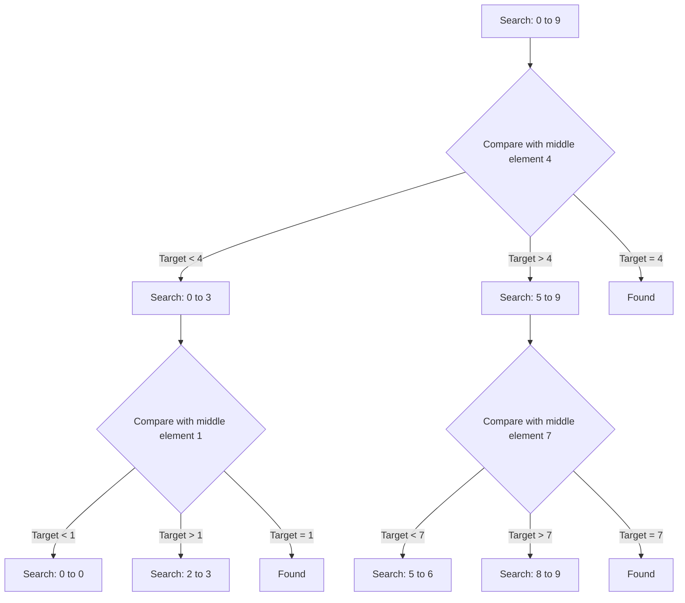

# Modified Binary Search

## Introduction

Binary search is a fundamental algorithm that efficiently finds elements in a sorted collection by repeatedly dividing the search space in half. While the standard binary search is used to find exact matches in a sorted array, **Modified Binary Search** refers to variations and adaptations of this algorithm to solve more complex problems.

Modified binary search techniques allow you to:

- Find elements that satisfy specific conditions
- Search in rotated, partially sorted, or modified arrays
- Find boundaries between different groups of elements
- Locate closest elements when exact matches don't exist

In this guide, we'll explore various modifications of the classic binary search algorithm and how they can be applied to solve different types of problems.

## Standard Binary Search: A Quick Refresher

Before diving into modifications, let's review the standard binary search algorithm:

```javascript
function binarySearch(arr, target) {
  let left = 0;
  let right = arr.length - 1;
  
  while (left <= right) {
    const mid = Math.floor((left + right) / 2);
    
    if (arr[mid] === target) {
      return mid; // Found the target
    } else if (arr[mid] < target) {
      left = mid + 1; // Search in the right half
    } else {
      right = mid - 1; // Search in the left half
    }
  }
  
  return -1; // Target not found
}

// Example usage
const sortedArray = [1, 3, 5, 7, 9, 11, 13];
console.log(binarySearch(sortedArray, 7)); // Output: 3
console.log(binarySearch(sortedArray, 6)); // Output: -1
```

The standard binary search has a time complexity of O(log n), which makes it much more efficient than linear search (O(n)) for large datasets.

## Common Binary Search Modifications

### 1. Finding the First or Last Occurrence

When duplicate elements exist in a sorted array, standard binary search only returns one occurrence. Modified binary search can find the first or last occurrence.

```javascript
function findFirstOccurrence(arr, target) {
  let left = 0;
  let right = arr.length - 1;
  let result = -1;
  
  while (left <= right) {
    const mid = Math.floor((left + right) / 2);
    
    if (arr[mid] === target) {
      result = mid; // Save the current position
      right = mid - 1; // Continue searching in the left half
    } else if (arr[mid] < target) {
      left = mid + 1;
    } else {
      right = mid - 1;
    }
  }
  
  return result;
}

function findLastOccurrence(arr, target) {
  let left = 0;
  let right = arr.length - 1;
  let result = -1;
  
  while (left <= right) {
    const mid = Math.floor((left + right) / 2);
    
    if (arr[mid] === target) {
      result = mid; // Save the current position
      left = mid + 1; // Continue searching in the right half
    } else if (arr[mid] < target) {
      left = mid + 1;
    } else {
      right = mid - 1;
    }
  }
  
  return result;
}

// Example usage
const arrayWithDuplicates = [1, 2, 2, 2, 3, 4, 5, 5, 6];
console.log(findFirstOccurrence(arrayWithDuplicates, 2)); // Output: 1
console.log(findLastOccurrence(arrayWithDuplicates, 2));  // Output: 3
console.log(findFirstOccurrence(arrayWithDuplicates, 5)); // Output: 6
console.log(findLastOccurrence(arrayWithDuplicates, 5));  // Output: 7
```

### 2. Finding the Floor and Ceiling

The floor of a target is the largest element in the array that is less than or equal to the target. The ceiling is the smallest element in the array that is greater than or equal to the target.

```javascript
function findFloor(arr, target) {
  let left = 0;
  let right = arr.length - 1;
  let result = -1;
  
  while (left <= right) {
    const mid = Math.floor((left + right) / 2);
    
    if (arr[mid] === target) {
      return arr[mid]; // Exact match is the floor
    } else if (arr[mid] < target) {
      result = arr[mid]; // Potential floor value
      left = mid + 1;
    } else {
      right = mid - 1;
    }
  }
  
  return result;
}

function findCeiling(arr, target) {
  let left = 0;
  let right = arr.length - 1;
  let result = -1;
  
  while (left <= right) {
    const mid = Math.floor((left + right) / 2);
    
    if (arr[mid] === target) {
      return arr[mid]; // Exact match is the ceiling
    } else if (arr[mid] < target) {
      left = mid + 1;
    } else {
      result = arr[mid]; // Potential ceiling value
      right = mid - 1;
    }
  }
  
  return result;
}

// Example usage
const sortedArray = [1, 3, 5, 7, 9, 11, 13];
console.log(findFloor(sortedArray, 6));  // Output: 5
console.log(findCeiling(sortedArray, 6)); // Output: 7
console.log(findFloor(sortedArray, 5));  // Output: 5
console.log(findCeiling(sortedArray, 5)); // Output: 5
```

### 3. Searching in a Rotated Sorted Array

A rotated sorted array is a sorted array that has been rotated at some pivot unknown to you beforehand. Modified binary search can efficiently search in such arrays.

```javascript
function searchInRotatedArray(arr, target) {
  let left = 0;
  let right = arr.length - 1;
  
  while (left <= right) {
    const mid = Math.floor((left + right) / 2);
    
    if (arr[mid] === target) {
      return mid;
    }
    
    // Check if the left half is sorted
    if (arr[left] <= arr[mid]) {
      // Check if target is in the left sorted half
      if (arr[left] <= target && target < arr[mid]) {
        right = mid - 1;
      } else {
        left = mid + 1;
      }
    } 
    // Otherwise, right half is sorted
    else {
      // Check if target is in the right sorted half
      if (arr[mid] < target && target <= arr[right]) {
        left = mid + 1;
      } else {
        right = mid - 1;
      }
    }
  }
  
  return -1;
}

// Example usage
const rotatedArray = [7, 9, 11, 13, 1, 3, 5];
console.log(searchInRotatedArray(rotatedArray, 9));  // Output: 1
console.log(searchInRotatedArray(rotatedArray, 3));  // Output: 5
console.log(searchInRotatedArray(rotatedArray, 6));  // Output: -1
```

### 4. Finding the Peak Element

A peak element is an element that is greater than its neighbors. For boundary elements, we need to compare with the single neighbor.

```javascript
function findPeakElement(arr) {
  let left = 0;
  let right = arr.length - 1;
  
  while (left < right) {
    const mid = Math.floor((left + right) / 2);
    
    if (arr[mid] > arr[mid + 1]) {
      // We are on a downward slope, peak is on the left
      right = mid;
    } else {
      // We are on an upward slope, peak is on the right
      left = mid + 1;
    }
  }
  
  // left and right converge to one element - the peak
  return left;
}

// Example usage
const array1 = [1, 3, 5, 4, 2];
console.log(findPeakElement(array1)); // Output: 2 (element value 5)

const array2 = [6, 5, 4, 3, 2, 1];
console.log(findPeakElement(array2)); // Output: 0 (element value 6)

const array3 = [1, 2, 3, 4, 5];
console.log(findPeakElement(array3)); // Output: 4 (element value 5)
```

## Real-World Applications

### Finding Median in Two Sorted Arrays

A challenging problem that can be solved using modified binary search is finding the median of two sorted arrays:

```javascript
function findMedianSortedArrays(nums1, nums2) {
  // Ensure nums1 is the smaller array for simpler implementation
  if (nums1.length > nums2.length) {
    [nums1, nums2] = [nums2, nums1];
  }
  
  const x = nums1.length;
  const y = nums2.length;
  const totalLength = x + y;
  
  let low = 0;
  let high = x;
  
  while (low <= high) {
    // Partition the arrays
    const partitionX = Math.floor((low + high) / 2);
    const partitionY = Math.floor((totalLength + 1) / 2) - partitionX;
    
    // Edge cases with empty partitions
    const maxX = partitionX === 0 ? Number.NEGATIVE_INFINITY : nums1[partitionX - 1];
    const minX = partitionX === x ? Number.POSITIVE_INFINITY : nums1[partitionX];
    
    const maxY = partitionY === 0 ? Number.NEGATIVE_INFINITY : nums2[partitionY - 1];
    const minY = partitionY === y ? Number.POSITIVE_INFINITY : nums2[partitionY];
    
    if (maxX <= minY && maxY <= minX) {
      // Found the correct partition
      // For even length
      if (totalLength % 2 === 0) {
        return (Math.max(maxX, maxY) + Math.min(minX, minY)) / 2;
      }
      // For odd length
      else {
        return Math.max(maxX, maxY);
      }
    } else if (maxX > minY) {
      high = partitionX - 1;
    } else {
      low = partitionX + 1;
    }
  }
  
  throw new Error("Input arrays are not sorted");
}

// Example usage
console.log(findMedianSortedArrays([1, 3], [2])); // Output: 2
console.log(findMedianSortedArrays([1, 2], [3, 4])); // Output: 2.5
```

### Ship Packages Within D Days

This problem demonstrates how binary search can be used to optimize allocation of resources:

```javascript
function shipWithinDays(weights, days) {
  // Find the minimum possible capacity (max single weight)
  // and the maximum capacity needed (sum of all weights)
  let left = Math.max(...weights);
  let right = weights.reduce((sum, weight) => sum + weight, 0);
  
  while (left < right) {
    const mid = Math.floor((left + right) / 2);
    
    // Check if we can ship all packages with 'mid' capacity in 'days' days
    if (canShipWithCapacity(weights, days, mid)) {
      right = mid; // Try to find a smaller capacity
    } else {
      left = mid + 1; // Need a larger capacity
    }
  }
  
  return left;
}

function canShipWithCapacity(weights, days, capacity) {
  let requiredDays = 1;
  let currentLoad = 0;
  
  for (const weight of weights) {
    if (currentLoad + weight > capacity) {
      requiredDays++;
      currentLoad = weight;
    } else {
      currentLoad += weight;
    }
  }
  
  return requiredDays <= days;
}

// Example usage
const packageWeights = [1, 2, 3, 4, 5, 6, 7, 8, 9, 10];
const daysAllowed = 5;
console.log(shipWithinDays(packageWeights, daysAllowed)); // Output: 15
```

## Visualization of Binary Search Process

Here's a visualization of how binary search divides the search space in half at each step:



## Common Pitfalls and Tips

1. **The Mid-Point Calculation**: To prevent integer overflow, use `mid = left + (right - left) / 2` instead of `mid = (left + right) / 2`.

2. **Off-by-One Errors**: Be careful with the conditions in your while loop (`left <= right` vs `left < right`) and how you update bounds.

3. **Infinite Loops**: Make sure your binary search makes progress in each iteration by properly updating `left` and `right`.

4. **Edge Cases**: Always test with empty arrays, single elements, and duplicates.

5. **Boundary Conditions**: Pay special attention to whether your algorithm should find the first or last occurrence of a value.

## Summary

Modified binary search is a powerful technique that extends beyond the basic binary search algorithm to solve a variety of problems efficiently. The key insights from this pattern include:

- Binary search can be adapted to find boundaries, first/last occurrences, and elements with specific properties.
- Even when arrays are not perfectly sorted, binary search principles may still apply (as in rotated sorted arrays).
- The binary search approach can be used to optimize decision problems by searching for a threshold value.
- Time complexity remains O(log n) for most modifications, making this an efficient approach for large datasets.

By mastering modified binary search techniques, you'll be able to solve a wide variety of algorithmic problems with optimal efficiency.

## Practice Problems

To strengthen your understanding of modified binary search, try solving these problems:

1. Find the square root of an integer without using any built-in functions.
2. Find the smallest letter in an array that is greater than a given target letter.
3. Find the single element in a sorted array where every other element appears exactly twice.
4. Find the position of an element in an infinite sorted array.
5. Search in a 2D sorted matrix where rows and columns are sorted in ascending order.

Remember, the key to mastering binary search is practice. Try implementing these algorithms yourself and test them with various inputs to build your confidence!