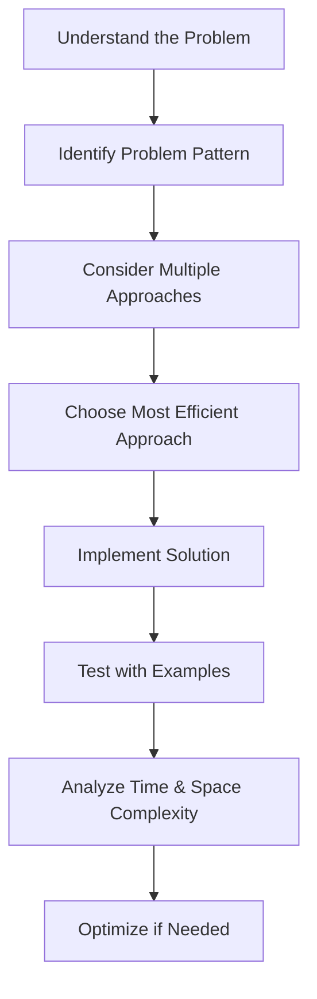

# Array Problem Strategies

Arrays are one of the most fundamental data structures and appear frequently in coding interviews and LeetCode problems. In this guide, we'll explore effective strategies to tackle array-based problems, common patterns to recognize, and techniques to optimize your solutions.

## Introduction to Array Problems

Arrays store elements of the same type in contiguous memory locations. This simple structure forms the foundation for many complex algorithms and problem-solving techniques. When approaching array problems, having a toolkit of strategies can significantly improve your ability to solve them efficiently.

```javascript
// Basic array declaration in JavaScript
const numbers = [1, 2, 3, 4, 5];

// Accessing elements by index
console.log(numbers[0]); // Output: 1
console.log(numbers[4]); // Output: 5
```

Most array problems on LeetCode can be categorized into several common patterns. Learning to recognize these patterns will help you develop a systematic approach to problem-solving.

## Core Array Problem Strategies

### 1. Two-Pointer Technique

The two-pointer technique involves using two pointers to traverse an array, often moving toward each other or at different speeds.

#### Example: Two Sum Problem

**Problem**: Given an array of integers `nums` and an integer `target`, return indices of the two numbers such that they add up to `target`.

```javascript
function twoSum(nums, target) {
    // Create a map to store elements we've seen
    const seen = {};
    
    for (let i = 0; i < nums.length; i++) {
        // Calculate the complement we need
        const complement = target - nums[i];
        
        // If we've seen the complement before, return both indices
        if (seen[complement] !== undefined) {
            return [seen[complement], i];
        }
        
        // Store the current element and its index
        seen[nums[i]] = i;
    }
    
    return null; // No solution found
}

// Example usage
const nums = [2, 7, 11, 15];
const target = 9;
console.log(twoSum(nums, target)); // Output: [0, 1] (2 + 7 = 9)
```

#### Example: Valid Palindrome

**Problem**: Determine if a string is a palindrome, considering only alphanumeric characters and ignoring case.

```javascript
function isPalindrome(s) {
    // Convert to lowercase and remove non-alphanumeric characters
    s = s.toLowerCase().replace(/[^a-z0-9]/g, '');
    
    let left = 0;
    let right = s.length - 1;
    
    while (left < right) {
        if (s[left] !== s[right]) {
            return false;
        }
        left++;
        right--;
    }
    
    return true;
}

// Example usage
console.log(isPalindrome("A man, a plan, a canal: Panama")); // Output: true
console.log(isPalindrome("race a car")); // Output: false
```

### 2. Sliding Window Technique

The sliding window technique is useful for problems involving subarrays or substrings where you need to find a contiguous segment meeting certain criteria.

#### Example: Maximum Subarray Sum of Size K

**Problem**: Find the maximum sum of any contiguous subarray of size K.

```javascript
function maxSubarraySum(arr, k) {
    if (arr.length < k) {
        return null;
    }
    
    // Calculate sum of first window
    let maxSum = 0;
    let tempSum = 0;
    
    for (let i = 0; i < k; i++) {
        maxSum += arr[i];
    }
    
    tempSum = maxSum;
    
    // Slide window and update maxSum
    for (let i = k; i < arr.length; i++) {
        tempSum = tempSum - arr[i - k] + arr[i];
        maxSum = Math.max(maxSum, tempSum);
    }
    
    return maxSum;
}

// Example usage
const array = [2, 1, 5, 1, 3, 2];
console.log(maxSubarraySum(array, 3)); // Output: 9 (5+1+3)
```

### 3. Prefix Sum

Prefix sum (also called cumulative sum) is a technique where you precompute sums of subarrays to make range sum queries efficient.

#### Example: Range Sum Query

**Problem**: Given an integer array nums, calculate the sum of the elements between indices left and right inclusive.

```javascript
class NumArray {
    constructor(nums) {
        // Create prefix sum array
        this.prefixSum = [0];
        for (let i = 0; i < nums.length; i++) {
            this.prefixSum.push(this.prefixSum[i] + nums[i]);
        }
    }
    
    sumRange(left, right) {
        // Sum from left to right = prefixSum[right+1] - prefixSum[left]
        return this.prefixSum[right + 1] - this.prefixSum[left];
    }
}

// Example usage
const numArray = new NumArray([-2, 0, 3, -5, 2, -1]);
console.log(numArray.sumRange(0, 2)); // Output: 1 (-2+0+3)
console.log(numArray.sumRange(2, 5)); // Output: -1 (3-5+2-1)
```

### 4. Binary Search

For problems with sorted arrays, binary search can help you efficiently find elements or positions.

#### Example: Search in Rotated Sorted Array

**Problem**: Given a rotated sorted array, search for a target value.

```javascript
function search(nums, target) {
    let left = 0;
    let right = nums.length - 1;
    
    while (left <= right) {
        const mid = Math.floor((left + right) / 2);
        
        if (nums[mid] === target) {
            return mid;
        }
        
        // Check if left half is sorted
        if (nums[left] <= nums[mid]) {
            // Check if target is in left half
            if (nums[left] <= target && target < nums[mid]) {
                right = mid - 1;
            } else {
                left = mid + 1;
            }
        } 
        // Right half is sorted
        else {
            // Check if target is in right half
            if (nums[mid] < target && target <= nums[right]) {
                left = mid + 1;
            } else {
                right = mid - 1;
            }
        }
    }
    
    return -1; // Target not found
}

// Example usage
const rotatedArray = [4, 5, 6, 7, 0, 1, 2];
console.log(search(rotatedArray, 0)); // Output: 4
console.log(search(rotatedArray, 3)); // Output: -1
```

### 5. Kadane's Algorithm

Kadane's algorithm is used to find the maximum subarray sum, which is useful for many dynamic programming problems.

#### Example: Maximum Subarray

**Problem**: Find the contiguous subarray with the largest sum.

```javascript
function maxSubArray(nums) {
    // Initialize our variables using the first element
    let currentMax = nums[0];
    let globalMax = nums[0];
    
    // Start with the second element since we already used the first
    for (let i = 1; i < nums.length; i++) {
        // Either add the current element to the previous subarray or start fresh
        currentMax = Math.max(nums[i], currentMax + nums[i]);
        
        // Update global max if needed
        if (currentMax > globalMax) {
            globalMax = currentMax;
        }
    }
    
    return globalMax;
}

// Example usage
const array = [-2, 1, -3, 4, -1, 2, 1, -5, 4];
console.log(maxSubArray(array)); // Output: 6 (from subarray [4, -1, 2, 1])
```

## Additional Strategies and Patterns

### 1. Frequency Counter / Hash Map

Using a hash map to count occurrences or track elements can solve many array problems efficiently.

#### Example: Contains Duplicate

**Problem**: Determine if an array contains any duplicate elements.

```javascript
function containsDuplicate(nums) {
    const seen = new Set();
    
    for (const num of nums) {
        if (seen.has(num)) {
            return true;
        }
        seen.add(num);
    }
    
    return false;
}

// Example usage
console.log(containsDuplicate([1, 2, 3, 1])); // Output: true
console.log(containsDuplicate([1, 2, 3, 4])); // Output: false
```

### 2. In-place Modification

Some problems require modifying arrays in-place to reduce space complexity.

#### Example: Remove Duplicates from Sorted Array

**Problem**: Remove duplicates from a sorted array in-place.

```javascript
function removeDuplicates(nums) {
    if (nums.length === 0) return 0;
    
    let i = 0;
    for (let j = 1; j < nums.length; j++) {
        if (nums[j] !== nums[i]) {
            i++;
            nums[i] = nums[j];
        }
    }
    
    return i + 1; // Length of array without duplicates
}

// Example usage
const array = [1, 1, 2, 2, 3, 4, 4, 5];
const newLength = removeDuplicates(array);
console.log(newLength); // Output: 5
console.log(array.slice(0, newLength)); // Output: [1, 2, 3, 4, 5]
```

### 3. Stack-Based Approaches

Stacks can be useful for problems involving backtracking or matching elements.

#### Example: Next Greater Element

**Problem**: For each element in an array, find the next greater element.

```javascript
function nextGreaterElement(nums) {
    const result = new Array(nums.length).fill(-1); // Initialize with -1
    const stack = [];
    
    for (let i = 0; i < nums.length; i++) {
        // While stack isn't empty and current element is greater than top element
        while (stack.length > 0 && nums[i] > nums[stack[stack.length - 1]]) {
            const idx = stack.pop();
            result[idx] = nums[i];
        }
        
        // Push current index to stack
        stack.push(i);
    }
    
    return result;
}

// Example usage
const array = [4, 1, 2, 5, 3];
console.log(nextGreaterElement(array)); // Output: [5, 2, 5, -1, -1]
```

## Real-World Applications

Array problem-solving strategies are widely applied in various domains:

1. **Data Processing**: Techniques like sliding window and prefix sum are used in data streaming applications.

2. **Image Processing**: 2D arrays represent images, and algorithms like Kadane's can be extended to 2D for identifying regions of interest.

3. **Financial Analysis**: Moving averages and windowed statistics use sliding window techniques on time-series data.

4. **Search Engines**: Ranking algorithms use modified versions of these techniques to process documents.

5. **Route Planning**: Graph algorithms often use array-based representations and techniques like binary search to optimize pathfinding.

### Real-World Example: Moving Average in Finance

```javascript
function calculateMovingAverage(prices, windowSize) {
    if (prices.length < windowSize) {
        return [];
    }
    
    const result = [];
    let windowSum = 0;
    
    // Calculate sum of first window
    for (let i = 0; i < windowSize; i++) {
        windowSum += prices[i];
    }
    result.push(windowSum / windowSize);
    
    // Slide window and calculate averages
    for (let i = windowSize; i < prices.length; i++) {
        windowSum = windowSum - prices[i - windowSize] + prices[i];
        result.push(windowSum / windowSize);
    }
    
    return result;
}

// Example: Stock prices over 10 days
const stockPrices = [45.5, 46.2, 46.6, 47.8, 48.1, 47.6, 47.8, 48.5, 49.2, 49.8];
const movingAvg5Day = calculateMovingAverage(stockPrices, 5);
console.log(movingAvg5Day);
// Output: [46.84, 47.26, 47.58, 47.96, 48.58, 48.58]
```

## Problem-Solving Workflow

When tackling array problems, follow this systematic approach:



1. **Understand the problem**: Identify constraints, edge cases, and required outputs.

2. **Identify the pattern**: Is it a two-pointer, sliding window, or another common pattern?

3. **Consider brute force approach**: Start simple, then optimize.

4. **Implement efficiently**: Apply the appropriate technique based on the pattern.

5. **Test thoroughly**: Check edge cases and general cases.

## Summary

Array problems can be solved efficiently by recognizing common patterns and applying the appropriate techniques. The most important strategies to master include:

- Two-pointer technique
- Sliding window
- Prefix sum
- Binary search
- Kadane's algorithm
- Hash map / frequency counter
- In-place modification
- Stack-based approaches

By practicing these strategies and understanding when to apply each one, you'll be well-equipped to tackle most array problems on LeetCode and in real-world applications.

## Practice Exercises

To reinforce your learning, try solving these array problems:

1. Merge two sorted arrays
2. Find the longest subarray with sum equal to K
3. Implement a circular array
4. Find all subarrays with product less than K
5. Rotate an array by K positions

## Additional Resources

- [Introduction to Algorithms](https://mitpress.mit.edu/books/introduction-algorithms-fourth-edition) by Cormen, Leiserson, Rivest, and Stein
- [Cracking the Coding Interview](http://www.crackingthecodinginterview.com/) by Gayle Laakmann McDowell
- [Leetcode's Array Explore Card](https://leetcode.com/explore/learn/card/array-and-string/)

Keep practicing and you'll soon develop the intuition to identify and apply the right strategy for any array problem!