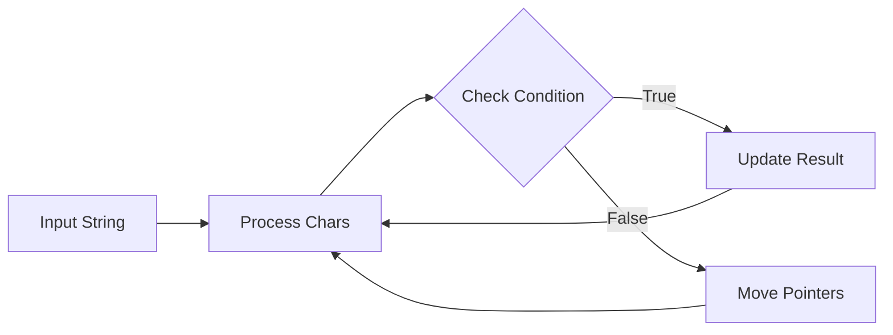

# String Problem Strategies

String manipulation is one of the most common types of problems you'll encounter in programming interviews and on platforms like LeetCode. This guide explores essential strategies for tackling string problems efficiently, with practical examples and step-by-step explanations.

## Introduction to String Problems

Strings are sequences of characters that appear in virtually every programming language. They're used to represent text, data formats, and even serve as inputs to many algorithms. Mastering string manipulation is crucial for becoming a proficient programmer.

String problems can test various concepts:
- Character manipulation
- Pattern matching
- String traversal
- Substring operations
- Encoding and decoding
- Lexicographical ordering

Let's dive into the key strategies for solving these problems.

## Strategy 1: Two-Pointer Technique

The two-pointer approach is remarkably useful for string problems, especially when comparing characters or finding patterns.

### Example: Valid Palindrome

A classic application is determining if a string is a palindrome (reads the same backward as forward).

```javascript
/**
 * @param {string} s
 * @return {boolean}
 */
const isPalindrome = function(s) {
    // Convert to lowercase and remove non-alphanumeric characters
    s = s.toLowerCase().replace(/[^a-z0-9]/g, '');
    
    let left = 0;
    let right = s.length - 1;
    
    while (left < right) {
        if (s[left] !== s[right]) {
            return false;
        }
        left++;
        right--;
    }
    
    return true;
};

// Example usage
console.log(isPalindrome("A man, a plan, a canal: Panama")); // Output: true
console.log(isPalindrome("race a car")); // Output: false
```

This approach is efficient with O(n) time complexity and O(1) space complexity (not counting the string cleaning operation).

## Strategy 2: Sliding Window

The sliding window technique is ideal for substring problems or when you need to process consecutive elements.

### Example: Longest Substring Without Repeating Characters

```javascript
/**
 * @param {string} s
 * @return {number}
 */
const lengthOfLongestSubstring = function(s) {
    const charMap = new Map();
    let left = 0;
    let maxLength = 0;
    
    for (let right = 0; right < s.length; right++) {
        const currentChar = s[right];
        
        // If we've seen this character before and it's in our current window
        if (charMap.has(currentChar) && charMap.get(currentChar) >= left) {
            // Move the left pointer to the right of the previous occurrence
            left = charMap.get(currentChar) + 1;
        }
        
        // Update max length
        maxLength = Math.max(maxLength, right - left + 1);
        
        // Store the position of the current character
        charMap.set(currentChar, right);
    }
    
    return maxLength;
};

// Example usage
console.log(lengthOfLongestSubstring("abcabcbb")); // Output: 3
console.log(lengthOfLongestSubstring("bbbbb")); // Output: 1
console.log(lengthOfLongestSubstring("pwwkew")); // Output: 3
```

The sliding window approach helps us efficiently track the current valid substring.

## Strategy 3: Hash Tables for Character Counting

Many string problems involve counting characters or checking for patterns. Hash tables (objects or maps) are perfect for these scenarios.

### Example: Valid Anagram

```javascript
/**
 * @param {string} s
 * @param {string} t
 * @return {boolean}
 */
const isAnagram = function(s, t) {
    // Quick check for length
    if (s.length !== t.length) {
        return false;
    }
    
    const charCount = {};
    
    // Count characters in first string
    for (let char of s) {
        charCount[char] = (charCount[char] || 0) + 1;
    }
    
    // Decrement counts for second string
    for (let char of t) {
        if (!charCount[char]) {
            return false;
        }
        charCount[char]--;
    }
    
    // Ensure all counts are zero
    return Object.values(charCount).every(count => count === 0);
};

// Example usage
console.log(isAnagram("anagram", "nagaram")); // Output: true
console.log(isAnagram("rat", "car")); // Output: false
```

This approach has O(n) time complexity where n is the length of the input strings.

## Strategy 4: String Building and Manipulation

Some problems require constructing or modifying strings. Understanding efficient ways to build strings is crucial.

### Example: Reverse Words in a String

```javascript
/**
 * @param {string} s
 * @return {string}
 */
const reverseWords = function(s) {
    // Split by space, filter out empty strings, and reverse
    const words = s.trim().split(/\s+/);
    return words.reverse().join(' ');
};

// Example usage
console.log(reverseWords("the sky is blue")); // Output: "blue is sky the"
console.log(reverseWords("  hello world  ")); // Output: "world hello"
```

Note: In many languages, strings are immutable. Building strings through repeated concatenation can be inefficient. Consider using array joining or specialized string builders when appropriate.

## Strategy 5: Dynamic Programming for Complex Patterns

For more complex string patterns or matching problems, dynamic programming often provides elegant solutions.

### Example: Longest Palindromic Substring

```javascript
/**
 * @param {string} s
 * @return {string}
 */
const longestPalindrome = function(s) {
    if (!s || s.length < 1) return "";
    
    let start = 0;
    let maxLength = 1;
    
    // Helper function to expand around center
    function expandAroundCenter(left, right) {
        while (left >= 0 && right < s.length && s[left] === s[right]) {
            const currentLength = right - left + 1;
            if (currentLength > maxLength) {
                maxLength = currentLength;
                start = left;
            }
            left--;
            right++;
        }
    }
    
    for (let i = 0; i < s.length; i++) {
        // Expand around center for odd length palindromes
        expandAroundCenter(i, i);
        // Expand around center for even length palindromes
        expandAroundCenter(i, i + 1);
    }
    
    return s.substring(start, start + maxLength);
};

// Example usage
console.log(longestPalindrome("babad")); // Output: "bab" or "aba"
console.log(longestPalindrome("cbbd")); // Output: "bb"
```

This approach has O(n²) time complexity and O(1) space complexity.

## Strategy 6: Tries for Prefix Problems

When dealing with multiple strings and prefix operations, tries (prefix trees) can be extremely efficient.

### Example: Implementing a Basic Trie

```javascript
class TrieNode {
    constructor() {
        this.children = {};
        this.isEndOfWord = false;
    }
}

class Trie {
    constructor() {
        this.root = new TrieNode();
    }
    
    /**
     * @param {string} word
     * @return {void}
     */
    insert(word) {
        let current = this.root;
        
        for (let char of word) {
            if (!current.children[char]) {
                current.children[char] = new TrieNode();
            }
            current = current.children[char];
        }
        
        current.isEndOfWord = true;
    }
    
    /**
     * @param {string} word
     * @return {boolean}
     */
    search(word) {
        let current = this.root;
        
        for (let char of word) {
            if (!current.children[char]) {
                return false;
            }
            current = current.children[char];
        }
        
        return current.isEndOfWord;
    }
    
    /**
     * @param {string} prefix
     * @return {boolean}
     */
    startsWith(prefix) {
        let current = this.root;
        
        for (let char of prefix) {
            if (!current.children[char]) {
                return false;
            }
            current = current.children[char];
        }
        
        return true;
    }
}

// Example usage
const trie = new Trie();
trie.insert("apple");
console.log(trie.search("apple"));   // Output: true
console.log(trie.search("app"));     // Output: false
console.log(trie.startsWith("app")); // Output: true
trie.insert("app");
console.log(trie.search("app"));     // Output: true
```

Tries are particularly useful for autocomplete, spell checkers, and prefix-based problems.

## Strategy 7: String Matching Algorithms

For pattern matching within strings, several specialized algorithms exist.

### Example: Implementing KMP (Knuth-Morris-Pratt) Algorithm

```javascript
/**
 * @param {string} haystack
 * @param {string} needle
 * @return {number}
 */
const strStr = function(haystack, needle) {
    if (needle === "") return 0;
    if (haystack.length < needle.length) return -1;
    
    // Compute LPS (Longest Prefix Suffix) array
    const lps = Array(needle.length).fill(0);
    let prevLPS = 0;
    let i = 1;
    
    while (i < needle.length) {
        if (needle[i] === needle[prevLPS]) {
            lps[i] = prevLPS + 1;
            prevLPS++;
            i++;
        } else if (prevLPS === 0) {
            lps[i] = 0;
            i++;
        } else {
            prevLPS = lps[prevLPS - 1];
        }
    }
    
    // Search for pattern
    let haystackPointer = 0;
    let needlePointer = 0;
    
    while (haystackPointer < haystack.length) {
        if (haystack[haystackPointer] === needle[needlePointer]) {
            haystackPointer++;
            needlePointer++;
        } else {
            if (needlePointer === 0) {
                haystackPointer++;
            } else {
                needlePointer = lps[needlePointer - 1];
            }
        }
        
        if (needlePointer === needle.length) {
            return haystackPointer - needlePointer;
        }
    }
    
    return -1;
};

// Example usage
console.log(strStr("hello", "ll")); // Output: 2
console.log(strStr("aaaaa", "bba")); // Output: -1
```

KMP has a time complexity of O(n + m) where n is the length of the haystack and m is the length of the needle.

## Real-World Applications

String manipulation is ubiquitous in software development. Here are some real-world applications:

### 1. Text Editors

Text editors use string algorithms to implement features like search, replace, and syntax highlighting.

```javascript
function highlightSyntax(code, language) {
    const keywords = getLanguageKeywords(language);
    let highlightedCode = code;
    
    // Highlight each keyword
    for (let keyword of keywords) {
        const regex = new RegExp(`\\b${keyword}\\b`, 'g');
        highlightedCode = highlightedCode.replace(regex, `<span class="keyword">${keyword}</span>`);
    }
    
    return highlightedCode;
}
```

### 2. Data Validation

String processing is essential for validating user inputs like emails, phone numbers, or passwords.

```javascript
function validateEmail(email) {
    const emailRegex = /^[^\s@]+@[^\s@]+\.[^\s@]+$/;
    return emailRegex.test(email);
}

function validatePassword(password) {
    // Check length
    if (password.length < 8) return false;
    
    // Check for at least one uppercase letter
    if (!/[A-Z]/.test(password)) return false;
    
    // Check for at least one digit
    if (!/[0-9]/.test(password)) return false;
    
    // Check for at least one special character
    if (!/[!@#$%^&*]/.test(password)) return false;
    
    return true;
}
```

### 3. Natural Language Processing

Many NLP tasks like tokenization, stemming, or sentiment analysis rely on string processing.

```javascript
function tokenize(text) {
    // Simple tokenization by splitting on whitespace and punctuation
    return text.toLowerCase()
               .replace(/[.,\/#!$%\^&\*;:{}=\-_`~()]/g, "")
               .split(/\s+/);
}

function countWordFrequency(text) {
    const words = tokenize(text);
    const frequency = {};
    
    for (let word of words) {
        frequency[word] = (frequency[word] || 0) + 1;
    }
    
    return frequency;
}
```

## Visualizing String Algorithms

Understanding how string algorithms work can be easier with visualization.



## Common String Problem Patterns

Here's a quick reference for recognizing common string problem patterns:

1. **Palindromes**: Two-pointer technique from outside in
2. **Anagrams**: Character counting with hash tables
3. **Substring search**: Sliding window or specialized algorithms like KMP
4. **Word problems**: String splitting and array operations
5. **Character replacement**: Sliding window with character counting
6. **Prefix/suffix**: Tries or careful comparisons
7. **String transformation**: Stack-based approaches or recursion

## Summary

String manipulation is a fundamental skill in programming that appears frequently in interviews and real-world applications. The key strategies we've explored include:

1. Two-pointer technique for comparing characters
2. Sliding window for substring operations
3. Hash tables for character counting and tracking
4. Efficient string building techniques
5. Dynamic programming for complex pattern matching
6. Tries for prefix operations
7. Specialized string matching algorithms like KMP

By mastering these approaches, you'll be well-equipped to tackle a wide variety of string problems across different domains of programming.

## Practice Exercises

To solidify your understanding, try solving these problems:

1. Implement a function to check if two strings are rotations of each other
2. Find all anagrams in a string
3. Implement string compression (e.g., "aabcccccaaa" becomes "a2b1c5a3")
4. Write a function to find the longest common prefix of an array of strings
5. Implement a basic regex pattern matcher for '.' (any single character) and '*' (zero or more of previous character)

## Additional Resources

- [LeetCode String Problems Collection](https://leetcode.com/tag/string/)
- "Cracking the Coding Interview" by Gayle Laakmann McDowell (Chapter on Strings)
- "Introduction to Algorithms" by Cormen, Leiserson, Rivest, and Stein (Section on String Matching)
- [Stanford CS Library - String Algorithms](http://www-cs-faculty.stanford.edu/~knuth/faq.html)

Keep practicing, and with time, string problems will become second nature!